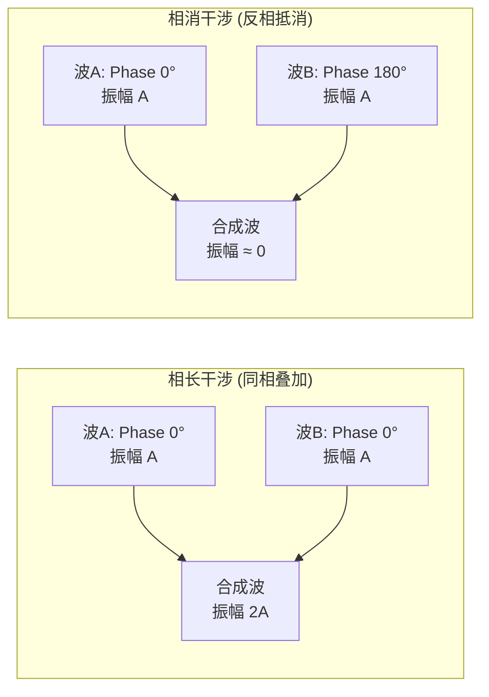

# 声波物理特性 (Sound Wave Physics)

声音是音频工程的逻辑起点。理解声音如何产生、传播以及其物理参数，是掌握后续数字信号处理 (DSP)、声学设计和音频系统调试的前提。

---

## 1. 什么是声音 (Definition of Sound)

**声音 (Sound)** 是由物体振动产生的**机械波 (Mechanical Wave)**。

```
声音的产生与传播:

  振动源 → 介质粒子受迫振动 → 压力波向外扩散 → 接收器 (人耳/麦克风)
  
  纵波 (Longitudinal Wave):
    介质质点振动方向 ∥ 波传播方向
    形成交替的 密部 (Compression) 和 疏部 (Rarefaction)
    
    压力分布示意:
    ┌─密─┐┌─疏─┐┌─密─┐┌─疏─┐
    │||||│|  | |│||||│|  | |  → 传播方向
    └────┘└────┘└────┘└────┘
    ←─── λ ───→

  传播条件:
    必须有弹性介质 (固体/液体/气体)
    真空中无法传声
    
  声波方程 (一维):
    ∂²p/∂t² = c² × ∂²p/∂x²
    其中 p=声压, c=声速, x=距离, t=时间
```

---

## 2. 核心物理参数

### 2.1 频率、周期与波长

$$f = \frac{1}{T}, \quad \lambda = \frac{v}{f}$$

| 参数 | 符号 | 单位 | 定义 |
|:---|:---|:---|:---|
| **频率** | $f$ | Hz | 每秒振动次数 |
| **周期** | $T$ | s | 一次完整振动的时间 |
| **波长** | $\lambda$ | m | 相邻同相位点间距 |
| **声速** | $v$ | m/s | 波在介质中的传播速度 |

**常见频率与波长对照**：

| 频率 | 波长 (空气中) | 对应 | 工程意义 |
|:---|:---|:---|:---|
| 20 Hz | 17.2 m | 人耳下限 | 低频驻波 ≈ 房间尺寸 |
| 100 Hz | 3.43 m | 低音 | 汽车车厢共振频段 |
| 1 kHz | 34.3 cm | 中频 | 测试标准频率 |
| 3 kHz | 11.4 cm | 语音核心 | 耳道共振频率 |
| 10 kHz | 3.43 cm | 高频 | 头部阴影效应显著 |
| 20 kHz | 1.72 cm | 人耳上限 | MEMS 振膜尺寸量级 |

### 2.2 声速

```
声速取决于介质的弹性和密度:

  v = √(E/ρ)    (固体/液体)
  v = √(γRT/M)  (理想气体)
  
  空气中声速 (近似):
    v ≈ 331.5 + 0.6T  (T: 摄氏度)
    
  各介质声速对比:
    空气 (20°C):    343 m/s
    水 (20°C):      1482 m/s
    铝:             6420 m/s
    钢:             5960 m/s
    
  温度/湿度影响:
    温度 ↑ → 声速 ↑ (约 +0.6 m/s 每°C)
    湿度 ↑ → 声速略 ↑ (水蒸气密度 < 干空气)
    
  工程应用:
    麦克风阵列波束成形: 需要精确声速值
    延迟计算: Δt = d/v (d=距离)
    例: 两麦克风间距 7cm, 90° 入射
        Δt = 0.07/343 ≈ 204 μs
```

### 2.3 声压与声强

```
声压 (Sound Pressure):
  大气压上的微小压力扰动
  单位: Pa (帕斯卡)
  
  人耳听阈:  20 µPa = 2×10⁻⁵ Pa (极其微小!)
  痛阈:      20 Pa  = 120 dB SPL
  大气压:    101325 Pa

声强 (Sound Intensity):
  单位面积上的声功率
  I = p²/(ρc)
  单位: W/m²
  
  参考值: I₀ = 10⁻¹² W/m²

声功率 (Sound Power):
  声源总辐射功率
  W = I × A (A=包围面积)
  
  声功率级: Lw = 10 × log₁₀(W/W₀)  (W₀ = 10⁻¹² W)

距离衰减 (自由场):
  点声源: SPL ∝ 1/r²  → 距离翻倍, SPL 下降 6 dB
  线声源: SPL ∝ 1/r   → 距离翻倍, SPL 下降 3 dB
```

### 2.4 相位

*   **定义**：描述声波在特定时间点处于振动周期中哪个位置的物理量，通常用角度 (0° - 360°) 或弧度 (0 - 2π) 表示。
*   **相位差 (Phase Difference)**：两个频率相同的声波，如果起始时间不同，就会产生相位差。这是 **AEC (回声消除)**、**ANC (主动降噪)**、**波束成形** 的核心物理基础。

```
相位差与时间差的关系:
  Δφ = 2π × f × Δt
  
  例: 1kHz 信号, 两麦克风间时差 0.5ms
      Δφ = 2π × 1000 × 0.0005 = π (180°) → 完全反相
```

---

## 3. 声学现象

### 3.1 干涉 (Interference)



**工程应用**：
- **ANC (主动降噪)**：生成与噪声反相的信号，利用相消干涉抵消噪声
- **波束成形**：利用相长干涉增强目标方向信号
- **相位校准**：多扬声器系统必须对齐相位，否则产生梳状滤波效应

### 3.2 反射与混响

```
声波遇到界面时:
  一部分被反射 (Reflection)
  一部分被吸收 (Absorption)
  一部分被透射 (Transmission)
  
  吸声系数 α = 被吸收声能 / 入射声能  (0~1)
    硬墙壁:     α ≈ 0.02 (几乎全反射)
    厚地毯:     α ≈ 0.4
    声学泡棉:   α ≈ 0.8
    开窗:       α = 1.0 (完全吸收)

混响时间 RT60:
  定义: 声源停止后, SPL 衰减 60 dB 所需时间
  
  赛宾公式 (Sabine): RT60 = 0.161 × V / A
    V: 房间体积 (m³)
    A: 总吸声量 = Σ(αᵢ × Sᵢ) (m²)
    
  典型 RT60:
    录音棚控制室: 0.2-0.4s (高度吸声)
    教室:         0.5-0.8s
    音乐厅:       1.5-2.5s (适度混响)
    大教堂:       4-8s (高度混响)
    车内:         < 0.1s (极小空间)
```

### 3.3 衍射 (Diffraction)

```
声波绕过障碍物继续传播:
  
  规律:
    λ >> 障碍物尺寸 → 几乎完全绕射 (低频)
    λ << 障碍物尺寸 → 产生明显阴影区 (高频)
    
  实际影响:
    头部衍射 (头部直径 ~17cm):
      低频 (< 500Hz): 几乎无阴影 → ITD 主导定位
      高频 (> 2kHz):  明显阴影 → ILD 主导定位
      过渡频率 ~1.5kHz (λ ≈ 头部直径)
```

### 3.4 驻波 (Standing Wave)

```
驻波:
  入射波与反射波叠加形成固定的波腹/波节模式
  
  房间模态频率 (矩形房间):
    f = (v/2) × √((nₓ/Lₓ)² + (nᵧ/Lᵧ)² + (n_z/L_z)²)
    
    n: 模态阶数 (0, 1, 2, ...)
    L: 房间尺寸
    
  实际影响:
    低频段 (< 300Hz) 驻波最明显
    例: 房间长 5m → 基频 = 343/(2×5) = 34.3 Hz
    
  解决方案:
    声学处理: 低频吸声体 (Bass Trap)
    DSP 校正: 参数 EQ 补偿
    房间比例设计: 避免整数比 (推荐 1:1.28:1.54)
```

### 3.5 多普勒效应 (Doppler Effect)

```
声源与观察者相对运动时, 感知频率改变:

  f' = f × (v ± v_observer) / (v ∓ v_source)
  
  接近 → 频率升高, 远离 → 频率降低
  
  工程影响:
    车载 ANC: 车速引起的频移需要算法补偿
    雷达/超声: 利用多普勒测速
    
  日常感知:
    救护车经过时音调变化
    车速 120km/h (~33m/s) → Δf/f ≈ 10% (可闻)
```

---

## 4. 分贝系统 (The Decibel System)

音频领域有多种分贝基准，混淆它们是专业工作中的大忌。

### 4.1 分贝基准速查

| 单位 | 参考基准 | 适用领域 | 典型值 |
|:---|:---|:---|:---|
| **dB SPL** | 20 µPa | 声学测量 | 对话: 60 dB, 演唱会: 110 dB |
| **dBFS** | 数字满幅 | 数字音频 | -6 dBFS (典型录制电平) |
| **dBu** | 0.775 Vrms | 专业音频 | +4 dBu (标准线路电平) |
| **dBV** | 1.0 Vrms | 消费电子 | -10 dBV (标准线路电平) |
| **dBm** | 1 mW (600Ω) | 电信 | 0 dBm = 0.775 Vrms@600Ω |
| **dB(A)** | A 计权 SPL | 噪声测量 | 办公室: 40 dB(A) |

### 4.2 常见声压级参考

```
dB SPL  │  场景
────────┼──────────────────────────────
  0     │  人耳听阈 (1kHz)
 20     │  树叶沙沙声
 40     │  安静图书馆
 50     │  安静办公室
 60     │  正常对话 (1m)
 70     │  吸尘器 / 交通噪声
 80     │  闹市 / 工厂 (需要听力保护)
 90     │  割草机 (长时间暴露有害)
100     │  摩托车 / 链锯
110     │  摇滚演唱会前排
120     │  痛阈 / 飞机起飞 (100m)
140     │  枪声 (近距离, 即时损伤)
```

### 4.3 dB 运算速查

```
dB 快速心算:

  +3 dB  ≈ 功率 ×2   (电压 ×1.41)
  +6 dB  ≈ 电压 ×2   (功率 ×4)
  +10 dB ≈ 功率 ×10  (主观响度 ×2)
  +20 dB ≈ 电压 ×10  (功率 ×100)
  
  组合示例:
    +13 dB = +10 dB + 3 dB = 功率 ×10 × ×2 = ×20
    -6 dB  = 电压 ÷2 (信号衰减一半)
    
  dBFS → 线性增益:
    gain = 10^(dBFS/20)
    -6 dBFS  → 0.501 (约一半)
    -20 dBFS → 0.1
    -40 dBFS → 0.01
    -60 dBFS → 0.001
```

---

## 5. 声场类型

```
自由场 (Free Field):
  无反射面, 声波自由扩散
  SPL 遵循 1/r² 衰减
  例: 户外开阔空间, 消声室
  
扩散场 (Diffuse Field):
  来自各方向声能均匀分布
  例: 混响室
  
近场 (Near Field):
  距离声源 < 几个波长
  声压与声强关系复杂 (非平面波)
  例: 近场监听扬声器 (1m 内使用)
  
远场 (Far Field):
  距离声源 >> 波长
  声波近似平面波
  例: 远场测试 (>1m), 麦克风阵列远场假设
```

---

## 6. 关键参考 (References)

1.  *Fundamentals of Acoustics* - Lawrence E. Kinsler
2.  *Principles of Vibration and Sound* - Thomas D. Rossing
3.  [Sound - Wikipedia](https://en.wikipedia.org/wiki/Sound)
4.  [The Speed of Sound - Engineering Toolbox](https://www.engineeringtoolbox.com/speed-sound-d_82.html)
5.  [Room Acoustics - Sabine Equation](https://en.wikipedia.org/wiki/Reverberation)

---
*Next Topic: [心理声学 (Psychoacoustics)](./02-Psychoacoustics.md)*
