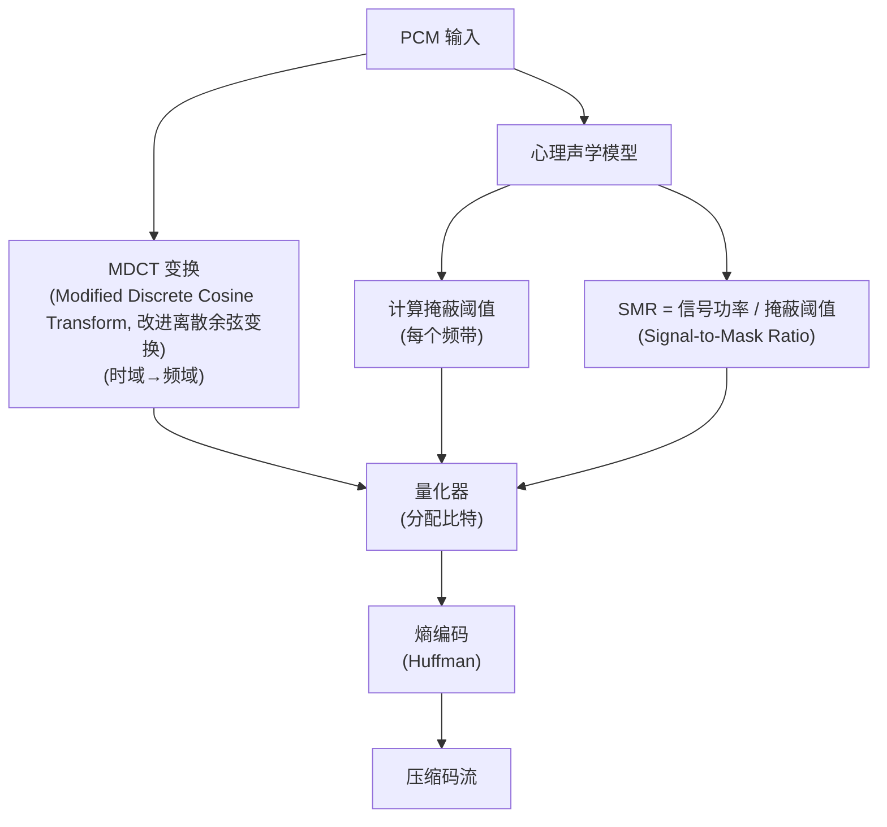

# 心理声学 (Psychoacoustics)

心理声学研究的是人类对声音的**主观感知**与物理声音信号之间的关系。理解心理声学是实现音频压缩（如 MP3/AAC）、音效增强、空间音频以及高级 DSP 算法的理论基础。

---

## 1. 人耳听觉特性 (Characteristics of Human Hearing)

### 1.1 听觉系统信号链

```
外耳 → 中耳 → 内耳 → 听觉神经 → 大脑听觉皮层

  外耳 (Outer Ear):
    耳廓 (Pinna): 收集声波, 提供方向性线索 (HRTF 的物理基础)
    耳道 (Ear Canal): 约 2.5cm, 共振频率 ~3kHz → 增强 2-5kHz 灵敏度
    
  中耳 (Middle Ear):
    鼓膜 → 锤骨 → 砧骨 → 镫骨 (阻抗匹配, 增益 ~25dB)
    
  内耳 (Inner Ear):
    耳蜗 (Cochlea): 基底膜 (Basilar Membrane) 频率-位置映射
      底部 (base): 高频 (~20kHz)
      顶部 (apex): 低频 (~20Hz)
    毛细胞 (Hair Cells): 机械振动 → 神经电信号
```

### 1.2 听觉范围与灵敏度

| 参数 | 数值 | 说明 |
|:---|:---|:---|
| **频率范围** | 20Hz - 20kHz | 随年龄下降 (每 10 年高频下降 ~1kHz) |
| **最灵敏频段** | 2kHz - 5kHz | 耳道共振 + 语音频段 |
| **听阈 (0 dB SPL)** | 20 µPa | 1kHz 处最小可闻声压 |
| **痛阈** | ~120 dB SPL | 持续暴露可造成永久损伤 |
| **动态范围** | ~120 dB | 从听阈到痛阈 |
| **时间分辨率** | ~2ms | 可分辨的最小时间间隔 |
| **频率分辨率 (JND, Just Noticeable Difference)** | ~0.3% (1kHz) | 可分辨的最小频率差 |

### 1.3 响度 (Loudness)

**响度单位**：
- **Phon (方)**：与 1kHz 纯音的 dB SPL 等效。40 Phon = 1kHz 处 40 dB SPL 的主观响度
- **Sone (宋)**：线性响度尺度。1 Sone = 40 Phon，响度翻倍 = Sone 翻倍

**等响曲线 (Equal-Loudness Contours, ISO 226:2003)**：

```
                       等响曲线示意
  
  SPL (dB)
   100│╲                                     ╱  ← 100 Phon
      │  ╲                                 ╱
    80│    ╲─────────────────────────────╱     ← 80 Phon
      │      ╲                       ╱
    60│        ╲─────────────────────╱          ← 60 Phon
      │          ╲               ╱
    40│            ╲─────────────╱               ← 40 Phon
      │              ╲       ╱
    20│                ╲─────╱                   ← 20 Phon
      │                  ╲╱
     0│                   ╰─── 最灵敏区域 (2-5kHz)
      └──────────────────────────────────────────
       20    100   500  1k   4k   8k   16k  Hz

  关键结论:
    - 低音量时, 低频和高频需要更大 SPL 才能达到等响
    - 高音量时, 曲线趋于平坦
    → 等响度补偿 (Loudness Compensation) 的理论基础
```

### 1.4 Weber-Fechner 定律

```
人耳感知响度变化遵循对数关系:

  ΔL(dB) = 10 × log₁₀(P₂/P₁)

  实际应用:
    - 功率翻倍 → 仅感知增加 3dB (刚好可察觉)
    - 功率 ×10  → 感知增加 10dB (主观响度翻倍)
    - 人耳最小可辨差 (JND): ~1dB (训练后 ~0.5dB)
    
  音量控制设计启示:
    - 音量调节应使用 dB 等间距, 而非线性等间距
    - Android VolumeIndex → dB 曲线即遵循此原则
```

---

## 2. 掩蔽效应 (The Masking Effect)

掩蔽效应是心理声学中最重大的发现，是有损音频压缩和降噪算法的理论基石。

### 2.1 频域掩蔽 (Simultaneous Masking)

```
频域掩蔽示意:

  SPL (dB)
    80│     ╱╲  掩蔽声 (Masker)
      │    ╱  ╲
    60│   ╱    ╲──── 掩蔽阈值曲线
      │  ╱      ╲        (Masking Threshold)
    40│ ╱        ╲
      │╱    ●     ╲──── 被掩蔽声 (Maskee): 不可闻
    20│      ▲     ╲
      │      │      ╲
     0│      │       ╲─── 绝对听阈
      └──────┴────────────────────
            掩蔽声频率

  特点:
    - 掩蔽范围向高频侧扩展更宽 (不对称)
    - 掩蔽声越强, 掩蔽范围越宽
    - 掩蔽声越近, 掩蔽效果越强
```

### 2.2 临界频带 (Critical Bands)

```
人耳基底膜等效于 ~25 个带通滤波器 (临界频带):

  频率 (Hz)  │  临界频带宽度 (Hz)  │  Bark 尺度
  ──────────┼─────────────────────┼──────────
     100    │        100          │    1
     500    │        100          │    5
    1000    │        160          │    8.5
    2000    │        300          │   13
    4000    │        700          │   17
    8000    │       1400          │   21
   16000    │       3500          │   24

  Bark 尺度: 将频率轴按人耳感知均匀映射
    z(Bark) ≈ 13 × arctan(0.00076f) + 3.5 × arctan((f/7500)²)
    
  Mel 尺度 (语音识别常用):
    m(Mel) = 2595 × log₁₀(1 + f/700)
    
  ERB (Equivalent Rectangular Bandwidth, 等效矩形带宽):
    ERB(f) = 24.7 × (4.37 × f/1000 + 1)
```

### 2.3 时域掩蔽 (Temporal Masking)

```
时域掩蔽示意:

  掩蔽效果
    ▲
    │    前掩蔽          同时掩蔽           后掩蔽
    │  (Pre-masking)   (Simultaneous)    (Post-masking)
    │       │               │                │
    │   ╱╲  │          ┌────┐           │╲
    │  ╱  ╲ │          │掩蔽│           │ ╲
    │ ╱    ╲│          │ 声 │           │  ╲
    │╱      ╲──────────┤    ├───────────╲   ╲
    ├───────┤──────────┤    ├───────────┤────╲──→ 时间
    │ 5-20ms│          │    │           │50-200ms
    │ (弱)  │          │    │           │ (强)
    └───────┴──────────┴────┴───────────┴──────

  应用:
    - MP3/AAC 编码器利用前后掩蔽, 减少量化位数
    - 音频降噪: 掩蔽阈值以下的噪声无需消除
```

---

## 3. 空间定位 (Spatial Localization)

### 3.1 双耳定位线索

| 线索 | 有效频段 | 原理 | 最大值 |
|:---|:---|:---|:---|
| **ITD** (Interaural Time Difference, 双耳时间差) | < 1.5kHz | 声波到达两耳的时间差 | ~690 µs (90°方位) |
| **ILD** (Interaural Level Difference, 双耳级差) | > 1.5kHz | 头部阴影效应导致的强度差 | ~20 dB (高频) |
| **HRTF** (Head-Related Transfer Function, 头相关传输函数) | 全频段 | 耳廓/头/肩对声音的滤波 | 个体差异大 |

```
双耳定位 — 频率与线索的关系:

  定位线索
    ▲
    │  ITD 主导         过渡区        ILD 主导
    │  ─────────    ──────────    ──────────
    │  ╱╲                              ╱╲
    │ ╱  ╲         ╱╲  ╱╲           ╱    ╲
    │╱    ╲───────╱  ╲╱  ╲─────────╱      ╲
    └──────────────────────────────────────→ 频率
          500Hz    1.5kHz         4kHz
    
  Duplex Theory (二重性理论):
    低频 (< 1.5kHz): ITD 为主要线索
    高频 (> 1.5kHz): ILD 为主要线索
    过渡区域: 定位精度下降
```

### 3.2 单耳定位线索 (HRTF)

```
HRTF 提供的额外定位信息:

  问题: ITD 和 ILD 无法区分:
    - 前方 vs 后方 (前后混淆, Front-Back Confusion)
    - 上方 vs 下方 (仰角判断)
    
  HRTF 如何解决:
    耳廓的褶皱对不同仰角的声音产生不同的频谱着色
    大脑通过学习这些频谱模式来判断仰角和前后
    
  HRTF 数据:
    - 通常在消声室中用微型麦克风在耳道口采集
    - 测量 ~1000+ 方向的脉冲响应
    - 包含幅度和相位信息
    - 个体差异大 → 通用 HRTF 会降低定位精度
    
  商业 HRTF 数据库:
    - CIPIC (Center for Image Processing and Integrated Computing, UC Davis)
    - LISTEN (IRCAM)
    - MIT KEMAR (Knowles Electronics Manikin for Acoustic Research)
```

---

## 4. 感知音频编码中的应用

### 4.1 心理声学模型在编码器中的角色



**关键原则**：
- SMR 高的频带 → 分配更多比特 (信号高于掩蔽阈值较多, 需要精确保留)
- SMR 低的频带 → 分配更少比特 (接近掩蔽阈值, 粗量化不可闻)
- SMR < 0 dB 的频带 → 可以完全丢弃 (被掩蔽, 不可闻)

### 4.2 各编码器的心理声学模型

| 编码器 | 心理声学模型 | 特点 |
|:---|:---|:---|
| **MP3** (MPEG-1 Layer III) | ISO 11172-3 Model 1/2 | 经典模型, 使用 FFT + 临界频带 |
| **AAC** | MPEG-2/4 心理声学 | 更精细的时频分析, TNS |
| **Opus** | CELT + SILK 混合 | 低延迟优化, 对掩蔽利用较少 |
| **LDAC** | Sony 专有 | 高比特率, 保留更多细节 |

---

## 5. 工程应用总结

| 应用领域 | 利用的心理声学原理 | 具体技术 |
|:---|:---|:---|
| **有损压缩** | 掩蔽效应 + 临界频带 | MP3/AAC/Opus 心理声学模型 |
| **等响度补偿** | 等响曲线 | Hi-Fi 音响 Loudness 按钮 |
| **虚拟环绕声** | ITD + ILD + HRTF | Dolby Atmos for Headphones |
| **噪声整形 (Noise Shaping)** | 频率灵敏度差异 | 将量化噪声移到不敏感频段 |
| **动态范围压缩** | Weber-Fechner 定律 | 广播/流媒体响度标准化 |
| **助听器算法** | 频率灵敏度 + 掩蔽 | 分频段增益补偿 |
| **ANC 降噪** | 掩蔽 + 等响曲线 | 优先消除敏感频段噪声 |

---

## 6. 关键参考 (References)

1.  *Psychoacoustics: Facts and Models* - Hugo Fastl & Eberhard Zwicker
2.  [Equal-Loudness Contour - ISO 226:2003](https://en.wikipedia.org/wiki/Equal-loudness_contour)
3.  [Introduction to Psychoacoustics - Stanford CCRMA](https://ccrma.stanford.edu/~mdufour/Psychoacoustics.html)
4.  [CIPIC HRTF Database](https://www.ece.ucdavis.edu/cipic/spatial-sound/hrtf-data/)
5.  [MPEG Audio Psychoacoustic Models](https://en.wikipedia.org/wiki/MPEG-1_Audio_Layer_III)

---
*Next Topic: [数字音频基础 (Digital Audio Fundamentals)](./03-Digital-Audio-Fundamentals.md)*
