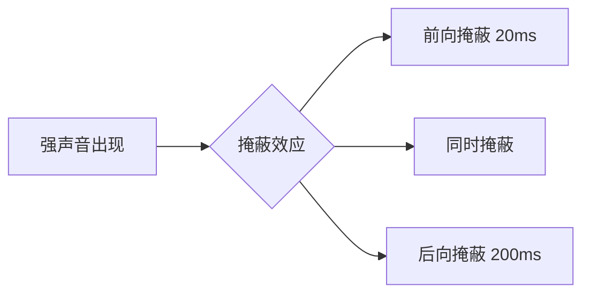

# 心理声学 (Psychoacoustics)

心理声学研究的是人类对声音的**主观感知**与物理声音信号之间的关系。理解心理声学是实现音频压缩（如 MP3/AAC）、音效增强以及高级 DSP 算法的核心。

---

## 1. 人耳听觉特性 (Characteristics of Human Hearing)

人耳不仅是一个精密的物理接收器，更是一个复杂的信号处理器。

### 1.1 听觉范围 (Auditory Range)
*   **频率范围**：健康年轻人约为 **20Hz - 20,000Hz**。
*   **灵敏度不均匀性**：人耳对 **2kHz - 5kHz** 之间的声音最为敏感（这是人类语言关键信息的所在区域），而对极高频和极低频的灵敏度较低。

### 1.2 响度 (Loudness)
*   响度是主观感受到的声音大小，单位通常用 **方 (Phon)** 或 **宋 (Sone)**。
*   **等响曲线 (Equal-Loudness Contours / Fletcher-Munson Curves)**：
    *   描述了在不同频率下，达到相同主观响度所需的物理声压级。
    *   **重要结论**：在低音量播放时，人耳对低频和高频的感知能力会显著下降。这就是为什么很多高端音响有“等响度补偿 (Loudness Compensation)”功能。

---

## 2. 掩蔽效应 (The Masking Effect)

掩蔽效应是心理声学中最重大的发现，也是音频有损压缩技术的基石。

### 2.1 频域掩蔽 (Frequency Masking)
*   **现象**：一个较强的声音（掩蔽声）会使得与其频率接近的较弱声音（被掩蔽声）变得不可听。
*   **临界频带 (Critical Band)**：人耳听觉系统被划分为一系列重叠的带通滤波器。在一个临界频带内，掩蔽效应最强。

### 2.2 时域掩蔽 (Temporal Masking)
掩蔽效应不仅发生在同一时刻，还会跨越时间：
*   **超前掩蔽 (Pre-masking)**：强声出现前 5-20ms 发生的掩蔽（较弱）。
*   **滞后掩蔽 (Post-masking)**：强声消失后 50-200ms 发生的掩蔽（较强）。

---

## 3. 空间定位 (Spatial Localization)

人耳如何判断声源的位置？

*   **双耳间时差 (ITD, Interaural Time Difference)**：声音到达两耳的时间差（低频定位主导）。
*   **双耳间强度差 (IID/ILD, Interaural Intensity Difference)**：由于头部的阴影效应，高频声音到达两耳的强度不同（高频定位主导）。
*   **头相关传输函数 (HRTF, Head-Related Transfer Function)**：躯干、肩膀、耳廓对声音的散射和反射，帮助我们区分前后和上下位置。

---

## 4. 关键应用 (Key Applications)

1.  **感知音频编码 (Perceptual Coding)**：如 MP3，通过剔除掩蔽效应下不可听的信号来压缩数据。
2.  **虚拟环绕声 (Virtual Surround)**：利用 HRTF 算法在耳机上模拟 5.1/7.1 声场。
3.  **听力保护**：根据等响曲线设计更科学的降噪方案。

---

## 5. 关键参考 (References)

1.  *Psychoacoustics: Facts and Models* - Hugo Fastl & Eberhard Zwicker
2.  [Equal-Loudness Contour - Wikipedia](https://en.wikipedia.org/wiki/Equal-loudness_contour)
3.  [Introduction to Psychoacoustics - Stanford University](https://ccrma.stanford.edu/~mdufour/Psychoacoustics.html)

---
*Next Topic: [数字音频基础 (Digital Audio Fundamentals)](./03-Digital-Audio-Fundamentals.md)*
