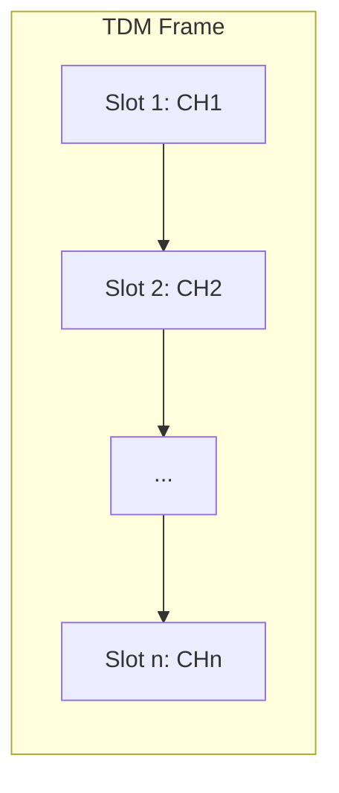

# 数字音频接口与总线 (Digital Audio Interfaces & Bus)

在音频硬件设计中，芯片与芯片之间（如 SoC 与 Codec 或 DSP）的音频数据传输主要通过特定的串行接口实现。最常见的包括 I2S, TDM 和 PDM.

---

## 1. I2S (Inter-IC Sound)

I2S 是由飞利浦公司制定的最通用的音频总线标准，用于芯片间的 PCM 数据传输。

### 1.1 关键信号线
*   **SCK (Serial Clock)**：串行时钟，也称 BCLK (Bit Clock)。每一位数据对应一个时钟脉冲。
*   **WS (Word Select)**：字段选择，也称 LRCK (Left/Right Clock)。用于切换左右声道。
    *   WS = 0：左声道数据。
    *   WS = 1：右声道数据。
*   **SD (Serial Data)**：串行数据线，用于传输二进制补码表示的音频数据。

### 1.2 I2S 标准时序
*   数据在 SCK 的下降沿改变，在上升沿被读取。
*   **关键特性**：MSB（最高有效位）在 WS 变化后的**第二个** SCK 上升沿开始传输（即延迟一个时钟周期）。

---

## 2. TDM (Time Division Multiplexing)

当需要在一个物理接口上传输多于 2 个声道（如车载 8 声道、16 声道）时，通常使用 TDM。

### 2.1 原理
TDM 将一个帧的时间划分为多个时间片 (Slot)，每个时间片承载一个声道的数据。
*   **SYNC (Frame Sync)**：帧同步信号，标志一帧的开始。
*   **BCLK**：位时钟，频率比 I2S 更高，以容纳更多声道。

---

## 3. PDM (Pulse Density Modulation)

PDM 是一种过采样技术，广泛用于 **数字 MEMS 麦克风**。

### 3.1 原理
*   PDM 不传输 PCM 那样的量化数值，而是传输一串**只有 0 和 1** 的高频码流。
*   **密度代表振幅**：1 的密度越大，代表模拟信号的瞬时幅度越高。
*   **处理流程**：SoC 接收到 PDM 信号后，需要通过 **抽取滤波器 (Decimation Filter)** 将其转换为 PCM 信号。

---

## 4. 接口对比 (Comparison)

| 特性 | I2S | TDM | PDM |
| :--- | :--- | :--- | :--- |
| **主要用途** | 2 声道 PCM 传输 | 多通道 (4+) PCM 传输 | 数字麦克风接口 |
| **信号线数** | 3 线 (SCK, WS, SD) | 3 线 (BCLK, FS, SD) | 2 线 (CLK, DATA) |
| **复杂度** | 低 | 中 | 高 (需抽取滤波) |

---

## 5. 关键参考 (References)

1.  *I2S Bus Specification* - Philips Semiconductors
2.  [Understanding PDM Digital Audio - Texas Instruments](https://www.ti.com/lit/an/slaa701/slaa701.pdf)
3.  [TDM Audio Interface - STMicroelectronics](https://www.st.com/)

---
*Next Topic: [移动端与车载音频硬件架构 (Mobile & Automotive Audio Hardware)](../03-Mobile-Hardware.md)*
