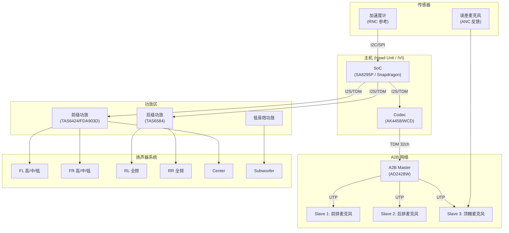

# 车载音频硬件架构 (Automotive Audio Hardware Architecture)

车载音频系统比手机系统复杂得多，涉及超长距离布线（车内跨度 5m+）、高通道数（20-30+ 扬声器）以及极其严苛的电磁兼容性 (EMC)、温度范围 (-40°C ~ +85°C) 和可靠性要求。

---

## 1. 车载音频系统拓扑

### 1.1 完整硬件拓扑



### 1.2 架构演进对比

| 维度 | 传统模拟 (2010-) | A2B 数字 (2018-) | Ethernet AVB/TSN (2022-) |
|:---|:---|:---|:---|
| 布线 | 点对点模拟线 | 单根 UTP 菊花链 | 以太网交换 |
| 通道数 | 受限于线束 | 32 up + 32 down | 理论无限 |
| 延迟 | 几乎为零 | ~50µs | ~2ms (有保证) |
| 线束重量 | 重 (铜线多) | 减少 75% | 适中 |
| EMC | 差 (模拟信号易干扰) | 好 (数字传输) | 好 |
| 成本 | 高 (多根线缆) | 中 | 高 (交换机) |
| 带宽 | 受限 | 50Mbps | 100Mbps-1Gbps |

---

## 2. A2B 详解 (Automotive Audio Bus)

### 2.1 协议架构

```
A2B 协议层次:
┌───────────────────────────────────────┐
│  Application Layer (音频数据 + 控制)    │
├───────────────────────────────────────┤
│  A2B Link Layer (帧结构/寻址/同步)     │
├───────────────────────────────────────┤
│  Physical Layer (差分信号/UTP)          │
└───────────────────────────────────────┘
```

### 2.2 帧结构

```
A2B 超帧 (Superframe):
  ┌─────────┬──────────┬──────────┬─────────┐
  │ Sync    │ Control  │ Upstream │Downstream│
  │ (同步字)│ (I2C cmd)│ (麦克风) │ (扬声器) │
  └─────────┴──────────┴──────────┴─────────┘
  
  时钟: 同步到 Master I2S BCLK
  超帧率: = 采样率 (如 48kHz → 每秒 48000 个超帧)
  
  每超帧可携带:
    Downstream: 最多 32 slots × 32-bit = 1024-bit/超帧
    Upstream:   最多 32 slots × 32-bit = 1024-bit/超帧
    I2C Control: 1 byte/超帧 (低速控制)
```

### 2.3 级联拓扑

```
A2B 菊花链 (Daisy-Chain):
  Master → Slave 0 → Slave 1 → Slave 2 → ... → Slave N
           (UTP)      (UTP)      (UTP)           (UTP)
           
  最大级联: 17 个 Slave (AD2428W)
  总线长度: Master 到末端 Slave 最长 ~40m (汽车足够)
  
  幻象电源 (Phantom Power):
    Master 通过信号线向每个 Slave 提供电源 (最大 300mA/节点)
    Slave 不需要独立电源 → 简化布线
```

### 2.4 A2B 芯片选型

| 芯片 | 角色 | 通道 | 特性 |
|:---|:---|:---|:---|
| **AD2428W** | Master/Slave | 32 up + 32 down | 最常用，支持级联 |
| **AD2429W** | Slave only | 16 up + 16 down | 成本优化 |
| **AD2420** | 旧版 Master | 8 up + 8 down | 已被 2428 替代 |

---

## 3. 车载功放 (DSP Amplifier)

### 3.1 功放 IC 主流方案

| 芯片 | 厂商 | 通道数 | 功率/通道 | 内置 DSP | 适用 |
|:---|:---|:---|:---|:---|:---|
| **TAS6424-Q1** | TI | 4 | 75W (4Ω) | 无 (需外部) | 标准功放 |
| **TAS6584-Q1** | TI | 8 | 40W | 有 (Smart Amp) | 中端多通道 |
| **FDA903D** (Fully Differential Amplifier) | TI | 12 | 100W (2Ω) | 无 | 高端多通道 |
| **SAF775x** | NXP | 12 | 外接 | 有 (Accucore DSP) | 高端数字功放 |
| **ADAU1452** | ADI | - | - | 有 (SigmaDSP) | 纯 DSP 处理 |
| **CS47L90** | Cirrus | - | - | 有 | Codec + DSP |

### 3.2 功放内部处理链


### 3.3 Class-D vs Class-AB

| 特性 | Class-D | Class-AB |
|:---|:---|:---|
| 效率 | > 90% | 50-65% |
| 发热 | 低 | 高 |
| THD+N | 0.01-0.1% | < 0.01% |
| 体积 | 小 (无散热器) | 大 |
| 车规应用 | 主流 | 高端/低功率 |

---

## 4. Ethernet AVB / TSN

### 4.1 协议栈

```
AVB/TSN 协议栈:
┌─────────────────────────────────────────┐
│  Application: Audio Stream (PCM/DSD)     │
├─────────────────────────────────────────┤
│  AVTP (IEEE 1722): 音频传输协议          │
│    - 时间戳 + 媒体时钟恢复               │
├─────────────────────────────────────────┤
│  SRP (IEEE 802.1Qat): 流预留协议         │
│    - 带宽预留，保证 QoS                   │
├─────────────────────────────────────────┤
│  gPTP (IEEE 802.1AS): 精确时间同步       │
│    - 全网时钟同步，精度 < 1µs             │
├─────────────────────────────────────────┤
│  Ethernet (100BASE-T1 / 1000BASE-T1)    │
│    - 车载单对以太网                       │
└─────────────────────────────────────────┘
```

### 4.2 AVB vs A2B 对比

| 特性 | A2B | Ethernet AVB |
|:---|:---|:---|
| 拓扑 | 菊花链 (点对点) | 星形/交换式 |
| 延迟 | ~50µs (确定性) | ~2ms (有保证) |
| 带宽 | 50Mbps | 100Mbps - 1Gbps |
| 同步精度 | 子采样级 | < 1µs (gPTP) |
| 融合能力 | 纯音频 | 音频+视频+数据 |
| 成本 | 低 (简单收发器) | 高 (需交换机) |
| 典型用途 | 麦克风回传/扬声器驱动 | 后排娱乐/多屏同步 |

---

## 5. 车载麦克风系统

### 5.1 麦克风布局

```
典型麦克风部署 (6-12 个):
  ┌─────────────────────────────────────────┐
  │                 顶棚                      │
  │   ●(RNC_1)         ●(RNC_2)             │
  │                                          │
  │         ●(Voice_1)    ●(Voice_2)         │
  │                                          │
  ├──────────────────────────────────────────┤
  │  ●(ANC_FL)                 ●(ANC_FR)     │
  │                                          │
  │        [驾驶员]    [副驾]                 │
  │                                          │
  │  ●(ANC_RL)                 ●(ANC_RR)     │
  │        [后排左]    [后排右]               │
  └──────────────────────────────────────────┘
  
  Voice MIC: 通话/语音助手 (顶棚/后视镜位置)
  ANC MIC:   主动降噪误差麦克风 (靠近耳朵)
  RNC MIC:   路噪参考 (靠近悬架/轮拱)
```

### 5.2 麦克风选型要求

| 参数 | 车规要求 | 说明 |
|:---|:---|:---|
| SNR | > 65 dB | 车内噪声环境大 |
| AOP (Acoustic Overload) | > 120 dB SPL | 大声说话+车噪不失真 |
| 工作温度 | -40°C ~ +105°C | 顶棚/A柱温度高 |
| 防尘/防水 | IP5X 以上 | 车内环境 |
| 数字输出 | PDM (直接数字) | 减少模拟走线干扰 |
| 供应商 | Knowles, InvenSense, Goertek | AEC-Q103 车规认证 |

---

## 6. ANC/RNC 硬件要求

### 6.1 系统延迟预算

```
ANC/RNC 延迟预算 (必须 < 5ms):
  加速度计/误差麦克风 → ADC: ~0.5ms
  A2B 传输: ~0.05ms
  DSP 处理 (FxLMS 算法): ~2ms
  A2B 传输回: ~0.05ms
  DAC → 扬声器: ~0.5ms
  ────────────────────────────
  总计: ~3.1ms (< 5ms ✓)
  
  如果延迟 > 5ms:
    低频 (< 500Hz) ANC 仍可工作 (波长长)
    中频 (500-1kHz) 效果退化
    高频 (> 1kHz) 完全无效
```

### 6.2 加速度计部署

| 位置 | 数量 | 传感方向 | 用途 |
|:---|:---|:---|:---|
| 前悬架减震器 | 2 | 垂直 (Z轴) | RNC 路噪参考 |
| 后悬架减震器 | 2 | 垂直 | RNC 路噪参考 |
| 车身地板 | 2-4 | XYZ 三轴 | 结构振动参考 |

---

## 7. EMC 设计要点

| 设计项 | 措施 | 标准 |
|:---|:---|:---|
| 电源滤波 | LC 滤波 + TVS 保护 | CISPR 25 |
| I2S/TDM 走线 | 差分对 + 地平面 | 阻抗匹配 |
| 扬声器线 | 双绞 + 共模扼流圈 | 辐射限值 |
| A2B 线缆 | 非屏蔽 UTP (符合标准) | ADI 指导 |
| PCB 布局 | 数字/模拟分区 + 星形接地 | |

---

## 8. 关键参考 (References)

1.  [Analog Devices A2B Technology](https://www.analog.com/en/applications/technology/a2b-audio-bus.html)
2.  [IEEE 802.1 AVB/TSN](https://www.ieee802.org/1/pages/avbridges.html)
3.  [TI Automotive Audio Amplifier Portfolio](https://www.ti.com/automotive-audio)
4.  [NXP SAF775x Automotive DSP](https://www.nxp.com/products/audio-and-radio/audio-amplifiers/car-radio-and-audio-solutions)
5.  *Automotive Ethernet* - Kirsten Matheus & Thomas Königseder

---
*Next Module: [03. 数字信号处理与算法 (Digital Signal Processing & Algorithms)](../03-Digital-Signal-Processing/README.md)*
