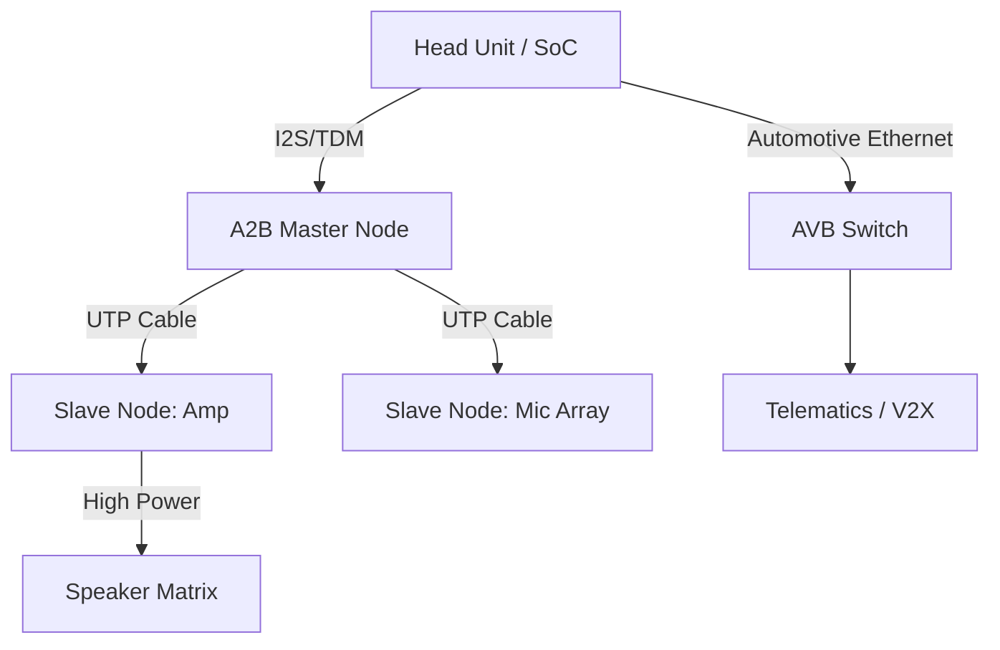

# 车载音频硬件架构 (Automotive Audio Hardware Architecture)

车载音频系统比手机系统复杂得多，涉及超长距离布线、高通道数（有时超过 20 个扬声器）以及极其严苛的电磁兼容性 (EMC) 和可靠性要求。

---

## 1. 车载音频拓扑演进

### 1.1 传统点对点连接 (Analog Legacy)
过去，机头 (Head Unit) 与各扬声器之间采用昂贵且沉重的模拟音频线直接连接。这种方式极易受到发动机 and 车载电子设备的电磁干扰。

### 1.2 现代总线架构 (Digital Bus Architecture)
现代车辆采用数字总线传输音频，主要包括 **A2B** 和 **Ethernet AVB**。

---

## 2. 核心硬件组件

### 2.1 A2B (Automotive Audio Bus)
由 Analog Devices 开发，目前已成为行业标准。
*   **物理介质**：单根非屏蔽双绞线 (UTP)。
*   **特性**：低延迟（50µs 级）、双向传输、支持幻象电源（通过信号线给从节点供电）。
*   **优势**：减轻线束重量 75% 以上，大幅降低系统成本。

### 2.2 DSP 功放 (External Amplifier)
在高端车载系统中，功放不再只是放大电压，而是一个强大的音频处理中心。
*   **多通道输出**：支持 8、12、甚至 24 通道输出。
*   **集成处理**：内置高性能 DSP，执行复杂的声场校准 (Tuning)、多音区分离以及主动降噪 (ANC)。

### 2.3 车载麦克风阵列
*   **功能**：不仅用于蓝牙通话，还用于语音交互（识别是谁在说话）、ANC/RNC（路噪消除）。
*   **部署**：通常部署在顶棚、A柱等位置，通过 A2B 数字化后回传。

---

## 3. 高级硬件交互：ANC/RNC 硬件要求

### 3.1 主动降噪 (ANC) 与 路噪消除 (RNC)
*   **RNC (Road Noise Cancellation)**：通过安装在减震器或底盘上的**加速度计 (Accelerometer)** 监测路面振动。
*   **硬件挑战**：信号从加速度计到 DSP 处理再到扬声器发声，必须在极短时间内（毫秒级）完成，否则相位无法对齐。

---

## 4. 车载以太网 AVB (Audio Video Bridging)
当音频与视频（如后排娱乐系统）需要同步传输且跨越多个控制器时，使用车载以太网 AVB 协议。它通过 **时间敏感网络 (TSN)** 技术保证了确定性的延迟。

---

## 5. 关键参考 (References)

1.  *Automotive Audio Systems* - S. J. Watkinson
2.  [A2B Audio Bus Official Site - ADI](https://www.analog.com/)
3.  [IEEE 802.1 Audio Video Bridging (AVB) Task Group](https://www.ieee802.org/1/pages/avbridging.html)

---
*Next Module: [03. 数字信号处理与算法 (Digital Signal Processing & Algorithms)](../03-Digital-Signal-Processing/README.md)*
