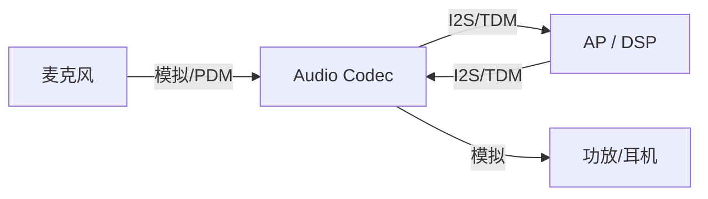
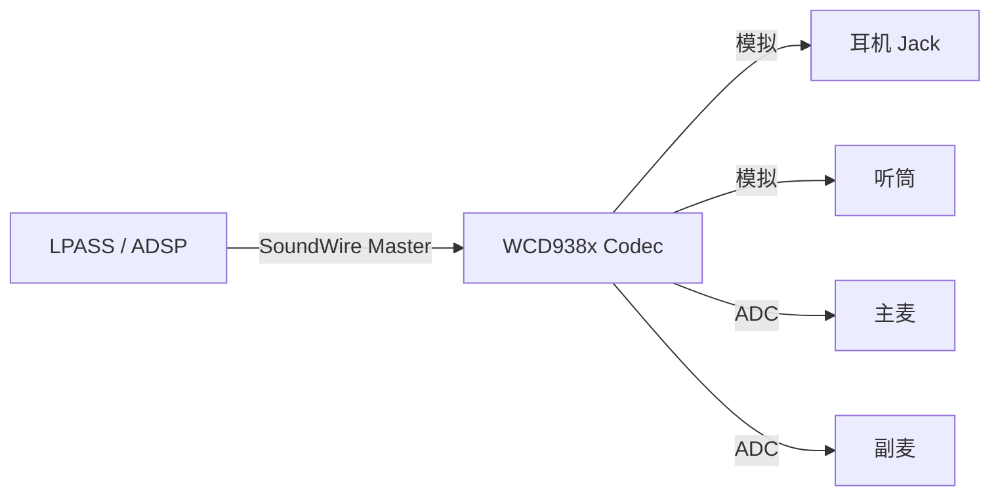
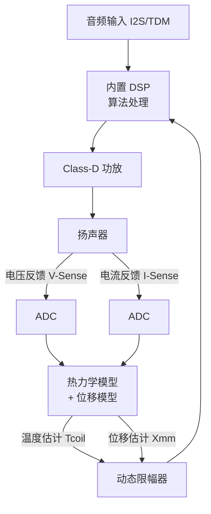
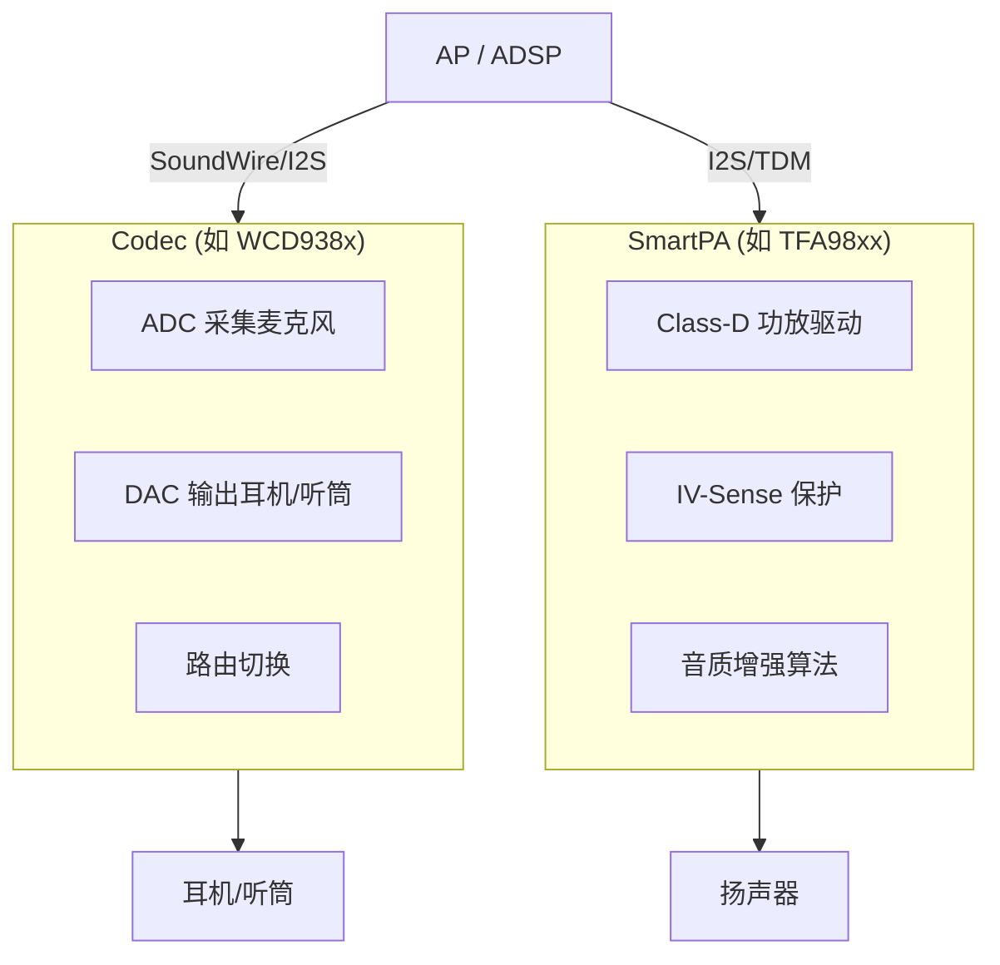

# 编解码器与智能功放 (Audio Codec & SmartPA)

音频编解码器 (Codec) 是数字音频系统的核心枢纽，负责 ADC/DAC 转换、路由切换与信号调理；智能功放 (SmartPA) 则是驱动微型扬声器的关键芯片，通过实时保护算法最大化音质表现。

---

## 1. 音频 Codec 芯片

### 1.1 功能定位

Codec 是 SoC 与外部换能器之间的"翻译官"：



### 1.2 核心功能模块

| 模块 | 功能 | 关键指标 |
|:---|:---|:---|
| **ADC** | 模拟→数字，采集麦克风信号 | SNR、THD+N、动态范围 |
| **DAC** | 数字→模拟，输出至功放/耳机 | DNR (Dynamic Range)、THD+N |
| **PGA (可编程增益放大器)** | 输入/输出增益调节 | 增益范围、步进精度 |
| **Mixer** | 多路信号混合 | 通道数 |
| **路由矩阵 (Routing Matrix)** | 灵活连接输入输出端口 | 拓扑复杂度 |
| **数字接口** | I2S / TDM / SoundWire 与 SoC 通信 | 支持采样率、位深 |
| **控制接口** | I2C / SPI 寄存器配置 | 寄存器映射 |

### 1.3 主流 Codec 芯片系列

#### 高通 WCD 系列 (移动端主力)

| 型号 | 定位 | 关键特性 |
|:---|:---|:---|
| **WCD9380** | 旗舰 | 32-bit/384kHz, DSD256 Native, SoundWire |
| **WCD9385** | 旗舰增强 | 支持更多并发 SoundWire 通路 |
| **WCD937x** | 中端 | 24-bit/192kHz, 成本优化 |

高通平台中 Codec 通常通过 **SoundWire** 总线与 SoC LPASS (Low Power Audio SubSystem) 连接：



#### Cirrus Logic CS 系列 (Apple 生态)

*   **CS42L43**：集成 SoundWire，支持多通道 TDM。
*   **CS35Lxx**：SmartPA + Codec 一体化方案。

#### Realtek ALC 系列 (PC/IoT)

*   **ALC5682**：USB-C 耳机 Codec，支持 Hi-Res。
*   **ALC1220**：桌面主板旗舰 Codec，120dB SNR。

### 1.4 Codec 寄存器配置范例 (以 WCD 为例)

Codec 的所有行为通过寄存器控制，在 Linux/Android 中由 ASoC 驱动 + DAPM 管理：

```c
/* 典型 Codec 寄存器操作 - 设置 PGA 增益 */
static int wcd_set_decimator_gain(struct snd_soc_component *component,
                                   int decimator, int gain_db)
{
    u16 gain_reg = WCD_REG_DEC0_GAIN + (decimator * 0x10);
    /* 增益范围: -12dB ~ +40dB, 步进 1dB */
    u8 val = (u8)(gain_db + 12); /* offset to unsigned */
    return snd_soc_component_write(component, gain_reg, val);
}
```

---

## 2. 智能功放 SmartPA

### 2.1 为什么需要 SmartPA？

传统功放 (Class-D Amp) 仅负责放大信号。但在手机/车载微型扬声器中：
*   **腔体极小** → 低频响应差 → 需要算法补偿
*   **功率密度高** → 音圈过热风险 → 需要温度保护
*   **振膜行程短** → 大音量时物理过冲 → 需要位移保护

SmartPA = **Class-D 功放** + **实时保护 DSP** + **IV-Sense 采样**

### 2.2 核心工作原理：IV-Sense 闭环



**关键公式**：
*   阻抗估算：$Z(t) = V(t) / I(t)$
*   温度推算：$T_{coil} = T_0 \times (1 + \alpha \cdot \Delta R / R_0)$
    *   $\alpha$：铜导线电阻温度系数 (≈0.00393/°C)
*   位移估算：基于电机方程 $x(t) = \frac{1}{Bl} \int (V - IR - L\frac{dI}{dt}) dt$

### 2.3 主流 SmartPA 芯片

| 芯片 | 厂商 | 关键特性 |
|:---|:---|:---|
| **TFA9874** | NXP (Goodix) | 双通道、IV-Sense、EQ |
| **TFA9878** | NXP (Goodix) | 支持 SoundWire |
| **CS35L45** | Cirrus Logic | Haptics 支持、低功耗 |
| **MAX98390** | Maxim (ADI) | 集成 DSP、热保护 |
| **AW882xx** | 艾为电子 | 国产方案、性价比高 |
| **FS19xx** | 富芮坤 | 国产、车载认证 |

### 2.4 SmartPA 的音质增强算法

除了保护功能外，SmartPA 内置 DSP 通常还支持：

1.  **低频补偿 (Bass Enhancement)**
    *   根据扬声器特性曲线，补偿 200Hz 以下的低频衰减。
    *   使能后可感知到明显"低音增强"效果。

2.  **热补偿 (Thermal Compensation)**
    *   音圈温度升高 → 阻抗升高 → 输出声压下降。
    *   算法预判并增加增益，保持输出声压稳定。

3.  **非线性失真校正**
    *   大信号时振膜运动产生非线性。
    *   通过前馈校正算法降低 THD。

### 2.5 Linux/Android 驱动集成

SmartPA 在 ASoC 框架中通常注册为一个 **Codec 驱动**：

```
Machine Driver → DAI Link → SmartPA Codec Driver
                                    ↓
                              I2C/SPI 控制通路
                              I2S/TDM 音频数据通路
```

典型设备树配置：
```dts
&i2c5 {
    tfa98xx: smartpa@34 {
        compatible = "nxp,tfa9874";
        reg = <0x34>;
        reset-gpio = <&tlmm 68 GPIO_ACTIVE_LOW>;
        irq-gpio = <&tlmm 69 GPIO_ACTIVE_HIGH>;
    };
};

&dai_link_speaker {
    codec {
        sound-dai = <&tfa98xx>;
    };
};
```

---

## 3. Codec vs SmartPA 职责划分

在现代手机音频架构中，两者分工明确：



| 维度 | Codec | SmartPA |
|:---|:---|:---|
| 主要角色 | 信号转换与路由 | 功率放大与保护 |
| 驱动对象 | 耳机、听筒、麦克风 | 扬声器 |
| 是否含 DAC | ✅ | ❌ (接收数字 I2S 输入) |
| 是否含功放 | 仅低功率耳机放大 | Class-D 大功率 |
| 保护算法 | 无 | IV-Sense 闭环 |

---

## 4. 关键参考 (References)

1.  [NXP TFA98xx Datasheet & Application Notes](https://www.nxp.com/products/audio-and-radio/audio-amplifiers/smart-audio-amplifiers)
2.  [Qualcomm WCD938x Codec Overview - Qualcomm Developer](https://developer.qualcomm.com/)
3.  [Cirrus Logic CS35L45 Technical Documentation](https://www.cirrus.com/products/cs35l45/)
4.  *ALSA ASoC Driver Development* - Linux Kernel Documentation
5.  [Understanding Speaker Protection - Audio Precision](https://www.ap.com/)
