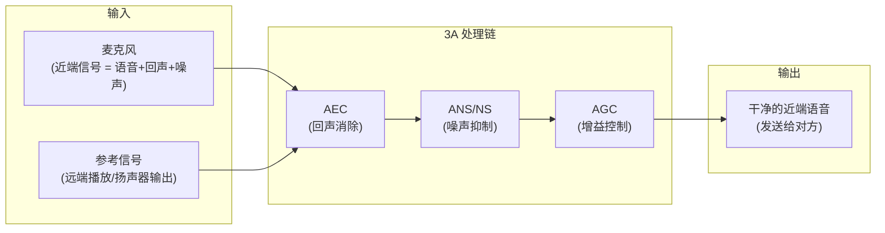
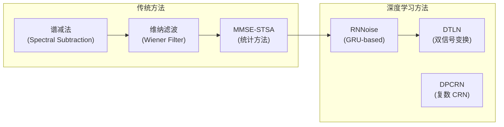
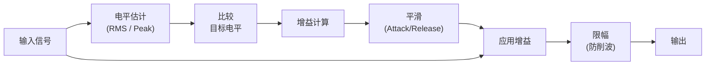

# 语音通信 3A 算法 (AEC, ANS, AGC)

在语音通话和会议系统中，3A 算法是保证通话质量的核心。本章从数学模型、工程实现到主流方案对比，系统解析 3A 全链路。

---

## 1. 3A 处理全链路



**处理顺序的重要性**：
- AEC 必须在最前面 (需要参考信号对齐)
- NS 在 AEC 之后 (消除 AEC 残余噪声)
- AGC 在最后 (对干净信号做增益归一化)

---

## 2. 回声消除 (AEC)

### 2.1 回声路径模型

```
回声产生原理:
  远端语音 → 网络 → 本地扬声器 → 房间声学路径 → 本地麦克风
                                    ↑
                              这就是回声路径 h(n)
                              (长度可达 100-500ms)

  麦克风信号: d(n) = s(n) + y(n) + v(n)
    s(n): 近端语音 (想保留的)
    y(n): 声学回声 = x(n) * h(n) (想消除的)
    v(n): 背景噪声
```

### 2.2 时域 NLMS 算法

$$\mathbf{w}(n+1) = \mathbf{w}(n) + \mu \frac{e(n) \mathbf{x}(n)}{\|\mathbf{x}(n)\|^2 + \epsilon}$$

```python
def nlms_aec(far_end_ref, mic_in, filter_state):
    # 1. 估计回声
    echo_hat = np.dot(filter_state.weights, far_end_ref)
    
    # 2. 误差 = 麦克风 - 估计回声
    error = mic_in - echo_hat
    
    # 3. 自适应更新 (仅在非双讲时)
    if not double_talk_detected(far_end_ref, mic_in):
        norm = np.dot(far_end_ref, far_end_ref) + 1e-6
        filter_state.weights += mu * (error * far_end_ref) / norm
    
    return error
```

### 2.3 频域 AEC (分块频域方法, PBFDAF)

时域 NLMS 在长回声路径下效率低。现代 AEC 使用**分块频域自适应滤波器**：

```
分块频域 AEC (Block Frequency Domain):
  1. 将输入分块 (如 128 samples/block)
  2. FFT → 频域处理 (逐频点自适应)
  3. IFFT → 时域输出

优势:
  - 计算复杂度: O(N log N) vs O(N²) (时域)
  - 支持长滤波器 (512-4096 taps, 对应 32-256ms 回声)
  - 利于 DSP SIMD 优化

WebRTC AEC3 就是分块频域实现:
  - Block size: 64 samples
  - Filter length: ~400ms (6400 taps @ 16kHz)
  - 自适应: 逐频点 NLMS + 正则化
```

### 2.4 双讲检测 (DTD)

| 方法 | 原理 | 优缺点 |
|:---|:---|:---|
| **Geigel** | 比较麦克风能量与参考能量 | 简单但不精确 |
| **ERLE-based** | 监测回声衰减量突变 | 较准确 |
| **Coherence** | 计算远端/近端相干性 | WebRTC 使用，鲁棒 |
| **Neural DTD** | 训练小模型判断 | 最准确，需计算资源 |

### 2.5 AEC 性能指标

| 指标 | 定义 | 目标 |
|:---|:---|:---|
| **ERLE** | 回声衰减量 (Echo Return Loss Enhancement) | > 30dB |
| **收敛时间** | 从开始到 ERLE 稳定 | < 1-2 秒 |
| **双讲保留** | 双讲时近端语音不失真 | MOS > 3.5 |
| **尾音长度** | 可消除的最大回声延迟 | > 200ms |

---

## 3. 噪声抑制 (ANS / NS)

### 3.1 算法演进



### 3.2 维纳滤波 (工业主流传统方案)

$$H(f) = \frac{P_s(f)}{P_s(f) + P_n(f)} = \frac{\text{SNR}(f)}{1 + \text{SNR}(f)}$$

```
维纳滤波实现步骤:
  1. STFT 分帧 (25ms, hop 10ms)
  2. 噪声估计 (静音段平均 / MCRA 最小统计量)
  3. 先验 SNR 估计 (Decision-Directed 方法)
  4. 计算增益 H(f) = SNR / (1 + SNR)
  5. 应用增益: S_hat(f) = H(f) × Y(f)
  6. ISTFT 合成

优化:
  - 增益平滑 (避免音乐噪声)
  - 最小增益限制 (如 -15dB, 避免过度抑制)
  - 语音存在概率 (Speech Presence Probability)
```

### 3.3 深度学习降噪

| 方案 | 架构 | 参数量 | 实时率 | 适用 |
|:---|:---|:---|:---|:---|
| **RNNoise** | GRU (22 bands) | 60K | 极低 (ARM 可用) | 嵌入式/WebRTC |
| **DTLN** | Dual-signal LSTM | 1M | CPU 实时 | 移动端 |
| **DCCRN** | Complex CRN + LSTM | 3.7M | GPU 实时 | 高质量 |
| **FullSubNet** | Full-band + Sub-band | 5.6M | GPU | SOTA 质量 |
| **Qualcomm Fluence** | 专有 (DSP) | 不公开 | ADSP 实时 | 高通手机 |

### 3.4 降噪性能指标

| 指标 | 说明 | 目标 |
|:---|:---|:---|
| **SNR 改善** | 处理前后 SNR 提升 | > 10-15 dB |
| **PESQ** | 感知语音质量 (1-4.5) | > 3.5 |
| **STOI** | 短时客观可懂度 (0-1) | > 0.85 |
| **处理延迟** | 算法引入的额外延迟 | < 20ms |

---

## 4. 自动增益控制 (AGC)

### 4.1 AGC 处理流程



### 4.2 AGC 分类

| 类型 | 处理位置 | 说明 |
|:---|:---|:---|
| **模拟 AGC** | Codec 前端 (PGA) | 调节模拟增益，防止 ADC 饱和 |
| **数字 AGC** | 软件处理 | 细粒度控制，灵活 |
| **固定增益** | 简单放大 | 无自适应，适合信号稳定场景 |
| **自适应 AGC** | 软件处理 | 根据环境动态调整 (主流) |

### 4.3 WebRTC AGC 两级架构

```
WebRTC AGC (Analog + Digital):

Level 1: 模拟增益 (Analog AGC)
  - 调节系统麦克风增益 (OS volume)
  - 粗调，保证信号在 ADC 量化范围内
  - 调节速度慢 (避免频繁改变硬件增益)

Level 2: 数字增益 (Digital AGC)
  - 细粒度补偿
  - 快速响应 (attack ~10ms)
  - 带 limiter 防止削波
  - 目标电平: -3 dBFS (留余量)
```

### 4.4 核心参数

| 参数 | 说明 | 典型值 |
|:---|:---|:---|
| **Target Level** | 目标输出电平 | -3 ~ -6 dBFS |
| **Max Gain** | 最大增益上限 | 30-40 dB |
| **Min Level** | 低于此不增益 (避免放大噪声) | -50 dBFS |
| **Attack** | 增益减小速度 | 5-20 ms |
| **Release** | 增益增加速度 | 100-500 ms |
| **Limiter Threshold** | 硬限幅门限 | -1 dBFS |

---

## 5. 方案对比

### 5.1 主流 3A 方案

| 方案 | 提供者 | 平台 | 特点 |
|:---|:---|:---|:---|
| **WebRTC APM** | Google (开源) | 跨平台 | 基线方案，免费，社区活跃 |
| **Fluence** | Qualcomm | 高通 ADSP | 多麦波束成形 + AEC + NS，DSP 运行 |
| **Speex** | Xiph.org (开源) | 跨平台 | 轻量，已过时 (被 WebRTC 替代) |
| **3A Suite** | 科大讯飞/思必驰 | 国产平台 | 中文语音优化 |
| **Dolby Voice** | Dolby | 会议系统 | 高端会议 3A |

### 5.2 WebRTC APM 模块架构

```
WebRTC Audio Processing Module (APM):
┌──────────────────────────────────────────────┐
│                  APM Pipeline                  │
├──────────────────────────────────────────────┤
│  Input: 10ms 帧 (16kHz/32kHz/48kHz)          │
│                                               │
│  1. High Pass Filter (去除 DC 偏移)            │
│  2. AEC3 (频域自适应滤波)                      │
│  3. Noise Suppression (频域维纳滤波)           │
│  4. Voice Activity Detection (VAD)            │
│  5. AGC2 (数字 AGC + Limiter)                 │
│  6. Residual Echo Suppressor                  │
│                                               │
│  Output: 处理后的 10ms 帧                      │
└──────────────────────────────────────────────┘

关键源码路径:
  webrtc/modules/audio_processing/
    ├── aec3/           (AEC3 频域回声消除)
    ├── ns/             (噪声抑制)
    ├── agc2/           (自动增益控制)
    ├── vad/            (语音活动检测)
    └── include/audio_processing.h (主接口)
```

---

## 6. 调试与问题排查

### 6.1 常见问题

| 问题 | 表现 | 根因 | 解决 |
|:---|:---|:---|:---|
| **回声泄漏** | 对方听到自己声音 | AEC 滤波器未收敛/延迟对齐错误 | 检查参考信号延迟对齐 |
| **双讲失真** | 双方同时说话时近端语音被消 | DTD 不灵敏 | 调整 DTD 阈值 |
| **噪声残留** | 静音时有底噪 | NS 抑制不够 | 增大抑制量 (但注意音乐噪声) |
| **音乐噪声** | 处理后有"水滴声" | NS 过度抑制 | 增加增益平滑/最小增益限制 |
| **呼吸效应** | AGC 在语音间隙拉升噪声 | Release 太快 | 增加 release 时间 |
| **半双工** | 同时说话时一方被静音 | AEC+NS 过于激进 | 降低 NLP 攻击性 |

### 6.2 调试信号录制

```bash
# Android 平台录制 3A 前后信号
# 录制远端参考信号 (AEC reference)
adb shell "echo 'aec_ref_dump=1' > /data/vendor/audio/audio_params"

# 录制麦克风原始信号 (AEC 前)
adb shell "echo 'mic_raw_dump=1' > /data/vendor/audio/audio_params"

# 录制 3A 处理后信号
adb shell "echo 'processed_dump=1' > /data/vendor/audio/audio_params"

# 高通平台 QXDM 抓取音频数据
# 使用 QACT 工具回放和分析
```

---

## 7. 关键参考 (References)

1.  *Adaptive Filter Theory (5th Edition)* - Simon Haykin
2.  [WebRTC Audio Processing Source](https://webrtc.googlesource.com/src/+/refs/heads/main/modules/audio_processing/)
3.  [RNNoise: Learning Noise Suppression](https://jmvalin.ca/demo/rnnoise/)
4.  [Speex DSP Library](https://www.speex.org/)
5.  [ITU-T G.168: Echo Canceller Requirements](https://www.itu.int/rec/T-REC-G.168)
6.  [ETSI TS 103 106: Speech Quality in Presence of Background Noise](https://www.etsi.org/)
