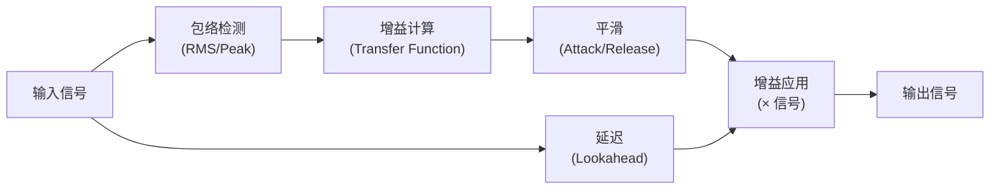
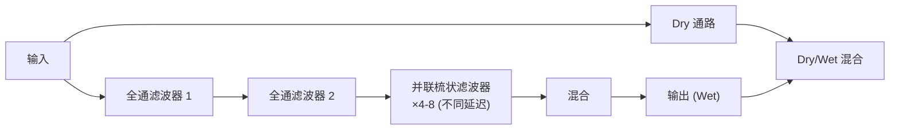
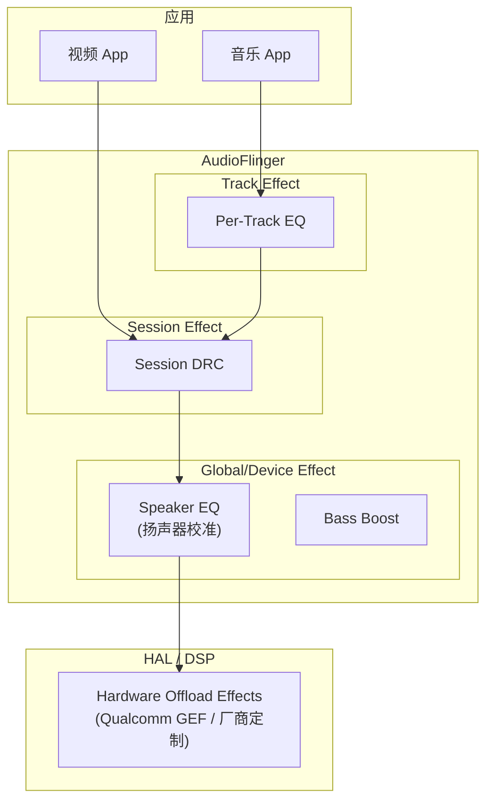

# 音效处理 (Audio Effects: EQ, DRC, Limiter, Reverb)

音效处理是对音频信号进行深度加工，以达到艺术修饰、硬件补偿或听感优化的目的。本章从数学原理到 DSP 实现，系统解析各类音效的工程实践。

---

## 1. 均衡器 (EQ, Equalizer)

### 1.1 Biquad 滤波器 (核心构建块)

几乎所有数字 PEQ 都由 Biquad (双二阶 IIR, Infinite Impulse Response, 无限脉冲响应) 滤波器级联而成：

$$y[n] = b_0x[n] + b_1x[n-1] + b_2x[n-2] - a_1y[n-1] - a_2y[n-2]$$

**Direct Form II Transposed 实现** (数值最稳定):
```c
// 定点 Biquad 实现 (Q27 格式, 适合 DSP)
typedef struct {
    int32_t b0, b1, b2, a1, a2;  // Q27 系数
    int64_t d1, d2;               // 延迟线 (Q27)
} biquad_t;

static inline int32_t biquad_process(biquad_t *f, int32_t x) {
    int64_t y = (int64_t)f->b0 * x + f->d1;
    f->d1 = (int64_t)f->b1 * x - (int64_t)f->a1 * (y >> 27) + f->d2;
    f->d2 = (int64_t)f->b2 * x - (int64_t)f->a2 * (y >> 27);
    return (int32_t)(y >> 27);
}
```

### 1.2 EQ 滤波器类型

| 类型 | 用途 | 参数 | 应用场景 |
|:---|:---|:---|:---|
| **Peaking** | 提升/衰减某频段 | Fc, Gain, Q | 音乐调音 |
| **Low-shelf** | 提升/衰减低频 | Fc, Gain, S | 低音增强 |
| **High-shelf** | 提升/衰减高频 | Fc, Gain, S | 亮度调节 |
| **HPF** | 切除低频 | Fc, Order | 去除风噪/机械振动 |
| **LPF** | 切除高频 | Fc, Order | 抗混叠/去毛刺 |
| **Band-pass** | 保留特定频段 | Fc, Q | 语音突出 |
| **Notch** | 陷除特定频率 | Fc, Q | 去除 50/60Hz 工频干扰 |

### 1.3 系数计算 (Peaking EQ)

```python
import numpy as np

def peaking_eq_coeffs(fc, gain_db, Q, fs):
    """计算 Peaking EQ 的 Biquad 系数"""
    A = 10 ** (gain_db / 40.0)
    w0 = 2 * np.pi * fc / fs
    alpha = np.sin(w0) / (2 * Q)
    
    b0 = 1 + alpha * A
    b1 = -2 * np.cos(w0)
    b2 = 1 - alpha * A
    a0 = 1 + alpha / A
    a1 = -2 * np.cos(w0)
    a2 = 1 - alpha / A
    
    # 归一化
    return [b0/a0, b1/a0, b2/a0, a1/a0, a2/a0]
```

### 1.4 多频段 PEQ 级联

```
典型 10-Band PEQ (手机扬声器校准):
  Band 1: HPF (High-Pass Filter, 高通滤波器) @ 100Hz,  Order 2 (去除振动噪声)
  Band 2: Peak   @ 200Hz,  Gain +3dB,  Q=1.5
  Band 3: Peak   @ 500Hz,  Gain -2dB,  Q=2.0
  Band 4: Peak   @ 1kHz,   Gain +1dB,  Q=1.0
  Band 5: Peak   @ 2kHz,   Gain +4dB,  Q=2.0
  Band 6: Peak   @ 4kHz,   Gain -1dB,  Q=1.5
  Band 7: Peak   @ 6kHz,   Gain +2dB,  Q=2.5
  Band 8: Peak   @ 8kHz,   Gain -3dB,  Q=3.0
  Band 9: Peak   @ 12kHz,  Gain +1dB,  Q=2.0
  Band 10: LPF (Low-Pass Filter, 低通滤波器) @ 18kHz,  Order 2 (抗混叠)

总延迟: 近似零 (IIR 滤波器, < 1 sample)
计算量: 10 × 5 MAC/sample = 50 MAC/sample
```

---

## 2. 动态范围控制 (DRC)

### 2.1 DRC 完整处理链



### 2.2 压缩器完整参数

| 参数 | 说明 | 典型值 | 影响 |
|:---|:---|:---|:---|
| **Threshold** | 开始压缩的电平 | -20 ~ -6 dBFS | 低→压缩更多信号 |
| **Ratio** | 压缩比 | 2:1 ~ 20:1 | 高→压缩越强 |
| **Attack** | 增益下降速度 | 1-50 ms | 短→快速响应瞬态 |
| **Release** | 增益恢复速度 | 50-500 ms | 短→快速恢复，可能有"呼吸感" |
| **Knee** | 阈值过渡宽度 | 0-12 dB | 大→过渡更平滑 |
| **Lookahead** | 预判延迟 | 0-10 ms | 有→避免瞬态泄漏 |
| **Makeup Gain** | 补偿增益 | 0-20 dB | 压缩后补偿响度损失 |

### 2.3 转换函数 (Transfer Function)

```
                    Output (dB)
                      │
            1:1 线    │     /
             (不压缩) │    / ← Ratio 2:1 (压缩)
                      │   /
                      │  /←── Ratio ∞:1 (限制器)
                      │ /
          ────────────┼/────────────── Threshold
                      │
                      └─────────────── Input (dB)

Soft Knee:
  在 Threshold ± Knee/2 范围内平滑过渡
  减少"泵浦感"，听感更自然
```

### 2.4 DRC 实现 (C 伪代码)

```c
float drc_process(drc_state_t *s, float input_sample) {
    // 1. 包络检测 (RMS, 带 attack/release)
    float abs_in = fabsf(input_sample);
    float env;
    if (abs_in > s->envelope)
        env = s->attack_coeff * s->envelope + (1 - s->attack_coeff) * abs_in;
    else
        env = s->release_coeff * s->envelope + (1 - s->release_coeff) * abs_in;
    s->envelope = env;
    
    // 2. 转换为 dB
    float env_db = 20.0f * log10f(env + 1e-10f);
    
    // 3. 计算增益 (soft knee)
    float gain_db = 0.0f;
    if (env_db > s->threshold + s->knee/2) {
        gain_db = s->threshold + (env_db - s->threshold) / s->ratio - env_db;
    } else if (env_db > s->threshold - s->knee/2) {
        // Soft knee 区域
        float x = env_db - s->threshold + s->knee/2;
        gain_db = (1.0f/s->ratio - 1.0f) * x * x / (2.0f * s->knee);
    }
    
    // 4. 应用增益
    float gain_linear = powf(10.0f, gain_db / 20.0f);
    return input_sample * gain_linear;
}
```

---

## 3. 限制器 (Limiter) 与噪声门 (Noise Gate)

### 3.1 Limiter (削顶限制器)

Limiter 是压缩比为 ∞:1 的特殊 DRC：

| 特性 | Compressor | Limiter |
|:---|:---|:---|
| Ratio | 2:1 ~ 10:1 | ∞:1 (硬限) |
| Attack | 可选 | 极快 (< 1ms) |
| Threshold | 中等 | 接近 0dBFS |
| 用途 | 动态控制 | 防削波保护 |

### 3.2 Noise Gate

```
Noise Gate 转换函数:
  input < threshold → 完全静音 (或衰减 -∞ dB)
  input > threshold → 通过 (0 dB)
  
参数:
  Threshold: 门限 (如 -40 dBFS)
  Attack: 开门速度
  Hold: 保持打开时间
  Release: 关门速度
  
应用: 去除录音间隙的底噪、话筒串扰
```

---

## 4. 混响 (Reverb)

### 4.1 混响组成

```
声音传播时间线:
  0ms        5-50ms         50-500ms           500ms+
   │           │               │                 │
   ▼           ▼               ▼                 ▼
  直达声    早期反射声      后期混响          混响尾
  (Direct)  (Early Refl.)  (Late Reverb)     (Tail)
  
  ← 距离感 → ← 房间大小 → ← 空间感/氛围 →
```

### 4.2 算法混响实现 (Schroeder Reverberator)



### 4.3 关键参数

| 参数 | 说明 | 效果 |
|:---|:---|:---|
| **Pre-delay** | 直达声到首次反射的间隔 | 模拟房间大小 |
| **RT60** | 混响衰减 60dB 的时间 | 大空间→长 RT60 |
| **Diffusion** | 反射密度 | 高→更自然 |
| **Damping** | 高频衰减速度 | 模拟材质吸收 |
| **Dry/Wet** | 原始信号与混响比例 | 控制效果强度 |

---

## 5. DSP 定点化实践

### 5.1 浮点 vs 定点

| 特性 | 浮点 (F32) | 定点 (Q31/Q15) |
|:---|:---|:---|
| 动态范围 | 1530 dB | 186 dB (Q31) / 90 dB (Q15) |
| 精度 | 均匀 (相对误差) | 不均匀 (绝对误差) |
| 溢出风险 | 极低 | 需手动管理 |
| DSP 硬件 | 需 FPU | 所有 DSP 原生支持 |
| 功耗 | 较高 | 极低 |
| 适用 | AP 侧 / 开发调试 | ADSP / 嵌入式 DSP |

### 5.2 Q 格式说明

```
Q31: 1 符号位 + 31 小数位
  范围: [-1.0, +1.0 - 2^-31]
  精度: 约 2^-31 ≈ 4.66e-10
  对应 dB 动态范围: 20*log10(2^31) ≈ 186 dB

Q15: 1 符号位 + 15 小数位
  范围: [-1.0, +1.0 - 2^-15]
  精度: 约 2^-15 ≈ 3.05e-5

定点乘法:
  Q31 × Q31 → Q62 → 右移31位 → Q31
  需要 64-bit 累加器 (MAD/MAC 指令)
```

---

## 6. Android 音效集成框架

### 6.1 Effect 挂载层级



### 6.2 Effect 处理位置演进

| Android 版本 | 趋势 | 说明 |
|:---|:---|:---|
| Android ≤ 12 | AudioServer 进程内处理 | 占用 CPU，增加延迟 |
| Android 13+ | 推荐下沉到 HAL 进程 | 利用 DSP 算力，降低功耗 |
| Android 14+ | AIDL Effect Interface | 标准化，支持多进程 |

### 6.3 HAL 侧处理优势

```
AudioServer 进程内 vs HAL/DSP 侧处理:

  CPU 路径:          DSP 路径:
  ┌──────────┐       ┌──────────┐
  │ MixerThread│     │ MixerThread│
  │ + Effect  │     │ (无 Effect)│
  │ (CPU 处理)│     └──────┬─────┘
  └──────┬─────┘           │
         │                  ▼
         ▼           ┌──────────┐
  ┌──────────┐       │ Audio HAL│
  │ Audio HAL│       │ → DSP   │
  └──────────┘       │ (硬件处理)│
                     └──────────┘
  
  功耗: 高 (CPU 满载)     低 (DSP 专用硬件)
  延迟: 增加 ~5-10ms     几乎零增加
  灵活性: 高              受限于 DSP 能力
```

---

## 7. 调音工具链

| 工具 | 厂商 | 用途 |
|:---|:---|:---|
| **QACT** | Qualcomm | 高通平台 EQ/DRC/AEC 调参 |
| **SoundClear Studio** | Qualcomm | 可视化音效设计 |
| **ACDB Editor** | Qualcomm | 音频校准数据库编辑 |
| **REW** | 开源 | 房间声学测量 + EQ 设计 |
| **Audio Precision** | AP | 专业音频客观测试 |
| **Cirrus Logic WISCE** | Cirrus | CS47x SmartPA 调音 |
| **miniDSP** | miniDSP | 跨平台 DSP 调音工具 |

---

## 8. 关键参考 (References)

1.  [Audio EQ Cookbook - Robert Bristow-Johnson](https://www.w3.org/2011/audio/audio-eq-cookbook.html)
2.  *Introduction to Sound Processing* - Davide Rocchesso
3.  [DAFX: Digital Audio Effects (2nd Edition)](https://www.dafx.de/)
4.  [Google Resonance Audio](https://github.com/resonance-audio/resonance-audio)
5.  [Android Audio Effect Framework](https://source.android.com/docs/core/audio/audio-effects)
