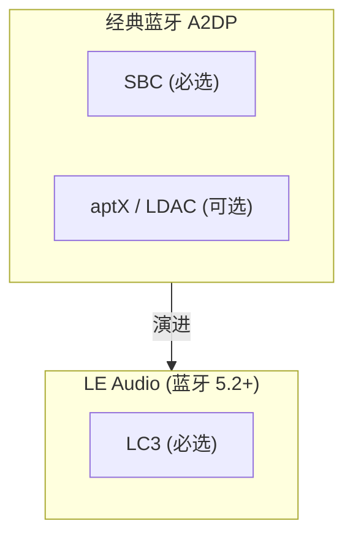
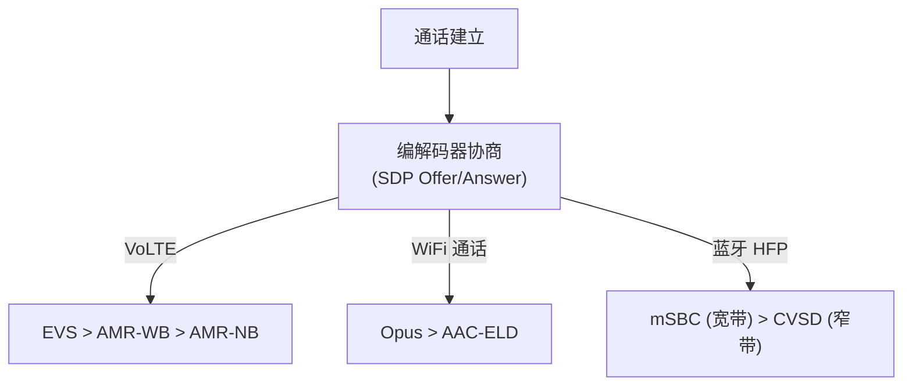
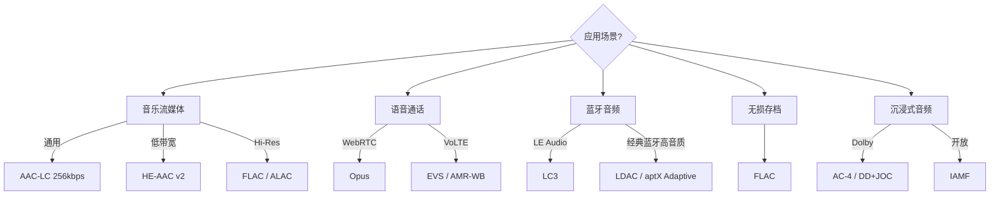

# 音频编解码格式 (Audio Codec Formats)

音频编解码 (Audio Codec) 是对原始 PCM 数据进行压缩编码以减少存储和传输带宽的技术。不同格式在压缩率、音质、延迟和计算复杂度之间做出不同权衡。

---

## 1. 基本概念

### 1.1 无损 vs 有损

| 类型 | 原理 | 典型格式 | 压缩率 |
|:---|:---|:---|:---|
| **无损 (Lossless)** | 信息熵编码，可完美还原 | FLAC, ALAC, APE | 50%-70% |
| **有损 (Lossy)** | 利用心理声学模型丢弃不可闻信息 | AAC, MP3, Opus | 5%-20% |

### 1.2 关键指标

*   **比特率 (Bitrate)**：kbps，直接影响音质和带宽占用
*   **采样率 (Sample Rate)**：44.1kHz (CD) / 48kHz (影视) / 96kHz+ (Hi-Res)
*   **编解码延迟 (Codec Latency)**：帧长 + Look-ahead，实时通话要求 < 40ms
*   **算法复杂度 (Complexity)**：影响 CPU/DSP 功耗

---

## 2. 通用音频编解码格式

### 2.1 AAC (Advanced Audio Coding)

业界最广泛的有损格式，MPEG 标准家族成员。

| Profile | 比特率 | 特性 | 应用场景 |
|:---|:---|:---|:---|
| **AAC-LC** | 128-256 kbps | 低复杂度、高兼容性 | 音乐流媒体、视频 |
| **HE-AAC v1** | 48-64 kbps | 加入 SBR (频谱带复制) | 数字广播 (DAB+) |
| **HE-AAC v2** | 24-48 kbps | 加入 PS (参数立体声) | 低带宽流媒体 |
| **AAC-ELD** | 24-64 kbps | 增强低延迟 (< 20ms) | FaceTime 通话 |
| **xHE-AAC** | 12-256 kbps | 统一低码率到高码率 | 自适应流媒体 |

### 2.2 Opus

IETF 开放标准，目前公认最先进的通用音频编解码器。

```
编码模式自动切换：
  语音 (SILK 内核) ←→ 混合模式 ←→ 音乐 (CELT 内核)
  低码率 6kbps         中码率           高码率 510kbps
```

*   **延迟**：最低 2.5ms（业界最低之一）
*   **采样率**：8kHz - 48kHz 全覆盖
*   **应用**：WebRTC 默认编解码器、Discord、微信通话

### 2.3 MP3 (MPEG-1 Audio Layer III)

*   历史最悠久的有损格式，专利已过期 (2017)
*   128kbps 已成为"可接受音质"的基线
*   **局限**：不支持多声道、编码效率低于 AAC/Opus

### 2.4 FLAC (Free Lossless Audio Codec)

*   最流行的开源无损格式
*   **压缩率**：典型约 50%-60%
*   **解码复杂度**：极低，适合嵌入式设备
*   Android 原生支持

### 2.5 ALAC (Apple Lossless Audio Codec)

*   Apple 生态的无损格式
*   性能与 FLAC 接近，Apple 设备原生支持
*   2011 年已开源

---

## 3. 蓝牙音频编解码格式

蓝牙音频受限于无线带宽，编解码格式直接决定了音质上限。

### 3.1 格式对比

| 格式 | 标准 | 最高码率 | 采样率 | 延迟 | 授权 |
|:---|:---|:---|:---|:---|:---|
| **SBC** | A2DP 必选 | 328 kbps | 48kHz/16bit | ~150ms | 免费 |
| **AAC** | A2DP 可选 | 256 kbps | 44.1kHz | ~100ms | 许可 |
| **aptX** | Qualcomm | 384 kbps | 48kHz/16bit | ~70ms | 许可 |
| **aptX HD** | Qualcomm | 576 kbps | 48kHz/24bit | ~100ms | 许可 |
| **aptX Adaptive** | Qualcomm | 420 kbps | 96kHz/24bit | ~50ms | 许可 |
| **LDAC** | Sony | 990 kbps | 96kHz/24bit | ~100ms | 开放 |
| **LC3** | Bluetooth LE Audio | 160 kbps | 48kHz | ~20ms | 免版税 |
| **LC3plus** | Fraunhofer | 256+ kbps | 96kHz | ~5ms | 许可 |

### 3.2 LC3：LE Audio 的核心编解码器

LC3 (Low Complexity Communication Codec) 是蓝牙 5.2 LE Audio 的强制编解码器，代表蓝牙音频的未来方向：



**LC3 优势**：
*   同等码率下音质显著优于 SBC
*   极低延迟 (帧长 7.5ms / 10ms)
*   支持多流 (Multi-Stream)：真正的独立左右耳传输
*   支持广播音频 (Auracast)

### 3.3 Android 蓝牙音频编解码路径


---

## 4. 语音通信编解码格式

### 4.1 窄带/宽带语音编解码

| 格式 | 带宽 | 采样率 | 码率 | 场景 |
|:---|:---|:---|:---|:---|
| **G.711** | 窄带 | 8kHz | 64 kbps | PSTN 电话 |
| **G.729** | 窄带 | 8kHz | 8 kbps | VoIP |
| **AMR-NB** | 窄带 | 8kHz | 4.75-12.2 kbps | 2G/3G 通话 |
| **AMR-WB** | 宽带 | 16kHz | 6.6-23.85 kbps | VoLTE HD Voice |
| **EVS** | 超宽带 | 8-48kHz | 5.9-128 kbps | VoLTE 演进 |
| **Opus** | 全频段 | 8-48kHz | 6-510 kbps | WebRTC/OTT |

### 4.2 编解码器选择链路 (Android VoIP)



---

## 5. 沉浸式音频编解码格式

| 格式 | 标准组织 | 核心特性 | 应用 |
|:---|:---|:---|:---|
| **Dolby AC-4** | Dolby | 对象音频 + 对话增强 | Atmos 流媒体 |
| **MPEG-H 3D Audio** | MPEG | 场景 + 对象 + HOA | Sony 360RA、广播 |
| **DTS:X** | DTS | 对象音频 + 无损 | 蓝光碟、家庭影院 |
| **IAMF** | Alliance for Open Media | 开放标准、免版税 | 流媒体、XR |

---

## 6. 编解码格式选择指南



---

## 7. 关键参考 (References)

1.  [Opus Codec Official](https://opus-codec.org/)
2.  [Bluetooth LE Audio Specification](https://www.bluetooth.com/learn-about-bluetooth/recent-enhancements/le-audio/)
3.  [Fraunhofer - AAC](https://www.iis.fraunhofer.de/en/ff/amm/consumer-electronics/aac.html)
4.  [FLAC - Free Lossless Audio Codec](https://xiph.org/flac/)
5.  [Dolby AC-4 Technical Overview](https://professional.dolby.com/tv/dolby-ac-4/)
6.  [IETF RFC 6716 - Opus](https://datatracker.ietf.org/doc/html/rfc6716)
