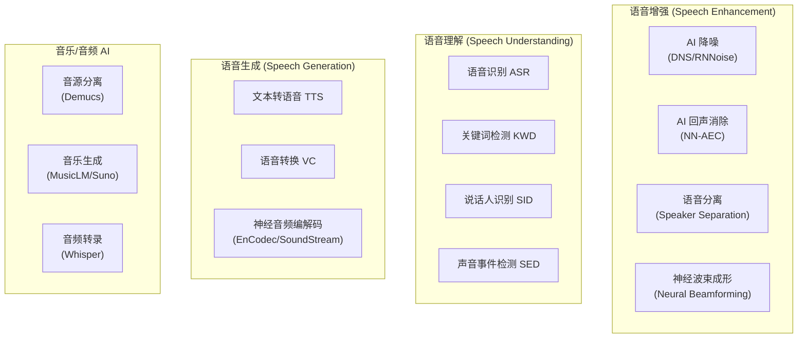

# AI 音频处理 (AI-Powered Audio Processing)

人工智能正在深刻重塑音频处理的范式——从传统的基于规则/统计模型的 DSP，转向数据驱动的深度学习方法。本章介绍 AI 在音频领域的核心应用、主流模型架构、端侧部署策略和工程实践。

---

## 1. AI 音频全景



---

## 2. AI 降噪 (Deep Noise Suppression)

### 2.1 传统 vs AI 降噪

| 维度 | 传统方法 (谱减法/维纳) | AI 方法 (DNN) |
|:---|:---|:---|
| **非平稳噪声** | 效果差 (依赖噪声估计) | 效果好 (数据驱动泛化) |
| **音质保持** | 易引入音乐噪声 | 自然度更高 |
| **计算复杂度** | 低 (~1 MIPS) | 高 (10-100 MIPS) |
| **噪声类型** | 需要针对性调参 | 训练数据覆盖即可 |
| **典型方案** | Speex/WebRTC NS | RNNoise/DTLN/DCCRN |

### 2.2 主流模型架构

```
AI 降噪模型演进:

  1. RNNoise (2018, Xiph.org)
     架构: GRU + Fully Connected
     特点: 极轻量 (~80KB 模型), 帧级处理
     复杂度: ~5 MFLOPS/frame
     
  2. DTLN (Dual-Signal Transformation LSTM Network)
     架构: 双路 LSTM (时域 + STFT 域)
     特点: 因果模型, 可实时
     
  3. DCCRN (Deep Complex CRN)
     架构: Complex-valued Conv + LSTM
     特点: 复数域处理, 相位增强
     
  4. FullSubNet+ (2022)
     架构: Full-band + Sub-band 双路
     特点: 全频带建模 + 子带精细处理
     
  5. TF-GridNet (2023)
     架构: 时频交替注意力
     特点: SOTA 性能, 计算较大

实时性要求:
  帧长: 10-20ms (为保证低延迟)
  Look-ahead: 0-10ms (因果/非因果)
  处理时间: < 帧长 (否则引入额外延迟)
```

### 2.3 训练数据与评估

```
训练数据组成:
  Clean Speech:  DNS Challenge dataset, LibriSpeech, VCTK
  Noise:         AudioSet, DEMAND, MUSAN, 真实采集噪声
  RIR (混响):    OpenSLR, Image-source 仿真
  
  数据增强:
    - 随机 SNR 混合 (-5dB ~ +20dB)
    - 随机 RIR 卷积
    - 随机频响畸变 (模拟设备差异)
    - Speed/Pitch 扰动

评估指标:
  PESQ:    感知语音质量 (窄带/宽带)
  SI-SNR:  尺度不变信噪比 (dB)
  STOI:    短时客观可懂度 (0-1)
  DNSMOS:  微软 DNS-MOS (无参考, 1-5分)
  
  实时因子 RTF:
    RTF = 处理时间 / 音频时长
    RTF < 1.0 → 可实时
    RTF < 0.5 → 有余量 (推荐)
```

---

## 3. AI 回声消除 (NN-AEC)

### 3.1 传统 AEC 的局限

```
传统 AEC (自适应滤波器) 的痛点:
  ❌ 非线性失真: SmartPA/扬声器非线性 → 线性滤波器无法建模
  ❌ 双讲检测: 远端近端同时说话时收敛困难
  ❌ 变化回声路径: 用户移动/手持切换 → 需要重新收敛
  
AI AEC 的优势:
  ✅ 隐式建模非线性
  ✅ 数据驱动的双讲处理
  ✅ 泛化不同声学环境
```

### 3.2 NN-AEC 架构

```
典型 NN-AEC Pipeline:

  参考信号 (远端) ──┐
                    ├──→ [特征提取] ──→ [NN Model] ──→ 增强语音
  麦克风信号 (近端+回声) ┘
  
  输入特征:
    近端: STFT 幅度 + 相位 (或复数谱)
    远端: STFT 幅度 (作为条件输入)
    
  模型类型:
    - 掩蔽 (Masking): 预测 T-F mask, 应用于近端
    - 映射 (Mapping): 直接预测干净语音谱
    - 混合: 线性 AEC 残差 + NN 后处理

  实际部署:
    通常 = 传统 AEC (粗消除) + NN 残余回声抑制 (RES)
    这样 NN 只需处理残余, 降低模型负担
```

---

## 4. 端侧 AI 音频部署

### 4.1 推理框架与硬件

| 推理框架 | 支持硬件 | 量化支持 | 音频适用性 |
|:---|:---|:---|:---|
| **TFLite** | CPU/GPU/DSP/NPU | INT8/FP16 | 通用, Android 原生 |
| **ONNX Runtime** | CPU/GPU/NPU | INT8/FP16 | 跨平台, 丰富算子 |
| **SNPE** (高通) | Hexagon DSP/HTP | INT8/FP16 | 高通平台最优 |
| **QNN** (高通) | HTP/HVX/GPU | INT8/INT16/FP16 | SNPE 继任者 |
| **ArmNN** | Arm CPU/GPU/NPU | INT8/FP16 | Arm 平台优化 |
| **Core ML** | Apple ANE/GPU | FP16/INT8 | iOS/macOS |

### 4.2 模型优化策略

```
端侧部署优化 Pipeline:

  1. 模型压缩:
     ├── 知识蒸馏 (Teacher → Student)
     ├── 结构剪枝 (通道/层剪枝)
     └── 低秩分解 (SVD/Tucker)
     
  2. 量化:
     ├── 训练后量化 PTQ (FP32 → INT8)
     ├── 量化感知训练 QAT (精度损失更小)
     └── 混合精度 (关键层 FP16, 其他 INT8)
     
  3. 算子优化:
     ├── 算子融合 (Conv+BN+ReLU → 单算子)
     ├── 内存复用 (减少峰值内存)
     └── SIMD/NEON 向量化
     
  4. 模型架构设计 (针对端侧):
     ├── 深度可分离卷积 (Depthwise Separable)
     ├── 因果卷积 (不依赖未来帧)
     ├── GRU 替代 LSTM (参数少 25%)
     └── Streaming 推理 (逐帧处理, 固定内存)

典型模型大小:
  KWD (关键词检测):   50-200 KB
  AI 降噪 (轻量):    200KB - 2MB
  AI 降噪 (高性能):  2MB - 10MB
  ASR (端侧):        50MB - 200MB
  TTS (端侧):        20MB - 100MB
```

### 4.3 高通平台 AI 音频部署

```
高通 AI Audio Pipeline:

  ┌───────────────────────────────────────┐
  │ AP (Application Processor)            │
  │  ├── TFLite / SNPE (CPU/GPU 推理)    │
  │  └── 适合: 非实时任务 (ASR/TTS)      │
  ├───────────────────────────────────────┤
  │ cDSP (Compute DSP)                    │
  │  ├── HVX (向量扩展) + HTP (张量处理) │
  │  ├── QNN / SNPE 推理                  │
  │  └── 适合: 实时 AI 降噪/AEC          │
  ├───────────────────────────────────────┤
  │ aDSP (Audio DSP)                      │
  │  ├── CAPI 模块内嵌轻量 NN            │
  │  ├── 固定点运算 (Q15/Q31)            │
  │  └── 适合: KWD / VAD / 轻量处理      │
  └───────────────────────────────────────┘
  
  选择依据:
    延迟要求 < 10ms → aDSP (最低延迟)
    中等复杂度 NN   → cDSP HVX/HTP
    大模型 / 非实时 → AP CPU/GPU
```

---

## 5. 语音识别 (ASR) 端侧部署

### 5.1 端侧 ASR 架构

```
端侧 ASR 模型演进:

  传统 Pipeline:
    音频 → 特征提取 (MFCC) → 声学模型 (HMM-DNN) → 语言模型 → 文本
    缺点: 多模块, 优化困难, 模型大
    
  端到端 (E2E):
    音频 → [单一 NN 模型] → 文本
    代表: CTC / Attention / Transducer (RNN-T)
    
  当前主流 (端侧):
    Conformer-Transducer:
      Encoder: Conformer (Conv + Self-Attention)
      Decoder: Prediction Network + Joint Network
      优势: 流式推理, 精度高
      
    Whisper (OpenAI):
      Encoder-Decoder Transformer
      优势: 多语言, 鲁棒性强
      缺点: 非流式, 模型大 (tiny: 39M → large: 1550M)
```

### 5.2 KWD (关键词检测) 轻量模型

```
KWD 模型要求:
  模型大小: < 500KB (运行在 LPI/DSP)
  功耗: < 1mW
  误唤醒率: < 1次/24小时
  响应延迟: < 500ms
  
经典架构:
  - DS-CNN (Depthwise Separable CNN): ~100KB
  - SVDF (Singular Value Decomposed Filter): ~80KB
  - Attention-based KWD: ~200KB
  
多级唤醒:
  Stage 1 (DSP/LPI): 超轻量模型, 高召回
  Stage 2 (AP):      中等模型, 确认验证
  Stage 3 (Cloud):   大模型, 最终确认 (可选)
```

---

## 6. 语音合成 (TTS) 

### 6.1 现代 TTS Pipeline

```
端侧 TTS 架构:

  文本 → [Text Frontend] → 音素序列
    → [Acoustic Model] → Mel 频谱图
      → [Vocoder] → 波形 (PCM)
      
  Text Frontend:
    文本归一化 → 分词 → G2P (字形转音素)
    
  Acoustic Model (文本 → Mel):
    - Tacotron 2 (Attention-based)
    - FastSpeech 2 (非自回归, 更快)
    - VITS (端到端, 含 Vocoder)
    
  Vocoder (Mel → 波形):
    - WaveNet: 高质量, 极慢 (非实时)
    - WaveRNN: 轻量, 可实时
    - HiFi-GAN: GAN-based, 高质量+快速
    - MB-MelGAN: Multi-band, 超快

端侧 TTS 典型配置:
  模型: FastSpeech2 + HiFi-GAN
  大小: ~30MB (量化后)
  RTF: 0.1-0.3 (GPU), 0.5-1.0 (CPU)
  采样率: 22050Hz / 24000Hz
```

---

## 7. 神经音频编解码 (Neural Audio Codec)

### 7.1 新范式：用 AI 替代传统编解码

```
神经音频编解码器:
  
  传统: PCM → 手工设计变换 → 量化 → 比特流
  Neural: PCM → Encoder NN → RVQ → 比特流 → Decoder NN → PCM
  
  代表模型:
    - EnCodec (Meta, 2022): 1.5-24 kbps, 24kHz/48kHz
    - SoundStream (Google, 2021): 3-18 kbps
    - DAC (Descript Audio Codec): 高保真
    
  RVQ (Residual Vector Quantization):
    多层 VQ 逐步细化:
    Level 1: 粗略重建 (低码率)
    Level 2: 残差补偿
    Level 3: 更精细的残差
    ...
    可变码率: 使用更多层 = 更高质量
    
  应用:
    - 超低码率语音传输 (1.5 kbps!)
    - 语音生成的中间表示 (AudioLM, VALL-E)
    - 音频 Tokenization → LLM 训练
```

---

## 8. Whisper 语音识别实战

### 8.1 Whisper 模型架构

```
OpenAI Whisper (2022):
  架构: Encoder-Decoder Transformer
  
  输入: 30 秒音频 → 80-dim Log-Mel 频谱图 (80×3000)
    ↓
  Encoder: N 层 Transformer (多头自注意力 + FFN)
    → 音频特征表示
    ↓
  Decoder: N 层 Transformer (交叉注意力 + 因果自注意力)
    → 自回归生成文本 Token
    ↓
  输出: 文本 + 时间戳 + 语言标识

  模型规模:
  ┌────────────┬──────────┬──────────┬──────────────┐
  │ 模型       │ 参数量   │ 模型大小 │ 英语 WER     │
  ├────────────┼──────────┼──────────┼──────────────┤
  │ tiny       │ 39M      │ ~75MB    │ ~7.6%        │
  │ base       │ 74M      │ ~142MB   │ ~5.0%        │
  │ small      │ 244M     │ ~466MB   │ ~3.4%        │
  │ medium     │ 769M     │ ~1.5GB   │ ~2.9%        │
  │ large-v3   │ 1550M    │ ~3.1GB   │ ~2.0%        │
  │ turbo      │ 809M     │ ~1.6GB   │ ~2.3%        │
  └────────────┴──────────┴──────────┴──────────────┘

  核心能力:
    - 多语言: 支持 99 种语言
    - 多任务: 语音识别、翻译、语言检测、时间戳
    - 鲁棒性: 对噪声/口音/方言容忍度极高
    - 零样本: 无需针对特定领域 fine-tune
```

### 8.2 Whisper 端侧部署

```
端侧 Whisper 部署方案:

  方案 1: whisper.cpp (C/C++ 推理)
    平台: Android/iOS/嵌入式
    模型: tiny/base (GGML 量化格式)
    性能: tiny INT8 → ARM A78 约 1.5x 实时
    优势: 纯 C++, 无外部依赖

  方案 2: ONNX Runtime + 量化
    模型: FP16/INT8 ONNX 格式
    平台: Android (NNAPI), iOS (Core ML)
    性能: base FP16 → 骁龙8Gen3 NPU 约 3x 实时

  方案 3: 高通 QNN 部署
    模型: INT8 量化 → HTP/HVX 推理
    适合: 实时转录 (会议/字幕)
    延迟: ~500ms per 30s chunk (tiny)

  局限性:
    ❌ 非流式: 需要完整 30s 输入才能推理
    ❌ 大模型不适合端侧 (medium/large)
    ⚠️ 中文识别效果弱于英语 (需 fine-tune)
    
  优化方向:
    - Distil-Whisper: 蒸馏小模型, 6x 加速
    - Faster-Whisper: CTranslate2 后端, 4x 加速
    - Whisper Streaming: 分块输入实现伪流式
```

---

## 9. 语音转换与变声技术 (Voice Conversion)

### 9.1 技术概览

```
语音转换 (Voice Conversion, VC):
  目标: 将源说话人的语音转换为目标说话人的音色, 保持内容不变

  核心解耦:
    语音信号 = 内容 (Content) + 音色 (Speaker) + 韵律 (Prosody)
    VC 只改变音色, 保持内容和韵律

  应用场景:
    - 实时变声 (直播/游戏)
    - 语音隐私保护
    - 影视配音 (跨语言配音)
    - TTS 音色克隆
    - 歌声转换 (AI 翻唱)
```

### 9.2 主流模型

```
Voice Conversion 模型演进:

  1. RVC (Retrieval-based Voice Conversion)
     架构: ContentVec (内容提取) + 说话人嵌入 + HiFi-GAN (声码器)
     训练: 仅需目标说话人 10-30 分钟音频
     推理: ~0.5 RTF (GPU), 近实时
     特点: 训练快 (20-40分钟/GPU), 社区生态完善
     开源: github.com/RVC-Project/Retrieval-based-Voice-Conversion

  2. So-VITS-SVC (Singing Voice Conversion)
     架构: VITS (端到端 TTS) + SoftVC 内容提取
     训练: 需要目标说话人干净歌声/语音
     特点: 歌声转换效果突出, 支持 pitch 变换
     开源: github.com/svc-develop-team/so-vits-svc

  3. OpenVoice (MyShell)
     架构: Base TTS + Tone Color Converter
     特点: 零样本音色克隆, 跨语言, 情感控制
     推理: 约 1.5x 实时 (GPU)

  4. GPT-SoVITS
     架构: GPT (文本→语义token) + SoVITS (语义→音频)
     训练: 仅需 1 分钟参考音频
     特点: Few-shot 克隆, 中文效果好

  实时变声部署:
    延迟要求: < 50ms (否则明显感知)
    方案: RVC + GPU 推理 / NPU 加速
    帧长: 10-20ms 流式处理
    缓冲: 双缓冲 ping-pong
```

### 9.3 安全与伦理

```
AI 语音技术的安全考量:

  深度伪造 (Deepfake Voice) 风险:
    - 语音钓鱼 (Vishing): 模仿高管/家人声音
    - 身份冒充: 绕过声纹验证系统
    - 虚假证据: 伪造录音

  防御与检测:
    - 声纹活体检测 (Liveness Detection)
    - AI 生成音频检测 (ASVspoof Challenge)
    - 音频水印 (AudioSeal by Meta)
    - 数字签名 (C2PA 内容认证)

  行业规范:
    - 标注 AI 生成内容 (EU AI Act)
    - 获取声音权利人授权
    - 禁止用于诈骗/冒充
```

---

## 10. AI 音频的工程挑战

### 10.1 实时性保障

```
实时 AI 音频的约束:

  帧级处理:
    帧长 = 10-20ms
    处理 deadline = 帧长 - 安全余量
    例: 10ms 帧长, 允许处理时间 < 8ms
    
  Streaming 推理设计:
    ❌ 非因果模型 (需要未来帧) → 不适合实时
    ✅ 因果模型 (仅依赖过去帧) → 适合实时
    ⚠️ 有限 look-ahead (1-2帧) → 折中方案
    
  状态管理:
    RNN/LSTM: 隐状态跨帧传递
    Causal Conv: 历史 buffer 维护
    Attention: 有限历史窗口 (Chunk-based)
```

### 10.2 常见问题与解决

| 问题 | 原因 | 解决方案 |
|:---|:---|:---|
| 模型推理超时 | 计算量过大 | 剪枝/量化/选用更高效架构 |
| 音质不如传统方法 | 训练数据不足 | 扩充数据、数据增强、迁移学习 |
| 端侧泛化差 | 训练-部署数据 mismatch | 加入设备采集真实数据 fine-tune |
| 量化后精度下降 | INT8 精度不足 | QAT / 关键层保持 FP16 |
| 内存不足 | 模型 + 中间 buffer 过大 | 层融合 / 分时复用 / 流式推理 |

---

## 11. 关键参考 (References)

1.  [RNNoise - Xiph.org](https://jmvalin.ca/demo/rnnoise/)
2.  [Microsoft DNS Challenge](https://github.com/microsoft/DNS-Challenge)
3.  [Meta EnCodec](https://github.com/facebookresearch/encodec)
4.  [OpenAI Whisper](https://github.com/openai/whisper)
5.  [Google SoundStream](https://arxiv.org/abs/2107.03312)
6.  [TFLite for Audio](https://www.tensorflow.org/lite/examples/audio_classification/overview)
7.  [Qualcomm AI Hub - Audio Models](https://aihub.qualcomm.com/)
8.  [INTERSPEECH / ICASSP 论文集](https://www.isca-speech.org/)

---
*返回：[空间音频](./04-Spatial-Audio.md) | [音频编解码格式](./05-Audio-Codec-Formats.md)*
