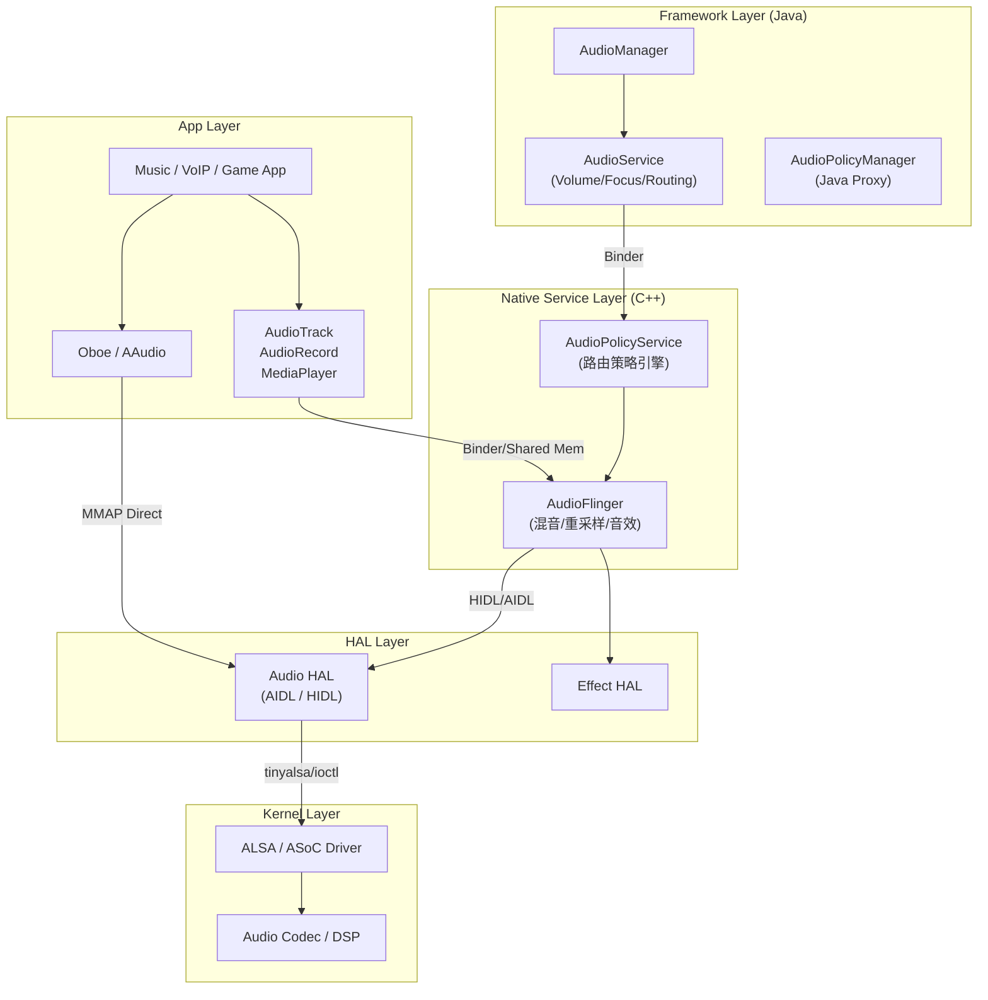
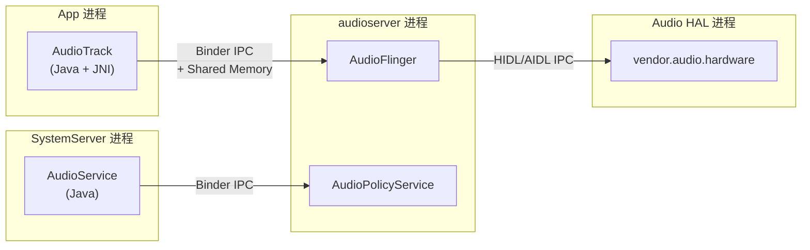
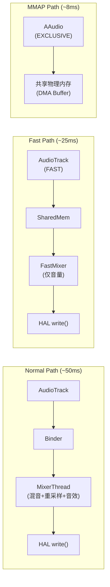

# Android 音频系统概览 (Android Audio Stack Overview)

Android 音频系统是 Android 框架中最复杂、最深奥的子系统之一。它负责从应用层到底层硬件的音频流管理、路由决策以及音频处理。本章提供全栈视角的架构概览、数据流路径、进程模型和版本演进。

---

## 1. 整体架构



---

## 2. 各层级详解

### 2.1 应用层 (App Layer)

| API | 语言 | 用途 | 延迟 |
|:---|:---|:---|:---|
| **MediaPlayer** | Java | 文件/流媒体播放 | 高 (~100ms) |
| **SoundPool** | Java | 短音效 (游戏) | 中 |
| **AudioTrack** | Java/JNI | 原始 PCM 播放 | 中 (~40ms) |
| **AudioRecord** | Java/JNI | 原始 PCM 录音 | 中 (~40ms) |
| **AAudio** | C | 低延迟播放/录音 | 低 (~10ms) |
| **Oboe** | C++ | AAudio/OpenSL 封装 | 低 (~10ms) |
| **ExoPlayer** | Java | 自适应流媒体 | 高 |

### 2.2 Framework 层 (Java)

```
AudioService (SystemServer 进程):
  ├── VolumeController
  │   ├── StreamVolume 管理 (15 个流类型)
  │   ├── Volume Index → dB 曲线映射
  │   └── 安全音量 (CSD / 85dB 限制)
  │
  ├── AudioDeviceInventory
  │   ├── 有线设备: Headset/USB 检测
  │   ├── 蓝牙: A2DP/LE Audio/SCO
  │   └── 设备连接/断开事件处理
  │
  ├── MediaFocusControl
  │   ├── AudioFocus 栈管理
  │   ├── FadeManager (Android 14+)
  │   └── 延迟焦点 (Delayed Focus)
  │
  └── AudioPolicyProxy
      └── 将策略请求转发到 Native APS
```

### 2.3 Native 服务层 (C++ — audioserver 进程)

```
AudioFlinger (音频引擎):
  ├── PlaybackThread (MixerThread / DirectOutputThread / OffloadThread)
  │   ├── Track 管理 (mActiveTracks)
  │   ├── AudioMixer (混音 + 重采样)
  │   ├── EffectChain (音效处理)
  │   └── HAL write() 循环
  │
  ├── RecordThread
  │   ├── HAL read() 循环
  │   ├── 重采样 + 声道转换
  │   └── 分发到多个 RecordTrack
  │
  └── MmapThread (低延迟直通)
      └── App ↔ HAL 共享内存

AudioPolicyService (策略引擎):
  ├── AudioPolicyManager
  │   ├── 解析 audio_policy_configuration.xml
  │   ├── 输出设备选择 (getOutputForAttr)
  │   ├── 输入设备选择 (getInputForAttr)
  │   └── 音量曲线管理
  │
  └── AudioPolicyEffects
      └── 预处理/后处理效果配置
```

### 2.4 HAL 层

```
HAL 接口演进:
  Android 8.0:  Audio HAL 2.0 (HIDL, 独立进程)
  Android 11:   Audio HAL 6.0 (HIDL)
  Android 12:   Audio HAL 7.0 (HIDL → AIDL 过渡)
  Android 14:   Audio AIDL HAL (推荐)

AIDL HAL 核心接口:
  IModule
  ├── openOutputStream()  → IStreamOut
  ├── openInputStream()   → IStreamIn
  ├── connectExternalDevice()
  ├── setAudioPatch()     → 硬件路由
  └── getMicrophones()

  IStreamOut
  ├── prepareToWrite() → FMQ (Fast Message Queue)
  ├── start() / standby()
  └── setVolume()
```

---

## 3. 进程隔离模型



| 进程 | 组件 | UID | 崩溃影响 |
|:---|:---|:---|:---|
| **App** | AudioTrack/Record | app_xxx | 仅影响本 App |
| **SystemServer** | AudioService | system | 系统重启 |
| **audioserver** | AudioFlinger + APS | audioserver | 音频服务重启 (~2s 恢复) |
| **audio HAL** | vendor.audio.hardware | system | HAL 重启, audioserver 感知 |

---

## 4. 音频流类型与属性

### 4.1 Legacy Stream Type (已废弃但仍在使用)

| Stream Type | 用途 | 默认设备 |
|:---|:---|:---|
| `STREAM_MUSIC` | 音乐/媒体 | Speaker/Headphone |
| `STREAM_VOICE_CALL` | 通话 | Earpiece |
| `STREAM_RING` | 铃声 | Speaker |
| `STREAM_ALARM` | 闹钟 | Speaker |
| `STREAM_NOTIFICATION` | 通知 | Speaker |
| `STREAM_SYSTEM` | 系统音效 | Speaker |

### 4.2 AudioAttributes (推荐方式)

```java
// 现代 Android 使用 AudioAttributes 替代 StreamType
AudioAttributes attrs = new AudioAttributes.Builder()
    .setUsage(AudioAttributes.USAGE_MEDIA)
    .setContentType(AudioAttributes.CONTENT_TYPE_MUSIC)
    .build();

// AudioPolicyManager 根据 Usage + ContentType 决定:
//   1. 路由到哪个输出设备
//   2. 使用哪条音量曲线
//   3. 是否允许 Direct Output
```

---

## 5. 数据路径对比

### 5.1 Normal Path vs Fast Path vs MMAP

```
Normal Path (传统路径):
  AudioTrack → Binder → AudioFlinger MixerThread → HAL write()
  延迟: ~40-80ms (取决于 buffer 大小)
  特点: 支持混音/重采样/音效

Fast Path (快速路径):
  AudioTrack (FAST flag) → SharedMemory → FastMixer → HAL write()
  延迟: ~20-40ms
  特点: 跳过 NormalMixer, 限制: 采样率必须匹配 HAL

MMAP Path (直通路径):
  AAudio (EXCLUSIVE) → 共享物理内存 → DSP DMA
  延迟: ~5-10ms
  特点: 完全绕过 AudioFlinger, 需要硬件支持
```



---

## 6. 关键配置文件

| 文件 | 路径 | 作用 |
|:---|:---|:---|
| **audio_policy_configuration.xml** | `/vendor/etc/` | 定义 modules/mixPorts/devicePorts/routes |
| **audio_policy_volumes.xml** | `/vendor/etc/` | 音量曲线定义 |
| **audio_effects.xml** | `/vendor/etc/` | 音效库加载配置 |
| **mixer_paths.xml** | `/vendor/etc/` | ALSA Mixer 控件默认值 |
| **default_volume_tables.xml** | `/vendor/etc/` | 默认音量表 |

---

## 7. 版本演进

| Android 版本 | 音频关键特性 |
|:---|:---|
| **5.0 (L)** | AudioFlinger float32 混音, Capture from Hotword |
| **8.0 (O)** | Treble: HAL 独立进程, AAudio API |
| **9.0 (P)** | AudioAttributes 强制, MMAP 支持 |
| **10 (Q)** | Audio Capture Policy, Hearing Aid Profile |
| **11 (R)** | Audio HAL 6.0, Spatializer 准备 |
| **12 (S)** | Spatial Audio (Spatializer), AIDL HAL |
| **13 (T)** | LE Audio (BLE Audio), Loudness Control |
| **14 (U)** | FadeManager, Ultra HDR Audio, CSD 累积声剂量 |
| **15 (V)** | Audio AIDL HAL 默认, Head Tracking API 增强 |

---

## 8. 车载场景扩展 (AAOS)

```
AAOS 音频栈扩展:
  ├── CarAudioService
  │   ├── 多区域路由 (Zone-based Routing)
  │   ├── CarAudioFocus (取代标准 AudioFocus)
  │   ├── 音量组管理 (VolumeGroup)
  │   └── OEM 回调扩展
  │
  ├── AudioControl HAL
  │   ├── Ducking 控制
  │   ├── Focus 事件通知
  │   └── 外部音源管理 (FM/AUX)
  │
  └── 电源同步
      ├── CPMS (CarPowerManagementService)
      ├── VHAL 电源状态监听
      └── 安全音优先 (倒车雷达/eCall)
```

---

## 9. 调试入口速查

```bash
# 音频系统全貌
adb shell dumpsys media.audio_flinger
adb shell dumpsys media.audio_policy

# 当前活跃的 Track
adb shell dumpsys media.audio_flinger | grep -A 5 "Active Tracks"

# 音量状态
adb shell dumpsys audio | grep -A 20 "Stream volumes"

# 设备连接状态
adb shell dumpsys audio | grep -A 10 "Devices"

# HAL 层信息
adb shell dumpsys vendor.audio.hardware

# 内核 ALSA 信息
adb shell cat /proc/asound/cards
adb shell cat /proc/asound/pcm
```

---

## 10. 关键参考 (References)

1.  [Android Open Source Project - Audio](https://source.android.com/devices/audio)
2.  [Android Audio Architecture](https://source.android.com/docs/core/audio/architecture)
3.  [Embedded Android - Karim Yaghmour](https://www.oreilly.com/library/view/embedded-android/9781449327958/)
4.  [AAudio API Reference](https://developer.android.com/ndk/guides/audio/aaudio)

---
*Next Topic: [AudioService 系统管理中心](./02-AudioService.md)*
