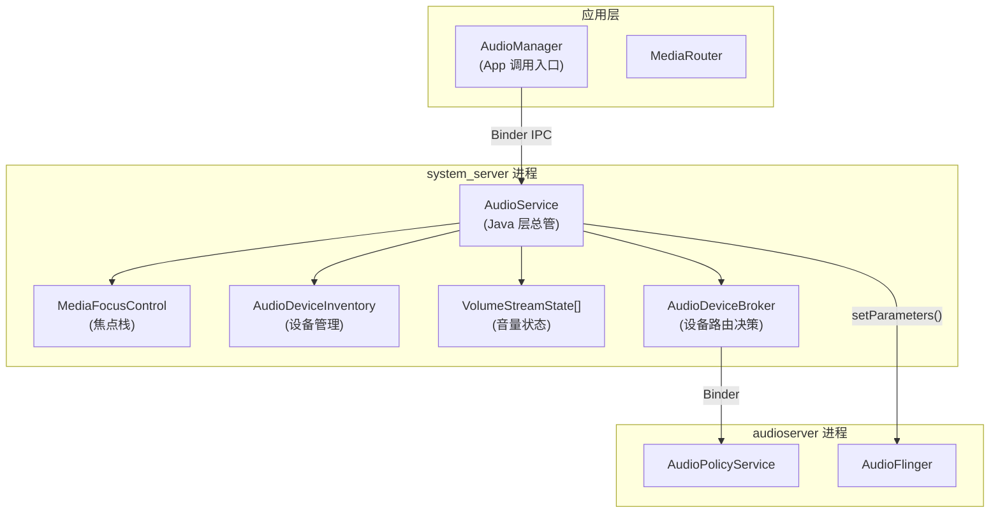
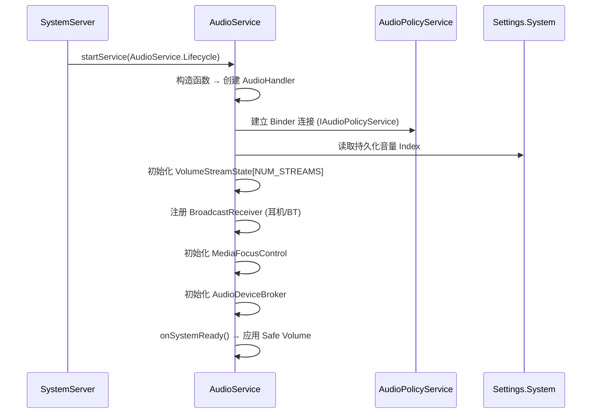
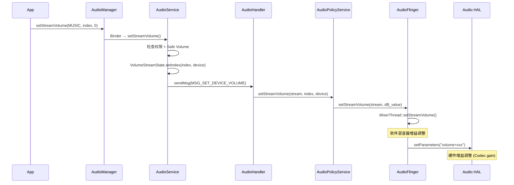
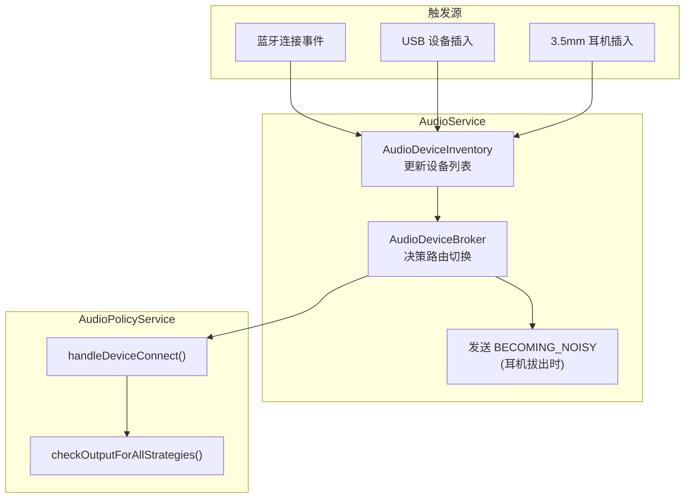
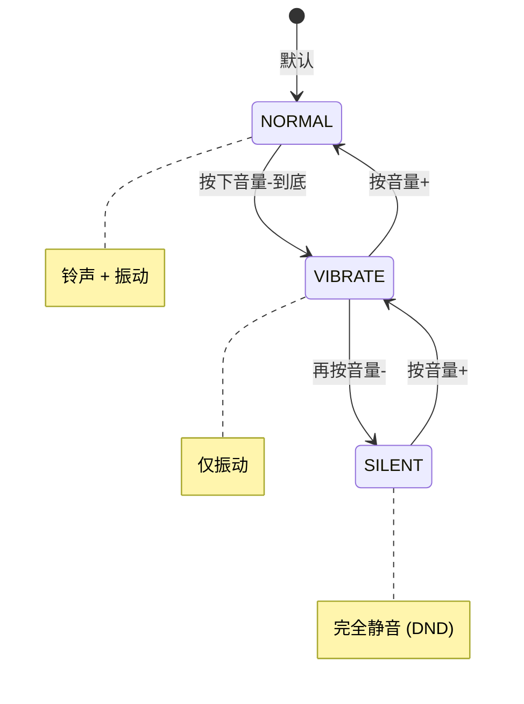
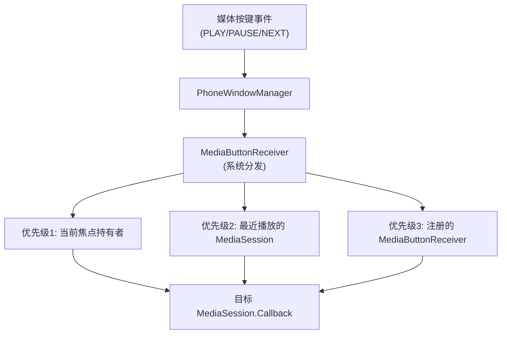

# AudioService 系统管理中心

`AudioService` 是 Android 音频框架在 Java 层的核心，运行在 `system_server` 进程中。它扮演着"总管"的角色，协调应用层请求与 Native 层服务，管理音量、设备路由、音频焦点、Ringer Mode 和媒体按键分发。

---

## 1. AudioService 在系统中的位置



---

## 2. 启动与初始化

### 2.1 启动时序



### 2.2 核心内部组件

| 组件 | 职责 | 源码位置 |
|:---|:---|:---|
| **AudioService** | 总调度 | `services/core/.../audio/AudioService.java` |
| **AudioHandler** | 异步消息处理 | AudioService 内部类 |
| **VolumeStreamState** | 每个 Stream 的音量状态 | AudioService 内部类 |
| **MediaFocusControl** | 焦点栈管理 | `services/core/.../audio/MediaFocusControl.java` |
| **AudioDeviceBroker** | 设备路由决策 | `services/core/.../audio/AudioDeviceBroker.java` |
| **AudioDeviceInventory** | 设备连接状态维护 | `services/core/.../audio/AudioDeviceInventory.java` |
| **SoundDoseHelper** | 听力安全/安全音量 | `services/core/.../audio/SoundDoseHelper.java` |

---

## 3. 音量管理

### 3.1 音量 Index → dB 映射

Android 使用整数 Index 表示音量（如 0-15），最终需要映射为 dB 值下发到硬件：

```java
// VolumeStreamState 核心逻辑
// 每个 Stream + Device 组合都有独立的 Index
class VolumeStreamState {
    private int mIndexMin;  // 最小 Index (通常 0)
    private int mIndexMax;  // 最大 Index (通常 15)
    
    // 设备 → 当前 Index 的映射
    private final SparseIntArray mIndexMap = new SparseIntArray();
    // Key: AudioSystem.DEVICE_OUT_xxx
    // Value: 当前 Index
}
```

**Index → dB 转换公式**：
```
dB = (index / indexMax) × (maxGaindB - minGaindB) + minGaindB

例如 STREAM_MUSIC:
  indexMax = 15, minGain = -60dB, maxGain = 0dB
  index=10 → dB = (10/15) × 60 - 60 = -20dB
  index=15 → dB = 0dB (满增益)
  index=1  → dB = -56dB
```

### 3.2 音量曲线 (Volume Curves)

在 `audio_policy_volumes.xml` 中定义非线性映射曲线：

```xml
<!-- default_volume_tables.xml -->
<volume_group name="STREAM_MUSIC">
    <volume deviceCategory="DEVICE_CATEGORY_SPEAKER">
        <point>0,   -5800</point>  <!-- Index 0% → -58dB -->
        <point>33,  -2600</point>  <!-- Index 33% → -26dB -->
        <point>66,  -1000</point>  <!-- Index 66% → -10dB -->
        <point>100,     0</point>  <!-- Index 100% → 0dB -->
    </volume>
    <volume deviceCategory="DEVICE_CATEGORY_HEADSET">
        <point>0,   -4400</point>
        <point>33,  -2200</point>
        <point>66,   -700</point>
        <point>100,     0</point>
    </volume>
</volume_group>
```

### 3.3 音量设置完整调用链



---

## 4. 设备路由决策

### 4.1 设备连接/断开流程



### 4.2 设备优先级 (默认策略)

```
输出设备优先级 (从高到低):
  1. 蓝牙 A2DP (如果已连接)
  2. 有线耳机 (3.5mm / USB)
  3. 听筒 (通话时)
  4. 扬声器 (默认)

输入设备优先级:
  1. 有线麦克风 (耳麦)
  2. 蓝牙 SCO 麦克风 (通话)
  3. 内建麦克风 (默认)
```

### 4.3 BECOMING_NOISY 机制

当输出设备从"私密"切换到"公开"时（如耳机拔出→扬声器），AudioService 广播 `ACTION_AUDIO_BECOMING_NOISY`：

```java
// AudioService.java
private void sendBecomingNoisyIntent() {
    // 通知所有注册了此 Intent 的 App (如音乐播放器)
    // App 收到后应该暂停播放，避免突然外放
    sendBroadcastToAll(new Intent(AudioManager.ACTION_AUDIO_BECOMING_NOISY));
}
```

---

## 5. Ringer Mode 状态机



**Ringer Mode 对 Stream 的影响**：

| Stream | NORMAL | VIBRATE | SILENT |
|:---|:---|:---|:---|
| RING | 正常播放 | 静音+振动 | 静音 |
| NOTIFICATION | 正常播放 | 静音+振动 | 静音 |
| ALARM | 正常播放 | 正常播放 | 正常播放 |
| MUSIC | 正常播放 | 正常播放 | 正常播放 |
| VOICE_CALL | 正常播放 | 正常播放 | 正常播放 |

---

## 6. 媒体按键分发

### 6.1 分发优先级



### 6.2 AudioService 中的处理

```java
// AudioService.java
public void dispatchMediaKeyEvent(KeyEvent keyEvent) {
    // 优先发给有音频焦点的 Session
    MediaFocusControl mfc = getMediaFocusControl();
    if (!mfc.dispatchMediaKeyEvent(keyEvent)) {
        // 焦点持有者没处理 → 发给最后活跃的 Session
        mMediaSessionService.dispatchMediaKeyEvent(keyEvent, false);
    }
}
```

---

## 7. Safe Volume (听力保护)

### 7.1 触发条件

```
Safe Volume 逻辑 (EU/中国法规):
  条件: 输出设备 == 耳机 (有线/蓝牙)
        AND 当前 Index > Safe Index (通常 Index 10/15)
        AND 累计使用时间 > 20小时 (连续高音量)
  
  动作:
    1. 弹出警告对话框
    2. 自动下调音量到 Safe Index
    3. 用户可手动恢复 (但会重新计时)
```

### 7.2 常见问题排查

| 现象 | 原因 | 排查 |
|:---|:---|:---|
| 耳机音量自动变小 | Safe Volume 触发 | `dumpsys audio` 查看 safe volume state |
| 插耳机音量与拔耳机不一致 | 每个设备独立 Index | 检查 `VolumeStreamState` per-device index |
| 调音量影响其他流 | Volume alias | 检查 `STREAM_VOLUME_ALIAS[]` 映射 |
| BT 连接后无声 | A2DP 音量未同步 | 检查 `setAbsoluteVolume()` |

---

## 8. 调试命令

```bash
# 完整 AudioService dump
dumpsys audio

# 查看当前音量状态
dumpsys audio | grep -A 20 "Stream volumes"

# 查看设备连接状态
dumpsys audio | grep -A 10 "Devices"

# 查看 Ringer Mode
dumpsys audio | grep "Ringer mode"

# 查看焦点栈
dumpsys audio | grep -A 20 "Media Focus Control"

# 查看 Safe Volume 状态
dumpsys audio | grep -i "safe"

# 实时观察音量变化 (logcat)
adb logcat -s AudioService:V VolumeStreamState:V

# 观察设备路由切换
adb logcat -s AudioDeviceBroker:V AudioDeviceInventory:V
```

---

## 9. Handler 消息完整列表

```java
// AudioService 中关键的异步消息
private static final int MSG_SET_DEVICE_VOLUME = 0;
private static final int MSG_PERSIST_VOLUME = 1;
private static final int MSG_SET_ALL_VOLUMES = 12;
private static final int MSG_BROADCAST_AUDIO_BECOMING_NOISY = 15;
private static final int MSG_SET_FORCE_USE = 16;
private static final int MSG_BT_HEADSET_CNCT_FAILED = 17;
private static final int MSG_DISPATCH_AUDIO_SERVER_STATE = 23;
private static final int MSG_NOTIFY_VOL_EVENT = 28;
```

---

## 10. 关键参考 (References)

1.  [AOSP Source: AudioService.java](https://android.googlesource.com/platform/frameworks/base/+/master/services/core/java/com/android/server/audio/AudioService.java)
2.  [AOSP Source: AudioDeviceBroker.java](https://android.googlesource.com/platform/frameworks/base/+/master/services/core/java/com/android/server/audio/AudioDeviceBroker.java)
3.  [Android Volume Control](https://source.android.com/docs/core/audio/volume)
4.  [Android Audio Focus](https://developer.android.com/guide/topics/media-apps/audio-focus)

---
*Next Topic: [AudioTrack 播放流程解析](./03-AudioTrack.md)*
