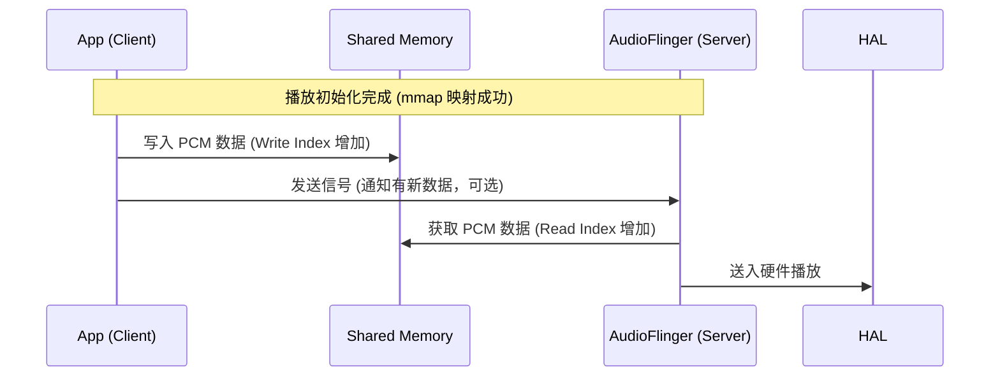
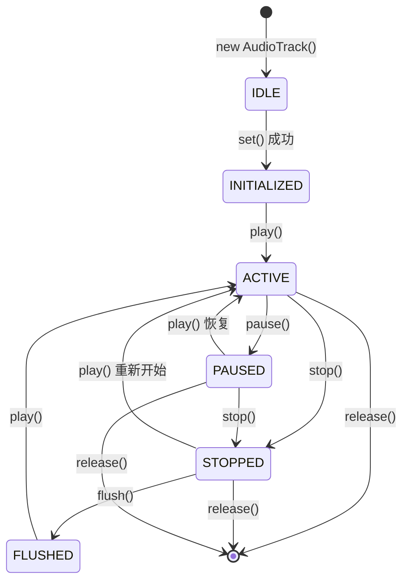
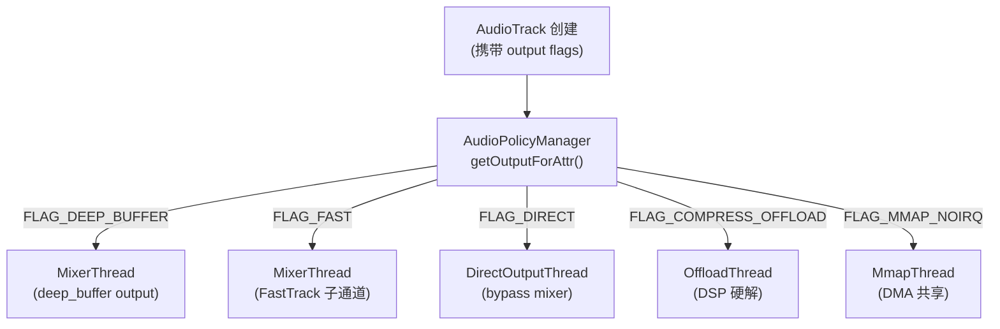
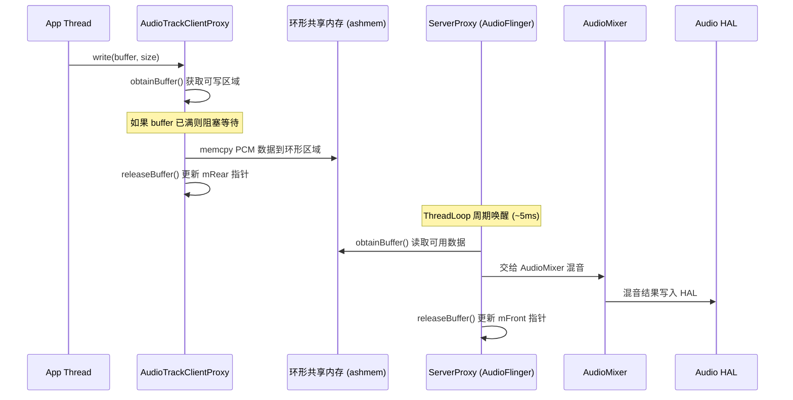
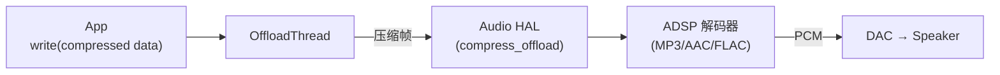

# AudioTrack 深度解析 (AudioTrack Deep Dive)

`AudioTrack` 是 Android 播放链路的起点。对于开发者，它是播放 PCM 的工具；对于架构师，它是理解 **Linux 共享内存、Binder 异步通信、实时调度** 的最佳案例。

---

## 1. Java 层核心 API 使用与避坑

在 Java 层，实例化一个 `AudioTrack` 需要精确配置参数。

```java
// 核心配置示例
AudioAttributes attributes = new AudioAttributes.Builder()
        .setUsage(AudioAttributes.USAGE_MEDIA) // 用途：多媒体
        .setContentType(AudioAttributes.CONTENT_TYPE_MUSIC) // 内容：音乐
        .build();

AudioFormat format = new AudioFormat.Builder()
        .setEncoding(AudioFormat.ENCODING_PCM_16BIT) // 量化精度
        .setSampleRate(44100) // 采样率
        .setChannelMask(AudioFormat.CHANNEL_OUT_STEREO) // 双声道
        .build();

// 获取系统建议的最小缓冲区（非常重要，决定了是否会卡顿）
int bufferSizeInBytes = AudioTrack.getMinBufferSize(44100, 
                    AudioFormat.CHANNEL_OUT_STEREO, 
                    AudioFormat.ENCODING_PCM_16BIT);

AudioTrack track = new AudioTrack(attributes, format, bufferSizeInBytes, 
                    AudioTrack.MODE_STREAM, AudioManager.AUDIO_SESSION_ID_GENERATE);
```

### 🧠 🧠 深度思考：为什么要有 getMinBufferSize？
`getMinBufferSize` 返回的不是一个随便的数字，它是由底层 HAL 层上报的硬件周期（Period Size）决定的。如果你的缓冲区小于这个值，AudioFlinger 还没来得及混合数据，硬件已经读完了，就会产生 **Underflow（断音/爆音）**。

---

## 2. JNI 层的“桥梁”作用

Java 层的 `AudioTrack.java` 只是个壳，核心逻辑在 Native 层的 `android_media_AudioTrack.cpp` 中。

```cpp
// 简化版的 JNI 逻辑展示 (frameworks/base/core/jni/android_media_AudioTrack.cpp)
static jint android_media_AudioTrack_setup(JNIEnv *env, jobject thiz, ...) {
    // 1. 在 Native 层创建一个真正的 AudioTrack 对象 (C++)
    // libaudioclient 提供的核心类
    sp<AudioTrack> lpTrack = new AudioTrack();
    
    // 2. 将 Native 对象的指针存入 Java 对象的私有成员变量变量 mNativeTrackInJavaObj 中
    // 这样后续的 write/play 才能找到对应的 C++ 对象
    env->SetLongField(thiz, javaAudioTrackFields.nativeTrackInJavaObj, (jlong)lpTrack.get());
}
```

---

## 3. Native 层：全链路初始化调用栈 (Expert Only)

这是理解 AudioTrack 启动过程最关键的代码路径。从 `set()` 到与 `AudioFlinger` 建立连接，经历了以下核心步骤：

### 3.1 核心调用栈源码级解析 (Call Stack)

1.  **`AudioTrack::set(...)`**：
    *   **职责**：校验参数（采样率、格式等），计算 `frameCount`。
    ```cpp
    status_t AudioTrack::set(audio_stream_type_t streamType, uint32_t sampleRate, ...) {
        // 校验采样率与格式
        if (!audio_is_valid_format(format)) return BAD_VALUE;
        // 计算每一帧的大小 (channels * bytes_per_sample)
        mFrameSize = audio_bytes_per_sample(format) * channelCount;
        // 随后进入关键的创建流程
        return createTrack_l();
    }
    ```

2.  **`AudioTrack::createTrack_l(...)`**：
    *   **策略查询**：调用 `AudioSystem::getOutputForAttr`。此步骤会向 `AudioPolicyManager` 请求一个 `audio_io_handle_t`（输出句柄）。
    ```cpp
    status_t AudioTrack::createTrack_l() {
        // 🚀 灵魂步骤：询问 Policy 大脑，我该去哪个输出线程？
        status = AudioSystem::getOutputForAttr(&mAttributes, &output, mSessionId, ...);
        
        // 拿到 output 句柄后，发起跨进程 Binder 调用
        sp<IAudioTrack> track = audioFlinger->createTrack(input, output, &status);
    }
    ```

3.  **`AudioFlinger::createTrack(...)`** (Server 侧执行)：
    *   **分配资源**：在对应的 `PlaybackThread` 中创建 `Track` 对象并分配匿名共享内存。
    ```cpp
    sp<IAudioTrack> AudioFlinger::createTrack(...) {
        // 找到对应的线程 (MixerThread / DirectThread)
        PlaybackThread *thread = checkPlaybackThread_l(output);
        // 创建 Track 实例，内部会分配 ashmem
        track = thread->createTrack_l(client, streamType, ...);
        // 返回 Binder 接口给 Client
        return new TrackHandle(track);
    }
    ```

### 3.2 建立同步机制 (Proxy Setup)
一旦 Binder 调用返回，Client 侧会执行：
```cpp
// AudioTrack.cpp 内部逻辑
mAudioTrackShared = track->getCblk(); // 获取控制块
mDataMemory = track->getBuffers();    // 获取数据区

// 🚀 初始化代理类
mProxy = new AudioTrackClientProxy(mAudioTrackShared, mDataMemory, ...);
```

---

## 4. 匿名共享内存与零拷贝机制

AudioTrack 内部维护了一个环形缓冲区。为了保证线程安全，引入了 `AudioTrackClientProxy` 和 `AudioTrackServerProxy`。

*   **App (Producer)**：调用 `write()` -> `AudioTrackClientProxy::obtainBuffer()` -> 填充 PCM -> `releaseBuffer()` (更新写指针)。
*   **AudioFlinger (Consumer)**：`AudioTrackServerProxy::obtainBuffer()` (读取数据) -> 送入混音器 -> `releaseBuffer()` (更新读指针)。



---

## 5. AudioTrack 状态机

AudioTrack 有严格的状态生命周期，违反状态转换是 App 层音频问题的首要原因：



**关键状态转换规则**：

| 操作 | 当前状态要求 | 违规后果 |
|:---|:---|:---|
| `play()` | INITIALIZED / STOPPED / PAUSED | IDLE 状态调用会返回 `INVALID_OPERATION` |
| `write()` | ACTIVE (MODE_STREAM) | STOPPED 状态写入数据会被丢弃 |
| `flush()` | STOPPED / PAUSED | ACTIVE 状态 flush 会导致数据丢失 |
| `stop()` | ACTIVE / PAUSED | 已有数据会被 drain 播完后才真正停止 |

---

## 6. Output Flag 与播放路径选择

AudioTrack 创建时携带的 Flag 直接决定了数据走哪条通路：

| Flag | 对应 Thread | 延迟 | Buffer 策略 | 典型场景 |
|:---|:---|:---|:---|:---|
| `FLAG_DEEP_BUFFER` | MixerThread (deep) | ~80-150ms | 大 buffer，省电 | 音乐播放 |
| `FLAG_FAST` | MixerThread (fast) | ~5-20ms | 小 buffer，FastTrack | 游戏/按键音 |
| `FLAG_LOW_LATENCY` | MixerThread (fast) | ~5-10ms | 最小 buffer | 实时音效 |
| `FLAG_DIRECT` | DirectOutputThread | ~5ms | 无混音 | 直通 DAC (Hi-Res) |
| `FLAG_MMAP_NOIRQ` | MmapThread | ~2-5ms | MMAP 共享 DMA | AAudio 独占 |
| `FLAG_COMPRESS_OFFLOAD` | OffloadThread | ~100ms+ | DSP 解码 | MP3/AAC 硬解 |

### 6.1 Flag 到 Thread 的映射流程



### 6.2 FastTrack 准入条件

不是所有 `FLAG_FAST` 请求都能进入 FastTrack，AudioFlinger 会做严格检验：

```cpp
// AudioFlinger::PlaybackThread::createTrack_l()
bool isTimed = (flags & AUDIO_OUTPUT_FLAG_FAST) != 0;
if (isTimed) {
    // 必须满足以下所有条件:
    // 1. 采样率与 HAL 输出一致 (无需重采样)
    // 2. 声道数 ≤ HAL 输出声道数
    // 3. 格式为 PCM_16 或 PCM_FLOAT
    // 4. frameCount ≤ FastMixer 的 frameCount
    // 5. 当前 FastTrack 槽位未满 (默认最多 8 条)
    if (!canUseFastTrack) {
        // 降级为 NormalTrack，走 MixerThread
        flags &= ~AUDIO_OUTPUT_FLAG_FAST;
    }
}
```

---

## 7. write() 全链路数据流

### 7.1 MODE_STREAM 写入流程



### 7.2 环形缓冲区结构

```
共享内存布局:
┌─────────────────────────────────────────────────┐
│  audio_track_cblk_t (控制块, 64 bytes)          │
│  ├── mServer (读指针, AF 更新)                   │
│  ├── mPosition (写指针, App 更新)                │
│  ├── mVolumeLR (音量)                           │
│  ├── mSampleRate (采样率)                       │
│  └── mFlags (标志位)                            │
├─────────────────────────────────────────────────┤
│  PCM Data Buffer (环形区域)                      │
│  ┌───┬───┬───┬───┬───┬───┬───┬───┐            │
│  │ W │ W │ R │ R │ R │ E │ E │ W │            │
│  └───┴───┴───┴───┴───┴───┴───┴───┘            │
│  W=已写未读  R=正在被AF读  E=空闲可写            │
└─────────────────────────────────────────────────┘

frameCount = bufferSizeInBytes / frameSize
```

---

## 8. 时间戳与 A/V 同步

### 8.1 getTimestamp() 原理

```java
AudioTimestamp ts = new AudioTimestamp();
if (track.getTimestamp(ts) == AudioTrack.SUCCESS) {
    long framesPlayed = ts.framePosition;   // 硬件已播放的帧数
    long nanoTime = ts.nanoTime;            // 对应的系统时间 (CLOCK_MONOTONIC)
    
    // 计算当前音频播放位置 (考虑 buffer 中的延迟)
    long currentFrames = framesPlayed + 
        (System.nanoTime() - nanoTime) * sampleRate / 1_000_000_000L;
}
```

### 8.2 延迟分解

```
端到端延迟 = App Buffer 延迟 + AudioFlinger Buffer 延迟 + HAL Buffer 延迟 + 硬件延迟

典型数值 (48kHz, deep_buffer):
  App Buffer:    ~8192 frames / 48000 = 170ms
  AF Buffer:     ~960 frames / 48000 = 20ms
  HAL Buffer:    ~960 frames / 48000 = 20ms
  硬件 (DSP+DAC): ~2ms
  合计:           ~212ms

典型数值 (48kHz, low_latency):
  App Buffer:    ~480 frames / 48000 = 10ms
  AF Buffer:     ~240 frames / 48000 = 5ms
  HAL Buffer:    ~240 frames / 48000 = 5ms
  硬件:          ~2ms
  合计:           ~22ms
```

---

## 9. Offload 播放 (压缩音频硬件解码)

当 AudioTrack 使用 `ENCODING_AAC_LC`/`ENCODING_MP3` 等压缩格式时，数据直接发送到 DSP 硬件解码器：



**Offload 优势**：CPU 接近零负载（数据搬运由 DMA 完成），适合后台长时播放省电。

**Offload 限制**：
- 不经过 AudioMixer → 无法与其他流混音
- 音效必须在 DSP 侧实现
- 仅支持 `MODE_STREAM`
- `pause()`/`resume()`/`drain()` 有特殊语义

---

## 10. 常见问题与专家级排查

| 问题 | 根因 | 解决方案 |
|:---|:---|:---|
| **write() 阻塞** | 共享内存已满，AF 消费太慢 | 检查 underrun 日志；不要在 UI 线程 write |
| **Underrun (断音)** | App 写入速度跟不上 HAL 消费 | 增大 buffer / 提高写入线程优先级 |
| **延迟过高** | 使用了 deep_buffer | 改用 `FLAG_LOW_LATENCY` 或 AAudio |
| **getTimestamp 返回失败** | Track 未进入 ACTIVE 或 HAL 不支持 | 确认 play() 后等待足够帧数再查询 |
| **stop() 后有残响** | drain 机制：HAL 需播完剩余数据 | 使用 flush() 强制清空 |
| **多次 play/stop 后无声** | Track 进入异常状态 | 检查 `getState()` + 重新 release/create |

### 10.1 调试命令

```bash
# 查看当前所有 Track 状态
adb shell dumpsys media.audio_flinger | grep -A 20 "Track"

# 查看 underrun 统计
adb shell dumpsys media.audio_flinger | grep -i "underrun"

# 查看共享内存使用
adb shell dumpsys media.audio_flinger | grep "cblk"
```

---

## 11. 关键参考 (References)

1.  [AOSP AudioTrack.cpp](https://android.googlesource.com/platform/frameworks/av/+/refs/heads/main/media/libaudioclient/AudioTrack.cpp)
2.  [Android Developer: AudioTrack](https://developer.android.com/reference/android/media/AudioTrack)
3.  [Android Audio Latency](https://source.android.com/docs/core/audio/latency)
4.  [AOSP AudioTrackShared.h (环形缓冲区实现)](https://android.googlesource.com/platform/frameworks/av/+/refs/heads/main/media/libaudioclient/include/media/AudioTrackShared.h)

---
*下一章：[AudioRecord 录音流程解析](./04-AudioRecord.md)*
