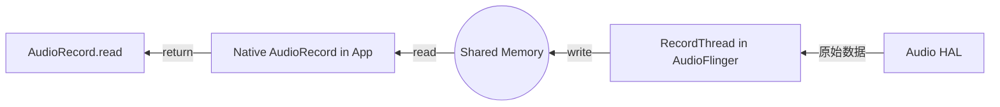
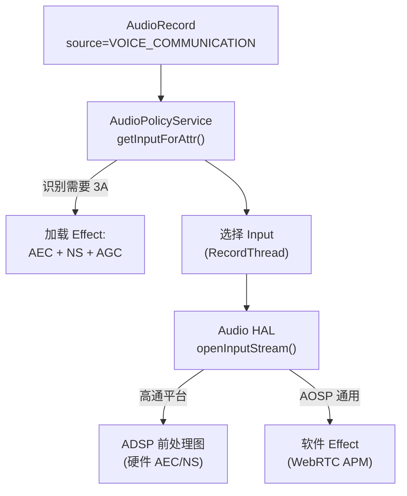
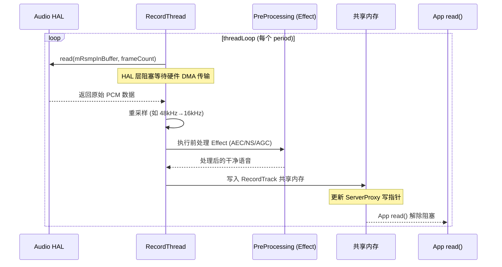
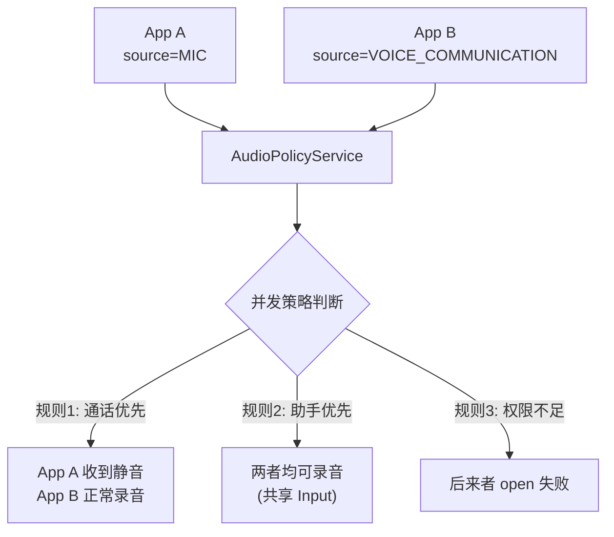

# AudioRecord 录音流程解析 (AudioRecord Deep Dive)

`AudioRecord` 是应用层获取原始音频数据的源头。对于初学者，它是“录音器”；对于专业人员，它是理解 **音频前端处理 (Preprocessing)、实时流传输、以及内核驱动采集** 的窗口。

---

## 1. 核心实战：实例化与 AudioSource 选择

在 Android 中，录音的“意图”由 `AudioSource` 决定。这直接影响到底层 DSP 会加载什么样的算法模块。

```java
// 专业录音配置示例
int sampleRate = 16000; // 语音识别常用采样率
int channelConfig = AudioFormat.CHANNEL_IN_MONO; // 单声道
int audioFormat = AudioFormat.ENCODING_PCM_16BIT;

int bufferSize = AudioRecord.getMinBufferSize(sampleRate, channelConfig, audioFormat);

// 🚀 专家建议：如果是通话或交互，务必选择 VOICE_COMMUNICATION
AudioRecord recorder = new AudioRecord(
        MediaRecorder.AudioSource.VOICE_COMMUNICATION, // 关键：开启底层 3A (AEC, ANS, AGC)
        sampleRate,
        channelConfig,
        audioFormat,
        bufferSize
);
```

### 🧠 🧠 深度思考：VOICE_COMMUNICATION 的魔力
当你选择这个 Source 时，`AudioPolicyService` 会识别出这是一个通话场景。它会自动向 `AudioFlinger` 发出指令，加载 **AEC (回声消除)** 和 **NS (降噪)** 的效果插件。如果硬件 DSP 支持这些算法，处理会发生在硬件层，极大地降低 CPU 负载。

---

## 2. JNI 与 Native 层的绑定

类似于 AudioTrack，`AudioRecord.cpp` 在 Native 层负责与 `audioserver` 进程交互。

```cpp
// AudioRecord.cpp 核心逻辑展示
status_t AudioRecord::set(...) {
    // 1. 获取 AudioFlinger 代理
    const sp<IAudioFlinger>& audioFlinger = AudioSystem::get_audio_flinger();
    
    // 2. 发起 Binder 调用请求创建 RecordTrack
    sp<IAudioRecord> record = audioFlinger->openRecord(...);
    
    // 3. 获取录音专用的共享内存
    mAudioRecordShared = record->getCblk();
}
```

---

## 3. Native 层：录音初始化全链路 (Expert Only)

录音的启动逻辑与播放对称，涉及复杂的跨进程握手。其核心调用栈如下：

### 3.1 核心调用栈源码级解析 (Call Stack)

1.  **`AudioRecord::set(...)`**：
    *   **职责**：校验录音参数，计算 FrameCount。
    ```cpp
    status_t AudioRecord::set(audio_source_t inputSource, uint32_t sampleRate, ...) {
        // 关键：保存 AudioSource，这决定了后续的路由决策
        mAttributes.source = inputSource;
        // 随后进入创建逻辑
        return openRecord_l(0, "");
    }
    ```

2.  **`AudioRecord::openRecord_l(...)`**：
    *   **策略查询**：调用 `AudioSystem::getInputForAttr`。
    ```cpp
    status_t AudioRecord::openRecord_l(...) {
        // 🚀 灵魂步骤：询问 Policy，我想录 VOICE_COMMUNICATION，该用哪个 Mic？
        status = AudioSystem::getInputForAttr(&mAttributes, &input, mSessionId, ...);
        
        // 拿到 input 句柄后，请求 AudioFlinger 开启录音流
        sp<IAudioRecord> record = audioFlinger->openRecord(input, ...);
    }
    ```

3.  **`AudioFlinger::openRecord(...)`** (Server 侧执行)：
    *   **职责**：在 `RecordThread` 中创建 `RecordTrack` 并分配共享内存。
    ```cpp
    sp<IAudioRecord> AudioFlinger::openRecord(...) {
        // 找到对应的录音线程
        RecordThread *thread = checkRecordThread_l(input);
        // 创建 RecordTrack，这是数据的生产者
        recordTrack = thread->createRecordTrack_l(client, ...);
        // 返回 Binder 句柄
        return new RecordHandle(recordTrack);
    }
    ```

### 3.2 共享内存同步 (Record Proxy)
一旦录音流建立，Native 层会初始化同步代理：
```cpp
// AudioRecord.cpp 内部逻辑
mAudioRecordShared = record->getCblk();
mDataMemory = record->getBuffers();

// 🚀 初始化录音代理类 (Server 为 Producer, Client 为 Consumer)
mProxy = new AudioRecordClientProxy(mAudioRecordShared, mDataMemory, ...);
```

---

## 4. 录音数据流：反向 Proxy 模型

录音的数据流向与播放正好相反，但机制相同。

*   **AudioFlinger (Producer)**：从 HAL 层读取 PCM 数据 -> 写入共享内存的 `ServerProxy` -> 更新写指针。
*   **App (Consumer)**：调用 `read()` -> 从共享内存的 `Proxy` 读取数据 -> 更新读指针 -> 返回给 Java 层。



---

## 5. AudioSource 与前处理算法的关系

AudioSource 的选择直接决定了录音链路上加载的 DSP 算法：

| AudioSource | 典型用途 | 前处理算法 | 路由倾向 |
|:---|:---|:---|:---|
| `DEFAULT` / `MIC` | 普通录音 | 无 / 基本 ANS | 主麦克风 |
| `VOICE_COMMUNICATION` | VoIP 通话 | **AEC + ANS + AGC** | 底部麦+参考信号 |
| `VOICE_RECOGNITION` | 语音识别 | 轻度 ANS (保留语音细节) | 主麦克风 |
| `CAMCORDER` | 视频录制 | 风噪抑制 + 方向增强 | 多麦阵列 |
| `UNPROCESSED` | 原始录音 (测量用) | **无任何处理** | 主麦克风 |
| `VOICE_PERFORMANCE` | K歌/乐器 | 轻度 ANS，无 AGC | 主麦克风 |
| `HOTWORD` | 语音唤醒 (系统) | KWD 模型 | 低功耗 LPI 通路 |

### 5.1 前处理加载链路



### 5.2 UNPROCESSED 的重要性

对于音频质量测试、声学测量，必须使用 `UNPROCESSED`：
- 绕过所有 ANS/AGC/AEC
- 获取原始 ADC 输出
- Android CTS 中用于验证 HAL 频响和底噪指标

---

## 6. read() 详细流程与阻塞机制

### 6.1 read() 源码级解析

```cpp
// AudioRecord.cpp
ssize_t AudioRecord::read(void* buffer, size_t userSize, bool blocking) {
    size_t bytesRead = 0;
    
    while (bytesRead < userSize) {
        Buffer audioBuffer;
        audioBuffer.frameCount = (userSize - bytesRead) / mFrameSize;
        
        // 1. 从共享内存获取可用数据
        status_t err = mProxy->obtainBuffer(&audioBuffer, 
            blocking ? &ClientProxy::kForever : &ClientProxy::kNonBlocking);
        
        if (err != NO_ERROR) {
            if (err == WOULD_BLOCK) break;  // 非阻塞模式: 返回已读数量
            if (err == DEAD_OBJECT) {
                // AudioFlinger 已死, 需要 restore
                restoreRecord_l("read");
                continue;
            }
        }
        
        // 2. 拷贝数据到应用缓冲区
        memcpy((char*)buffer + bytesRead, audioBuffer.raw, audioBuffer.size);
        bytesRead += audioBuffer.size;
        
        // 3. 释放缓冲区 (更新读指针)
        mProxy->releaseBuffer(&audioBuffer);
    }
    return bytesRead;
}
```

### 6.2 阻塞 vs 非阻塞

| 模式 | 行为 | 使用场景 |
|:---|:---|:---|
| **阻塞 (默认)** | read() 在没数据时 wait，直到 RecordThread 写入 | 简单录音 App |
| **非阻塞** | 立即返回可用数据量 (可能为 0) | 实时处理 + 自定义调度 |

---

## 7. RecordThread 内部工作机制

AudioFlinger 的 RecordThread 是录音数据的"搬运工"：



### 7.1 重采样场景

当 App 请求 16kHz 但 HAL 只支持 48kHz 时，RecordThread 内部执行重采样：

```cpp
// RecordThread::threadLoop() 中的重采样逻辑
if (mResampler != nullptr) {
    // HAL 以 48kHz 采集，App 需要 16kHz
    // 比例 = 48000/16000 = 3:1
    mResampler->resample(mRsmpOutBuffer, framesOut, this);
}
```

---

## 8. 并发录音与权限控制

### 8.1 多客户端并发录音 (Android 10+)

Android 10 引入了并发录音策略，由 AudioPolicy 控制：



**并发录音规则优先级**：
1. 通话 App (`VOICE_COMMUNICATION`) > 普通录音
2. 持有 `CAPTURE_AUDIO_OUTPUT` 权限的系统 App 可同时录音
3. 助手 App (`HOTWORD`) 可在后台持续监听
4. 普通 App 之间互斥（后来者 open 成功但收到静音数据）

### 8.2 后台录音限制 (Android 9+)

```java
// 应用进入后台后的行为:
// - read() 仍然返回成功
// - 但返回的数据全部为 0 (静音)
// - 不会收到任何错误或异常
// - 回到前台后自动恢复真实数据

// 豁免条件:
// 1. 前台 Service (带有 Notification)
// 2. Accessibility Service
// 3. 系统 UID 应用
```

---

## 9. MMAP 录音路径

与播放类似，录音也支持 MMAP 超低延迟模式：

```
常规录音延迟:
  HAL Buffer (5ms) + RecordThread (5ms) + App Buffer (10ms) = ~20ms

MMAP 录音延迟:
  DMA Buffer 共享 → App 直接读取 = ~2-5ms
```

AAudio 使用 MMAP 录音时，数据从硬件 DMA buffer 直接映射到 App 进程，完全绕过 RecordThread。

---

## 10. 调试实战

### 10.1 核心调试命令

```bash
# 查看录音线程状态
adb shell dumpsys media.audio_flinger | grep -A 30 "Record"

# 查看当前活跃的录音客户端
adb shell dumpsys media.audio_flinger | grep -i "RecordTrack"

# 查看录音相关 Effect
adb shell dumpsys media.audio_flinger | grep -B2 -A5 "PreProcessing"

# 实时监控录音日志
adb logcat -s AudioRecord AudioFlinger AudioPolicyService

# 查看并发录音状态
adb shell dumpsys audio | grep -A 20 "Recording"
```

### 10.2 常见问题排查

| 问题 | 根因 | 解决方案 |
|:---|:---|:---|
| **read() 返回静音** | App 在后台 / 权限不足 | 使用前台 Service + 检查 RECORD_AUDIO 权限 |
| **Overrun (数据丢失)** | App read() 太慢 | 独立高优先级线程 + 队列缓冲 |
| **AEC 不生效** | 未使用 VOICE_COMMUNICATION | 切换 AudioSource + 确认 HAL 支持 |
| **录音有底噪** | AGC 过度放大 | 尝试 UNPROCESSED Source 对比 |
| **多 App 录音冲突** | 硬件不支持并发 | 检查 `audio_policy_configuration.xml` maxActiveCount |
| **16kHz 打开失败** | HAL 不支持该采样率 | 使用 HAL 支持的采样率，系统自动重采样 |

---

## 11. 关键参考 (References)

1.  [AOSP AudioRecord.cpp](https://android.googlesource.com/platform/frameworks/av/+/refs/heads/main/media/libaudioclient/AudioRecord.cpp)
2.  [Android Developer: AudioRecord](https://developer.android.com/reference/android/media/AudioRecord)
3.  [Android Audio Capture](https://source.android.com/docs/core/audio/capture)
4.  [Concurrent Audio Capture](https://source.android.com/docs/core/audio/concurrent-audio-capture)

---
*下一章：[AudioFlinger 混音引擎深度解析](./05-AudioFlinger.md)*
