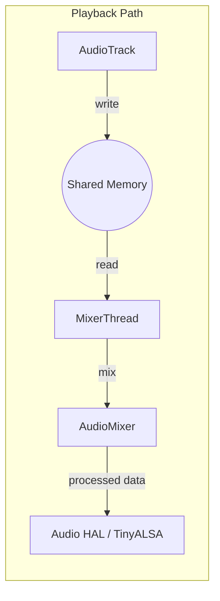

# AudioFlinger 混音引擎深度解析

`AudioFlinger` 是 Android 音频系统的“心脏”，运行在 `audioserver` 进程中。它通过多线程模型实现了多个应用流的高效混音与硬件分发。

---

## 1. 启动与初始化流程 (Initialization Sequence)

`AudioFlinger` 的生命周期起始于系统开机时的进程启动。

### 1.1 启动入口：audioserver.rc
```rc
service audioserver /system/bin/audioserver
    class main
    user audioserver
    group audio camera drmrpc inet media net_bt net_bt_admin net_bw_acct
    ioprio rt 4
```

### 1.2 实例化过程
1.  **`main_audioserver.cpp`**：执行 `AudioFlinger::instantiate()`。
2.  **`AudioFlinger` 构造函数**：
    *   初始化 `mPlaybackThreads` 和 `mRecordThreads` 容器。
    *   创建 `DevicesFactoryHalInterface` 句柄，准备加载 HAL。
3.  **加载 HAL 模块**：
    *   通过 `loadHwModule()` 加载 `audio.primary.so` 等厂商动态库。
    *   调用 `hw_get_module_by_class` 查找并打开硬件接口。

---

## 2. 核心线程模型深度匹配 (Flags -> Thread)

AudioFlinger 根据 `audio_policy_configuration.xml` 中定义的 Flags 来决定启动哪种类型的线程：

| 标志 (Flags) | 线程类型 | 应用场景 |
| :--- | :--- | :--- |
| `AUDIO_OUTPUT_FLAG_PRIMARY` | `MixerThread` | 铃声、系统提示音。 |
| `AUDIO_OUTPUT_FLAG_FAST` | `MixerThread` (Fast Path) | 按键音、游戏音、触屏交互。 |
| `AUDIO_OUTPUT_FLAG_DEEP_BUFFER` | `MixerThread` | 音乐播放，增加 Buffer 容错率。 |
| `AUDIO_OUTPUT_FLAG_DIRECT` | `DirectOutputThread` | 无损音频或压缩流直通。 |
| `AUDIO_OUTPUT_FLAG_COMPRESS_OFFLOAD`| `OffloadThread` | MP3/AAC 硬解码，极低功耗。 |

---

## 3. 核心类与算法

*   **AudioResampler**：负责采样率转换。
*   **AudioMixer**：核心混音器。执行音量调节（Volume Scaling）、声道转换及**饱和截断算法 (Saturation)**：
    $Sample_{out} = \text{clamp}(Sample_1 + Sample_2, -32768, 32767)$。
*   **AudioTrackServerProxy**：管理共享内存缓冲区指针（`sw_ptr`, `hw_ptr`）。

---

## 4. 数据流向全景图



---

## 5. 专家调试与 Dump 分析

`adb shell dumpsys media.audio_flinger`
*   **Active tracks**：当前活跃音轨。
*   **Underruns (UR)**：缓冲区欠载次数，判断卡顿的头号指标。

---
*下一章：策略大脑 [AudioPolicy 策略管理深度解析](./06-AudioPolicy.md)*
