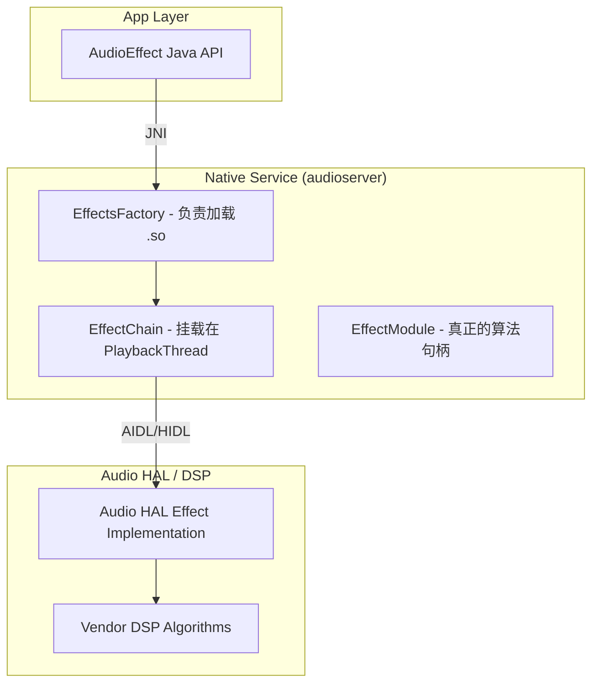

# AudioEffect 音效框架深度解析

`AudioEffect` 是 Android 提供的一套强大的插件式处理框架，允许开发者对音频流进行实时的增强处理（如：低音增强、虚拟环绕声、动态压缩）。

---

## 1. 架构全景：从 App 到 HAL

Android 的音效框架横跨了 Java、Native、HAL 和 DSP 四个层级。



---

## 2. 音效分类与生命周期

### 2.1 作用范围分类
1.  **Global Effects (全局音效)**：作用于整个系统（如：系统均衡器）。
2.  **Session Effects (会话音效)**：仅作用于特定的 `AudioSessionID`。如果你想让自己的 App 独享低音增强，必须传入对应的 Session ID。
3.  **Device Effects (设备音效)**：挂载在物理输出节点（如扬声器校准、耳道修正）。

### 2.2 核心组件：EffectChain
在 `AudioFlinger` 的 `PlaybackThread` 中，每一个需要处理的音频流都会经过一个 `EffectChain`。
*   **插入点**：混音之前（Track 级别）或混音之后（Device 级别）。
*   **处理流**：数据在链中按顺序传递，前一个音效的输出是后一个音效的输入。

---

## 3. 核心 API 与 AIDL 迁移 (Android 14+)

### 3.1 经典实例化 (Java)
```java
// 以创建均衡器 (Equalizer) 为例
int sessionId = media_player.getAudioSessionId();
Equalizer equalizer = new Equalizer(0, sessionId);
equalizer.setEnabled(true);
equalizer.setBandLevel((short)0, (short)500); // 提升低频
```

### 3.2 🚀 专家点：AIDL 迁移与 Effect Proxy
从 Android 14 开始，音效框架全面转向 **AIDL**。
*   **IEffect.aidl**：定义了 `open`, `close`, `setParameter`, `getParameter` 等核心接口。
*   **Proxy 模式**：系统提供了一个音效代理，能够根据硬件能力动态选择在 CPU (软解) 还是 DSP (硬解) 执行算法。

---

## 4. 低延迟路径下的音效限制 (MMAP & FastPath)

如果你追求极致的低延迟（如使用 `AAudio` 或 `FastMixer`）：
*   **跳过音效**：为了保证确定性的延迟，`FastMixer` 通常会跳过复杂的 `EffectChain`。
*   **硬件卸载**：在这种情况下，音效必须实现在 **Audio HAL** 或 **DSP** 中，通过硬件直接处理，不消耗主 CPU 周期。

---

## 5. 实战：如何排查音效无效的问题？

1.  **Session ID 校验**：确认 App 设置的 ID 是否与 `AudioFlinger` 中创建的 Track ID 一致。
2.  **Dumpsys 检查**：
    `adb shell dumpsys media.audio_flinger`
    *   搜索 `Effect Chains`，看对应的 Chain 是否处于 `Active` 状态。
3.  **库文件确认**：
    检查 `/vendor/lib/soundfx/` 目录下是否存在对应的 `.so` 算法库。

---

## 6. 关键参考 (References)

1.  [Android Developer: AudioEffect](https://developer.android.com/reference/android/media/audiofx/AudioEffect)
2.  [AOSP: Audio Effects Architecture](https://source.android.com/docs/core/audio/effects)
3.  [Android 14 Audio Effect AIDL Specification](https://source.android.com/docs/core/audio/aidl)

---
*下一章：策略大脑 [AudioPolicy 路由管理与策略源码解析](../05-AudioPolicy/README.md)*
