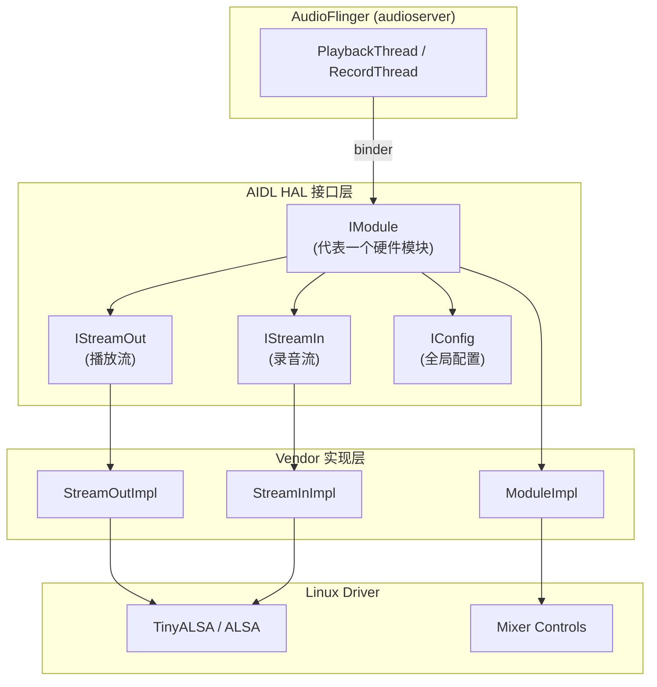
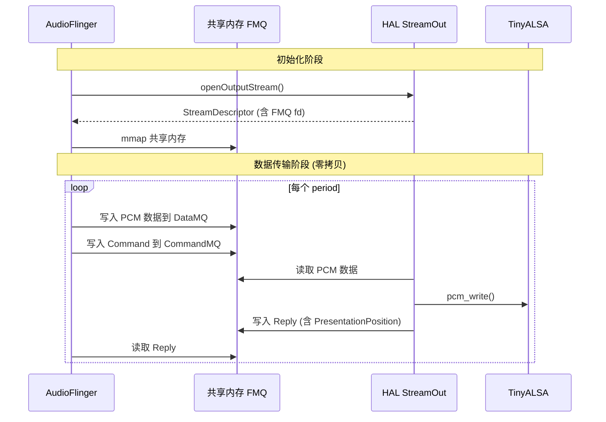
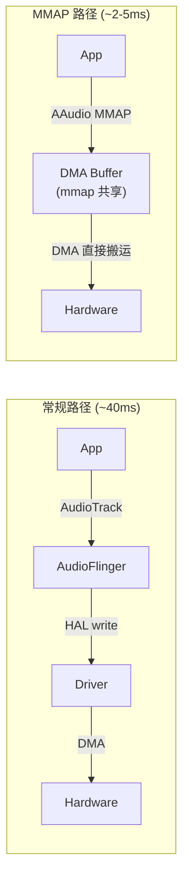
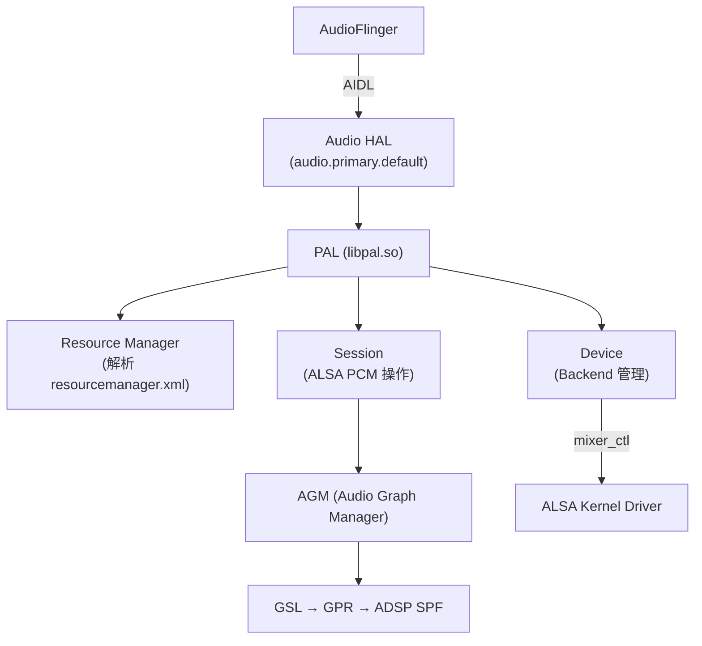

# Audio HAL 接口规范 (Audio Hardware Abstraction Layer)

Audio HAL 是 Android Framework 与物理硬件之间的抽象层。它将 AudioFlinger 的通用音频操作翻译为具体的硬件驱动调用，是音频工程师日常工作中接触最多的层。

---

## 1. HAL 架构演进

### 1.1 三代 HAL 接口对比

| 代际 | Android 版本 | 接口技术 | 核心文件 | 传输机制 |
|:---|:---|:---|:---|:---|
| **Legacy HAL** | ≤7 | C 函数指针 (hw_module_t) | `audio_hw.c` | 直接函数调用 |
| **HIDL HAL** | 8-13 | HIDL (`IDevice.hal`) | `.hal` + 生成代码 | hwbinder IPC |
| **AIDL HAL** | 14+ | Stable AIDL (`IModule.aidl`) | `.aidl` + 生成代码 | binder IPC |

### 1.2 AIDL HAL 核心接口层次



---

## 2. AIDL HAL 完整接口定义

### 2.1 IModule 核心接口

```aidl
// hardware/interfaces/audio/aidl/android/hardware/audio/core/IModule.aidl
interface IModule {
    // ===== 流管理 =====
    IStreamIn openInputStream(in OpenInputStreamArguments args,
                              out OpenInputStreamReturn ret);
    IStreamOut openOutputStream(in OpenOutputStreamArguments args,
                                out OpenOutputStreamReturn ret);
    
    // ===== 端口管理 =====
    AudioPort[] getAudioPorts();
    AudioRoute[] getAudioRoutes();
    AudioPort connectExternalDevice(in AudioPort port);
    void disconnectExternalDevice(in int portId);
    
    // ===== 端口配置 =====
    AudioPortConfig[] getAudioPortConfigs();
    AudioPortConfig setAudioPortConfig(in AudioPortConfig config, out boolean applied);
    
    // ===== AudioPatch =====
    AudioPatch setAudioPatch(in AudioPatch patch);
    void resetAudioPatch(in int patchId);
    
    // ===== 全局控制 =====
    void setMasterVolume(float volume);
    void setMasterMute(boolean muted);
    void setMicMute(boolean muted);
    
    // ===== MMAP 支持 =====
    MmapBufferDescriptor getMmapBufferInfo(in StreamContext context);
}
```

### 2.2 IStreamOut 核心接口

```aidl
interface IStreamOut {
    // 获取流描述符（共享内存 FMQ）
    StreamDescriptor getStreamDescriptor();
    
    // 音量控制
    void setHwVolume(in float[] channelVolumes);
    
    // 呈现位置（用于 A/V 同步）
    PresentationPosition getPresentationPosition();
    
    // Offload 控制
    void drain(in AudioDrain type);
    void flush();
    void pause();
    void resume();
    
    // 延迟信息
    long getBufferSizeFrames();
    long getBufferPosition();
}
```

### 2.3 数据传递：FMQ (Fast Message Queue)

AIDL HAL 使用 **FMQ** 而非传统 binder 传递音频数据，避免逐帧 IPC 开销：



**关键数据结构**：

```cpp
struct StreamDescriptor {
    MQDescriptor<int8_t, SynchronizedReadWrite> audio;    // 音频数据 MQ
    MQDescriptor<StreamCommand, SynchronizedReadWrite> command; // 命令 MQ
    MQDescriptor<StreamReply, SynchronizedReadWrite> reply;     // 回复 MQ
    int32_t frameSizeBytes;
    int32_t bufferSizeFrames;
};
```

---

## 3. MMAP 独占模式实现

### 3.1 MMAP 原理

MMAP (Memory-Mapped) 模式允许应用直接读写 DMA buffer，绕过 AudioFlinger 的 ThreadLoop，实现 **< 5ms** 的端到端延迟。



### 3.2 HAL 层 MMAP 实现要点

```cpp
// HAL 必须实现的 MMAP 接口
ndk::ScopedAStatus StreamOutImpl::createMmapBuffer(
        int32_t minSizeFrames,
        MmapBufferDescriptor* _aidl_return) {
    
    // 1. 配置 ALSA PCM 为 MMAP 模式
    struct pcm_config config = {};
    config.channels = mChannelCount;
    config.rate = mSampleRate;
    config.period_size = minSizeFrames;
    config.period_count = 2;  // 双缓冲
    config.format = PCM_FORMAT_S16_LE;
    config.start_threshold = 0;
    config.stop_threshold = 0;
    
    mPcm = pcm_open(mCard, mDevice, PCM_OUT | PCM_MMAP | PCM_NOIRQ, &config);
    
    // 2. 获取 MMAP buffer 的 fd 和 offset
    unsigned int offset = 0;
    unsigned int frames = 0;
    pcm_mmap_begin(mPcm, &mMmapBuffer, &offset, &frames);
    
    // 3. 返回描述符给 Framework
    _aidl_return->sharedMemory = dupFdFromMmapBuffer(mPcm);
    _aidl_return->bufferSizeFrames = frames;
    _aidl_return->burstSizeFrames = config.period_size;
    _aidl_return->flags = MmapBufferDescriptor::FLAG_INDEX_APPLICATION_SHAREABLE;
    
    return ndk::ScopedAStatus::ok();
}
```

### 3.3 MMAP 生效条件

| 条件 | 要求 |
|:---|:---|
| HAL 声明支持 | `audio_policy_configuration.xml` 中对应 profile 含 `FLAG_MMAP_NOIRQ` |
| 内核驱动支持 | PCM device 支持 `SNDRV_PCM_INFO_MMAP` |
| SELinux 权限 | App 进程有权 mmap 音频 FD |
| AAudio 请求 | App 使用 `AAUDIO_SHARING_MODE_EXCLUSIVE` |

---

## 4. 高通平台 HAL 实现：PAL 对接

高通 AudioReach 平台的 HAL 不直接调用 TinyALSA，而是通过 **PAL (Platform Abstraction Layer)** 间接操作：



### 4.1 PAL Stream 打开流程

```cpp
// 高通 HAL 的 openOutputStream 核心路径
int AudioStreamOut::open(const struct audio_config *config) {
    pal_stream_attributes attr = {};
    attr.type = PAL_STREAM_DEEP_BUFFER;  // 或 LOW_LATENCY / COMPRESSED_OFFLOAD
    attr.direction = PAL_AUDIO_OUTPUT;
    attr.out_media_config.sample_rate = config->sample_rate;
    attr.out_media_config.ch_info = channelMapFromMask(config->channel_mask);
    attr.out_media_config.bit_width = 16;
    
    // PAL 内部: 分配 FE PCM → 组装 GKV → 通过 AGM 配置 DSP Graph
    int ret = pal_stream_open(&attr, 
                               deviceCount, devices,
                               0, NULL,     // modifier
                               &streamCb, this,
                               &mPalStream);
    return ret;
}
```

### 4.2 高通 HAL 与标准 HAL 的差异

| 维度 | 标准 AOSP HAL | 高通 PAL HAL |
|:---|:---|:---|
| 音频数据路径 | HAL → pcm_write → Kernel ALSA | HAL → PAL → AGM → DSP (SPF) |
| 音效处理位置 | AudioFlinger EffectChain (ARM CPU) | ADSP (Hexagon DSP, 功耗极低) |
| 路由控制 | mixer_ctl 直接操作 | Resource Manager 策略 + mixer_ctl |
| 配置文件 | `audio_policy_configuration.xml` | 额外 `resourcemanager.xml` + `usecaseKvManager.xml` |
| Offload 解码 | HAL 层 OMX/Codec2 → pcm_write | DSP 直接解码 (mp3/aac/flac) |

---

## 5. HAL 调试实战

### 5.1 核心调试命令

```bash
# 查看已注册的 HAL 服务
adb shell dumpsys android.hardware.audio.core.IModule/default

# 查看 ALSA 驱动节点
adb shell cat /proc/asound/cards
adb shell cat /proc/asound/pcm

# 查看当前活跃的 PCM 流
adb shell cat /proc/asound/card0/pcm0p/sub0/status

# 高通平台: 查看 PAL stream 状态
adb shell dumpsys vendor.audio.hardware

# 查看 HAL 层延迟
adb shell dumpsys media.audio_flinger | grep -A5 "HAL"
```

### 5.2 常见问题排查

| 问题 | 排查点 | 验证手段 |
|:---|:---|:---|
| HAL 打开失败 | PCM 节点是否存在 / SELinux | `adb shell ls /dev/snd/` + `adb logcat -s audio_hw` |
| 无声 | mixer 路由是否正确 | `adb shell tinymix` 逐项检查 |
| Underrun (欠载) | buffer size 是否过小 | logcat 搜索 `underrun` + 增大 period_size |
| 延迟过高 | 是否走了 deep_buffer | 检查 output flag + HAL buffer 配置 |
| 采样率不匹配 | HAL 声明与实际不符 | `audio_policy_configuration.xml` 检查 |
| MMAP 未生效 | 驱动不支持 / 权限 | logcat 搜索 `mmap` + 检查 `SNDRV_PCM_INFO_MMAP` |

### 5.3 HAL 层延迟计算

```
HAL 层延迟 = period_size / sample_rate × period_count

示例:
  period_size = 240 frames
  sample_rate = 48000 Hz
  period_count = 2
  HAL 延迟 = 240 / 48000 × 2 = 10ms
```

---

## 6. audio_policy_configuration.xml 与 HAL 的关系

HAL 的能力声明来自此配置文件，AudioPolicy 根据它选择输出流：

```xml
<module name="primary" halVersion="3.0">
    <mixPorts>
        <!-- 深缓冲播放 (音乐) -->
        <mixPort name="deep_buffer" role="source"
                 flags="AUDIO_OUTPUT_FLAG_DEEP_BUFFER">
            <profile name="" format="AUDIO_FORMAT_PCM_16_BIT"
                     samplingRates="48000" channelMasks="AUDIO_CHANNEL_OUT_STEREO"/>
        </mixPort>
        
        <!-- 低延迟播放 (游戏/按键音) -->
        <mixPort name="low_latency" role="source"
                 flags="AUDIO_OUTPUT_FLAG_FAST">
            <profile name="" format="AUDIO_FORMAT_PCM_16_BIT"
                     samplingRates="48000" channelMasks="AUDIO_CHANNEL_OUT_STEREO"/>
        </mixPort>
        
        <!-- MMAP 独占播放 -->
        <mixPort name="mmap_no_irq_out" role="source"
                 flags="AUDIO_OUTPUT_FLAG_MMAP_NOIRQ">
            <profile name="" format="AUDIO_FORMAT_PCM_16_BIT"
                     samplingRates="48000" channelMasks="AUDIO_CHANNEL_OUT_STEREO"/>
        </mixPort>
        
        <!-- Offload 播放 (压缩音频直通 DSP 解码) -->
        <mixPort name="compress_offload" role="source"
                 flags="AUDIO_OUTPUT_FLAG_COMPRESS_OFFLOAD|AUDIO_OUTPUT_FLAG_DIRECT">
            <profile name="" format="AUDIO_FORMAT_MP3"
                     samplingRates="44100,48000" channelMasks="AUDIO_CHANNEL_OUT_STEREO"/>
            <profile name="" format="AUDIO_FORMAT_AAC_LC"
                     samplingRates="44100,48000" channelMasks="AUDIO_CHANNEL_OUT_STEREO"/>
        </mixPort>
    </mixPorts>
    
    <devicePorts>
        <devicePort tagName="Speaker" type="AUDIO_DEVICE_OUT_SPEAKER" role="sink"/>
        <devicePort tagName="Wired Headset" type="AUDIO_DEVICE_OUT_WIRED_HEADSET" role="sink"/>
    </devicePorts>
    
    <routes>
        <route type="mix" sink="Speaker" sources="deep_buffer,low_latency,mmap_no_irq_out"/>
        <route type="mix" sink="Wired Headset" sources="deep_buffer,low_latency,compress_offload"/>
    </routes>
</module>
```

---

## 7. 关键参考 (References)

1.  [AOSP Audio HAL AIDL Interfaces](https://android.googlesource.com/platform/hardware/interfaces/+/refs/heads/main/audio/aidl/)
2.  [Android Audio Architecture](https://source.android.com/docs/core/audio/architecture)
3.  [TinyALSA Source Code](https://github.com/tinyalsa/tinyalsa)
4.  Qualcomm PAL/AGM Architecture Documentation (Vendor Confidential)
5.  [ALSA MMAP Documentation](https://www.alsa-project.org/alsa-doc/alsa-lib/pcm.html)

---
*下一章：[AudioEffect 音效框架深度解析](./08-AudioEffect.md)*
