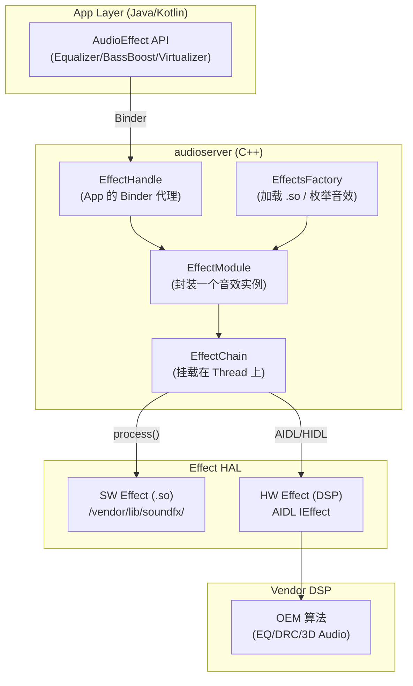
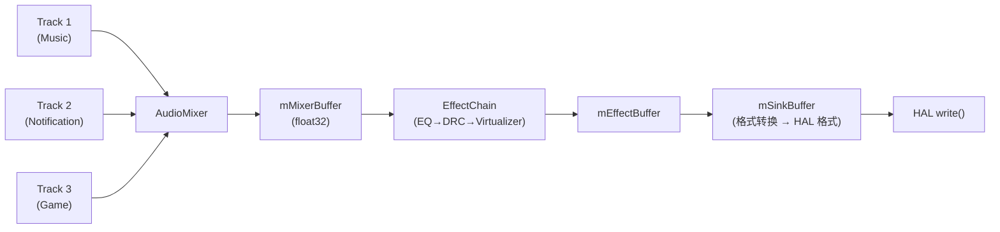

# AudioEffect 音效框架深度解析

`AudioEffect` 是 Android 提供的一套插件式音频处理框架，允许开发者和 OEM 对音频流进行实时增强处理。本章深入分析架构分层、Buffer 传递机制、AIDL 迁移、音效开发以及调试方法。

---

## 1. 架构全景



---

## 2. 音效分类

### 2.1 按作用范围

| 类型 | Session ID | 挂载位置 | 典型用途 |
|:---|:---|:---|:---|
| **Session Effect** | App 指定的 Session | Track 级 EffectChain | App 独享的 EQ/BassBoost |
| **Global Effect** | `AUDIO_SESSION_OUTPUT_MIX` (0) | MixerThread 输出 | 系统全局均衡器 |
| **Device Effect** | `AUDIO_SESSION_DEVICE` | Device 输出端 | 扬声器校准、耳道补偿 |
| **Pre-processing** | Input Session | RecordThread 输入 | AEC/NS/AGC |
| **Post-processing** | Output Session | PlaybackThread 输出 | Spatializer/DRC |

### 2.2 按处理位置

```
音效处理位置:

  Insert Effect (插入式):
    串联在信号链中, 替换原始信号
    例: EQ, DRC, Virtualizer
    数据流: Input → Effect → Output (替换)
    
  Auxiliary Effect (辅助式):
    并联处理, 混合原始信号和处理后信号
    例: Reverb (混响)
    数据流: Input → Output (直通)
                └→ Effect → Aux Buffer → 混合到 Output
```

### 2.3 Android 内置音效

| 音效 | UUID (Type) | 功能 | 典型实现 |
|:---|:---|:---|:---|
| **Equalizer** | `0bed4300-...` | 多频段均衡器 | SW / DSP |
| **BassBoost** | `0634f220-...` | 低音增强 | SW / DSP |
| **Virtualizer** | `37cc2c00-...` | 虚拟环绕声 | SW / DSP |
| **LoudnessEnhancer** | `fe3199be-...` | 响度增强 | SW |
| **Reverb** | `c2e5d5f0-...` | 混响 (Auxiliary) | SW |
| **Visualizer** | `e46b26a0-...` | 频谱可视化 (只读) | SW |
| **AEC** | `7b491460-...` | 回声消除 (Pre) | DSP |
| **NS** | `58b4b260-...` | 噪声抑制 (Pre) | DSP |
| **AGC** | `0a8abfe0-...` | 自动增益 (Pre) | DSP |
| **Spatializer** | Android 12+ | 空间音频渲染 | DSP / SW |
| **HapticGenerator** | Android 12+ | 触觉反馈生成 | SW |

---

## 3. EffectChain 与 Buffer 传递

### 3.1 EffectChain 在 PlaybackThread 中的位置

```
PlaybackThread::threadLoop() 核心循环:

  while (true) {
    1. prepareTracks_l()
       ├── 遍历 mActiveTracks
       ├── 设置 Track.mainBuffer → mMixerBuffer 或 EffectChain.inBuffer
       └── 处理 Track Volume
       
    2. AudioMixer::process()
       ├── 混音所有 active Track
       ├── 重采样 (如需要)
       └── 输出到 mMixerBuffer
       
    3. EffectChain::process_l()    ← 音效处理在这里!
       ├── 遍历所有 EffectModule
       ├── 调用 effect->process() 
       └── 输出到 mEffectBuffer
       
    4. memcpy(mSinkBuffer, mEffectBuffer)
       
    5. HAL->write(mSinkBuffer)    ← 送给硬件
  }
```

### 3.2 Buffer 流转详解



```
Buffer 类型与格式:
  mMixerBuffer:  float32, 内部混音格式
  mEffectBuffer: float32, 音效处理格式
  mSinkBuffer:   int16/int32, HAL 要求的格式

Session Effect vs Global Effect 的 Buffer 差异:
  Session Effect:
    挂载在特定 Track 的 EffectChain
    inBuffer = Track 的独立 Buffer (混音前处理)
    
  Global Effect:
    挂载在 Session 0 的 EffectChain
    inBuffer = mMixerBuffer (混音后处理)
```

---

## 4. 音效配置与加载

### 4.1 audio_effects.xml 配置

```xml
<!-- /vendor/etc/audio_effects.xml -->
<audio_effects_conf version="2.0" xmlns:xi="http://www.w3.org/2001/XInclude">
    <libraries>
        <library name="bundle" path="libbundlewrapper.so"/>
        <library name="reverb" path="libreverbwrapper.so"/>
        <library name="visualizer" path="libvisualizer.so"/>
        <library name="downmix" path="libdownmix.so"/>
        <!-- OEM 自定义音效库 -->
        <library name="oem_effect" path="liboem_audio_effect.so"/>
    </libraries>
    
    <effects>
        <effectProxy name="equalizer" 
                     library="bundle" 
                     uuid="ce772f20-847d-11df-bb17-001a80">
            <!-- SW 实现 -->
            <libsw library="bundle" 
                   uuid="0bed4300-847d-11df-bb17-001a80"/>
            <!-- HW 实现 (DSP offload) -->
            <libhw library="offload_bundle" 
                   uuid="a0dac280-401c-11e3-9379-0002a5d5c51b"/>
        </effectProxy>
        
        <effect name="bassboost" library="bundle" 
                uuid="8631f300-72e2-11df-b57e-0002a5d5c51b"/>
    </effects>
    
    <postprocess>
        <stream type="music">
            <apply effect="equalizer"/>
            <apply effect="bassboost"/>
        </stream>
    </postprocess>
    
    <preprocess>
        <stream type="voice_communication">
            <apply effect="aec"/>
            <apply effect="ns"/>
        </stream>
    </preprocess>
</audio_effects_conf>
```

### 4.2 Effect Proxy 机制

```
Effect Proxy (SW/HW 自动切换):

  ┌──────────────────────────────────┐
  │ EffectProxy                      │
  │  ├── libsw (CPU 软件实现)        │
  │  └── libhw (DSP 硬件实现)        │
  └──────────────────────────────────┘
  
  选择逻辑:
    if (Track 走 Offload/Direct 路径)
      → 使用 libhw (DSP 处理, 零 CPU 开销)
    else (Normal/Fast Path)
      → 使用 libsw (CPU 处理)
      
  优势:
    同一个音效 UUID, 两套实现
    AudioFlinger 根据播放路径自动选择
    App 层完全透明
```

---

## 5. AIDL 音效接口 (Android 14+)

### 5.1 AIDL vs Legacy 对比

| 维度 | Legacy (< Android 14) | AIDL (Android 14+) |
|:---|:---|:---|
| **接口定义** | C 结构体 (`effect_interface_s`) | AIDL `IEffect.aidl` |
| **数据传输** | 共享内存 + 回调 | FMQ (Fast Message Queue) |
| **参数控制** | `command()` 万能函数 | 类型化 `setParameter()`/`getParameter()` |
| **HAL 进程** | 与音效库同进程 | 独立进程 (更安全) |
| **热插拔** | 不支持 | 支持动态加载/卸载 |

### 5.2 AIDL IEffect 核心接口

```
IEffect.aidl:
  ├── open(Parameter common, Parameter specific)
  │   → 分配资源, 返回 FMQ 描述符
  │
  ├── close()
  │   → 释放资源
  │
  ├── getDescriptor() → Descriptor
  │   → 返回音效类型/UUID/名称
  │
  ├── command(CommandId id) → RetCode
  │   → START / STOP / RESET
  │
  ├── setParameter(Parameter param) → RetCode
  │   → 下发参数 (类型安全)
  │
  ├── getParameter(Tag tag) → Parameter
  │   → 获取参数
  │
  └── getState() → State
      → INIT / IDLE / PROCESSING

FMQ 数据流 (零拷贝):
  AudioFlinger ←→ FMQ ←→ Effect HAL
  Command FMQ:  AudioFlinger → Effect (控制命令)
  Status FMQ:   Effect → AudioFlinger (状态/应答)
  Data FMQ:     双向 (音频数据, Auxiliary 模式)
```

---

## 6. Spatializer (空间音频, Android 12+)

```
Spatializer 架构:

  MediaPlayer (多声道) → AudioTrack (Spatializer Session)
    → AudioFlinger → Spatializer EffectModule
      → 多声道 → 双声道 Binaural 渲染
        → HRTF 卷积 + Head Tracking
          → HAL write() → 耳机输出

关键组件:
  SpatializerHelper (Java):
    管理 Spatializer 生命周期
    监听设备连接 (仅耳机/耳塞启用)
    
  ISpatializer (AIDL):
    setDesiredSpatializerParams()
    setHeadTrackerEnabled()
    getSpatializerCompatibleModes()
    
  Spatializer Effect (HAL):
    接收多声道 PCM (5.1/7.1/Atmos)
    HRTF 渲染为双声道
    可选: Head Tracking 数据输入

支持的内容格式:
  - 5.1 / 7.1 多声道 PCM
  - Dolby Atmos (JOC)
  - Sony 360 Reality Audio
```

---

## 7. 低延迟路径的音效限制

```
各路径的音效支持:

  Normal Path (MixerThread):
    ✅ 支持所有 SW/HW Effect
    ✅ Session + Global Effect
    延迟影响: 每个音效增加 ~1-2ms 处理时间
    
  Fast Path (FastMixer):
    ⚠️ 仅支持简单音效 (Volume)
    ❌ 不支持复杂 EffectChain
    原因: FastMixer 有严格的实时性要求
    
  MMAP Path (AAudio Exclusive):
    ❌ 完全不支持 SW Effect
    ✅ 仅支持 DSP 侧 HW Effect
    原因: 数据直接 DMA, 不经过 AudioFlinger
    
  Offload Path (OffloadThread):
    ✅ 支持 HW Effect (DSP Proxy)
    ❌ 不支持 SW Effect
    原因: 解码在 DSP, 数据不经过 CPU
```

---

## 8. 调试方法

### 8.1 dumpsys 查看音效状态

```bash
# 查看所有已加载的音效库
adb shell dumpsys media.audio_flinger | grep -A 100 "Effects Factory"

# 查看当前活跃的 EffectChain
adb shell dumpsys media.audio_flinger | grep -B 2 -A 20 "Effect Chain"

# 查看特定 Session 的音效
adb shell dumpsys media.audio_flinger | grep -A 10 "session"

# 查看 Effect HAL 状态
adb shell dumpsys vendor.audio.hardware | grep -i effect
```

### 8.2 常见问题排查

| 问题 | 可能原因 | 排查方法 |
|:---|:---|:---|
| 音效不生效 | Session ID 不匹配 | `dumpsys` 检查 Effect 挂载的 Session |
| 音效不生效 | .so 未加载 | 检查 `audio_effects.xml` 和 `/vendor/lib/soundfx/` |
| 音效不生效 | Effect 未 enable | `dumpsys` 检查 `state: ACTIVE` |
| 音效导致爆音 | 增益过高导致削波 | 降低 Effect 增益, 检查 Limiter |
| 音效导致延迟 | Effect 处理时间过长 | perfetto 抓取 threadLoop 耗时 |
| Offload 无音效 | 无 HW Proxy 实现 | 检查 `audio_effects.xml` 中 `libhw` 配置 |
| Spatializer 不工作 | 设备不支持 / 内容非多声道 | 检查 `SpatializerHelper` 日志 |

### 8.3 音效开发: effect_interface_s (Legacy)

```c
// Legacy 音效接口 (仍广泛使用)
struct effect_interface_s {
    int32_t (*process)(effect_handle_t self,
                       audio_buffer_t *inBuffer,
                       audio_buffer_t *outBuffer);
                       
    int32_t (*command)(effect_handle_t self,
                       uint32_t cmdCode,
                       uint32_t cmdSize, void *pCmdData,
                       uint32_t *replySize, void *pReplyData);
                       
    int32_t (*get_descriptor)(effect_handle_t self,
                              effect_descriptor_t *pDescriptor);
};

// process() 每个 threadLoop 周期调用一次
// 典型 buffer 大小: 240-960 frames (5-20ms @ 48kHz)
// 必须在一个周期内完成, 否则导致 underrun
```

---

## 9. 关键参考 (References)

1.  [Android Developer: AudioEffect](https://developer.android.com/reference/android/media/audiofx/AudioEffect)
2.  [AOSP: Audio Effects Architecture](https://source.android.com/docs/core/audio/effects)
3.  [Android 14 Audio Effect AIDL Specification](https://source.android.com/docs/core/audio/aidl)
4.  [AOSP: Spatializer](https://source.android.com/docs/core/audio/spatial-audio)

---
*下一章：[AudioFocus 音频焦点机制](./09-AudioFocus.md)*
