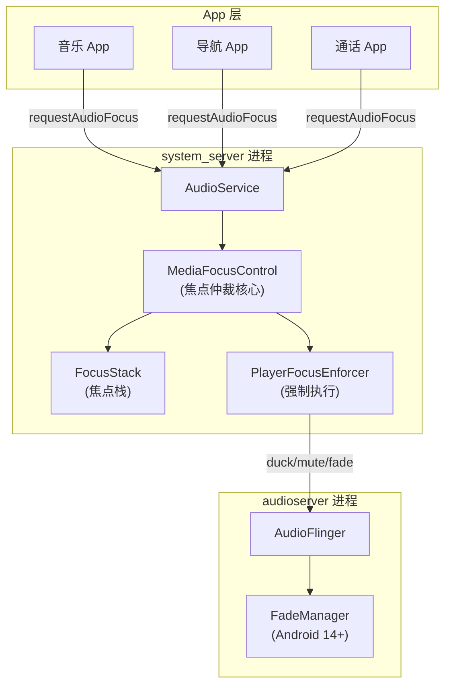
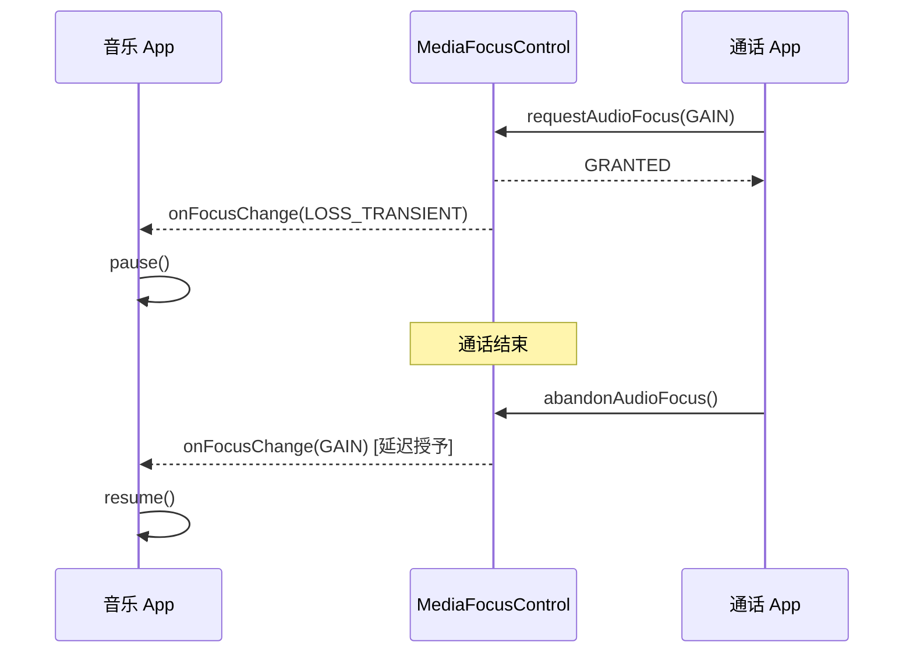
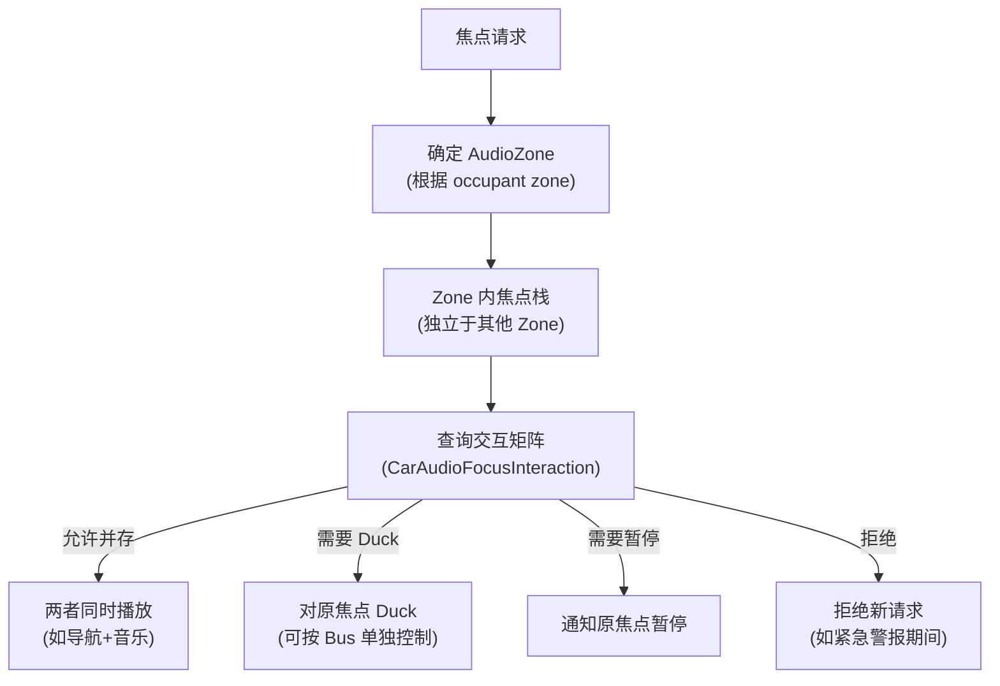

# AudioFocus 音频焦点机制

AudioFocus 是 Android 解决多应用音频冲突的核心机制。从手机场景（听歌时来电话）到车载场景（导航播报抢占音乐），焦点系统决定了"谁有权发声"。

---

## 1. 架构全景

### 1.1 焦点系统在 Audio Stack 中的位置



### 1.2 焦点栈数据结构

```java
// frameworks/base/services/core/java/com/android/server/audio/MediaFocusControl.java
private final Stack<FocusRequester> mFocusStack = new Stack<>();

class FocusRequester {
    final AudioAttributes mAttributes;      // 音频属性 (Usage + ContentType)
    final int mFocusGainRequest;           // 申请类型 (GAIN / TRANSIENT / DUCK)
    final int mClientUid;                  // 申请者 UID
    final String mPackageName;             // 包名
    final IAudioFocusDispatcher mDispatcher; // 回调接口
    int mFocusLossReceived;               // 当前失焦状态
    boolean mFocusLossWasNotified;        // 是否已通知
}
```

---

## 2. 焦点申请与仲裁

### 2.1 申请类型 (Focus Gain)

| 类型 | 值 | 场景 | 对已有焦点的影响 |
|:---|:---|:---|:---|
| `AUDIOFOCUS_GAIN` | 1 | 音乐/视频长播放 | 前焦点者收到 `LOSS` |
| `AUDIOFOCUS_GAIN_TRANSIENT` | 2 | 导航播报/闹钟 | 前焦点者收到 `LOSS_TRANSIENT` |
| `AUDIOFOCUS_GAIN_TRANSIENT_MAY_DUCK` | 3 | 通知提示音 | 前焦点者收到 `LOSS_TRANSIENT_CAN_DUCK` |
| `AUDIOFOCUS_GAIN_TRANSIENT_EXCLUSIVE` | 4 | 语音识别/录音 | 所有其他播放器必须静音 |

### 2.2 仲裁逻辑源码解析

```java
// MediaFocusControl.java - 核心仲裁方法
private int evaluateFocusRequestLocked(FocusRequester newFocus) {
    // 1. 栈为空: 直接批准
    if (mFocusStack.isEmpty()) return AUDIOFOCUS_REQUEST_GRANTED;
    
    // 2. 取栈顶 (当前焦点持有者)
    FocusRequester topFocus = mFocusStack.peek();
    
    // 3. 同一客户端重复申请: 更新参数
    if (topFocus.hasSameClient(newFocus.getClientId())) {
        return AUDIOFOCUS_REQUEST_GRANTED;
    }
    
    // 4. 查询焦点交互矩阵
    @FocusInteraction int interaction = 
        mFocusPolicy.evaluateRequest(newFocus, topFocus);
    
    switch (interaction) {
        case INTERACTION_REJECT:
            return AUDIOFOCUS_REQUEST_FAILED;
        case INTERACTION_EXCLUSIVE:
            topFocus.handleFocusLoss(AUDIOFOCUS_LOSS, newFocus, /*forceDuck*/ false);
            break;
        case INTERACTION_DUCK:
            topFocus.handleFocusLoss(AUDIOFOCUS_LOSS_TRANSIENT_CAN_DUCK, 
                                      newFocus, /*forceDuck*/ false);
            break;
    }
    return AUDIOFOCUS_REQUEST_GRANTED;
}
```

### 2.3 焦点交互矩阵

系统使用 **AudioAttributes.Usage** 决定交互行为：

| 新请求 ↓ / 当前焦点 → | USAGE_MEDIA | USAGE_ALARM | USAGE_VOICE_COMMUNICATION | USAGE_ASSISTANCE_NAVIGATION |
|:---|:---|:---|:---|:---|
| **USAGE_MEDIA** | 抢占 | 抢占 | 拒绝 | 共存 |
| **USAGE_ALARM** | 抢占 | 抢占 | 拒绝 | 抢占 |
| **USAGE_VOICE_COMMUNICATION** | 抢占 | 抢占 | 抢占 | Duck |
| **USAGE_ASSISTANCE_NAVIGATION** | Duck | Duck | Duck | 共存 |

---

## 3. 焦点丢失处理

### 3.1 Loss 类型与 App 侧响应

| Loss 类型 | 含义 | App 正确响应 |
|:---|:---|:---|
| `AUDIOFOCUS_LOSS` | 永久失去，新播放者已抢占 | **停止播放** + 释放资源 |
| `AUDIOFOCUS_LOSS_TRANSIENT` | 暂时失去（如来电） | **暂停播放**，等恢复后继续 |
| `AUDIOFOCUS_LOSS_TRANSIENT_CAN_DUCK` | 暂时失去但可降音量 | 降低音量到 20% 或系统自动 Duck |

### 3.2 系统自动 Ducking (Android 8.0+)

从 Android 8.0 开始，系统可以在 AudioFlinger 层自动为不配合的 App 执行 Ducking，无需 App 自己调音量：

```java
// AudioService.java
private void duckPlayers(@NonNull FocusRequester winner, 
                          @NonNull FocusRequester loser) {
    // 通过 PlayerFocusEnforcer 通知 AudioFlinger
    // 对 loser 的 AudioTrack 应用 -14dB 衰减
    mPlayerFocusEnforcer.duckPlayers(loser, winner, 
        /* usesSystemDuck */ true);
}
```

衰减量配置：`config_audioDuckingValue = -14dB`（可由 OEM 覆盖）。

---

## 4. Android 14+ 新特性：延迟焦点 & FadeManager

### 4.1 延迟焦点 (Delayed Focus)

Android 12 引入，允许焦点请求"排队等待"而非立即失败：

```java
// App 申请延迟焦点
AudioFocusRequest request = new AudioFocusRequest.Builder(AudioManager.AUDIOFOCUS_GAIN)
    .setAudioAttributes(musicAttributes)
    .setAcceptsDelayedFocusGain(true)  // 关键: 接受延迟授予
    .setOnAudioFocusChangeListener(listener)
    .build();

int result = audioManager.requestAudioFocus(request);
// result 可能为 AUDIOFOCUS_REQUEST_DELAYED (值=2)
// 此时 App 不应开始播放，等待回调通知焦点已授予
```

**工作流程**：


### 4.2 FadeManager (Android 14+)

Android 14 在 AudioFlinger 引入 **FadeManager**，实现焦点切换时的平滑淡入淡出，避免"砰"一声的突兀切换：

```cpp
// frameworks/av/services/audioflinger/FadeManager.cpp
class FadeManager {
public:
    // 触发淡出 (焦点丢失时)
    void startFadeOut(sp<Track> track, int durationMs = 200);
    
    // 触发淡入 (焦点恢复时)
    void startFadeIn(sp<Track> track, int durationMs = 300);
    
private:
    // 淡入淡出曲线: 使用 S-curve (而非线性)
    float computeGain(int64_t elapsedMs, int64_t durationMs) {
        float t = (float)elapsedMs / durationMs;
        // Smoothstep: 3t² - 2t³
        return t * t * (3.0f - 2.0f * t);
    }
};
```

**FadeManager 与传统 Duck 的区别**：

| 维度 | 传统 Duck | FadeManager |
|:---|:---|:---|
| 执行位置 | PlayerBase 层 (App 进程) | AudioFlinger (audioserver) |
| 控制粒度 | 整个播放器 | 单个 Track 级别 |
| 过渡曲线 | 无过渡，瞬间降音量 | S-curve 平滑过渡 |
| 时间控制 | 无 | 可配置 fadeIn/fadeOut 时长 |
| App 配合 | 需要 App 监听并响应 | 系统强制执行，App 无感 |

---

## 5. 车载 AudioFocus：CarAudioFocus

AAOS (Android Automotive OS) 对焦点机制做了重大扩展：

### 5.1 与手机焦点的核心差异

| 维度 | 手机 (Phone) | 车载 (Automotive) |
|:---|:---|:---|
| 焦点范围 | 全局单一焦点栈 | **多 AudioZone**，每个 Zone 独立焦点栈 |
| 仲裁策略 | 固定矩阵 | OEM 可定制 `CarAudioFocusInteraction` |
| 并行播放 | 极少允许 | 常见（导航+音乐同时出声） |
| 紧急音频 | 无特殊处理 | 紧急警报优先级最高，不可被抢 |
| Duck 行为 | -14dB 固定 | 按 Zone + 通道精细控制 |

### 5.2 CarAudioFocus 仲裁流程



### 5.3 多音区焦点实例

```
驾驶员区 (Zone 0):
  ├── 焦点栈: [通话 (GAIN)] → 音乐暂停
  └── 输出 Bus: bus0_media (muted), bus1_call (active)

副驾区 (Zone 1):
  ├── 焦点栈: [音乐 (GAIN)]  → 正常播放
  └── 输出 Bus: bus2_media (active)

后排区 (Zone 2):
  ├── 焦点栈: [视频 (GAIN)]  → 正常播放
  └── 输出 Bus: bus3_rear (active)
```

---

## 6. 调试实战

### 6.1 核心调试命令

```bash
# 查看焦点栈
adb shell dumpsys audio | grep -A 30 "Audio Focus stack"

# 查看所有活跃播放器与焦点关系
adb shell dumpsys audio | grep -A 50 "Audio Players"

# 车载: 查看 CarAudioService 焦点状态
adb shell dumpsys car_service | grep -A 30 "CarAudioFocus"

# 监控焦点变化 (实时)
adb logcat -s AudioFocus MediaFocusControl
```

### 6.2 dumpsys 输出解读

```
Audio Focus stack entries (last is top of stack):
  source:android.media.AudioManager@a1b2c3d 
    -- pack: com.spotify.music 
    -- client: android.media.AudioManager@a1b2c3d
    -- gain: AUDIOFOCUS_GAIN
    -- flags: 0 
    -- loss: AUDIOFOCUS_LOSS_TRANSIENT_CAN_DUCK  ← 当前被 duck
    -- notified: true
    -- uid: 10156 -- attr: AudioAttributes: usage=USAGE_MEDIA
    
  source:android.media.AudioManager@e5f6g7h  ← 栈顶 (当前焦点持有者)
    -- pack: com.google.android.apps.maps
    -- gain: AUDIOFOCUS_GAIN_TRANSIENT_MAY_DUCK
    -- loss: none
    -- uid: 10098 -- attr: AudioAttributes: usage=USAGE_ASSISTANCE_NAVIGATION
```

### 6.3 常见问题排查表

| 现象 | 可能原因 | 排查方法 |
|:---|:---|:---|
| 两个 App 同时出声 | App 未申请焦点 / Duck 未生效 | dumpsys 看焦点栈 + logcat 看 duck 日志 |
| 来电后音乐不恢复 | App 未正确处理 `LOSS_TRANSIENT` | 检查 App 的 onFocusChange 实现 |
| 导航不出声 | 导航焦点被通话拒绝 | 查看交互矩阵配置 |
| 车载后排有声驾驶无声 | Zone 隔离正常 | 确认 Zone 映射 + 焦点栈分离 |
| Fade 不平滑 | 未走 FadeManager | 确认 Android 版本 ≥ 14 + HAL 支持 |

---

## 7. 关键参考 (References)

1.  [Android Developer: Managing Audio Focus](https://developer.android.com/guide/topics/media-apps/audio-focus)
2.  [AOSP MediaFocusControl.java](https://android.googlesource.com/platform/frameworks/base/+/refs/heads/main/services/core/java/com/android/server/audio/MediaFocusControl.java)
3.  [AAOS CarAudioFocus](https://source.android.com/docs/automotive/audio/audio-focus)
4.  [Android 14 FadeManager](https://android.googlesource.com/platform/frameworks/av/+/refs/heads/main/services/audioflinger/)

---
*Next Module: [05. Linux 音频子系统 (Linux Audio Subsystem)](../05-Linux-Audio-Subsystem/README.md)*
