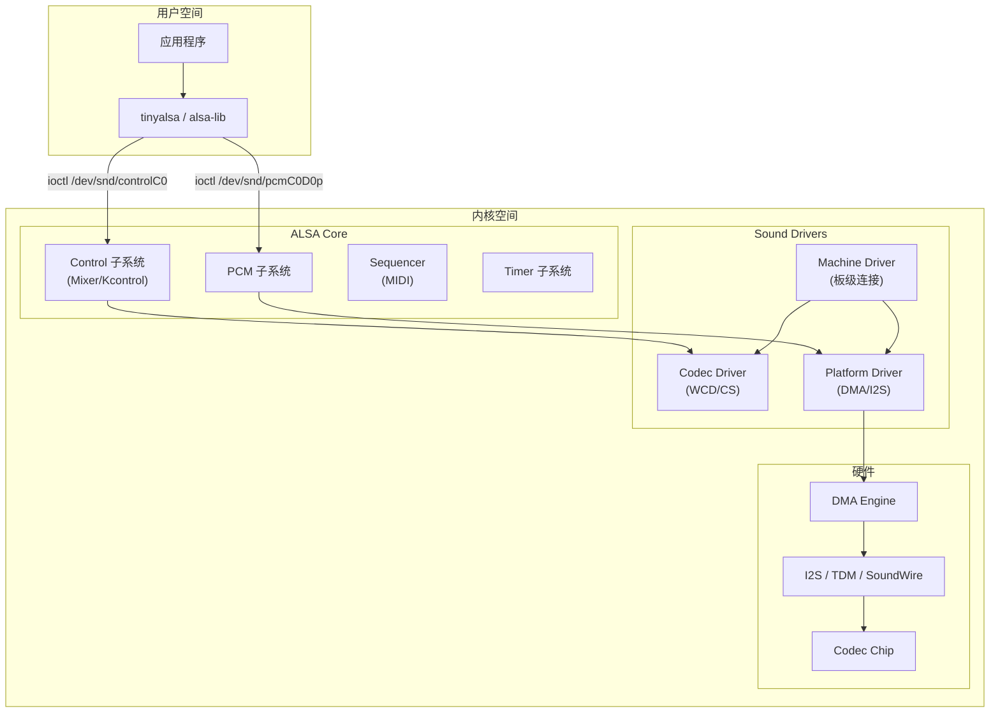
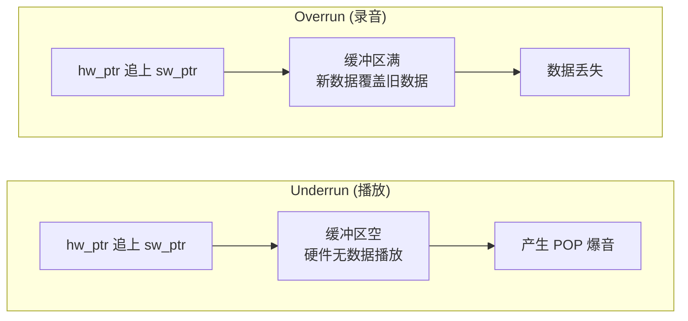
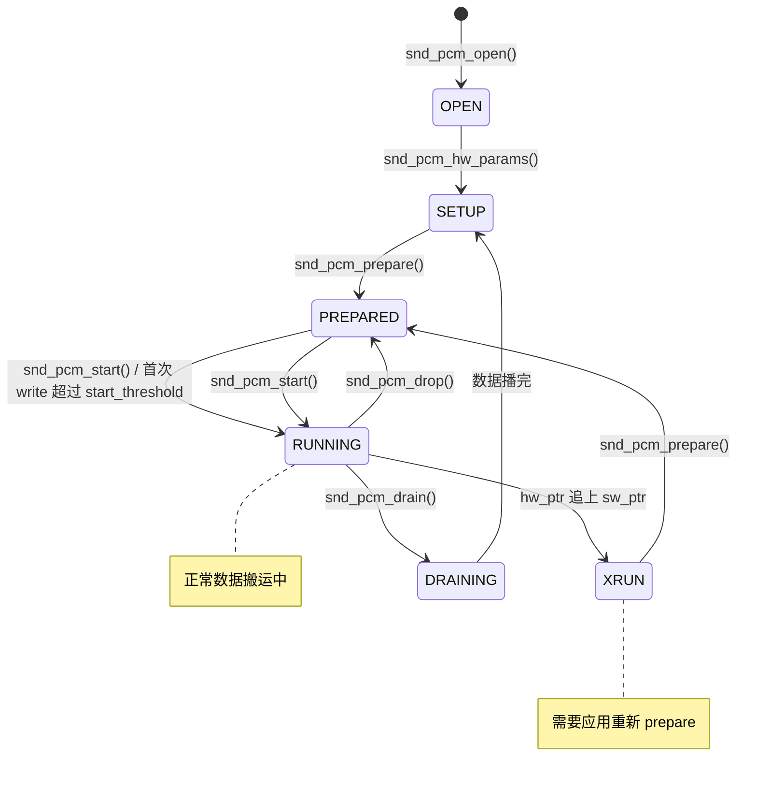
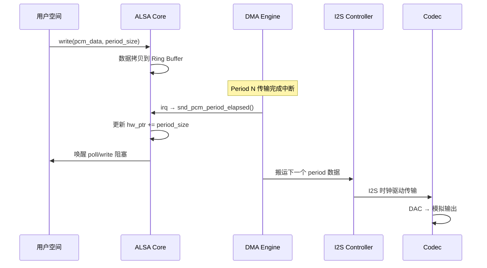

# ALSA 核心架构 (Advanced Linux Sound Architecture)

ALSA 是 Linux 内核中音频处理的核心子系统，为上层提供统一的 PCM 播放/录音、Mixer 控制和 MIDI 接口。Android 的 Audio HAL (tinyalsa) 最终也是调用 ALSA 内核接口完成数据传输。

---

## 1. ALSA 整体架构



### 1.1 设备节点

```bash
# ALSA 在 /dev/snd/ 下创建设备节点
ls /dev/snd/
  controlC0      # Card 0 的 Mixer 控制接口
  pcmC0D0p       # Card 0, Device 0, Playback
  pcmC0D0c       # Card 0, Device 0, Capture
  pcmC0D1p       # Card 0, Device 1, Playback
  timer          # 定时器设备

# 命名规则: pcmC{card}D{device}{p|c}
# card: 声卡编号
# device: PCM 设备编号 (一张声卡可有多个 PCM 设备)
# p/c: playback / capture
```

---

## 2. PCM 环形缓冲区机制

### 2.1 Ring Buffer 核心原理

```
Ring Buffer 结构 (播放方向):

   ┌───────────────────────────────────────────────────────┐
   │                    Buffer (N frames)                   │
   └───────────────────────────────────────────────────────┘
   ↑                              ↑                        ↑
   buffer_start               hw_ptr                   sw_ptr
   
   应用写入区域 (可写):  sw_ptr → buffer_end → buffer_start → hw_ptr
   硬件搬运区域 (待播):  hw_ptr → sw_ptr
   
   avail_min: 应用被唤醒前硬件需要空出的最小空间
   start_threshold: 开始播放需要的最少数据量

   buffer_size = period_size × period_count
   典型配置: period_size=1024, period_count=4 → buffer=4096 frames
```

### 2.2 双指针同步

| 指针 | 控制者 | 移动时机 | 含义 |
|:---|:---|:---|:---|
| **hw_ptr** | DMA 硬件中断 | 每搬完一个 period | "已经播出去的数据边界" |
| **sw_ptr (appl_ptr)** | 用户空间 write() | 应用写入数据后 | "已经写入的数据边界" |

### 2.3 Xrun 详解



**Xrun 根因分析**：

| 原因 | 表现 | 解决方案 |
|:---|:---|:---|
| Period 太小 | 中断过于频繁，CPU 来不及响应 | 增大 period_size |
| Buffer 太小 | 容错空间不够 | 增加 period_count |
| 调度延迟 | 应用被抢占 (CFS) | 使用 SCHED_FIFO / RT 优先级 |
| DMA 配置错误 | 硬件中断丢失 | 检查 DMA channel 配置 |
| CPU 频率太低 | 解码跟不上消耗 | 锁定 CPU 频率 |

---

## 3. PCM 状态机



---

## 4. hw_params 与 sw_params

### 4.1 hw_params (硬件参数)

hw_params 定义了硬件能力约束，一旦设置不可中途更改：

```c
struct snd_pcm_hw_params {
    // 关键参数:
    snd_pcm_format_t format;      // PCM_FORMAT_S16_LE, S24_LE, S32_LE
    unsigned int rate;             // 采样率: 8000, 16000, 44100, 48000, 96000
    unsigned int channels;         // 声道数: 1, 2, 4, 8...
    snd_pcm_uframes_t period_size; // 一个 period 的帧数
    unsigned int periods;          // period 个数 (buffer = period_size * periods)
    snd_pcm_access_t access;       // 访问模式 (见下表)
};
```

| Access 模式 | 说明 | 使用场景 |
|:---|:---|:---|
| `RW_INTERLEAVED` | read()/write() 交织模式 | 最常用，tinyalsa 默认 |
| `RW_NONINTERLEAVED` | 非交织 (分声道缓冲) | 多声道 DSP 处理 |
| `MMAP_INTERLEAVED` | mmap 直接映射 + 交织 | 低延迟 (AAudio MMAP) |
| `MMAP_NONINTERLEAVED` | mmap + 非交织 | 专业音频 |

### 4.2 sw_params (软件参数)

sw_params 控制 ALSA 运行时行为：

```c
struct snd_pcm_sw_params {
    snd_pcm_uframes_t avail_min;       // 唤醒阈值 (通常=period_size)
    snd_pcm_uframes_t start_threshold; // 自动启动阈值
    snd_pcm_uframes_t stop_threshold;  // 自动停止阈值 (=buffer_size 则 xrun 时停)
    snd_pcm_uframes_t silence_threshold; // 静音填充阈值
};
```

**延迟计算**：
```
硬件延迟 = period_size / sample_rate × period_count
示例: 1024 / 48000 × 4 = 85.3ms (总缓冲延迟)
单 period 延迟 = 1024 / 48000 = 21.3ms
```

---

## 5. DMA 传输机制

### 5.1 DMA 与 PCM 的关系



### 5.2 MMAP 模式 (零拷贝)

```
传统 RW 模式:
  用户空间 buffer → copy_from_user() → 内核 Ring Buffer → DMA → I2S
  (一次内存拷贝)

MMAP 模式:
  用户空间直接映射内核 Ring Buffer → DMA → I2S
  (零拷贝, 延迟更低)

Android AAudio MMAP 路径就是使用此模式:
  AudioTrack → SharedMemory (mmap) → ALSA MMAP → DMA → Codec
```

---

## 6. snd_pcm_ops 回调接口

每个 Platform Driver 必须实现的核心回调：

```c
// include/sound/pcm.h
struct snd_pcm_ops {
    int (*open)(struct snd_pcm_substream *substream);
    int (*close)(struct snd_pcm_substream *substream);
    int (*hw_params)(struct snd_pcm_substream *substream,
                     struct snd_pcm_hw_params *params);
    int (*hw_free)(struct snd_pcm_substream *substream);
    int (*prepare)(struct snd_pcm_substream *substream);
    int (*trigger)(struct snd_pcm_substream *substream, int cmd);
    snd_pcm_uframes_t (*pointer)(struct snd_pcm_substream *substream);
    int (*copy)(struct snd_pcm_substream *substream, int channel,
                unsigned long pos, void __user *buf, unsigned long bytes);
};
```

| 回调 | 时机 | 职责 |
|:---|:---|:---|
| `open` | 设备打开时 | 配置 runtime 能力约束 |
| `hw_params` | 参数协商完成 | 分配 DMA buffer |
| `prepare` | 每次 start 前 | 重置 DMA 描述符，清零计数器 |
| `trigger` | START/STOP 命令 | 启动/停止 DMA 传输 |
| `pointer` | 周期性查询 | 返回当前 hw_ptr (DMA 已搬运位置) |

---

## 7. 命令行实战

### 7.1 tinyalsa (Android/嵌入式常用)

```bash
# 播放 WAV
tinyplay /sdcard/test.wav -D 0 -d 0 -p 1024 -n 4
#  -D: card 编号
#  -d: device 编号
#  -p: period_size (frames)
#  -n: period_count

# 录音
tinycap /sdcard/rec.wav -D 0 -d 0 -r 48000 -b 16 -c 2 -p 1024 -n 4

# 查看所有 Kcontrol
tinymix -D 0

# 设置某个 Kcontrol
tinymix -D 0 "PRI_MI2S_RX Audio Mixer MultiMedia1" 1

# 查看 PCM 设备列表
cat /proc/asound/pcm
```

### 7.2 alsa-utils (标准 Linux)

```bash
# 列出声卡
aplay -l

# 播放 (指定硬件参数)
aplay -D hw:0,0 -f S16_LE -r 48000 -c 2 test.wav

# 录音
arecord -D hw:0,0 -f S16_LE -r 16000 -c 1 -d 10 rec.wav

# 查看硬件参数能力
cat /proc/asound/card0/pcm0p/sub0/hw_params

# 查看运行时状态
cat /proc/asound/card0/pcm0p/sub0/status
```

### 7.3 procfs 调试信息

```bash
# 查看所有声卡
cat /proc/asound/cards

# 查看 PCM 设备
cat /proc/asound/pcm

# 查看当前运行状态 (hw_ptr, sw_ptr, avail 等)
cat /proc/asound/card0/pcm0p/sub0/status
# state: RUNNING
# hw_ptr: 1234567
# appl_ptr: 1235000

# 查看硬件约束
cat /proc/asound/card0/pcm0p/sub0/hw_params
```

---

## 8. 延迟优化策略

| 策略 | 效果 | 风险 |
|:---|:---|:---|
| 减小 period_size | 降低单次延迟 | Xrun 概率增大 |
| 减少 period_count | 降低总缓冲延迟 | 容错空间减少 |
| 使用 MMAP 模式 | 消除拷贝延迟 | 需要驱动支持 |
| SCHED_FIFO 线程 | 减少调度抖动 | 影响系统公平性 |
| CPU affinity | 避免核迁移 | 限制调度灵活性 |
| 关闭 resampler | 消除 SRC 延迟 | 需硬件原生支持目标采样率 |

**Android 低延迟路径**：
```
FastTrack: period=128 frames @ 48kHz = 2.67ms/period
MMAP:      period=128 frames @ 48kHz, 零拷贝, 总延迟 < 10ms
Legacy:    period=960 frames @ 48kHz = 20ms/period
```

---

## 9. 关键参考 (References)

1.  [ALSA Project - PCM Interface](https://www.alsa-project.org/alsa-doc/alsa-lib/pcm.html)
2.  [Kernel.org: Writing an ALSA Driver](https://www.kernel.org/doc/html/latest/sound/kernel-api/writing-an-alsa-driver.html)
3.  [tinyalsa GitHub](https://github.com/tinyalsa/tinyalsa)
4.  *Linux Sound Subsystem* - Jaroslav Kysela
5.  [Android Audio MMAP Architecture](https://source.android.com/docs/core/audio/latency/design)
