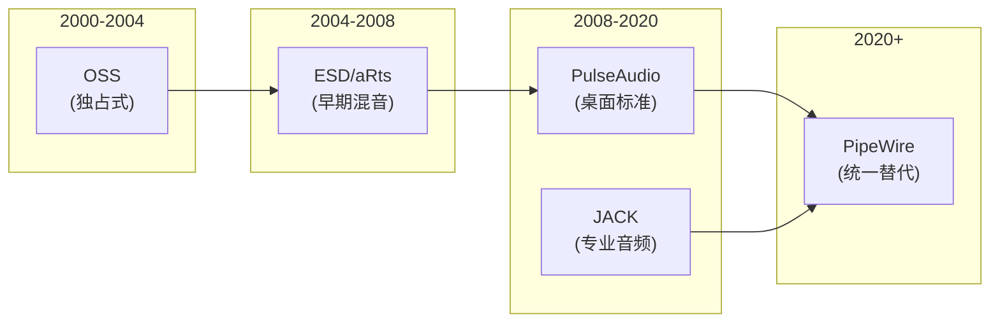
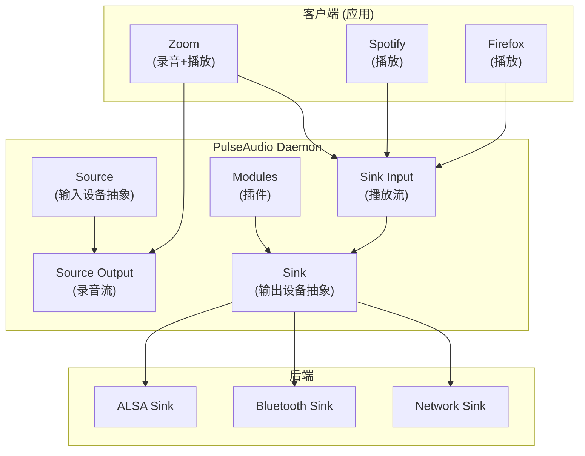
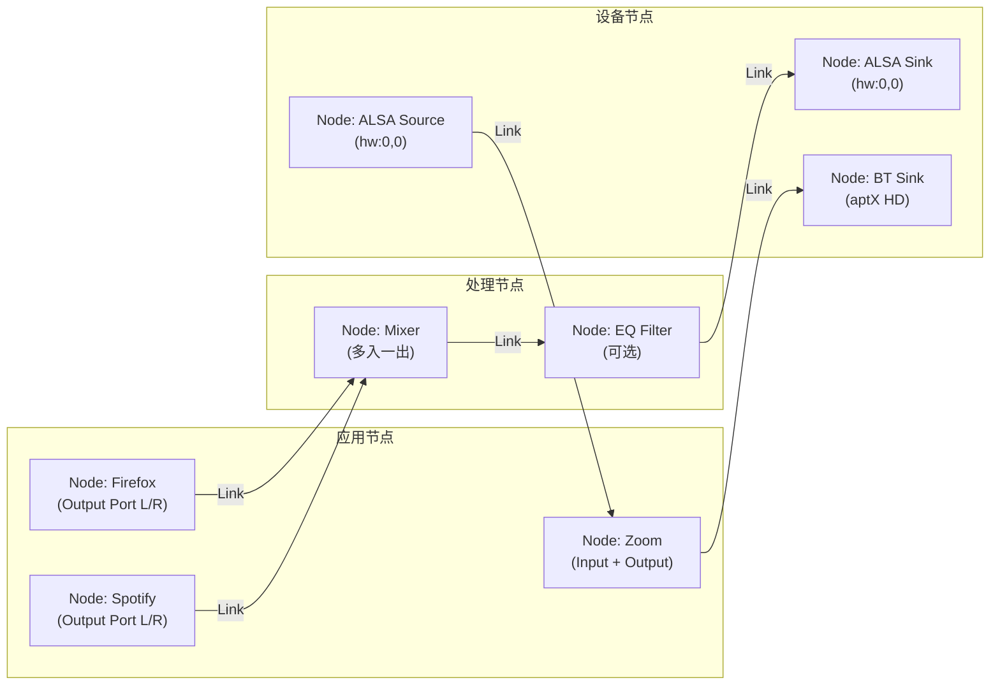

# 现代 Linux 音频服务 (PulseAudio & PipeWire)

在桌面 Linux 和嵌入式 Linux (非 Android) 系统中，应用通常不直接调用 ALSA，而是通过音频服务器（Sound Server）进行交互，以实现多应用混音、动态设备切换和策略管理。PipeWire 正在全面替代 PulseAudio 成为新标准。

---

## 1. Linux 音频服务器演进



---

## 2. PulseAudio 架构

### 2.1 核心概念



### 2.2 核心抽象

| 概念 | 说明 | 类比 |
|:---|:---|:---|
| **Sink** | 音频输出端点 (如扬声器) | Android 的 AudioDevice (output) |
| **Source** | 音频输入端点 (如麦克风) | Android 的 AudioDevice (input) |
| **Sink Input** | 连接到 Sink 的播放流 | Android 的 AudioTrack |
| **Source Output** | 从 Source 读取的录音流 | Android 的 AudioRecord |
| **Module** | 功能插件 (蓝牙/网络/混音) | Android 的 HAL module |
| **Card** | 物理声卡抽象 | ALSA card |

### 2.3 PulseAudio 局限性

| 局限 | 影响 | 详细说明 |
|:---|:---|:---|
| 延迟高 | 不适合实时音频 | 典型延迟 ~40-100ms (对比 JACK ~5ms) |
| 架构单一 | 不能处理视频 | 无法统一管理音视频流 |
| 代码复杂 | 维护困难 | 模块系统过度设计 |
| 安全模型弱 | 容器化困难 | 任何应用均可访问所有音频 |
| 蓝牙支持差 | 编解码受限 | 不支持 aptX/LDAC 等高级编码 |

---

## 3. PipeWire 架构

### 3.1 Graph-Based 处理模型

PipeWire 的核心创新是采用**图模型 (Graph)**，所有音频/视频流都是图中的节点 (Node) 和链接 (Link)：



### 3.2 核心组件

```
PipeWire 系统架构:
┌─────────────────────────────────────────────────────────────┐
│                     应用层                                    │
│  ┌──────────┐  ┌──────────┐  ┌──────────┐  ┌──────────┐   │
│  │PulseAudio│  │  JACK    │  │  ALSA    │  │ GStreamer │   │
│  │  Apps    │  │  Apps    │  │  Apps    │  │  Apps    │   │
│  └────┬─────┘  └────┬─────┘  └────┬─────┘  └────┬─────┘   │
│       │              │              │              │         │
│  ┌────▼─────┐  ┌────▼─────┐  ┌────▼─────┐       │         │
│  │pipewire- │  │pipewire- │  │pipewire- │       │         │
│  │pulse     │  │jack      │  │alsa      │       │         │
│  │(兼容层)  │  │(兼容层)  │  │(兼容层)  │       │         │
│  └────┬─────┘  └────┬─────┘  └────┬─────┘       │         │
├───────┼──────────────┼──────────────┼────────────┼─────────┤
│       └──────────────┴──────────────┴────────────┘         │
│                         │                                    │
│                  ┌──────▼──────┐                            │
│                  │  PipeWire   │                            │
│                  │   Daemon    │                            │
│                  └──────┬──────┘                            │
│                         │                                    │
│                  ┌──────▼──────┐                            │
│                  │ WirePlumber │  ← 策略/会话管理            │
│                  └──────┬──────┘                            │
├─────────────────────────┼───────────────────────────────────┤
│                  ┌──────▼──────┐                            │
│                  │ ALSA Kernel │                            │
│                  └─────────────┘                            │
└─────────────────────────────────────────────────────────────┘
```

### 3.3 WirePlumber (策略引擎)

WirePlumber 是 PipeWire 的**会话管理器**，负责决定"谁连接谁"：

| 职责 | 说明 |
|:---|:---|
| 设备发现 | 监听 ALSA/BT 设备热插拔 |
| 自动连接 | 新应用启动时自动连接到默认设备 |
| 路由策略 | 耳机插入时切换输出、优先级仲裁 |
| 权限控制 | Flatpak/Snap 沙盒应用的访问控制 |
| 配置管理 | Lua 脚本定义策略规则 |

```lua
-- WirePlumber 策略脚本示例 (Lua)
-- 当蓝牙耳机连接时，自动切换默认输出
rule = {
  matches = {{ "node.name", "matches", "bluez_output.*" }},
  apply_properties = {
    ["node.description"] = "Bluetooth Headphones",
    ["priority.session"] = 2000,  -- 高优先级
  },
}
```

### 3.4 Node / Port / Link 模型

```
PipeWire 核心数据模型:

  Node (节点): 一个音频处理单元
    ├── Port (端口): 节点的输入/输出接口
    │     ├── Direction: Input / Output
    │     ├── Format: F32LE, S16LE, S32LE...
    │     └── Channel: FL, FR, FC, LFE...
    └── Properties: 名称、优先级、media.class 等

  Link (链接): 连接两个 Port
    ├── Output Port → Input Port
    ├── 可自动协商格式
    └── 支持动态创建/销毁

  Graph (图): 所有 Node + Link 组成的有向图
    └── 每个处理周期，按拓扑序遍历并处理
```

---

## 4. 完整对比

| 特性 | PulseAudio | JACK | PipeWire |
|:---|:---|:---|:---|
| **定位** | 桌面通用 | 专业音频 | 统一替代 |
| **延迟** | 40-100ms | 2-5ms | 3-10ms |
| **混音** | 内置 | 无 (纯路由) | 内置 |
| **视频** | 不支持 | 不支持 | 原生支持 |
| **蓝牙** | 基本 (SBC/AAC) | 不支持 | 完整 (aptX/LDAC/LC3) |
| **容器化** | 弱 | 弱 | 原生 (Portal API) |
| **API 兼容** | 自有 | 自有 | 兼容 PA + JACK + ALSA |
| **策略引擎** | 内置 (modules) | 无 | WirePlumber (Lua) |
| **代码量** | ~200K 行 | ~80K 行 | ~100K 行 (+ WirePlumber) |
| **采用状态** | 逐步淘汰 | 专业领域 | Fedora 34+, Ubuntu 22.10+ |

---

## 5. 命令行工具

### 5.1 PipeWire 工具

```bash
# 查看所有节点
pw-cli list-objects

# 查看图拓扑 (节点+链接)
pw-dump

# 实时监控事件
pw-mon

# 查看当前图状态 (类似 pavucontrol)
pw-top

# 设置默认输出设备
wpctl set-default <node-id>

# 查看所有设备和流
wpctl status

# 调节音量
wpctl set-volume @DEFAULT_AUDIO_SINK@ 0.8

# 查看处理图性能 (量子大小/周期/延迟)
pw-metadata -n settings
```

### 5.2 PulseAudio 工具 (仍可通过兼容层使用)

```bash
# 列出所有 Sink
pactl list sinks short

# 列出所有播放流
pactl list sink-inputs

# 设置默认 Sink
pactl set-default-sink <sink-name>

# 移动流到其他设备 (动态路由)
pactl move-sink-input <stream-id> <sink-name>

# 查看详细信息
pactl info
```

### 5.3 JACK 工具 (通过 pipewire-jack)

```bash
# 列出端口
jack_lsp

# 连接两个端口
jack_connect <output-port> <input-port>

# 监控 xrun
jack_iodelay

# 查看延迟
jack_bufsize
```

---

## 6. PipeWire 量子与延迟

PipeWire 使用 **Quantum (量子)** 概念替代传统的 buffer/period：

```
Quantum = 一次图处理周期处理的采样帧数

默认配置:
  default.clock.quantum = 1024    (采样帧/周期)
  default.clock.min-quantum = 32  (最小量子)
  default.clock.max-quantum = 8192 (最大量子)
  default.clock.rate = 48000      (采样率)

延迟计算:
  处理延迟 = quantum / rate
  1024 / 48000 = 21.3ms (默认)
  256 / 48000 = 5.3ms (低延迟)
  64 / 48000 = 1.3ms (超低延迟, JACK 级)

配置文件: /etc/pipewire/pipewire.conf
```

---

## 7. 与 Android 的关系

| 维度 | Android | 桌面 Linux (PipeWire) |
|:---|:---|:---|
| 音频服务 | AudioFlinger + AudioPolicyService | PipeWire Daemon + WirePlumber |
| 混音 | AudioFlinger MixerThread | PipeWire Graph 内置混音 |
| 路由策略 | AudioPolicyManager (XML 配置) | WirePlumber (Lua 脚本) |
| HAL | Audio HAL (AIDL/HIDL) → tinyalsa | 直接 ALSA (无 HAL 层) |
| 蓝牙 | Fluoride/Gabeldorsche → A2DP HAL | BlueZ → pipewire-media-session |
| 低延迟 | AAudio MMAP | JACK 兼容 (quantum=64) |

---

## 8. 关键参考 (References)

1.  [PipeWire Official Documentation](https://docs.pipewire.org/)
2.  [WirePlumber Documentation](https://pipewire.pages.freedesktop.org/wireplumber/)
3.  [PipeWire Wiki](https://gitlab.freedesktop.org/pipewire/pipewire/-/wikis/home)
4.  [PulseAudio Documentation](https://www.freedesktop.org/wiki/Software/PulseAudio/)
5.  [JACK Audio Connection Kit](https://jackaudio.org/)
6.  [Linux Audio: PipeWire vs PulseAudio vs JACK](https://archive.fosdem.org/2021/schedule/event/pipewire/)

---
*Next Module: [06. 车载音频系统 (Automotive Audio System)](../06-Automotive-Audio/README.md)*
