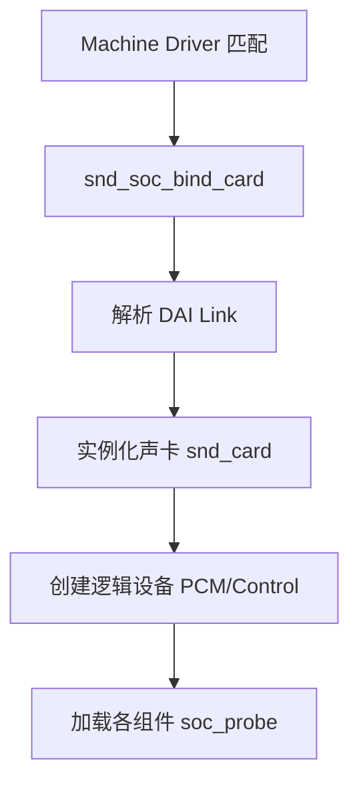

# ALSA 声卡注册与实例化 (Card Registration)

在 Linux 嵌入式系统中，声卡的注册遵循 ASoC (ALSA System on Chip) 框架的自底向上原则。本章解析声卡从底层驱动匹配到逻辑设备创建的全过程。

---

## 1. 核心流程：自底向上

声卡的生命周期起始于 **Machine Driver** 的加载。它像粘合剂一样将 Platform (SoC) 和 Codec 连接起来。



---

## 2. 关键函数解析：`snd_soc_bind_card`

这是 ASoC 核心层最核心的函数，负责将 CPU、Codec 和 Platform 三者绑定在一起。

### 2.1 功能拆解
1.  **DAI Link 绑定**：遍历 `snd_soc_dai_link` 结构体，寻找匹配的 CPU DAI 和 Codec DAI。
2.  **创建声卡实例**：调用 `snd_card_new` 创建内核声卡结构。
3.  **创建逻辑设备**：
    *   `soc_new_pcm()`：创建 `/dev/snd/pcmCxDx` 节点。
    *   `snd_ctl_create()`：创建 `/dev/snd/controlCx` 节点。

---

## 3. 什么是 DAI Link？

`DAI Link` 定义了音频数据流的通路。在现代 DPCM 架构中，分为 **FE (Front-End)** 和 **BE (Back-End)**：

*   **FE DAI Link**：连接 CPU 与 DSP。它暴露 PCM 节点供用户空间访问。
*   **BE DAI Link**：连接 DSP 与外部 Codec。它负责物理接口（I2S, TDM）的硬件配置，通常不直接暴露 PCM 节点。

---

## 4. 驱动注册示例 (C 代码)

```c
// 定义一个简单的 DAI Link
static struct snd_soc_dai_link my_card_dai[] = {
    {
        .name = "Primary",
        .stream_name = "Primary",
        .cpu_dai_name = "soc-i2s.0",
        .codec_dai_name = "wm8960-hifi",
        .platform_name = "soc-audio.0",
        .codec_name = "wm8960.0-001a",
        .dai_fmt = SND_SOC_DAIFMT_I2S | SND_SOC_DAIFMT_NB_NF,
    },
};
```

---

## 5. 调试实战：查看声卡信息

在开发板上，通过以下方式验证声卡是否注册成功：

```bash
# 查看所有声卡
cat /proc/asound/cards

# 查看声卡内的 PCM 设备
cat /proc/asound/pcm

# 查看 ASoC 组件状态 (需开启 DebugFS)
ls /sys/kernel/debug/asoc/
```

---
*下一模块：[06. 车载音频系统 (Automotive Audio)](../06-Automotive-Audio/README.md)*
