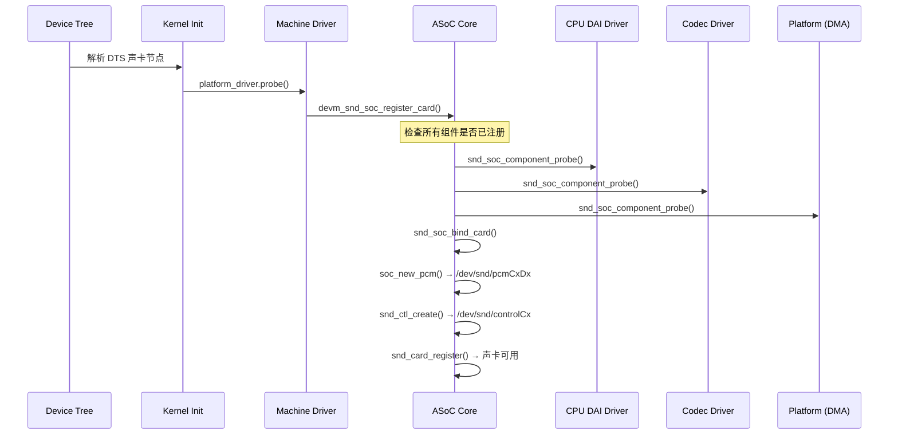
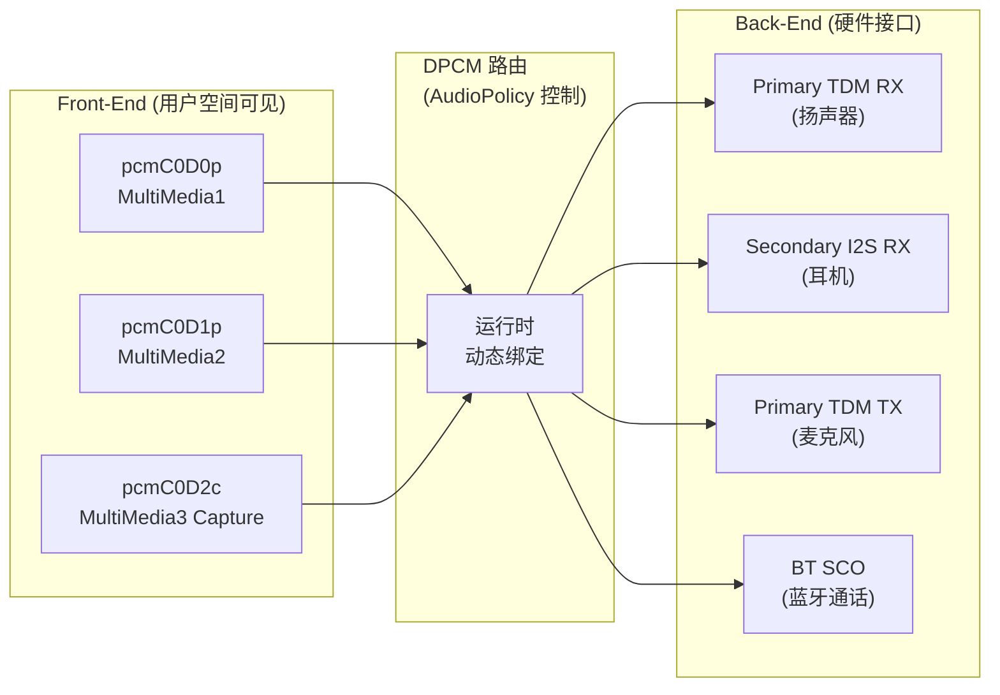
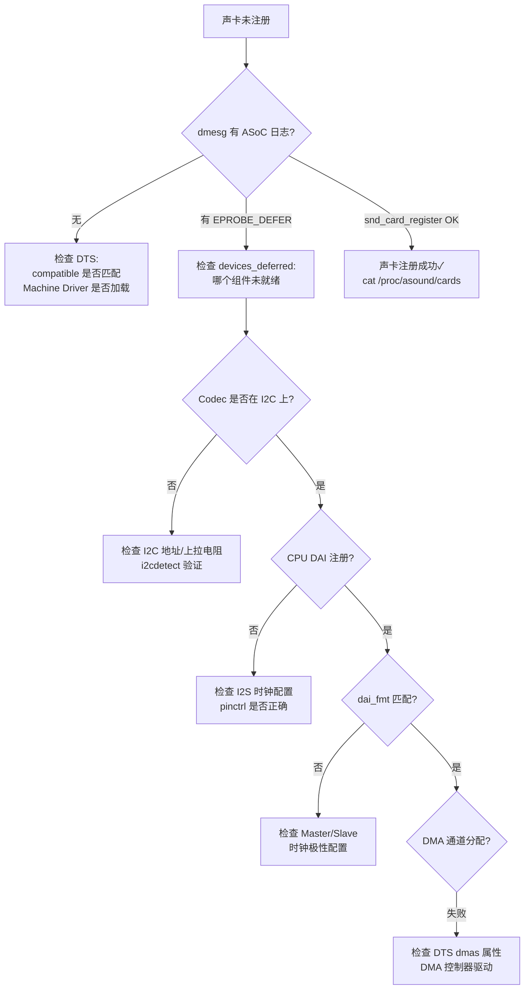

# ALSA 声卡注册与实例化 (Card Registration)

在 Linux 嵌入式系统中，声卡的注册遵循 ASoC (ALSA System on Chip) 框架的组件延迟绑定原则。本章解析声卡从 Device Tree 匹配、组件探测 (probe)、DAI Link 绑定到逻辑设备创建的全过程，并覆盖常见注册失败的排查方法。

---

## 1. 声卡注册全流程

### 1.1 时序总览



### 1.2 三大驱动的注册时序

```
声卡注册的前提: 三大组件都必须先注册到 ASoC Core

  1. CPU DAI Driver    (I2S/TDM 控制器)    → snd_soc_register_component()
  2. Codec Driver      (Codec 芯片驱动)    → snd_soc_register_component()
  3. Platform Driver   (DMA 引擎)          → snd_soc_register_component()
  
  三者注册顺序不确定 (由内核模块加载顺序决定)
  → ASoC Core 使用「延迟绑定」机制:
    任何一个组件注册后, 都会尝试 snd_soc_bind_card()
    只有当所有组件都就绪时, 绑定才会成功
    如果缺少组件 → 返回 -EPROBE_DEFER (稍后重试)
```

---

## 2. Machine Driver 详解

### 2.1 Machine Driver 的角色

```
Machine Driver = 声卡的「粘合剂」

  它不控制任何硬件, 只定义:
    ├── 声卡名称
    ├── DAI Link (哪个 CPU DAI 连接哪个 Codec DAI)
    ├── DAI 格式 (I2S/TDM, Master/Slave, 时钟极性)
    ├── DAPM 外部路由 (板级连接: 哪个 Codec 引脚接了扬声器)
    └── 初始化回调 (init: 设置默认音量/路由)
```

### 2.2 完整 Machine Driver 示例

```c
// Board-specific Machine Driver
#include <sound/soc.h>

// DAI Link 初始化回调
static int my_board_init(struct snd_soc_pcm_runtime *rtd) {
    struct snd_soc_component *codec = asoc_rtd_to_codec(rtd, 0)->component;
    
    // 设置默认路由: 使能扬声器输出
    snd_soc_dapm_enable_pin(&codec->dapm, "Speaker");
    snd_soc_dapm_disable_pin(&codec->dapm, "Headphone");
    snd_soc_dapm_sync(&codec->dapm);
    
    return 0;
}

// 板级 DAPM Widget (外部器件)
static const struct snd_soc_dapm_widget board_widgets[] = {
    SND_SOC_DAPM_SPK("External Speaker", NULL),
    SND_SOC_DAPM_MIC("Onboard Mic", NULL),
    SND_SOC_DAPM_HP("Headphone Jack", NULL),
};

// 板级路由 (Codec 引脚 → 板级器件)
static const struct snd_soc_dapm_route board_routes[] = {
    { "External Speaker", NULL, "SPKOUT" },  // Codec SPKOUT → 板上扬声器
    { "MIC1P",            NULL, "Onboard Mic" },
    { "Headphone Jack",   NULL, "HPOUTL" },
    { "Headphone Jack",   NULL, "HPOUTR" },
};

// DAI Link 定义
SND_SOC_DAILINK_DEFS(hifi,
    DAILINK_COMP_ARRAY(COMP_CPU("soc-i2s.0")),
    DAILINK_COMP_ARRAY(COMP_CODEC("wm8960.0-001a", "wm8960-hifi")),
    DAILINK_COMP_ARRAY(COMP_PLATFORM("soc-audio.0")));

static struct snd_soc_dai_link my_board_dai_links[] = {
    {
        .name        = "HiFi",
        .stream_name = "HiFi Playback/Capture",
        .init        = my_board_init,
        .dai_fmt     = SND_SOC_DAIFMT_I2S
                     | SND_SOC_DAIFMT_NB_NF
                     | SND_SOC_DAIFMT_CBP_CFP,
        SND_SOC_DAILINK_REG(hifi),
    },
};

// 声卡定义
static struct snd_soc_card my_board_card = {
    .name            = "my-board-sound",
    .owner           = THIS_MODULE,
    .dai_link        = my_board_dai_links,
    .num_links       = ARRAY_SIZE(my_board_dai_links),
    .dapm_widgets    = board_widgets,
    .num_dapm_widgets = ARRAY_SIZE(board_widgets),
    .dapm_routes     = board_routes,
    .num_dapm_routes  = ARRAY_SIZE(board_routes),
};

// Platform driver probe
static int my_board_probe(struct platform_device *pdev) {
    my_board_card.dev = &pdev->dev;
    return devm_snd_soc_register_card(&pdev->dev, &my_board_card);
}

static const struct of_device_id my_board_of_match[] = {
    { .compatible = "myvendor,my-board-audio" },
    {},
};

static struct platform_driver my_board_driver = {
    .driver = {
        .name = "my-board-audio",
        .of_match_table = my_board_of_match,
    },
    .probe = my_board_probe,
};
module_platform_driver(my_board_driver);
```

---

## 3. DAI Link 与 DPCM

### 3.1 传统 DAI Link vs DPCM

| 特性 | 传统 DAI Link | DPCM |
|:---|:---|:---|
| FE/BE 分离 | 否 (1:1 映射) | 是 (M:N 映射) |
| 动态路由 | 不支持 | 运行时切换 BE |
| PCM 节点 | 每个 Link 一个 | 仅 FE 暴露节点 |
| 适用平台 | 简单 SoC | 高通/联发科等复杂 SoC |

### 3.2 DPCM 声卡的 DAI Link 定义

```c
// 高通平台 DPCM 风格 DAI Link (简化)
static struct snd_soc_dai_link msm_dai_links[] = {
    // ===== Front-End DAI Links =====
    {
        .name     = "MultiMedia1 Playback",
        .stream_name = "MultiMedia1",
        .dynamic = 1,           // 标记为 FE
        .dpcm_playback = 1,
        .trigger = { SND_SOC_DPCM_TRIGGER_POST,
                     SND_SOC_DPCM_TRIGGER_POST },
        SND_SOC_DAILINK_REG(mm1),
    },
    {
        .name     = "MultiMedia2 Capture",
        .stream_name = "MultiMedia2",
        .dynamic = 1,
        .dpcm_capture = 1,
        SND_SOC_DAILINK_REG(mm2),
    },
    
    // ===== Back-End DAI Links =====
    {
        .name     = "Primary TDM RX",
        .no_pcm   = 1,         // 标记为 BE (不暴露 PCM 节点)
        .dpcm_playback = 1,
        .dai_fmt  = SND_SOC_DAIFMT_DSP_B | SND_SOC_DAIFMT_NB_NF,
        SND_SOC_DAILINK_REG(pri_tdm_rx),
    },
    {
        .name     = "Primary TDM TX",
        .no_pcm   = 1,
        .dpcm_capture = 1,
        SND_SOC_DAILINK_REG(pri_tdm_tx),
    },
};
```

### 3.3 FE-BE 路由映射



---

## 4. `snd_soc_bind_card` 内部流程

```
snd_soc_bind_card() 详细步骤:

  1. snd_soc_instantiate_card()
     ├── 遍历所有 dai_link
     │   ├── 查找匹配的 CPU component
     │   ├── 查找匹配的 Codec component
     │   └── 查找匹配的 Platform component
     │       → 任何一个找不到 → return -EPROBE_DEFER
     │
     ├── snd_card_new()
     │   → 分配 struct snd_card (ALSA 核心结构)
     │   → 创建 /dev/snd/controlCx
     │
     ├── 遍历每个 dai_link:
     │   ├── soc_new_pcm()
     │   │   → 创建 /dev/snd/pcmCxDxp (playback)
     │   │   → 创建 /dev/snd/pcmCxDxc (capture)
     │   │
     │   ├── snd_soc_dai_link_event() → 设置 DAI 格式
     │   └── dai_link.init() → 执行板级初始化回调
     │
     ├── snd_soc_dapm_new_controls() → 注册所有 DAPM Widget
     ├── snd_soc_dapm_add_routes() → 注册所有 DAPM 路由
     │
     └── snd_card_register()
         → 声卡正式可用
         → /proc/asound/cards 中可见
```

---

## 5. 设备节点映射

### 5.1 /dev/snd/ 设备节点

```
声卡注册后创建的设备节点:

  /dev/snd/
    ├── controlC0         (Mixer 控制接口)
    ├── pcmC0D0p          (Card 0, Device 0, Playback)
    ├── pcmC0D0c          (Card 0, Device 0, Capture)
    ├── pcmC0D1p          (Card 0, Device 1, Playback)
    ├── pcmC0D2c          (Card 0, Device 2, Capture)
    ├── timer             (ALSA 定时器)
    └── seq               (MIDI 音序器, 如启用)

  命名规则: pcmC{card}D{device}{direction}
    card:   声卡编号 (0, 1, 2...)
    device: DAI Link 编号 (对应 dai_link 数组索引)
    direction: p=playback, c=capture
```

### 5.2 /proc/asound/ 信息

```bash
# 声卡列表
cat /proc/asound/cards
#  0 [mysoundcard   ]: my-board-sound - my-board-sound
#                       my-board-sound

# PCM 设备列表
cat /proc/asound/pcm
# 00-00: HiFi wm8960-hifi-0 : : playback 1 : capture 1
# 00-01: Voice bt-sco-0 : : playback 1 : capture 1

# PCM 运行时参数
cat /proc/asound/card0/pcm0p/sub0/hw_params
# access: MMAP_INTERLEAVED
# format: S16_LE
# channels: 2
# rate: 48000
# period_size: 240
# buffer_size: 960
```

---

## 6. 多声卡场景

### 6.1 Android 多声卡

```
Android 典型多声卡配置:

  Card 0: Primary Sound Card (SoC 内置 Codec)
    ├── pcmC0D0p: Deep Buffer Playback
    ├── pcmC0D1p: Low Latency Playback
    ├── pcmC0D2p: Compressed Offload
    ├── pcmC0D3c: Primary Capture
    └── pcmC0D4p: HDMI Playback

  Card 1: USB Audio (动态)
    ├── pcmC1D0p: USB Playback
    └── pcmC1D0c: USB Capture

  Card 2: A2B Audio (车载)
    ├── pcmC2D0p: TDM Playback (多通道扬声器)
    └── pcmC2D1c: TDM Capture (麦克风阵列)
```

### 6.2 声卡编号与固定

```bash
# 声卡编号默认按注册顺序分配
# 问题: USB 设备热插拔会导致编号变化

# 解决方案1: udev 规则固定 card 编号
# /etc/udev/rules.d/85-audio.rules
SUBSYSTEM=="sound", ATTR{id}=="mysoundcard", ATTR{number}="0"

# 解决方案2: 模块参数
# /etc/modprobe.d/alsa.conf
options snd-usb-audio index=1

# Android 方案: audio_policy_configuration.xml 中使用 card name
# <module name="primary" halVersion="3.0">
#   <attachedDevices> ... </attachedDevices>
# </module>
```

---

## 7. 注册失败排查

### 7.1 常见失败原因

| 错误信息 | 原因 | 解决 |
|:---|:---|:---|
| `EPROBE_DEFER` | 组件未就绪 (Codec/I2S 驱动未加载) | 检查组件驱动加载顺序 / DTS 依赖 |
| `No CPU DAI found` | CPU DAI 名称不匹配 | 检查 DTS `sound-dai` 引用 |
| `No Codec DAI found` | Codec 驱动未注册 | 检查 I2C 通信 / Codec 驱动 probe |
| `Invalid dai_fmt` | DAI 格式配置错误 | 检查 Master/Slave / 时钟极性 |
| `Failed to create PCM` | 资源不足 / 参数冲突 | 检查 DMA 通道分配 |

### 7.2 排查命令

```bash
# 查看组件注册状态
cat /sys/kernel/debug/asoc/components
# 输出所有已注册的 ASoC 组件

# 查看延迟探测 (deferred probe) 列表
cat /sys/kernel/debug/devices_deferred
# 列出所有因依赖未满足而推迟的设备

# 查看声卡注册日志
dmesg | grep -E "snd|asoc|codec|i2s|sound"

# 查看 I2C 设备是否检测到 Codec
cat /sys/bus/i2c/devices/*/name | grep -i codec
# 或
i2cdetect -y 1

# 查看 DAPM 状态
cat /sys/kernel/debug/asoc/*/dapm_widgets
```

### 7.3 典型排查流程



---

## 8. 关键参考 (References)

1.  [Linux Kernel: ASoC Machine Driver](https://www.kernel.org/doc/html/latest/sound/soc/machine.html)
2.  [Linux Kernel: DPCM](https://www.kernel.org/doc/html/latest/sound/soc/dpcm.html)
3.  [Linux Kernel: DAPM](https://www.kernel.org/doc/html/latest/sound/soc/dapm.html)
4.  [Device Tree Bindings: simple-audio-card](https://www.kernel.org/doc/Documentation/devicetree/bindings/sound/simple-card.txt)
5.  [ALSA Project - ASoC](https://www.alsa-project.org/wiki/ASoC)

---
*下一模块：[06. 车载音频系统 (Automotive Audio)](../06-Automotive-Audio/README.md)*
