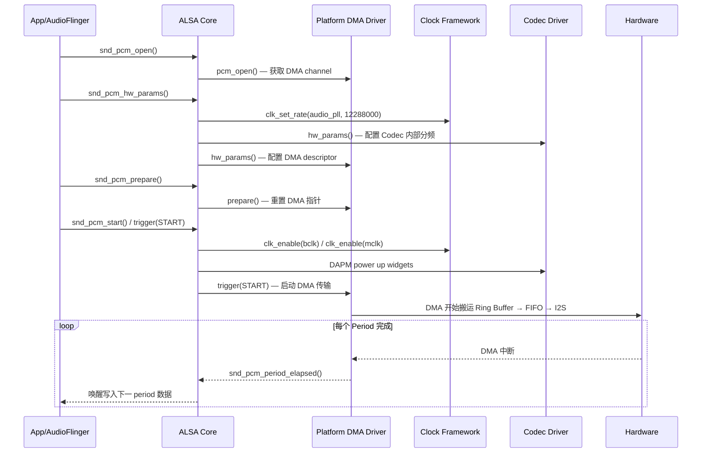

# 音频时钟与 DMA 传输 (Audio Clock & DMA Engine)

音频系统对时序精度要求极高——时钟抖动直接导致底噪和失真，DMA 传输效率决定了延迟和功耗。本章深入解析 Linux 内核中音频相关的时钟树管理、DMA Engine 框架以及 regmap 寄存器访问机制。

---

## 1. 音频时钟体系

### 1.1 时钟树全景

```
典型 SoC 音频时钟拓扑 (以高通/MTK 为例):

  ┌─────────────────────────────────────────────────────────┐
  │ 晶振 (XO / TCXO)                                       │
  │   19.2 MHz / 26 MHz                                     │
  └────────────┬────────────────────────────────────────────┘
               ▼
  ┌─────────────────────────────────────────────────────────┐
  │ Audio PLL (Phase-Locked Loop)                           │
  │   锁定到精确音频基频:                                    │
  │   - 44.1 kHz 家族: PLL → 11.2896 MHz (× 256)           │
  │   - 48 kHz 家族:   PLL → 12.288 MHz (× 256)            │
  │                                                         │
  │   Fractional-N PLL: 支持任意倍频, 但增加 jitter          │
  │   Integer-N PLL:    抖动更低, 但只支持整数倍频            │
  └────────────┬────────────────────────────────────────────┘
               ▼
  ┌─────────────────────────────────────────────────────────┐
  │ Clock Dividers / Mux                                    │
  │   ├── MCLK (Master Clock) → 外部 Codec                  │
  │   ├── BCLK (Bit Clock) = SampleRate × BitDepth × Channels│
  │   ├── LRCLK/FSYNC (Frame Sync) = SampleRate             │
  │   └── Internal DMA Clock                                │
  └─────────────────────────────────────────────────────────┘

关键约束:
  BCLK = Fs × Bits × Channels
  例: 48000 × 32 × 2 = 3.072 MHz (I2S Stereo)
  例: 48000 × 32 × 8 = 12.288 MHz (TDM 8-channel)
  MCLK 通常为 BCLK 的 2× 或 4× (Codec 内部 PLL 需要)
```

### 1.2 两大时钟家族

| 家族 | 基频 | 派生采样率 | 典型场景 |
|:---|:---|:---|:---|
| **48 kHz** | 12.288 MHz | 8/16/24/32/48/96/192 kHz | 通话、蓝牙、系统音、影视 |
| **44.1 kHz** | 11.2896 MHz | 11.025/22.05/44.1/88.2/176.4 kHz | CD 音质、HiFi 音乐 |

**跨家族切换问题**：当 48→44.1 kHz 切换时，PLL 需要重新锁定，可能产生 pop/click。解决方案：
- **双 PLL**：两个 PLL 分别锁定两家族，切换时 mux 选择（高端方案）
- **Fractional-N PLL**：单 PLL 支持任意频率，但 jitter 略高
- **SRC (Sample Rate Converter)**：固定 PLL，软件做重采样（最常用）

### 1.3 Linux CCF (Common Clock Framework) 中的音频时钟

```c
// 典型 Machine Driver 中的时钟配置
static int machine_hw_params(struct snd_pcm_substream *substream,
                             struct snd_pcm_hw_params *params)
{
    struct snd_soc_pcm_runtime *rtd = substream->private_data;
    struct snd_soc_dai *codec_dai = asoc_rtd_to_codec(rtd, 0);
    struct snd_soc_dai *cpu_dai = asoc_rtd_to_cpu(rtd, 0);
    unsigned int rate = params_rate(params);
    unsigned int mclk;

    // 根据采样率家族选择 MCLK
    if (rate % 8000 == 0)
        mclk = 12288000;  // 48k 家族
    else
        mclk = 11289600;  // 44.1k 家族

    // 设置 CPU DAI 的 sysclk (通常连接到 PLL)
    snd_soc_dai_set_sysclk(cpu_dai, 0, mclk, SND_SOC_CLOCK_OUT);

    // 设置 Codec DAI 的 MCLK 来源
    snd_soc_dai_set_sysclk(codec_dai, 0, mclk, SND_SOC_CLOCK_IN);

    // 对于 TDM: 设置 BCLK 分频比
    // BCLK = MCLK / bclk_ratio  或由 PLL 独立生成
    snd_soc_dai_set_bclk_ratio(cpu_dai, 64);  // 32bit × 2ch = 64

    return 0;
}
```

### 1.4 时钟问题排查

```bash
# 查看时钟树
cat /sys/kernel/debug/clk/clk_summary | grep -i audio

# 典型输出:
#    audio_core_lpass_clk   1   1   19200000   0
#    audio_pll0             1   1   11289600   0
#    audio_pll1             1   1   12288000   0
#    lpaif_pri_clk_src      1   1   12288000   0
#    lpaif_sec_clk_src      0   0          0   0

# 确认 BCLK 频率是否正确
cat /sys/kernel/debug/clk/lpaif_pri_clk_src/clk_rate

# 常见问题:
# 1. 时钟未使能 → 无声 (HAL write 成功但硬件无输出)
# 2. 频率错误 → 音频变速 (快或慢)
# 3. PLL 未锁定 → 底噪/失真 (jitter 过大)
# 4. 跨家族 glitch → 切歌时 pop 音
```

---

## 2. DMA Engine 与音频数据传输

### 2.1 为什么音频需要 DMA

```
无 DMA (PIO 模式):
  CPU 每个 period 中断 → memcpy 数据到 FIFO → CPU 占用率高, 延迟不稳定

有 DMA:
  CPU 配置 DMA 描述符 → DMA Engine 自动搬运 → period 结束中断通知
  CPU 仅在中断时唤醒更新指针, 其余时间可 idle/sleep

  ┌─────────┐    DMA     ┌──────────┐   I2S/TDM   ┌────────┐
  │  DRAM   │ ────────→  │ DMA FIFO │  ────────→   │ Codec  │
  │(Ring Buf)│  自动搬运  │ (LPAIF)  │  串行移位    │        │
  └─────────┘            └──────────┘              └────────┘
       ↑                       │
  period 完成中断          硬件自动从 FIFO 取数据
       │
  snd_pcm_period_elapsed()
  → 唤醒 ALSA 用户空间 / AudioFlinger
```

### 2.2 环形 DMA Buffer 架构

```
ALSA DMA Buffer 结构:

  buffer_size = period_size × period_count

  ┌────────┬────────┬────────┬────────┐
  │Period 0│Period 1│Period 2│Period 3│  (ring buffer in DRAM)
  └────┬───┴────┬───┴────┬───┴────┬───┘
       │        │        │        │
       ▼        ▼        ▼        ▼
  DMA Descriptor Chain (循环链表):
  desc[0] → desc[1] → desc[2] → desc[3] → desc[0] (回环)
  
  每个 descriptor:
    - src_addr:  物理地址 (buffer + period_offset)
    - dst_addr:  LPAIF FIFO 寄存器地址
    - length:    period_size_bytes
    - next:      下一个 descriptor
    - interrupt: period 完成时触发中断

延迟关系:
  硬件延迟 = buffer_size / (sample_rate × frame_size)
  例: 1920 frames / 48000 Hz = 40ms (4 periods × 10ms)
  
  period 越小 → 延迟越低, 但中断越频繁 → 功耗越高
  典型配置:
    低延迟 (游戏/通话): period = 2-5ms, count = 2-4
    普通播放:           period = 10-20ms, count = 2-4
    Deep buffer:        period = 40-96ms, count = 2
```

### 2.3 Linux DMA Engine API

```c
// Platform Driver 中的 DMA 配置 (简化)
// 文件: sound/soc/xxx/xxx-pcm-dma.c

#include <linux/dmaengine.h>
#include <sound/dmaengine_pcm.h>

// 方法1: 使用 ASoC 通用 DMA PCM 框架 (推荐)
static int platform_probe(struct platform_device *pdev)
{
    // 自动处理 DMA channel 获取、buffer 分配、中断回调
    return devm_snd_dmaengine_pcm_register(&pdev->dev,
                                            NULL,  // 使用默认配置
                                            0);    // flags
}

// 方法2: 手动管理 DMA (需要精细控制时)
static int pcm_open(struct snd_soc_component *component,
                    struct snd_pcm_substream *substream)
{
    struct dma_chan *chan;
    
    // 从 Device Tree 获取 DMA channel
    chan = dma_request_chan(dev, "rx");  // 或 "tx"
    if (IS_ERR(chan))
        return PTR_ERR(chan);
    
    // 配置 DMA slave
    struct dma_slave_config config = {
        .direction = DMA_MEM_TO_DEV,       // 播放
        .dst_addr = fifo_phys_addr,        // LPAIF FIFO 物理地址
        .dst_addr_width = DMA_SLAVE_BUSWIDTH_4_BYTES,
        .dst_maxburst = 16,                // FIFO burst 深度
    };
    dmaengine_slave_config(chan, &config);
    
    return 0;
}

// period 完成回调
static void dma_callback(void *data)
{
    struct snd_pcm_substream *substream = data;
    snd_pcm_period_elapsed(substream);  // 通知 ALSA core
}
```

### 2.4 Device Tree 中的 DMA 配置

```dts
// 典型音频 DMA 节点 (以高通 LPAIF 为例)
lpass_audio: audio@3400000 {
    compatible = "qcom,sa8295-lpass-audio";
    reg = <0x0 0x03400000 0x0 0x100000>;
    
    // DMA channel 定义
    dmas = <&lpass_dma 0>,   /* Primary TDM RX (播放) */
           <&lpass_dma 1>,   /* Primary TDM TX (录音) */
           <&lpass_dma 2>,   /* Secondary TDM RX */
           <&lpass_dma 3>;   /* Secondary TDM TX */
    dma-names = "rx0", "tx0", "rx1", "tx1";
    
    // 时钟引用
    clocks = <&lpass_clk LPASS_CLK_ID_PRI_TDM_IBIT>,
             <&lpass_clk LPASS_CLK_ID_PRI_TDM_EBIT>;
    clock-names = "ibit", "ebit";
};

// DMA Controller 节点
lpass_dma: dma-controller@3440000 {
    compatible = "qcom,sa8295-lpass-wsa-dma";
    reg = <0x0 0x03440000 0x0 0x30000>;
    #dma-cells = <1>;
    interrupts = <GIC_SPI 160 IRQ_TYPE_LEVEL_HIGH>;
    
    // DMA channel 数量
    qcom,dma-channels = <8>;
    qcom,dma-channel-mask = <0xFF>;
};
```

### 2.5 DMA 问题排查

| 症状 | 可能原因 | 排查命令 |
|:---|:---|:---|
| 无声且无 DMA 中断 | DMA channel 未获取 / 时钟未使能 | `cat /proc/interrupts \| grep lpass` |
| 周期性爆音 (pop) | period 完成中断丢失 / buffer underrun | `cat /proc/asound/card0/pcm0p/sub0/status` |
| 音频变速 | BCLK/LRCLK 频率配置错误 | 逻辑分析仪抓 I2S 时序 |
| 单次播放后卡住 | DMA 描述符未配置为循环模式 | `dmesg \| grep dma` |
| 通道错乱 | TDM slot mapping 错误 | 检查 DTS `qcom,tdm-slot-mapping` |

```bash
# 查看 DMA channel 分配状态
cat /sys/kernel/debug/dmaengine/summary

# 查看 ALSA PCM 运行状态
cat /proc/asound/card0/pcm0p/sub0/hw_params
# 输出: rate=48000, channels=2, format=S24_LE, period_size=240, buffer_size=960

# 查看中断统计 (确认 DMA 中断在递增)
watch -n 1 'cat /proc/interrupts | grep lpass'
```

---

## 3. Regmap 与音频寄存器访问

### 3.1 为什么音频驱动使用 regmap

```
传统方式 vs Regmap:

  传统:
    codec->write(codec, REG_ADDR, value);   // 每个 Codec 自己实现 I/O
    问题: 代码重复, 无缓存, 无调试接口, 总线差异需逐一适配

  Regmap:
    regmap_write(map, REG_ADDR, value);     // 统一抽象
    优势:
    ✓ 总线透明: I2C / SPI / MMIO 用同一 API
    ✓ 寄存器缓存: 减少物理 I/O, 加速 suspend/resume
    ✓ 读写回调: 自动处理大小端、寄存器宽度
    ✓ debugfs 接口: 运行时读写寄存器
    ✓ 脏页追踪: resume 时仅回写修改过的寄存器
```

### 3.2 音频 Codec 驱动中的 regmap 使用

```c
// 以 WCD938x Codec 为例 (SoundWire 总线)
static const struct regmap_config wcd938x_regmap_config = {
    .reg_bits = 32,           // 寄存器地址宽度
    .val_bits = 8,            // 寄存器值宽度
    .max_register = 0x4FF,    // 最大寄存器地址
    
    // 缓存策略
    .cache_type = REGCACHE_MAPLE,   // Linux 6.x 新缓存算法
    
    // 访问控制表 (哪些寄存器可读/可写/volatile)
    .readable_reg = wcd938x_readable_register,
    .writeable_reg = wcd938x_writeable_register,
    .volatile_reg = wcd938x_volatile_register,   // 不缓存的寄存器 (如状态寄存器)
    
    // 默认值表 (用于 resume 时比对)
    .reg_defaults = wcd938x_defaults,
    .num_reg_defaults = ARRAY_SIZE(wcd938x_defaults),
};

// volatile 寄存器: 每次必须真实读取 (状态/中断/FIFO)
static bool wcd938x_volatile_register(struct device *dev, unsigned int reg)
{
    switch (reg) {
    case WCD938X_DIGITAL_INTR_STATUS_0:  // 中断状态
    case WCD938X_ANA_MBHC_RESULT_3:      // 耳机检测结果
    case WCD938X_DIGITAL_SWR_HM_TEST:    // 硬件测试
        return true;
    default:
        return false;
    }
}
```

### 3.3 regcache 与 Suspend/Resume

```
音频 Codec Suspend/Resume 流程:

  Suspend:
    1. DAPM 关闭所有 widget → Codec 进入低功耗模式
    2. regcache_mark_dirty(regmap) → 标记所有缓存为 "脏"
    3. regcache_cache_only(regmap, true) → 后续 write 仅写缓存
    4. 关闭 Codec 电源 / 总线

  Resume:
    1. 恢复 Codec 电源 / 总线
    2. regcache_cache_only(regmap, false) → 恢复物理 I/O
    3. regcache_sync(regmap) → 将所有脏寄存器回写到硬件
       → 仅回写 "当前值 ≠ 默认值" 的寄存器 (优化)
    4. DAPM 重新评估 widget 路径

  优势: 无需逐个保存/恢复寄存器, 框架自动处理
```

### 3.4 regmap debugfs 调试

```bash
# 查看 Codec 所有寄存器当前值
cat /sys/kernel/debug/regmap/wcd938x/registers

# 读取特定寄存器
cat /sys/kernel/debug/regmap/wcd938x/0x340   # HPH_L_EN

# 写入寄存器 (仅 debug 构建)
echo "0x340 0x01" > /sys/kernel/debug/regmap/wcd938x/registers

# 查看缓存与硬件是否一致
cat /sys/kernel/debug/regmap/wcd938x/cache_dirty
# 输出 dirty 寄存器列表

# 典型调试场景:
# 1. 无声 → 检查 HPH/SPK enable 寄存器是否被设置
# 2. 音量异常 → 检查 gain 寄存器值
# 3. 底噪 → 检查 bias/LDO 寄存器配置
```

---

## 4. 时钟、DMA 与 ASoC 的协作

### 4.1 播放启动时序



### 4.2 关键延迟贡献分析

```
端到端播放延迟分解:

  App Buffer        : AudioFlinger buffer (通常 1-2 periods)
  + Kernel Buffer   : ALSA ring buffer → DMA (period_size × period_count)
  + DMA FIFO        : 硬件 FIFO 深度 (通常 < 1ms)
  + I2S 传输        : 几乎为 0 (串行移位, < 1 sample)
  + Codec 处理      : DAC pipeline delay (通常 < 1ms)
  + 模拟通路        : 放大器延迟 (< 0.1ms)
  ────────────────────────────────────────────────
  总计 (NormalTrack): 40-80ms
  总计 (FastTrack):   5-15ms
  总计 (MMAP):        1-3ms (绕过 ALSA buffer, 直接写 DMA buffer)
```

---

## 5. 高级主题

### 5.1 多通道 TDM 的 DMA 配置

```
TDM 8通道播放 (车载常见):

  逻辑视图:
    App 输出 8ch PCM → interleaved buffer (L/R/C/LFE/LS/RS/LB/RB)
    
  DMA 视图:
    一个 DMA channel 搬运整个 interleaved frame
    frame_size = 8ch × 4bytes = 32 bytes
    period_bytes = period_frames × 32
    
  硬件视图:
    LPAIF TDM port: 8 slots × 32bit = 256bit per frame
    BCLK = 48000 × 256 = 12.288 MHz

Device Tree 配置:
  qcom,tdm-slot-num = <8>;
  qcom,tdm-slot-width = <32>;
  qcom,tdm-slot-mapping = <0 1 2 3 4 5 6 7>;  // slot 到 channel 的映射
```

### 5.2 Clock Drift 与同步

```
多设备同步问题:

  场景: SoC + 外部 DSP + 远端 Codec, 各自时钟源不同
  
  问题: 即使标称都是 48kHz, 实际存在 ppm 级偏差
    SoC:   48000.00 Hz (精确)
    Codec: 47999.85 Hz (−3 ppm drift)
    → 1小时后累积差: 3600 × 3 × 10⁻⁶ = 0.0108 秒 ≈ 518 samples
    → 表现: buffer 逐渐 underrun 或 overrun

  解决方案:
    1. 统一主时钟: Codec 使用 SoC 的 MCLK (最简单)
    2. SRC 补偿: 软件 ASRC 实时调整速率 (AudioReach 内置)
    3. PTP/gPTP: 以太网音频用 IEEE 802.1AS 时间同步 (AVB/TSN)
    4. 硬件 rate matcher: 某些 Codec 内置 (如 CS47L35)
```

---

## 参考

- Linux Kernel Documentation: `Documentation/driver-api/dmaengine/`
- Linux Kernel Documentation: `Documentation/driver-api/regmap.rst`
- ALSA PCM API: `Documentation/sound/designs/pcm-interface.rst`
- 高通 LPAIF 文档: Qualcomm Audio Hardware Programming Guide (NDA)
