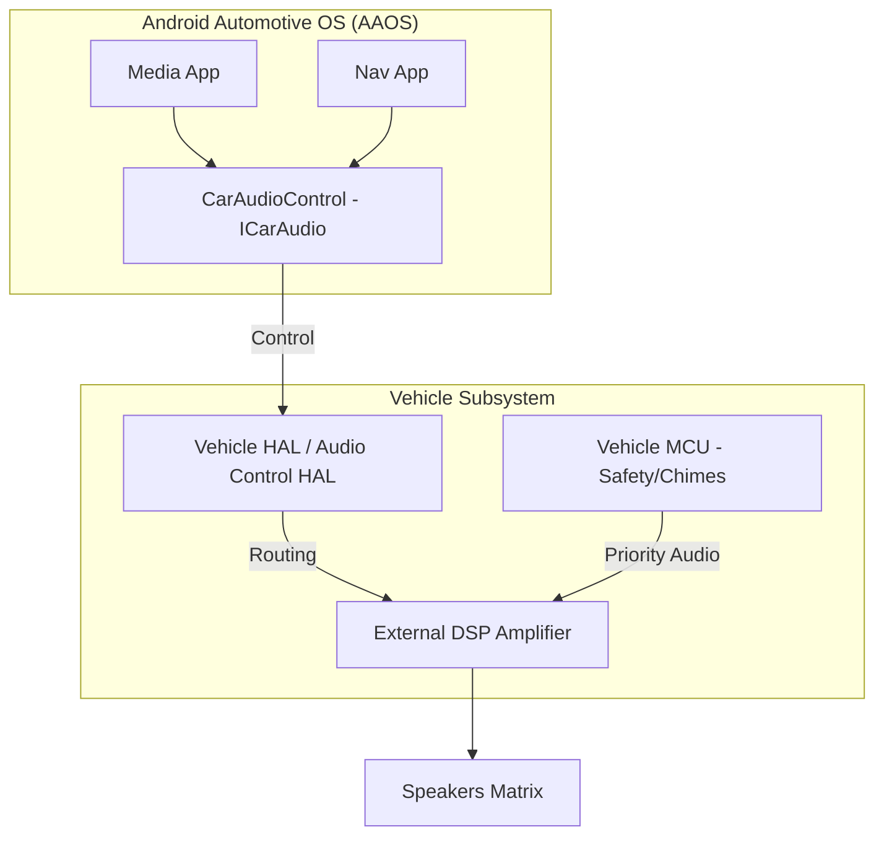

# 车载音频系统概览 (Automotive Audio System Overview)

车载音频系统已从单纯的“娱乐系统”演变为一个集成安全警报、语音交互、多音区娱乐及主动降噪的复杂分布式系统。在 Android Automotive (AAOS) 普及的今天，理解系统级的音频设计至关重要。

---

## 1. 车载音频架构 (Automotive Architecture)

与手机音频不同，车载音频需要处理来自 Android 系统、整车控制器 (MCU) 以及实时安全系统 (ADAS) 的多路音频流。

---

## 2. 车载音频的核心差异 (Key Differences)

### 2.1 外部音频路由 (External Routing)
手机的混音通常在 SoC 内部完成。而在汽车中，为了保证系统挂掉（如 Android 重启）时报警音（倒车雷达、转向灯）依然能响，混音和路由通常发生在**外部 DSP 功放**中。

### 2.2 多音区 (Multi-zone Audio)
汽车被划分为不同的听音区域（如：驾驶员位、副驾位、后排左/右）。系统需要支持：
*   驾驶员听导航。
*   后排乘客通过耳机看电影。
*   各音区互不干扰。

### 2.3 安全优先级 (Safety Priority)
音频流按优先级排序，安全类音频（ADAS 预警）具有最高优先级，可以强行中断（Mute）或压低（Duck）正在播放的音乐。

---

## 3. 车载音频控制逻辑：CarAudioService

在 AAOS 中，`CarAudioService` 扩展了 Android 原生的音频管理功能：
*   **音频上下文 (Audio Context)**：将 Usage 映射为车载特定的上下文（如：Music, Navigation, Voice_Command）。
*   **静态路由配置**：通过 `car_audio_configuration.xml` 定义每个音区的硬件总线 (Bus)。

---

## 4. 关键参考 (References)

1.  [Android Open Source Project: Automotive Audio](https://source.android.com/devices/automotive/audio)
2.  [AAOS Audio Control HAL Specification](https://source.android.com/devices/automotive/audio/audio-control-hal)

---
*Next Topic: [车载多音区与路由策略](./02-Multi-zone-Routing.md)*
