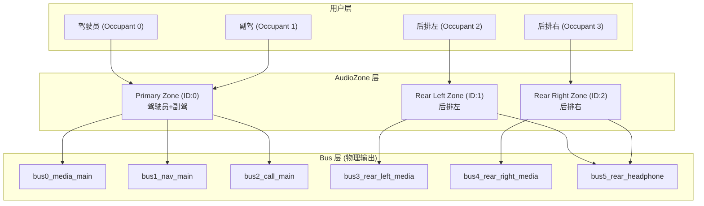
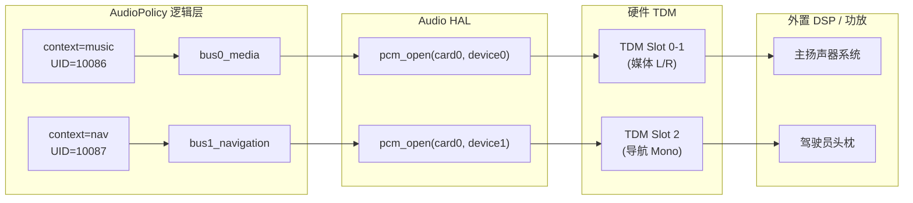
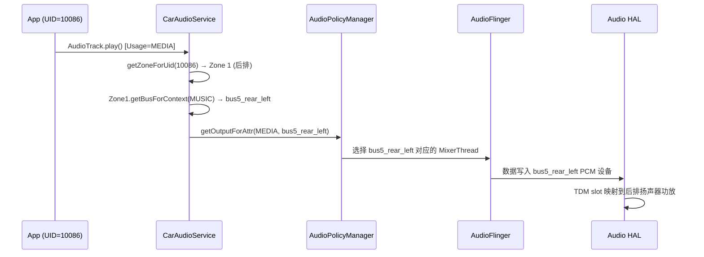
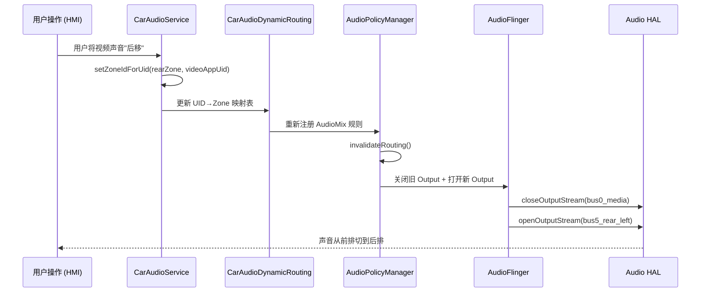

# 车载多音区、动态路由与 Bus 绑定

在智能座舱中，每一个"座位"都可以被看作一个独立的音频消费单元。AAOS 通过 AudioZone + Bus 地址 + OccupantZone 三层抽象实现了真正的物理隔离和独立控制。

---

## 1. 多音区架构全景

### 1.1 三层映射模型



### 1.2 核心概念定义

| 概念 | 说明 | 配置位置 |
|:---|:---|:---|
| **OccupantZone** | 座位抽象（人）。每个 Display + 座位 = 一个 OccupantZone | `config_occupant_zones.xml` |
| **AudioZone** | 音频区域（声音）。一个 AudioZone 绑定一组 Bus | `car_audio_configuration.xml` |
| **Bus** | 物理输出端点。对应 `audio_policy_configuration.xml` 中的 device address | HAL 层实际的 PCM 设备 |
| **Context** | 音频内容类型。决定数据流走向哪条 Bus | CarAudioContext 枚举 |

### 1.3 OccupantZone 与 AudioZone 的绑定

```java
// CarOccupantZoneManager 管理 人↔区 映射
// OccupantZone 负责: Display + 座位 + 用户账号
// AudioZone 负责: 该座位的音频输出 Bus 集合

// 映射关系:
// OccupantZone 0 (Driver, Display 0)    → AudioZone 0 (Primary)
// OccupantZone 1 (Passenger, Display 1) → AudioZone 0 (共享 Primary)
// OccupantZone 2 (Rear Left, Display 2) → AudioZone 1
// OccupantZone 3 (Rear Right, Display 3) → AudioZone 2
```

---

## 2. car_audio_configuration.xml 完整解析

这是车载音频最核心的配置文件，定义了 Zone → VolumeGroup → Bus → Context 的完整映射：

```xml
<carAudioConfiguration version="3">
    <zones>
        <!-- ===== 主音区 (前排) ===== -->
        <zone name="primary zone" isPrimary="true" occupantZoneId="0">
            <volumeGroups>
                <!-- 媒体音量组 -->
                <group name="media_group">
                    <device address="bus0_media">
                        <context context="music"/>
                        <context context="movie"/>
                        <context context="game"/>
                    </device>
                </group>
                
                <!-- 导航音量组 -->
                <group name="nav_group">
                    <device address="bus1_navigation">
                        <context context="navigation"/>
                        <context context="voice_command"/>
                    </device>
                </group>
                
                <!-- 通话音量组 -->
                <group name="call_group">
                    <device address="bus2_call">
                        <context context="call"/>
                        <context context="call_ring"/>
                    </device>
                </group>
                
                <!-- 系统音量组 -->
                <group name="system_group">
                    <device address="bus3_system">
                        <context context="alarm"/>
                        <context context="notification"/>
                        <context context="system_sound"/>
                    </device>
                </group>
                
                <!-- 安全音量组 (通常固定音量，不可调) -->
                <group name="safety_group">
                    <device address="bus4_safety">
                        <context context="emergency"/>
                        <context context="safety"/>
                        <context context="vehicle_status"/>
                    </device>
                </group>
            </volumeGroups>
        </zone>
        
        <!-- ===== 后排左音区 ===== -->
        <zone name="rear_left" isPrimary="false" occupantZoneId="2">
            <volumeGroups>
                <group name="rear_left_media">
                    <device address="bus5_rear_left">
                        <context context="music"/>
                        <context context="movie"/>
                        <context context="game"/>
                    </device>
                </group>
            </volumeGroups>
        </zone>
        
        <!-- ===== 后排右音区 ===== -->
        <zone name="rear_right" isPrimary="false" occupantZoneId="3">
            <volumeGroups>
                <group name="rear_right_media">
                    <device address="bus6_rear_right">
                        <context context="music"/>
                        <context context="movie"/>
                    </device>
                </group>
            </volumeGroups>
        </zone>
    </zones>
</carAudioConfiguration>
```

---

## 3. Bus 与 audio_policy_configuration.xml 的对应

`car_audio_configuration.xml` 中的 Bus 地址必须与 `audio_policy_configuration.xml` 中的 `devicePort` 一一对应：

```xml
<!-- audio_policy_configuration.xml (HAL 层能力声明) -->
<module name="primary" halVersion="3.0">
    <devicePorts>
        <!-- 每条 Bus 对应一个独立的 PCM 设备 -->
        <devicePort tagName="bus0_media" role="sink" type="AUDIO_DEVICE_OUT_BUS"
                    address="bus0_media">
            <profile format="AUDIO_FORMAT_PCM_16_BIT"
                     samplingRates="48000" channelMasks="AUDIO_CHANNEL_OUT_STEREO"/>
        </devicePort>
        
        <devicePort tagName="bus1_navigation" role="sink" type="AUDIO_DEVICE_OUT_BUS"
                    address="bus1_navigation">
            <profile format="AUDIO_FORMAT_PCM_16_BIT"
                     samplingRates="48000" channelMasks="AUDIO_CHANNEL_OUT_MONO"/>
        </devicePort>
        
        <devicePort tagName="bus5_rear_left" role="sink" type="AUDIO_DEVICE_OUT_BUS"
                    address="bus5_rear_left">
            <profile format="AUDIO_FORMAT_PCM_16_BIT"
                     samplingRates="48000" channelMasks="AUDIO_CHANNEL_OUT_STEREO"/>
        </devicePort>
    </devicePorts>
    
    <mixPorts>
        <!-- 每条 Bus 都有对应的 mixPort -->
        <mixPort name="mixport_bus0" role="source">
            <profile format="AUDIO_FORMAT_PCM_16_BIT"
                     samplingRates="48000" channelMasks="AUDIO_CHANNEL_OUT_STEREO"/>
        </mixPort>
    </mixPorts>
    
    <routes>
        <route type="mix" sink="bus0_media" sources="mixport_bus0"/>
    </routes>
</module>
```

### 3.1 Bus 到 HAL 物理映射



---

## 4. 音区管理 API

### 4.1 CarAudioManager 核心接口

```java
CarAudioManager carAudioManager = (CarAudioManager) car.getCarManager(Car.AUDIO_SERVICE);

// 获取所有音区 ID
List<Integer> zoneIds = carAudioManager.getAudioZoneIds();

// 查询 App 当前所在音区
int zoneId = carAudioManager.getZoneIdForUid(Process.myUid());

// 将 App 动态路由到后排音区 (需要系统权限)
carAudioManager.setZoneIdForUid(REAR_LEFT_ZONE_ID, targetUid);

// 获取音区的配置信息
CarAudioZoneConfigInfo configInfo = carAudioManager.getCurrentAudioZoneConfigInfo(zoneId);
```

### 4.2 UID 路由决策流程



---

## 5. 动态路由切换 (Dynamic Routing)

### 5.1 CarAudioDynamicRouting 机制

AAOS 在系统启动时通过 `CarAudioDynamicRouting` 类将 `car_audio_configuration.xml` 的映射关系注入到 `AudioPolicy`：

```java
// CarAudioDynamicRouting.java 核心逻辑
class CarAudioDynamicRouting {
    void setupAudioDynamicRouting(AudioPolicy.Builder builder) {
        for (CarAudioZone zone : mCarAudioZones) {
            for (CarVolumeGroup group : zone.getVolumeGroups()) {
                for (String busAddress : group.getAddresses()) {
                    // 构建路由规则: AudioAttributes → Bus
                    AudioMixingRule.Builder ruleBuilder = new AudioMixingRule.Builder();
                    for (int context : group.getContextsForAddress(busAddress)) {
                        AudioAttributes attr = getAttributesForContext(context);
                        ruleBuilder.addRule(attr, AudioMixingRule.RULE_MATCH_ATTRIBUTE_USAGE);
                    }
                    
                    // 注册到 AudioPolicy
                    AudioMix mix = new AudioMix.Builder(ruleBuilder.build())
                        .setFormat(format)
                        .setDevice(new AudioDeviceInfo(busAddress))
                        .setRouteFlags(AudioMix.ROUTE_FLAG_RENDER)
                        .build();
                    builder.addMix(mix);
                }
            }
        }
    }
}
```

### 5.2 运行时路由切换场景

| 场景 | 触发条件 | 路由变化 |
|:---|:---|:---|
| 后排乘客上车 | Display 激活 + 用户登录 | 新建 AudioZone，映射 Bus |
| 声音后移 | HMI 拖拽声场中心 | Fade/Balance 权重变化 |
| 蓝牙耳机连接 | 后排连接 BT 耳机 | Zone 输出从 Bus 切到 BT Device |
| 多屏投屏 | 视频 Cast 到后排 | App UID 重新映射到后排 Zone |
| OTA (Over-The-Air, 空中升级) 播报 | 全车通知 | 临时切换到所有 Zone 并行输出 |

### 5.3 路由切换时序



---

## 6. 高通平台 Bus 实现

在高通 SA8295/SA8155 平台上，Bus 地址最终映射为 TDM 通道：

```
Bus 到硬件映射示例:
  bus0_media       → PCM device 100 → Primary TDM Slot 0-1  → 主扬声器功放
  bus1_navigation  → PCM device 101 → Primary TDM Slot 2    → 驾驶员头枕
  bus2_call        → PCM device 102 → Primary TDM Slot 3    → 驾驶员头枕
  bus3_system      → PCM device 103 → Primary TDM Slot 4-5  → 全车扬声器
  bus4_safety      → PCM device 104 → Secondary TDM Slot 0  → 安全音专用通道
  bus5_rear_left   → PCM device 105 → Quaternary TDM Slot 0-1 → 后排左头枕
  bus6_rear_right  → PCM device 106 → Quaternary TDM Slot 2-3 → 后排右头枕
```

---

## 7. 调试实战

### 7.1 核心调试命令

```bash
# 查看所有 AudioZone 和 Bus 绑定
adb shell dumpsys car_service | grep -A 50 "CarAudioService"

# 查看 Zone 内的 VolumeGroup 状态
adb shell dumpsys car_service | grep -A 30 "Volume groups"

# 查看当前活跃流走的哪条 Bus
adb shell dumpsys media.audio_policy | grep -A 10 "Output Coverage"

# 查看 UID 与 Zone 的映射
adb shell dumpsys car_service | grep -i "uid.*zone"

# 验证 HAL 层 Bus 状态
adb logcat -s AudioControl AudioHAL | grep -i "bus"

# 查看 AudioMix 路由规则
adb shell dumpsys media.audio_policy | grep -B2 -A 10 "AudioMix"
```

### 7.2 常见问题排查

| 问题 | 根因 | 排查方法 |
|:---|:---|:---|
| 后排无声 | Bus 未在 HAL 注册 / Zone 映射错误 | `dumpsys audio_policy` 看 devicePorts |
| 声音从错误扬声器出 | Context→Bus 映射错误 | 检查 `car_audio_configuration.xml` |
| 动态路由切换失败 | UID→Zone 绑定未生效 | `dumpsys car_service` 查 zone mapping |
| 两个 Zone 同时出声 | Bus 共享 / TDM slot 冲突 | 检查 `audio_policy_configuration.xml` |
| 安全音不出声 | Bus 被错误 mute | 检查 VolumeGroup 是否含 safety Bus |

---

## 8. 关键参考 (References)

1.  [AAOS Audio Zones](https://source.android.com/docs/automotive/audio/audio-zones)
2.  [CarAudioService Source (AOSP)](https://android.googlesource.com/platform/packages/services/Car/+/refs/heads/main/service/src/com/android/car/audio/)
3.  [car_audio_configuration.xml Schema](https://source.android.com/docs/automotive/audio/audio-configuration)
4.  [Qualcomm SA8295 TDM Configuration Guide](https://developer.qualcomm.com/)

---
*Next Topic: [车载音频焦点策略与音量组管理](./03-Focus-Volume-Management.md)*
