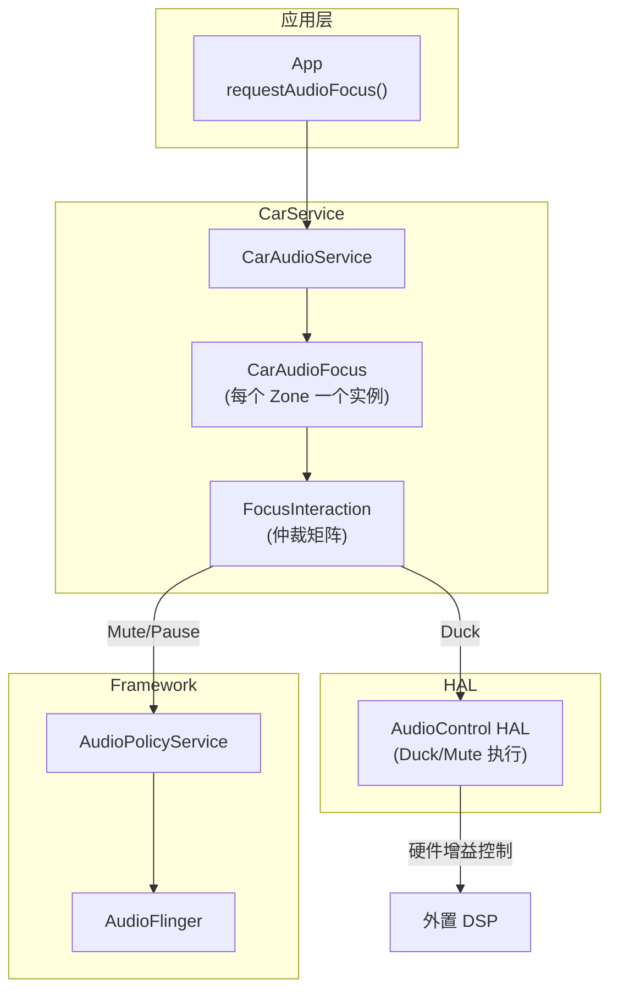
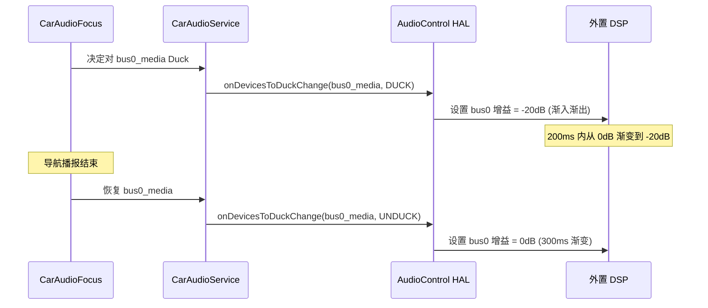
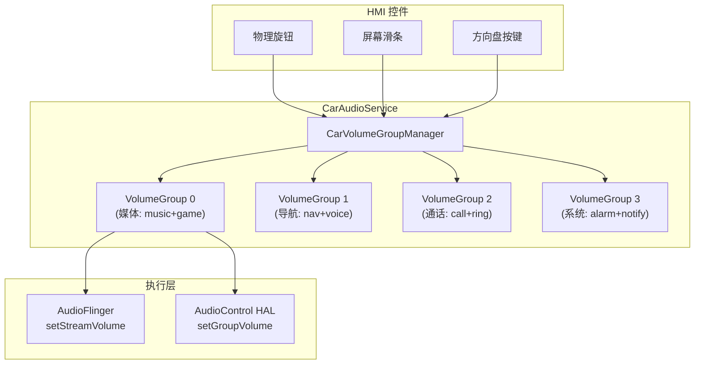
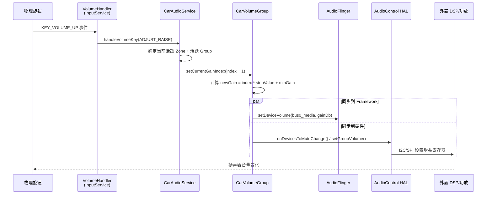
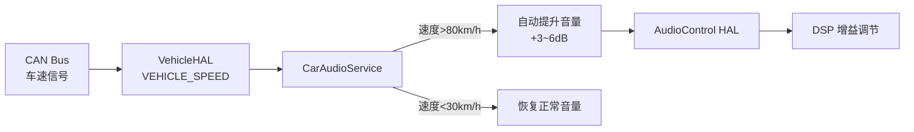

# 车载音频焦点策略与音量组管理

车载环境下音频交互极其频繁且需要多流并发：导航播报、雷达提示、手机来电、语音助理可能同时活跃。如何协调这些声音的竞争关系（焦点）并精确管理其响度（音量组），是车载音频开发的核心难题。

---

## 1. 车载音频焦点 (CarAudioFocus)

### 1.1 与手机焦点的根本差异

| 维度 | 手机 AudioFocus | 车载 CarAudioFocus |
|:---|:---|:---|
| 焦点范围 | 全局单一 | 每个 AudioZone 独立焦点栈 |
| 仲裁实现 | `MediaFocusControl` (Framework) | `CarAudioFocus` (CarService) |
| 多流并发 | 极少允许 | 常规操作（导航+音乐+提示） |
| Duck 实现 | AudioFlinger 层 -14dB | AudioControl HAL 精确 dB 控制 |
| 拒绝策略 | 几乎不拒绝 | 安全音/紧急场景会拒绝 |
| 延迟焦点 | 支持 (Android 12+) | 支持 + OEM 可扩展 |

### 1.2 CarAudioFocus 架构



### 1.3 完整焦点交互矩阵

```java
// CarAudioFocus 内部使用的交互矩阵
// 行=新请求, 列=当前持有者
// R=Reject, E=Exclusive(抢占), C=Concurrent(并存), D=Duck
```

| 新请求 ↓ / 当前 → | MUSIC | NAV | CALL | ALARM | SAFETY | EMERGENCY |
|:---|:---|:---|:---|:---|:---|:---|
| **MUSIC** | E | C | R | C | R | R |
| **NAVIGATION** | D | C | D | D | R | R |
| **CALL** | E | D | E | E | R | R |
| **ALARM** | D | C | R | E | R | R |
| **SAFETY** | D | D | D | D | C | R |
| **EMERGENCY** | E | E | E | E | E | E |

**交互行为说明**：
- **E (Exclusive)**：新请求抢占，当前者收到 `AUDIOFOCUS_LOSS`
- **D (Duck)**：新请求并存，当前者收到 `LOSS_TRANSIENT_CAN_DUCK`
- **C (Concurrent)**：两者完全并存，无焦点变化通知
- **R (Reject)**：新请求被拒绝，返回 `AUDIOFOCUS_REQUEST_FAILED`

### 1.4 CarAudioFocus 源码流程

```java
// packages/services/Car/service/src/com/android/car/audio/CarAudioFocus.java
class CarAudioFocus extends AudioPolicy.AudioPolicyFocusListener {
    
    @Override
    public void onAudioFocusRequest(AudioFocusInfo afi, int requestResult) {
        synchronized (mLock) {
            // 1. 确定请求的 CarAudioContext
            int context = CarAudioContext.getContextForAttributes(afi.getAttributes());
            
            // 2. 遍历当前焦点栈，逐一评估交互
            for (FocusEntry entry : mFocusHolders.values()) {
                int interaction = mFocusInteraction.evaluateRequest(
                    context, entry.getAudioContext(), 
                    afi.getGainRequest(), entry.getGainRequest());
                
                switch (interaction) {
                    case INTERACTION_REJECT:
                        denyFocusRequest(afi);
                        return;
                    case INTERACTION_EXCLUSIVE:
                        removeFocusEntry(entry, AUDIOFOCUS_LOSS);
                        break;
                    case INTERACTION_DUCK:
                        entry.setDucked(true);
                        notifyDuck(entry);
                        break;
                    case INTERACTION_CONCURRENT:
                        // 无需操作，两者并存
                        break;
                }
            }
            
            // 3. 授予焦点
            grantFocusRequest(afi);
        }
    }
}
```

### 1.5 Duck 的硬件执行

车载 Duck 不依赖 App 配合，而是通过 AudioControl HAL 直接在硬件层面控制增益：



---

## 2. 音量组管理 (Volume Groups)

### 2.1 音量组架构



### 2.2 Index 到 dB 的转换

车载音量不是简单的线性关系，而是遵循人耳感知曲线：

```java
// CarVolumeGroup.java 内部逻辑
class CarVolumeGroup {
    // 配置来自 car_audio_configuration.xml
    private int mMinGainIndex;    // 最小 index (如 0)
    private int mMaxGainIndex;    // 最大 index (如 40)
    private int mDefaultGainIndex; // 默认 index (如 20)
    private int mStepValue;       // 每步增益 (millibel, 如 100 = 1dB)
    
    // Index → dB 计算
    int getGainForIndex(int index) {
        // 结果单位: millibel (1/1000 dB)
        return mMinGainMillibel + (index * mStepValue);
    }
    
    // 示例:
    // minGain = -8000 (即 -80dB, 静音)
    // maxGain = 0 (即 0dB, 满音量)
    // stepValue = 200 (每步 2dB)
    // maxIndex = 40
    // index=20 → gain = -8000 + 20*200 = -4000 millibel = -40dB
}
```

### 2.3 音量组配置详解

```xml
<!-- car_audio_configuration.xml -->
<zone name="primary zone" isPrimary="true" occupantZoneId="0">
    <volumeGroups>
        <!-- 媒体组: 包含音乐、游戏、电影 -->
        <group name="media">
            <device address="bus0_media">
                <context context="music"/>
                <context context="movie"/>
                <context context="game"/>
            </device>
            <!-- 增益配置 -->
            <!-- stepValue: 每步变化量 (millibel), 200=2dB -->
            <!-- minValue: 最小增益 (millibel), -8000=-80dB -->
            <!-- maxValue: 最大增益 (millibel), 0=0dB -->
            <!-- defaultValue: 初始值 (millibel), -4000=-40dB -->
        </group>
        
        <!-- 导航组: 独立于媒体音量 -->
        <group name="navigation">
            <device address="bus1_navigation">
                <context context="navigation"/>
                <context context="voice_command"/>
            </device>
        </group>
        
        <!-- 通话组 -->
        <group name="call">
            <device address="bus2_call">
                <context context="call"/>
                <context context="call_ring"/>
            </device>
        </group>
        
        <!-- 安全组: 通常为固定音量, 用户不可调 -->
        <group name="safety">
            <device address="bus4_safety">
                <context context="emergency"/>
                <context context="safety"/>
            </device>
        </group>
    </volumeGroups>
</zone>
```

---

## 3. 音量调节完整数据链路

### 3.1 从旋钮到扬声器



### 3.2 两种音量控制方式

| 方式 | 实现 | 优点 | 缺点 | 适用场景 |
|:---|:---|:---|:---|:---|
| **Software Volume** | AudioFlinger 数字增益 | 简单，无需 HAL 配合 | 降低动态范围，底噪恶化 | 中低端方案 |
| **Hardware Volume** | AudioControl HAL → DSP | 保持动态范围，无数字损失 | 需要 HAL 实现 | 高端方案 (推荐) |

```
Software Volume 问题:
  原始信号: 16bit (-96dB 底噪)
  软件衰减 -40dB 后: 有效精度仅剩 ~10bit (-56dB 底噪)
  
Hardware Volume 优势:
  原始信号: 16bit 全精度送到 DAC
  DAC 后的模拟增益调节: 不损失数字精度
```

---

## 4. Fade 与 Balance (声场中心调节)

### 4.1 概念

```
Balance (左右平衡):
  -100%                0               +100%
    ←── 全左    ──── 居中 ────    全右 ──→

Fade (前后平衡):
  -100%                0               +100%
    ←── 全前    ──── 居中 ────    全后 ──→
```

### 4.2 四角增益计算

```java
// CarAudioService 内部 Fade/Balance 计算逻辑
void applyFadeBalance(float fade, float balance) {
    // fade: -1.0 (全前) ~ 0 (居中) ~ +1.0 (全后)
    // balance: -1.0 (全左) ~ 0 (居中) ~ +1.0 (全右)
    
    float frontLeft  = computeGain(-fade, -balance); // 前左
    float frontRight = computeGain(-fade,  balance); // 前右
    float rearLeft   = computeGain( fade, -balance); // 后左
    float rearRight  = computeGain( fade,  balance); // 后右
    
    // 应用到各通道
    mAudioControlHal.setFadeTowardsFront(fade);
    mAudioControlHal.setBalanceTowardsRight(balance);
}

float computeGain(float fadeFactor, float balanceFactor) {
    // 使用 cosine 法则平滑过渡
    return Math.cos(fadeFactor * Math.PI / 2) * Math.cos(balanceFactor * Math.PI / 2);
}
```

### 4.3 AudioControl HAL 的 Fade/Balance 接口

```aidl
// hardware/interfaces/automotive/audiocontrol/aidl/IAudioControl.aidl
interface IAudioControl {
    // 设置前后平衡 (-1.0 全前, 0 居中, 1.0 全后)
    void setFadeTowardsFront(float value);
    
    // 设置左右平衡 (-1.0 全左, 0 居中, 1.0 全右)
    void setBalanceTowardsRight(float value);
    
    // 设置音量组静音状态
    void onDevicesToMuteChange(in MutingInfo[] mutingInfos);
    
    // 设置 Duck 状态
    void onDevicesToDuckChange(in DuckingInfo[] duckingInfos);
}
```

---

## 5. 限速降噪联动 (Speed-Dependent Volume)

高速行驶时路噪增大，音乐播放的有效感知响度下降。车载系统支持根据车速自动调节音量：



**实现方式**：
1. `VehicleHAL` 上报实时车速
2. `CarAudioService` 根据预设曲线计算补偿增益
3. 通过 `AudioControl HAL` 下发增益偏移
4. 典型曲线：60km/h +0dB, 80km/h +2dB, 120km/h +5dB

---

## 6. 调试实战

### 6.1 核心调试命令

```bash
# 查看所有 VolumeGroup 状态
adb shell dumpsys car_service | grep -A 50 "Volume groups"

# 查看当前各 Zone 焦点栈
adb shell dumpsys car_service | grep -A 30 "CarAudioFocus"

# 设置指定 Zone/Group 音量
adb shell cmd car_service set-audio-zone-volume <ZONE_ID> <GROUP_ID> <INDEX>

# 查看 Duck 状态
adb shell dumpsys car_service | grep -i "duck"

# 监控焦点变化
adb logcat -s CarAudioFocus CarAudioService

# 查看 AudioControl HAL 状态
adb shell dumpsys android.hardware.automotive.audiocontrol.IAudioControl/default
```

### 6.2 常见问题排查

| 问题 | 根因 | 排查方法 |
|:---|:---|:---|
| 导航播报时音乐不 Duck | 交互矩阵配置错误 | 检查 `CarAudioFocusInteraction` |
| 旋钮调音量无反应 | VolumeGroup 未与 Zone 绑定 | `dumpsys car_service` 看 Group 状态 |
| 安全音音量可调 | safety group 未设为固定 | 检查 XML 中 safety group 配置 |
| 后排音量与前排联动 | Zone 间 Group 共享 | 确认后排 Zone 有独立 VolumeGroup |
| Duck 不平滑 (突变) | HAL 未实现渐入渐出 | 在 AudioControl HAL 加 ramp 逻辑 |
| 高速时音乐太小 | 未启用速度补偿 | 检查 VehicleHAL 车速上报 + 补偿曲线 |

---

## 7. 关键参考 (References)

1.  [AAOS Audio Focus](https://source.android.com/docs/automotive/audio/audio-focus)
2.  [AAOS Volume Management](https://source.android.com/docs/automotive/audio/volume-management)
3.  [AudioControl HAL AIDL Interface](https://android.googlesource.com/platform/hardware/interfaces/+/refs/heads/main/automotive/audiocontrol/aidl/)
4.  [CarAudioService Source](https://android.googlesource.com/platform/packages/services/Car/+/refs/heads/main/service/src/com/android/car/audio/)

---
*Next Module: [07. 高通平台专题 (Qualcomm Platform)](../07-Qualcomm-Platform/README.md)*
