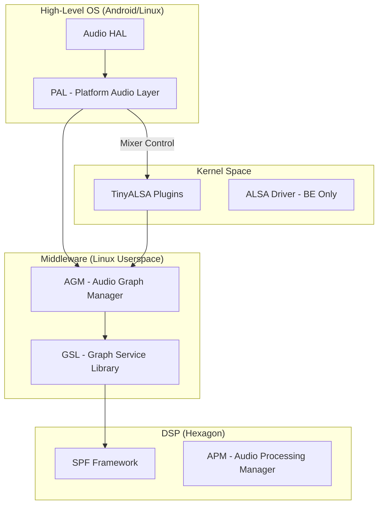

# Qualcomm AudioReach 架构深度解析

AudioReach（也称为 Signal Processing Framework, SPF）是高通 (Qualcomm) 推出的下一代音频信号处理架构。它不仅实现了算法的模块化，还通过一套复杂的软件中间层（PAL, AGM）实现了软硬件的高度解耦。

---

## 1. 系统全景架构 (Software Layers)

AudioReach 的核心理解点在于高通对 TinyALSA 的扩展，将其分成了普通 TinyALSA 和 **TinyALSA Plugins** 两部分。

---

## 2. 关键组件详解

### 2.1 PAL (Platform Audio Layer)
*   **职责**：提供高级 API 访问 QTI 音频硬件。
*   **核心逻辑**：解析 `resourcemanager.xml`，管理 Front-End (FE) 设备，维护 Stream 到 GKV 的映射。

### 2.2 AGM (Audio Graph Manager)
*   **职责**：运行在用户空间的音频服务。
*   **功能**：管理 FE 与 Back-End (BE) 的连接，使用 GKV 和 CKV 设置 GSL 会话，配置硬件端点（I2S, TDM）。

### 2.3 键值对管理 (Key Vectors)
AudioReach 使用“键值对”来描述和控制 Graph。
*   **GKV (Graph Key Vector)**：唯一标识一个 Graph。例如 `StreamRx=Pcm_Deep_Buffer`。
*   **CKV (Calibration Key Vector)**：模块的调试参数（如音量级别、EQ 系数）。
*   **TKV (Tag Key Vector)**：用于运行时动态控制模块参数（如实时增益调节）。

### 2.4 TinyALSA Plugins
*   **翻译官**：将 ALSA 的 `mixer_ctl` 操作和 PCM 操作转换为 AGM API 调用。它使得应用层可以像操作传统声卡一样操作复杂的 DSP 图形。

---

## 3. 配置文件流 (XML Parsing Flow)

系统在开机初始化时（`pal_init`），通过 **Resource Manager** 加载三个核心 XML：

1.  **`card-defs.xml`**：定义虚拟节点（PCMs/Mixers）设备。
2.  **`resourcemanager.xml`**：定义设备到后端的映射、策略属性以及音频路由。
3.  **`usecaseKvManager.xml`**：管理 Usecase 到 GKV 的映射逻辑。

---

## 4. DPCM：前端 (FE) 与 后端 (BE) 的革命

在旧架构（8350 以前）中，FE 和 BE 驱动都在 Kernel 中。而在 AudioReach (8450+) 中：
*   **FE (Front-End)**：移至 **HAL/PAL 层** 虚拟化。
*   **BE (Back-End)**：留在 **Kernel** 中，负责上电逻辑和物理接口。
*   **优势**：极大地减小了内核音频驱动的复杂度，将逻辑转移到更易调试的用户空间。

---

## 5. 核心代码路径 (Expert Path)

### 5.1 启动 Graph 的流程
1.  `StreamPCM::open` -> `SessionAlsaPcm::open`。
2.  调用 `allocateFrontEndIds` 获取虚拟 PCM 节点（如 `pcm117`）。
3.  `PayloadBuilder` 组装 GKV/CKV 数据包。
4.  通过 `mixer_ctl_set_array` 将 Metadata 发送给 AGM。
5.  AGM 最终通过 GPR 协议通知 DSP 上的 APM 开启 Graph。

---

## 6. 关键参考 (References)

1.  *SA8295 ADSP Software Architecture* - Qualcomm Documentation
2.  *AudioReach SPF Generic Packet Router (GPR) API Reference*
3.  Qualcomm PAL/AGM Source Code (Vendor Proprietary)
