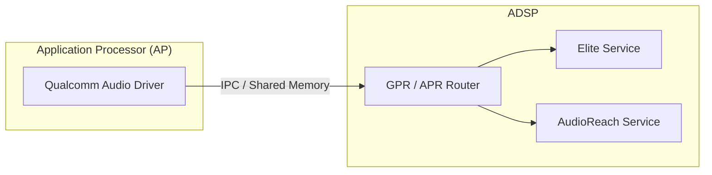

# 高通 ADSP 拓扑与调试 (ADSP Topology & Debugging)

ADSP (Audio Digital Signal Processing) 是高通 SoC 中专门负责音频处理的处理器。了解其拓扑结构和调试方法是解决复杂音频问题的关键。

---

## 1. ADSP 通信机制

应用处理器 (AP) 与 ADSP 之间的通信依赖于专有的 RPC (Remote Procedure Call) 机制。

*   **APR (Asynchronous Packet Router)**：传统架构（Elite）使用的通信协议。
*   **GPR (Graph Packet Router)**：AudioReach 架构使用的下一代协议，支持更复杂的寻址和图形化控制。

---

## 2. 拓扑 (Topology) 概念

在 ADSP 中，“拓扑”定义了音频模块的排列组合顺序。
*   **COPP (Common Object Processing Path)**：通常用于音频输出端（如：EQ + Volume + Reverb）。
*   **POPP (Per Object Processing Path)**：通常用于每个播放流端（如：Decoder + Resampler）。

---

## 3. 核心调试工具链

高通提供了一整套专有的调试工具：

### 3.1 QACT (Qualcomm Audio Configuration Tool)
*   **实时调试**：通过 USB 或网口连接真机，实时调整 DSP 内部模块的参数。
*   **拓扑查看**：可视化查看当前的音频链路。

### 3.2 QCAT (Qualcomm Analysis Tool)
*   **日志分析**：用于解析高通特有的音频日志 (QXDM Logs)。
*   **数据导出**：可以将 DSP 采集的原始 PCM 数据从日志中提取出来，用于分析 AEC 或降噪算法的效果。

### 3.3 QXDM (Qualcomm eXtensible Diagnostic Monitor)
*   **日志采集**：手机/车机音频日志采集的通用工具。

---

## 4. 常见问题排查流程

1.  **确认路径**：使用 QACT 查看当前音频流是否正确走到了对应的 Subgraph 和 Module。
2.  **检查时钟**：确认 BCLK/LRCK 等硬件时钟是否正常。
3.  **日志追踪**：通过 QCAT 查看 GPR 命令是否成功下发，以及 DSP 是否有报错（Error Code）。
4.  **PCM Dump**：在 DSP 的入口和出口 Dump 数据，定位是算法处理导致的失真还是输入源有问题。

---

## 5. 关键参考 (References)

1.  [Qualcomm Audio Debugging Guide](https://developer.qualcomm.com/)
2.  *High Definition Audio on Qualcomm Platforms* - QC Whitepapers

---
*Next Topic: [08. 测试与质量标准 (Testing & Standard)](../08-Testing-Quality-Standard/README.md)*
