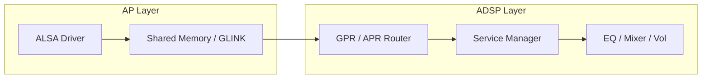

# 高通 ADSP 拓扑与调试 (ADSP Topology & Debugging)

ADSP (Audio Digital Signal Processing) 是高通 SoC 的音频大脑。本章深入探讨其内部通信协议、拓扑架构及专家级调试手段。

---

## 1. 通信协议深度解析：APR vs. GPR

AP (应用处理器) 与 DSP 之间的“通话”通过特定的数据包路由协议实现。

### 1.1 APR (Asynchronous Packet Router) - Elite 架构
*   **路由寻址**：基于 **Service ID** 和 **Port ID**。
*   **场景**：传统手机机型和旧版 Elite 驱动。

### 1.2 GPR (Graph Packet Router) - AudioReach 架构
*   **路由寻址**：基于 **Domain ID** 和 **Instance ID (IID)**。
*   **灵活性**：支持动态的图 (Graph) 拓扑寻址，更适合复杂的车载多音区场景。



---

## 2. DSP 拓扑组件 (Topology Components)

理解拓扑结构是排查“无声”或“音质差”的关键。

*   **POPP (Per Object Processing Path)**：
    *   **位置**：靠近应用端（Decoder 之后）。
    *   **任务**：处理流特定的算法（如：不同音乐 App 的独立 EQ）。
*   **COPP (Common Object Processing Path)**：
    *   **位置**：混音之后，硬件输出之前。
    *   **任务**：处理设备特定的算法（如：扬声器保护、多声道下混）。
*   **AFE (Audio Front End)**：
    *   **位置**：最底层。
    *   **任务**：对接物理 I2S/TDM 接口，管理硬件采样率和时钟同步。

---

## 3. 专家调试实战

### 3.1 关键调试节点 (PCM Dump)
高通 DSP 支持在路径的任何位置进行数据 Dump。
1.  **POPP Input**：确认 App 发来的数据是否正确。
2.  **COPP Output**：确认混音和音效处理后是否失真。
3.  **AFE RX/TX**：确认最终送往硬件的数据状态。

### 3.2 常用 adb 调试命令
```bash
# 查看 ADSP 是否崩溃 (SSR 状态)
adb shell cat /sys/kernel/debug/msm_subsys/adsp

# 查看音频驱动状态 (高通专有路径)
adb shell cat /sys/kernel/debug/audio_reach/graph_info

# 查看实时 DSP 负载 (需配合调试固件)
adb shell "echo 1 > /sys/kernel/debug/audio_reach/perf_monitor"
```

---

## 4. QACT 可视化连线调试

使用 QACT (Qualcomm Audio Configuration Tool) 时，开发者可以直接看到当前的 **Graph 拓扑**。
*   **实时微调**：点击 EQ 模块，拖动曲线，DSP 内部寄存器会通过 GPR 协议瞬间更新，实现“所调即所得”。

---

## 5. 关键参考 (References)

1.  [Qualcomm Hexagon DSP SDK Documentation](https://developer.qualcomm.com/software/hexagon-dsp-sdk)
2.  *High-Performance Audio on Qualcomm Mobile Platforms* - Industry Whitepaper
