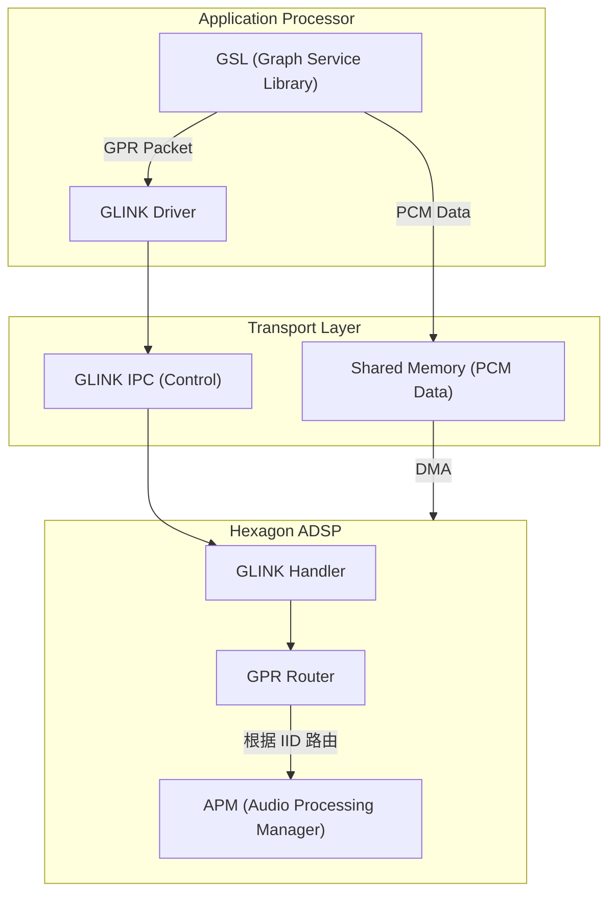
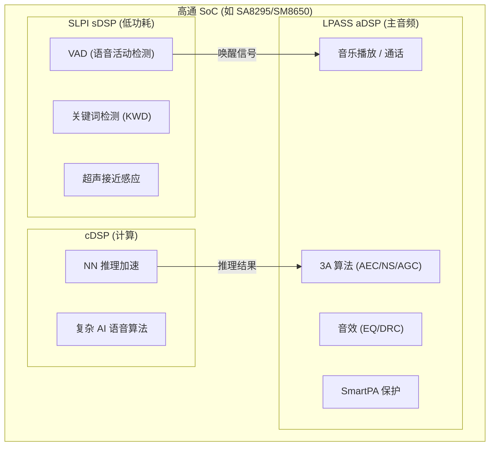

# 高通 ADSP 拓扑与调试 (ADSP Topology & Debugging)

ADSP (Audio Digital Signal Processing) 是高通 SoC 的音频大脑。本章深入探讨其内部通信协议、拓扑架构、数据流管理以及专家级调试手段。

---

## 1. 通信协议：APR vs GPR

| 维度 | APR (Elite 架构) | GPR (AudioReach 架构) |
|:---|:---|:---|
| **全称** | Asynchronous Packet Router | Graph Packet Router |
| **寻址方式** | Service ID + Port ID | Domain ID + Instance ID (IID) |
| **路由粒度** | 服务级别 | 模块级别 (更精细) |
| **适用平台** | SM8350 及以前 | SM8450+ |
| **拓扑方式** | 静态硬编码 | 动态 Graph 拓扑 |
| **多域支持** | 单 DSP | 多 DSP (aDSP/cDSP/sDSP) |

### 1.1 GPR 包结构

```
GPR Packet 格式:
  ┌────────────────────────────────────────┐
  │ GPR Header (20 bytes)                  │
  ├────────────────────────────────────────┤
  │  Version (4b) │ HeaderSize (4b)        │
  │  PacketSize (32b)                      │
  │  DstDomain (8b) │ SrcDomain (8b)       │
  │  DstPort/IID (32b)                     │
  │  SrcPort/IID (32b)                     │
  │  Token (32b) — 用于请求-应答匹配       │
  │  Opcode (32b)                          │
  ├────────────────────────────────────────┤
  │ Payload (可变长)                        │
  │  取决于 Opcode 定义的结构               │
  └────────────────────────────────────────┘

常用 Opcode:
  APM_CMD_GRAPH_OPEN      = 0x01001000  // 打开 Graph
  APM_CMD_GRAPH_PREPARE   = 0x01001001  // 准备 Graph
  APM_CMD_GRAPH_START     = 0x01001002  // 启动 Graph
  APM_CMD_GRAPH_STOP      = 0x01001003  // 停止 Graph
  APM_CMD_GRAPH_CLOSE     = 0x01001004  // 关闭 Graph
  APM_CMD_SET_CFG         = 0x01001005  // 下发参数
  APM_CMD_GET_CFG         = 0x01001006  // 获取参数
```

### 1.2 AP ↔ DSP 通信通道



---

## 2. DSP 拓扑组件

### 2.1 Elite 架构拓扑 (旧)

```
Elite 架构拓扑层次:

  App PCM → ┌──────────────────────────────────────────┐
            │  POPP (Per Object Processing Path)        │
            │  ├── Decoder (Offload 场景)                │
            │  ├── SRC (采样率转换)                      │
            │  ├── Volume                               │
            │  └── Per-Stream EQ                        │
            ├──────────────────────────────────────────┤
            │  Matrix Mixer (N:M 混音)                   │
            ├──────────────────────────────────────────┤
            │  COPP (Common Object Processing Path)     │
            │  ├── Device EQ                            │
            │  ├── DRC / Limiter                        │
            │  ├── Speaker Protection (SmartPA)         │
            │  └── Visualizer                           │
            ├──────────────────────────────────────────┤
            │  AFE (Audio Front End)                     │
            │  ├── I2S / TDM / SoundWire 接口           │
            │  ├── 时钟管理 / 同步                      │
            │  └── DMA 管理                             │
            └──────────────────────────────────────────┘
            → Codec / Amplifier → Speaker/Headphone
```

### 2.2 AudioReach 架构拓扑 (新)

```
AudioReach Graph 拓扑:

  Graph 由 SubGraph 组成, SubGraph 由 Module 组成:
  
  播放 Graph 示例:
  ┌─────────────────────────────────────────────────────┐
  │ SubGraph: Stream PP (流处理)                         │
  │  WR_EP → MFC → VOLUME → PEQ → MBDRC               │
  │  (写端点)  (格式转换) (音量)  (参数EQ) (多频段DRC)    │
  ├─────────────────────────────────────────────────────┤
  │ SubGraph: Device PP (设备处理)                       │
  │  MFC → SPEAKER_PROT → LIMITER                      │
  │  (格式转换) (扬声器保护)  (限幅器)                    │
  ├─────────────────────────────────────────────────────┤
  │ SubGraph: Device Interface                          │
  │  HW_EP_RX (I2S/TDM/SoundWire Endpoint)             │
  └─────────────────────────────────────────────────────┘

  录音 Graph 示例:
  ┌─────────────────────────────────────────────────────┐
  │ SubGraph: Device Interface                          │
  │  HW_EP_TX (麦克风输入端点)                           │
  ├─────────────────────────────────────────────────────┤
  │ SubGraph: Device PP                                 │
  │  MFC → EC_REF_MUX → AEC → NS → AGC                │
  │  (格式)  (回声参考)   (回消) (降噪) (增益控制)        │
  ├─────────────────────────────────────────────────────┤
  │ SubGraph: Stream PP                                 │
  │  MFC → VOLUME → RD_EP                              │
  │  (格式转换) (音量)  (读端点 → 送给 App)              │
  └─────────────────────────────────────────────────────┘
```

### 2.3 常用 CAPI 模块列表

| Module ID | 名称 | 功能 | 典型位置 |
|:---|:---|:---|:---|
| `0x07001000` | WR_EP | 写端点 (数据入口) | Stream PP 首 |
| `0x07001001` | RD_EP | 读端点 (数据出口) | Stream PP 尾 |
| `0x07001002` | MFC | Media Format Converter | 各 SubGraph |
| `0x07001003` | VOLUME | 音量控制 | Stream PP |
| `0x07001005` | PEQ | 参数均衡器 | Stream/Device PP |
| `0x07001006` | MBDRC | 多频段动态范围压缩 | Stream PP |
| `0x07001010` | AEC | 回声消除 | Device PP (TX) |
| `0x07001011` | NS | 噪声抑制 | Device PP (TX) |
| `0x07001015` | SPK_PROT | 扬声器保护 | Device PP (RX) |
| `0x07001020` | HW_EP_RX | 硬件端点 (播放) | Device I/F |
| `0x07001021` | HW_EP_TX | 硬件端点 (录音) | Device I/F |

---

## 3. Multi-DSP 框架

### 3.1 DSP 职责分工



### 3.2 低功耗岛 (LPI, Low Power Island)

```
LPI 模式 (关键词检测):
  
  AP 休眠状态:
    sDSP 运行 VAD + KWD 检测
    功耗: ~1-3 mW (极低)
    麦克风通过 SoundWire 直连 sDSP
    
  检测到唤醒词:
    sDSP → 中断 AP → AP 唤醒
    sDSP → 通知 aDSP → 启动完整语音 Graph
    切换: LPI Path → Non-LPI Path
    延迟: ~200ms (包括 AP 唤醒)
    
  Non-LPI 模式:
    AP 处于活跃状态, 麦克风数据走 aDSP
    功能完整: AEC + NS + AGC + KWD
    功耗: ~30-50 mW
```

---

## 4. TDM 接口与 Slot 映射

### 4.1 TDM 配置详解

```
TDM (Time Division Multiplexing) 帧结构:

  ┌────┬────┬────┬────┬────┬────┬────┬────┐
  │Slot│Slot│Slot│Slot│Slot│Slot│Slot│Slot│  ← 一个 TDM 帧
  │ 0  │ 1  │ 2  │ 3  │ 4  │ 5  │ 6  │ 7  │     (8 slots)
  └────┴────┴────┴────┴────┴────┴────┴────┘
  ←──────── 1/fs 周期 (如 1/48000 秒) ──────→

  关键参数:
    Slots Per Frame:  8 / 16 / 32
    Bits Per Slot:    16 / 24 / 32
    对齐方式:         MSB / LSB Justified
    FSYNC:            Short (1 BCLK) / Long (1 Slot Width)
```

### 4.2 车载 TDM Slot 映射实例

```
SA8295 车载平台 TDM 映射示例:

  QUAT_TDM_RX_0 (播放 → 功放):
    Slot 0-1:  前左/前右扬声器    (FL/FR)
    Slot 2-3:  后左/后右扬声器    (RL/RR)
    Slot 4-5:  中置/低音炮        (C/LFE)
    Slot 6-7:  环绕声/顶置        (SL/SR)

  QUAT_TDM_TX_0 (录音 ← Codec):
    Slot 0-1:  驾驶员麦克风 (近场)
    Slot 2-3:  副驾麦克风
    Slot 4-5:  后排麦克风
    Slot 6-7:  回声参考信号 (EC Reference)
```

### 4.3 TDM 配置命令

```bash
# TDM RX 配置
tinymix 'QUAT_TDM_RX_0 Channels' 'Eight'
tinymix 'QUAT_TDM_RX_0 Format' 'S32_LE'
tinymix 'QUAT_TDM_RX_0 SampleRate' 'KHZ_48'
tinymix 'QUAT_TDM_RX_0 SlotWidth' '32'
tinymix 'QUAT_TDM_RX_0 SlotNumber' '8'

# TDM TX 配置
tinymix 'QUAT_TDM_TX_0 Channels' 'Eight'
tinymix 'QUAT_TDM_TX_0 Format' 'S32_LE'
tinymix 'QUAT_TDM_TX_0 SampleRate' 'KHZ_48'

# 验证 TDM 状态
adb shell cat /proc/asound/card0/pcm*p/sub0/hw_params
adb shell cat /proc/asound/card0/pcm*c/sub0/hw_params
```

---

## 5. DSP 数据 Dump 调试

### 5.1 数据注入/抓取点

```
Graph 数据流中可用的 Dump 位置:

  ┌──────┐   ①    ┌───────┐   ②    ┌──────┐   ③    ┌───────┐
  │WR_EP │──────→│VOLUME │──────→│ PEQ  │──────→│HW_EP  │
  └──────┘       └───────┘       └──────┘       └───────┘
       ↑              ↑              ↑               ↑
     Dump①          Dump②          Dump③           Dump④
   (App数据)     (音量处理后)    (EQ处理后)      (送给硬件)

调试场景:
  无声 → 检查 Dump①: App 是否有数据写入?
  音量异常 → 对比 Dump①②: Volume 模块增益是否正确?
  音质差 → 检查 Dump③: EQ 参数是否异常?
  硬件问题 → 检查 Dump④: 数据到达 HW_EP 了吗?
```

### 5.2 PCM Dump 命令

```bash
# 使能 ADSP PCM Dump (通过 QACT 或命令行)
adb shell "echo 1 > /sys/kernel/debug/audio_reach/pcm_dump"

# 指定 Dump 模块 (通过 Module IID)
adb shell "echo module_iid=0x1234 > /sys/kernel/debug/audio_reach/pcm_dump_cfg"

# Dump 文件位置
adb pull /data/vendor/audio/pcm_dump/

# 用 Audacity 分析:
#   采样率: 48000, 位深: 32-bit, 声道: 根据配置
```

### 5.3 系统调试命令汇总

```bash
# ADSP 状态
adb shell cat /sys/kernel/debug/msm_subsys/adsp       # SSR 状态
adb shell cat /sys/kernel/debug/audio_reach/graph_info  # Graph 拓扑
adb shell cat /sys/kernel/debug/audio_reach/perf_monitor # DSP 负载

# ADSP 崩溃分析
adb shell dmesg | grep -i "adsp\|subsys\|ssr"
adb shell cat /sys/kernel/debug/msm_subsys/adsp_crash_reason

# Graph 实时状态
adb logcat -s APM SPF GPR | grep -i "graph\|module\|error"

# AFE (Audio Front End) 状态
adb shell cat /sys/kernel/debug/audio_reach/afe_ports
```

---

## 6. ADSP SSR (SubSystem Restart) 处理

```
ADSP SSR 恢复流程:

  1. ADSP 崩溃 → Kernel 检测到 SSR 事件
  2. Kernel 通知 HAL → HAL 收到 onServiceDied()
  3. audioserver 感知 → 标记所有 Graph 为 INVALID
  4. ADSP 重新加载固件 → 重新初始化
  5. HAL 重新 open → PAL 重建所有活跃 Stream
  6. AGM 重新建立 Graph → DSP 恢复正常
  
  总恢复时间: ~2-5 秒
  
常见 SSR 原因:
  - DSP 内存溢出 (Heap Exhaustion)
  - 死循环 (Watchdog Timeout)
  - 非法内存访问 (Bus Error)
  - 固件缺陷 (需要 Qualcomm 修复)
```

---

## 7. 关键参考 (References)

1.  [Qualcomm Hexagon DSP SDK Documentation](https://developer.qualcomm.com/software/hexagon-dsp-sdk)
2.  *High-Performance Audio on Qualcomm Mobile Platforms* - Industry Whitepaper
3.  *SA8295/SM8650 Audio Software Architecture Guide* - Qualcomm Documentation
4.  *AudioReach SPF Module Developer Guide* - Qualcomm Internal
