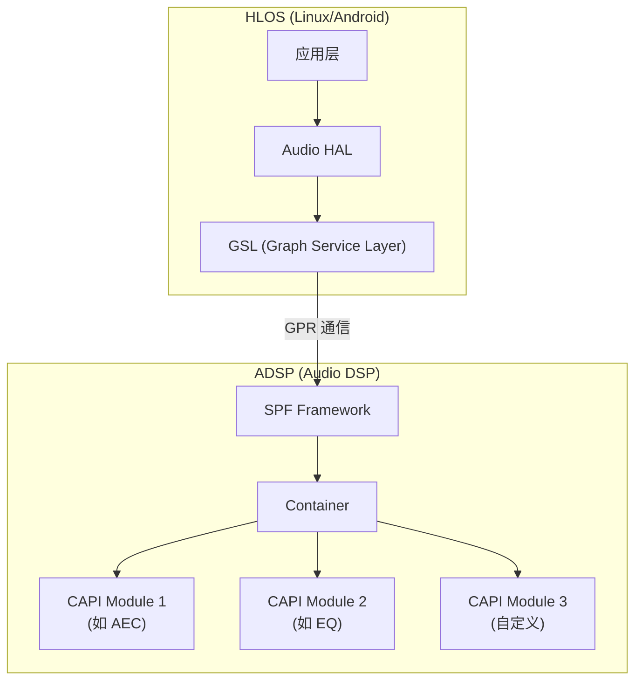
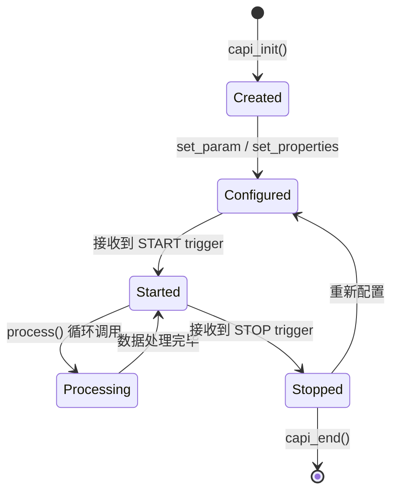

# CAPI 自定义模块开发 (CAPI Custom Module Integration)

CAPI (Common Audio Processor Interface) 是 AudioReach SPF (Signal Processing Framework) 中模块开发的标准接口。所有运行在 ADSP 上的音频处理模块（EQ、AEC、DRC 等）都遵循 CAPI 框架实现。

---

## 1. CAPI 在 AudioReach 中的位置



---

## 2. CAPI 接口核心结构

### 2.1 模块生命周期



### 2.2 CAPI vtable (虚函数表)

每个 CAPI 模块必须实现以下接口：

```c
typedef struct capi_vtbl_t {
    /* 处理音频数据 — 核心函数 */
    capi_err_t (*process)(capi_t *_pif, 
                          capi_stream_data_t *input[], 
                          capi_stream_data_t *output[]);
    
    /* 获取模块静态属性 */
    capi_err_t (*get_static_properties)(
                          capi_proplist_t *init_set_proplist,
                          capi_proplist_t *static_proplist);
    
    /* 初始化模块实例 */
    capi_err_t (*init)(capi_t *_pif, 
                       capi_proplist_t *init_set_proplist);
    
    /* 设置参数 (来自 HLOS 或其他模块) */
    capi_err_t (*set_param)(capi_t *_pif, 
                            uint32_t param_id,
                            const capi_port_info_t *port_info,
                            capi_buf_t *params_ptr);
    
    /* 获取参数 */
    capi_err_t (*get_param)(capi_t *_pif, 
                            uint32_t param_id,
                            const capi_port_info_t *port_info,
                            capi_buf_t *params_ptr);
    
    /* 设置属性 (媒体格式、事件回调等) */
    capi_err_t (*set_properties)(capi_t *_pif, 
                                 capi_proplist_t *proplist);
    
    /* 获取属性 */
    capi_err_t (*get_properties)(capi_t *_pif, 
                                 capi_proplist_t *proplist);
    
    /* 销毁模块 */
    capi_err_t (*end)(capi_t *_pif);
} capi_vtbl_t;
```

### 2.3 核心数据结构

```c
/* 音频缓冲区 */
typedef struct capi_buf_t {
    int8_t  *data_ptr;       /* 数据指针 */
    uint32_t actual_data_len; /* 实际数据长度 */
    uint32_t max_data_len;    /* 缓冲区最大长度 */
} capi_buf_t;

/* 流数据 — 包含多个 buffer (多通道) */
typedef struct capi_stream_data_t {
    capi_stream_flags_t flags;
    int64_t             timestamp;
    capi_buf_t         *buf_ptr;     /* buffer 数组 */
    uint32_t            bufs_num;    /* buffer 数量 (= 通道数) */
} capi_stream_data_t;
```

---

## 3. 自定义模块开发步骤

### 3.1 文件结构

```
my_custom_module/
├── inc/
│   └── my_module_api.h          # 参数 ID 定义 & 结构体
├── src/
│   ├── my_module.c              # 核心实现
│   ├── my_module_process.c      # process() 实现
│   └── my_module_utils.c        # 辅助函数
├── lib/
│   └── my_module_stub.c         # 模块注册入口
└── build/
    └── my_module.scons           # 构建脚本
```

### 3.2 模块注册 (Entry Point)

```c
/* my_module_stub.c */
#include "capi.h"
#include "module_cmn_api.h"

/* 模块唯一 ID — 与 ACDB/ARCT 配置匹配 */
#define MY_MODULE_MODULE_ID  0x10001234

/* 静态属性查询入口 */
capi_err_t my_module_get_static_properties(
    capi_proplist_t *init_set_proplist,
    capi_proplist_t *static_proplist)
{
    /* 声明模块需要的栈大小、是否需要数据端口等 */
    capi_init_memory_requirement_t mem_req = {
        .size_in_bytes = sizeof(my_module_t)
    };
    // ... 填充 static_proplist
    return CAPI_EOK;
}

/* 初始化入口 */
capi_err_t my_module_init(capi_t *_pif, 
                          capi_proplist_t *init_set_proplist)
{
    my_module_t *me = (my_module_t *)_pif;
    
    /* 设置虚函数表 */
    me->vtbl.vtbl_ptr = &my_module_vtbl;
    
    /* 初始化内部状态 */
    me->gain_linear = 1.0f;
    me->enabled = TRUE;
    
    /* 从 init_set_proplist 获取回调函数指针 */
    // 用于向框架上报事件、媒体格式变化等
    
    return CAPI_EOK;
}
```

### 3.3 process() 实现示例 (简单增益模块)

```c
capi_err_t my_module_process(capi_t *_pif,
                             capi_stream_data_t *input[],
                             capi_stream_data_t *output[])
{
    my_module_t *me = (my_module_t *)_pif;
    
    if (!me->enabled) {
        /* Bypass: 直接拷贝输入到输出 */
        memcpy(output[0]->buf_ptr[0].data_ptr,
               input[0]->buf_ptr[0].data_ptr,
               input[0]->buf_ptr[0].actual_data_len);
        output[0]->buf_ptr[0].actual_data_len = 
            input[0]->buf_ptr[0].actual_data_len;
        return CAPI_EOK;
    }
    
    /* 对每个通道应用增益 */
    for (uint32_t ch = 0; ch < input[0]->bufs_num; ch++) {
        int16_t *in  = (int16_t *)input[0]->buf_ptr[ch].data_ptr;
        int16_t *out = (int16_t *)output[0]->buf_ptr[ch].data_ptr;
        uint32_t num_samples = input[0]->buf_ptr[ch].actual_data_len 
                               / sizeof(int16_t);
        
        for (uint32_t i = 0; i < num_samples; i++) {
            int32_t sample = (int32_t)(in[i] * me->gain_linear);
            /* 饱和处理 */
            out[i] = (int16_t)CLAMP(sample, INT16_MIN, INT16_MAX);
        }
        
        output[0]->buf_ptr[ch].actual_data_len = 
            input[0]->buf_ptr[ch].actual_data_len;
    }
    
    return CAPI_EOK;
}
```

### 3.4 参数设置 (set_param)

```c
/* 参数 ID 定义 (my_module_api.h) */
#define MY_MODULE_PARAM_GAIN     0x10001235
#define MY_MODULE_PARAM_ENABLE   0x10001236

typedef struct my_module_gain_cfg_t {
    int32_t gain_q13;  /* Q13 格式增益值 */
} my_module_gain_cfg_t;

/* set_param 实现 */
capi_err_t my_module_set_param(capi_t *_pif,
                               uint32_t param_id,
                               const capi_port_info_t *port_info,
                               capi_buf_t *params_ptr)
{
    my_module_t *me = (my_module_t *)_pif;
    
    switch (param_id) {
    case MY_MODULE_PARAM_GAIN: {
        my_module_gain_cfg_t *cfg = 
            (my_module_gain_cfg_t *)params_ptr->data_ptr;
        me->gain_linear = (float)cfg->gain_q13 / 8192.0f; /* Q13→float */
        break;
    }
    case MY_MODULE_PARAM_ENABLE: {
        me->enabled = *(uint32_t *)params_ptr->data_ptr;
        break;
    }
    default:
        return CAPI_EUNSUPPORTED;
    }
    return CAPI_EOK;
}
```

---

## 4. 媒体格式处理

CAPI 模块必须正确处理媒体格式变化事件：

```c
capi_err_t my_module_set_properties(capi_t *_pif, 
                                     capi_proplist_t *proplist)
{
    my_module_t *me = (my_module_t *)_pif;
    capi_prop_t *prop;
    
    /* 遍历属性列表 */
    while (/* iterate proplist */) {
        switch (prop->id) {
        case CAPI_INPUT_MEDIA_FMT_V2: {
            capi_media_fmt_v2_t *fmt = 
                (capi_media_fmt_v2_t *)prop->payload.data_ptr;
            me->sample_rate = fmt->format.sampling_rate;
            me->num_channels = fmt->format.num_channels;
            me->bits_per_sample = fmt->format.bits_per_sample;
            
            /* 向框架上报输出格式 (若输出格式与输入相同) */
            // 使用 event_cb 上报 CAPI_OUTPUT_MEDIA_FMT_V2
            break;
        }
        // ... 其他属性
        }
    }
    return CAPI_EOK;
}
```

---

## 5. 模块集成到 AudioReach 拓扑

### 5.1 ARCT (AudioReach Configuration Tool) 配置

在 ARCT 中将自定义模块添加到图中：

1. **注册模块 ID**：在 AMDB (Audio Module Database) 中注册 `0x10001234`
2. **添加到 Subgraph**：在目标 Subgraph 中拖入模块
3. **连接端口**：将模块的输入/输出端口与前后模块连接
4. **配置参数**：设置默认参数值

### 5.2 AMDB 注册

```
Module ID:     0x10001234
Module Type:   AMDB_MODULE_TYPE_GENERIC
Interface:     CAPI_V2
File Name:     my_custom_module.so (动态) 或静态链接
Entry Point:   my_module_get_static_properties
```

### 5.3 从 HLOS 下发参数

```c
/* HLOS 侧通过 GSL/AGMS 下发参数 */
struct apm_cmd_header_t cmd_hdr = {
    .module_instance_id = MY_MODULE_INSTANCE_ID,
    .param_id = MY_MODULE_PARAM_GAIN,
    .param_size = sizeof(my_module_gain_cfg_t),
};

my_module_gain_cfg_t gain_cfg = {
    .gain_q13 = 4096, /* 0.5x = -6dB */
};

/* 通过 GPR 发送到 ADSP */
gpr_send_command(APM_CMD_SET_CFG, &cmd_hdr, &gain_cfg);
```

---

## 6. 调试技巧

### 6.1 日志输出

```c
#include "ar_msg.h"

/* CAPI 模块内日志 (输出到 QXDM) */
AR_MSG(DBG_HIGH_PRIO, "my_module: gain set to %d (Q13)", 
       cfg->gain_q13);
AR_MSG(DBG_ERROR_PRIO, "my_module: unsupported sample rate %d", 
       me->sample_rate);
```

### 6.2 QXDM 抓取 CAPI 日志

```
QXDM > Filter > Subsystem: ADSP
                Message Type: MSG_SSID_QDSP6
                Level: HIGH / MED / LOW
```

### 6.3 常见问题

| 问题 | 原因 | 解决方案 |
|:---|:---|:---|
| 模块加载失败 | Module ID 未注册 AMDB | 确认 AMDB 配置正确 |
| process() 不被调用 | 未正确上报 output media format | 检查 set_properties 逻辑 |
| 输出静音 | actual_data_len 未正确设置 | 确保输出 buffer 长度已赋值 |
| 崩溃 / Watchdog | process() 中耗时过长 | 优化算法或检查死循环 |
| 参数不生效 | param_id 不匹配 | 对齐 HLOS 和 ADSP 侧的头文件 |

---

## 7. 关键参考 (References)

1.  80-VN500-17: *CAPI Custom Module Integration Into AudioReach SPF User Guide*
2.  80-VN500-28: *CAPI Custom Module Integration Into SPF for OEMs User Guide*
3.  80-VN500-6: *AudioReach SPF CAPI API Reference*
4.  80-VN500-16: *AudioReach SPF Technical Overview*
5.  80-VN500-4: *AudioReach SPF Modules API Reference*
