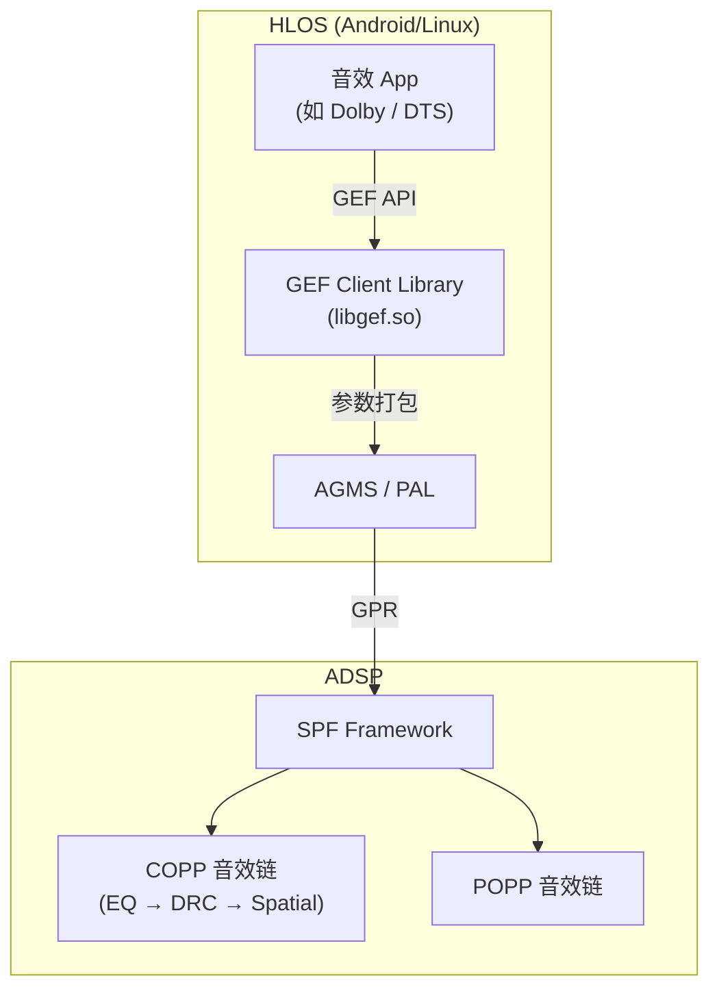
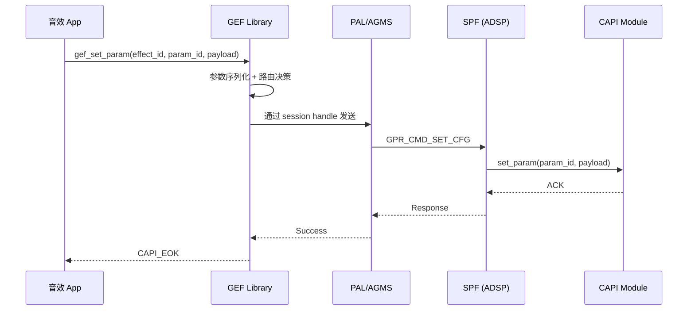
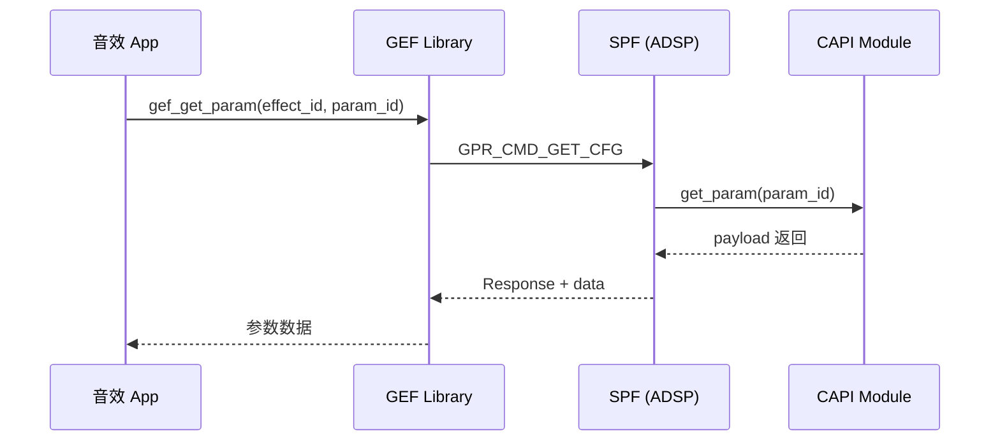
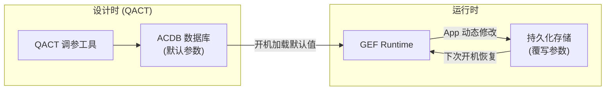

# GEF：通用音效框架 (Generic Effects Framework)

GEF (Generic Effects Framework) 是高通 AudioReach 体系中连接 HLOS 应用层与 ADSP 音效模块的桥梁。它允许上层应用（如音效 App）通过标准化接口下发参数到 DSP 侧的音效处理模块，无需修改 Audio HAL。

---

## 1. GEF 在音频栈中的位置



---

## 2. 核心概念

### 2.1 GEF 设计目标

*   **统一入口**：所有第三方音效厂商通过同一套 API 下发参数
*   **无需 HAL 修改**：参数直接穿透到 ADSP 模块，不经过 AudioFlinger
*   **Use Case 感知**：可根据不同音频用例 (Playback / VoIP / Record) 绑定不同音效配置
*   **持久化**：支持参数的保存与恢复

### 2.2 关键术语

| 术语 | 含义 |
|:---|:---|
| **GEF Config** | 一组音效参数的集合，绑定到特定 Use Case |
| **Effect ID** | 音效模块的唯一标识 (即 CAPI Module ID) |
| **Param ID** | 模块内部的参数标识 |
| **Subgraph Type** | 参数目标：COPP (设备侧) / POPP (流侧) |
| **Calibration Data** | ACDB 中存储的默认参数值 |

---

## 3. GEF 工作流程

### 3.1 参数下发路径



### 3.2 参数获取路径



---

## 4. GEF API 接口

### 4.1 初始化与销毁

```c
#include "gef_api.h"

/* 初始化 GEF 客户端 */
gef_handle_t gef_handle;
gef_status_t status = gef_init(&gef_handle);

/* 销毁 */
gef_deinit(gef_handle);
```

### 4.2 参数设置

```c
/* 设置音效参数 */
gef_param_info_t param_info = {
    .module_id   = 0x10001234,   /* 目标 CAPI 模块 ID */
    .param_id    = 0x10001235,   /* 参数 ID */
    .instance_id = 0,            /* 模块实例 (若拓扑中有多个相同模块) */
};

my_eq_config_t eq_cfg = {
    .band_count = 5,
    .bands = { /* ... */ },
};

status = gef_set_param(gef_handle, 
                       &param_info, 
                       (uint8_t *)&eq_cfg, 
                       sizeof(eq_cfg));
```

### 4.3 绑定到特定 Use Case

```c
/* 将配置绑定到播放场景 */
gef_usecase_info_t usecase = {
    .stream_type = GEF_STREAM_PLAYBACK,
    .device_id   = GEF_DEVICE_SPEAKER,
};

status = gef_set_param_for_usecase(gef_handle, 
                                    &usecase,
                                    &param_info, 
                                    (uint8_t *)&eq_cfg, 
                                    sizeof(eq_cfg));
```

---

## 5. GEF 与 ACDB 的关系



*   **ACDB 提供默认值**：出厂调音参数存储在 ACDB 中
*   **GEF 运行时覆写**：用户通过音效 App 调整后，GEF 将差异参数持久化
*   **优先级**：GEF 覆写 > ACDB 默认

---

## 6. 典型应用场景

### 6.1 第三方音效集成 (如 Dolby Atmos)

```
Dolby App → GEF API → ADSP Dolby Module (CAPI)
                            ↓
                    实时处理 Atmos 渲染
```

### 6.2 OEM 自定义 EQ

```
设置 App (Sound Settings) → GEF API → ADSP PEQ Module
    用户拖动 EQ 滑条              →  实时更新 Band Gain
```

### 6.3 车载多场景切换

```
驾驶模式 → GEF usecase = {PLAYBACK, DRIVER_SPEAKER}  → 驾驶位优化参数
影院模式 → GEF usecase = {PLAYBACK, ALL_SPEAKERS}     → 全车环绕参数
```

---

## 7. 调试方法

### 7.1 验证参数是否下达

```bash
# QXDM 过滤 GEF 相关日志
Filter: MSG_SSID_QDSP6 + "gef" 或 "set_param"

# 预期日志
"GEF: set_param module=0x10001234 param=0x10001235 size=20 SUCCESS"
```

### 7.2 常见问题

| 问题 | 原因 | 解决方案 |
|:---|:---|:---|
| 参数不生效 | Module 未在当前 graph 中加载 | 确认 Use Case 已启动对应拓扑 |
| 返回 MODULE_NOT_FOUND | Module ID 错误或未注册 AMDB | 核对 Module ID 与 AMDB |
| 持久化失败 | 文件系统权限问题 | 检查 `/data/vendor/audio/` 权限 |
| 参数被覆盖 | ACDB 重新加载覆写了 GEF 设置 | 调整加载顺序或使用 GEF persist |

---

## 8. 关键参考 (References)

1.  80-VN500-24: *Generic Effects Framework (GEF) for AudioReach*
2.  80-VN500-11: *AudioReach LA Customizations*
3.  80-VN500-13: *AudioReach Use Case Customizations*
4.  80-VN500-4: *AudioReach SPF Modules API Reference*
