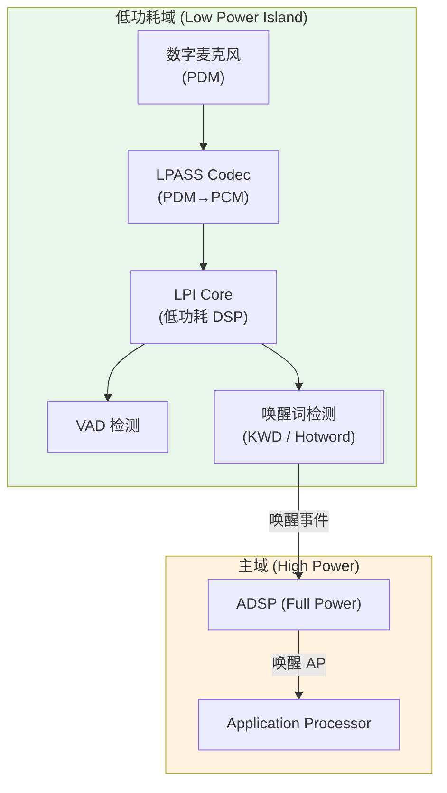
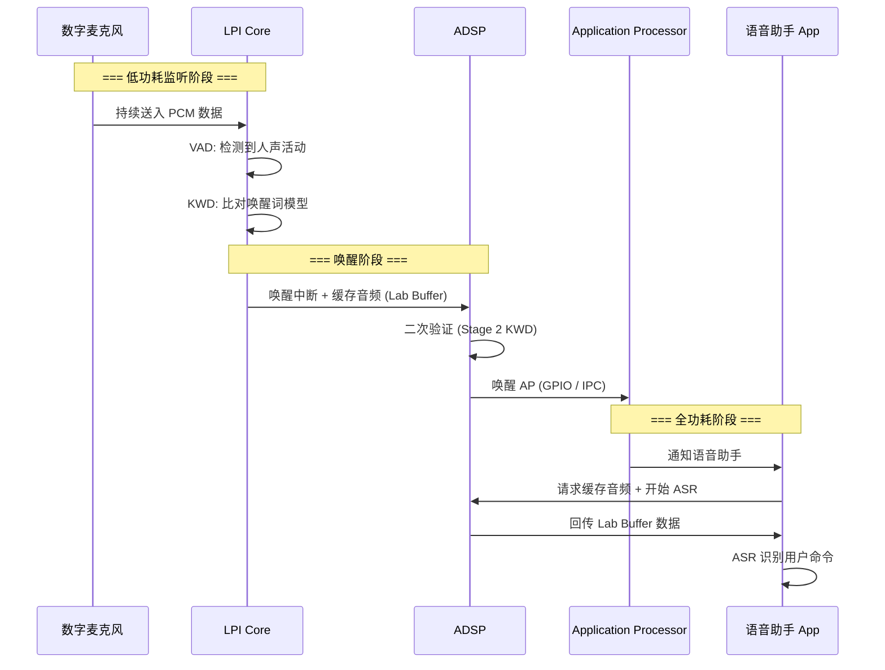
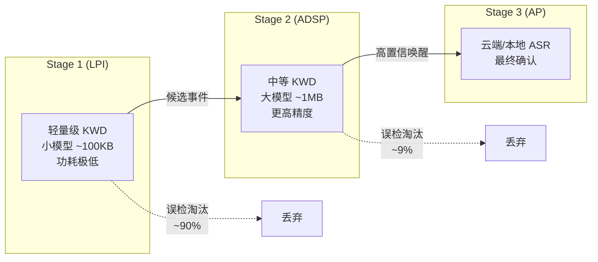
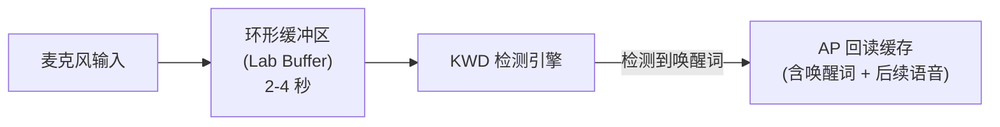
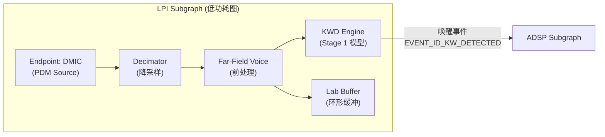
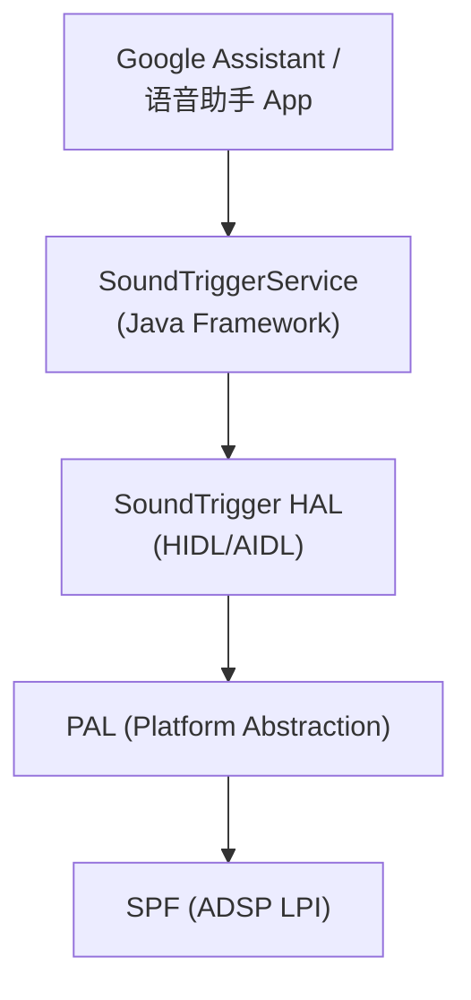

# 低功耗语音唤醒 (LPI Voice Activation in AudioReach)

LPI (Low Power Island) 语音唤醒是高通平台实现"常听候命 (Always Listening)"的核心技术。通过将语音检测任务放在超低功耗域 (LPI) 上运行，实现在主处理器休眠时仍能响应唤醒词，功耗仅约 1-2mW。

---

## 1. LPI 硬件架构



### 1.1 功耗对比

| 状态 | 活跃组件 | 典型功耗 |
|:---|:---|:---|
| 深度休眠 (No Listen) | 仅 RTC | < 0.1mW |
| **LPI 唤醒监听** | DMIC + LPASS Codec + LPI Core | **1-2mW** |
| ADSP 全功耗 | 完整 ADSP + Codec | 10-50mW |
| AP 活跃 | AP + ADSP + Display | 100mW+ |

---

## 2. 唤醒流程时序



---

## 3. 多级唤醒架构 (Multi-Stage Detection)

为平衡误唤醒率与功耗，高通采用多级串联检测：



| 阶段 | 运行位置 | 模型大小 | 延迟 | 误唤醒率 |
|:---|:---|:---|:---|:---|
| Stage 1 | LPI Core | 50-200KB | < 100ms | 较高 (宁可多报) |
| Stage 2 | ADSP | 500KB-2MB | < 200ms | 低 |
| Stage 3 | AP (可选) | 大模型 | < 500ms | 极低 |

---

## 4. Lab Buffer (Look-Ahead Buffer)

### 4.1 问题

唤醒词检测有固有延迟。当系统确认"检测到唤醒词"时，用户可能已经说了后续命令。如果丢失这部分音频，ASR 将无法识别完整语句。

### 4.2 解决方案

LPI/ADSP 维护一个环形缓冲区 (Lab Buffer)，持续缓存最近 2-4 秒的音频：



### 4.3 配置参数

```c
/* Lab Buffer 配置 (AudioReach SPF) */
struct lab_buffer_config_t {
    uint32_t buffer_duration_ms;  /* 缓存时长, 典型 2000-4000ms */
    uint32_t sample_rate;         /* 16000Hz (语音标准) */
    uint32_t bit_width;           /* 16 bit */
    uint32_t num_channels;        /* 1 (单通道) */
};
```

---

## 5. AudioReach 中的 LPI 拓扑配置

### 5.1 典型 LPI Subgraph 结构



### 5.2 关键 Module ID

| 模块 | Module ID | 功能 |
|:---|:---|:---|
| Detection Engine (SVA) | 0x08001065 | 唤醒词检测核心引擎 |
| Lab Buffer | 0x0800103E | 环形音频缓存 |
| Dam Module | 0x07001012 | 数据对齐管理 |
| Fluence (FFV) | 0x07001043 | 远场语音前处理 |

### 5.3 唤醒事件上报

```c
/* KWD Module 检测到唤醒词后通过 GPR 上报事件 */
typedef struct event_id_kw_detected_t {
    uint32_t status;           /* 检测状态 */
    uint32_t keyword_index;    /* 唤醒词索引 (支持多唤醒词) */
    uint32_t confidence_level; /* 置信度 0-100 */
    uint64_t timestamp;        /* 检测时间戳 */
} event_id_kw_detected_t;

/* 事件 ID */
#define EVENT_ID_DETECTION_ENGINE_GENERIC_INFO 0x08001007
```

---

## 6. HLOS 侧集成 (Android)

### 6.1 SoundTrigger HAL

Android 通过 **SoundTrigger HAL** 与底层 LPI 唤醒交互：



### 6.2 关键流程

```java
// Android Framework: SoundTrigger 使用
SoundTrigger.ModuleProperties props = 
    SoundTrigger.listModules().get(0);

SoundTriggerModule module = 
    SoundTrigger.attachModule(props.id, listener);

// 加载声学模型 (唤醒词)
SoundTrigger.SoundModel model = new SoundTrigger.GenericSoundModel(
    UUID.fromString("9f6ad62a-1f0b-11e7-87c5-40a8f0d0a5f3"),
    UUID.fromString("..."),
    modelData  // 唤醒词模型二进制数据
);
module.loadSoundModel(model);

// 启动检测
module.startRecognition(soundModelHandle, recognitionConfig);
```

---

## 7. 功耗优化要点

| 优化策略 | 具体做法 | 节省功耗 |
|:---|:---|:---|
| **低采样率** | KWD 仅需 16kHz，不必 48kHz | ~40% |
| **单通道** | 唤醒检测无需多通道 | ~50% vs 4ch |
| **小模型优先** | Stage 1 用极简模型，多级验证 | ~60% |
| **VAD 门控** | 无人声时暂停 KWD 推理 | ~30% |
| **Duty Cycling** | 间歇采样 (如每 100ms 采 30ms) | ~70% (牺牲灵敏度) |

---

## 8. 调试与验证

### 8.1 确认 LPI 路径是否激活

```bash
# 通过 procfs 查看 LPASS 电源状态
adb shell cat /proc/audiodsp/lpi_status
# 预期: "LPI Active"

# 查看 SoundTrigger 状态
adb shell dumpsys soundtrigger_middleware
```

### 8.2 常见问题

| 问题 | 原因 | 解决方案 |
|:---|:---|:---|
| 无法进入 LPI | 其他音频流占用 LPASS | 确认无并发录音/播放 |
| 唤醒延迟过长 | Lab Buffer 过短 | 增大 buffer_duration_ms |
| 高误唤醒率 | Stage 1 模型过于灵敏 | 提高 confidence threshold |
| AP 唤醒后没有音频 | Lab Buffer 读取失败 | 检查 Dam Module 配置 |

---

## 9. 关键参考 (References)

1.  80-VN500-20: *Low Power Island Voice Activation in AudioReach*
2.  80-VN500-3: *AudioReach Signal Processing Framework Overview*
3.  80-VN500-16: *AudioReach SPF Technical Overview*
4.  [Android SoundTrigger Documentation](https://source.android.com/docs/core/audio/sound-trigger)
5.  [Qualcomm SVA (Snapdragon Voice Activation) White Paper](https://developer.qualcomm.com/)
