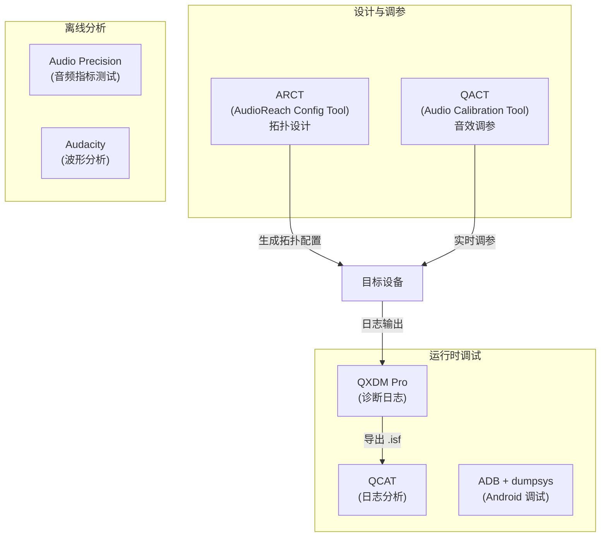
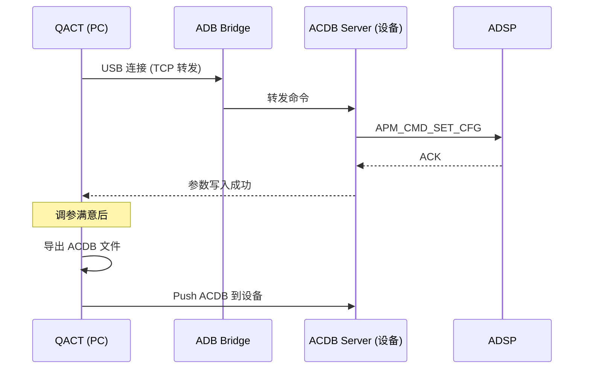
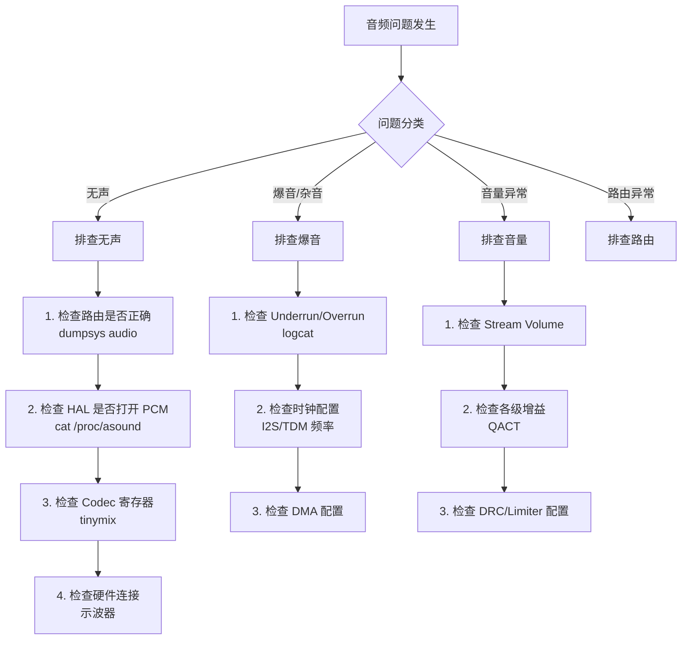

# QACT 调试与工具链 (QACT & Audio Debug Tools)

高通音频开发离不开一套强大的工具链。本章详解 QACT (Qualcomm Audio Calibration Tool)、QXDM、QCAT 等核心调试工具的使用方法与实战技巧。

---

## 1. 工具链全景图



---

## 2. QACT (Qualcomm Audio Calibration Tool)

### 2.1 核心功能

QACT 是高通音频系统最核心的调参工具，用于：
*   **参数调试**：实时修改 ADSP 模块参数（EQ、DRC、增益等）
*   **ACDB 管理**：创建、编辑、导出校准数据库
*   **拓扑浏览**：可视化查看当前活跃的音频拓扑
*   **实时监测**：监控模块状态和信号电平

### 2.2 QACT 工作原理



### 2.3 QACT 连接设置

```bash
# Step 1: 确认设备 ADB 连接
adb devices

# Step 2: 端口转发 (QACT 默认使用 TCP 5558)
adb forward tcp:5558 tcp:5558

# Step 3: 启动设备侧 ACDB 服务
adb shell "acdb_loader_service &"
# 或在 AudioReach 架构中:
adb shell "ats_service &"

# Step 4: QACT 中配置连接
# Transport: TCP
# IP: 127.0.0.1
# Port: 5558
```

### 2.4 QACT 调参实战流程

```
1. 连接设备 → 读取当前 ACDB
2. 选择 Use Case (如: Playback → Speaker)
3. 浏览活跃拓扑 → 定位目标模块 (如 PEQ)
4. 修改参数 → 实时推送到 ADSP (Real-Time)
5. 耳听验证 → 满意后保存到 ACDB
6. 导出 ACDB 文件 → 集成到固件
```

### 2.5 ACDB 文件结构

```
acdb_data/
├── acdb_cal.acdb          # 主校准文件 (所有模块参数)
├── acdb_workspaceFile.qwsp  # QACT 工程文件
├── codec/
│   └── wcd938x/
│       ├── playback_speaker.cal
│       └── record_handset.cal
└── global/
    └── global_cal.acdb    # 全局参数
```

---

## 3. QXDM Pro (诊断日志工具)

### 3.1 用途

*   抓取 ADSP 实时日志 (AR_MSG 输出)
*   监控音频子系统状态
*   捕获 GPR 消息交互
*   分析异常崩溃 (Crash / Watchdog)

### 3.2 连接方式

**方式一：USB 直连**
```
QXDM → Connection → USB → 选择设备 COM 端口
```

**方式二：WiFi/IP 连接 (QNX/车载)**
```bash
# 设备侧启动 diag 路由
diag_socket_app &

# QXDM: Connection → TCP/IP → 设备 IP:port
```

### 3.3 关键日志过滤

| 过滤条件 | 用途 |
|:---|:---|
| `MSG_SSID_QDSP6` | ADSP 所有日志 |
| `MSG_SSID_QDSP6` + `"audio"` | ADSP 音频相关 |
| `MSG_SSID_QDSP6` + `"gpr"` | GPR 通信消息 |
| `MSG_SSID_QDSP6` + `"spf"` | SPF 框架日志 |
| `MSG_SSID_QDSP6` + `"capi"` | CAPI 模块日志 |
| `MSG_SSID_APR` | APR 协议消息 (旧架构) |

### 3.4 QXDM 实用操作

```
# 开始抓取
1. 连接设备
2. 设置 Message Level: HIGH + MED + LOW
3. 点击 "Start Logging"
4. 复现问题
5. 停止 → 保存为 .isf 文件

# 常用 View
- Message View: 查看实时文本日志
- Log Packets: 查看结构化 Log 包
- Events: 系统事件
```

### 3.5 QXDM 实战: 音频问题抓取示例

```
场景 1: ADSP Crash / SSR 分析

  1. QXDM Message View 中过滤:
     SSID = MSG_SSID_QDSP6, Level = FATAL + ERROR
  
  2. 典型 Crash 日志模式:
     [timestamp] FATAL: Exception occurred in audio_pd
     [timestamp] ERROR: Process audio_pd crashed, SSR triggered
     [timestamp] ERROR: spf_svc: graph_close failed, result=0x80004003
  
  3. 定位关键信息:
     → Exception PC (程序计数器) → 对应 CAPI 模块地址
     → Thread ID → 确认是哪个拓扑线程
     → 最后 10 条 MSG → 分析崩溃前操作
  
  4. 联合分析:
     QXDM .isf + ADSP ramdump → 用 addr2line/crash 工具定位源码行

场景 2: 音频无声问题定位

  1. QXDM 过滤: "gpr" + "spf" + "graph"
  
  2. 正常流程日志:
     [T1] gpr_send: APM_CMD_GRAPH_OPEN → graph_id=0x1001
     [T2] gpr_send: APM_CMD_GRAPH_PREPARE → graph_id=0x1001
     [T3] gpr_send: APM_CMD_GRAPH_START → graph_id=0x1001
     [T4] data_cmd: WR_SH_MEM_EP → buf_addr=0xABCD, size=960
  
  3. 异常模式:
     ❌ GRAPH_OPEN 无响应 → ADSP 加载问题
     ❌ GRAPH_START 返回 error → 硬件配置错误
     ❌ WR_SH_MEM 无数据 → HAL 层未送数据
     ❌ 数据送入但无输出 → 查看 Codec/PA mixer 配置

场景 3: 爆音 (Glitch) 定位

  1. QXDM 过滤: "underrun" + "overrun" + "xrun"
  2. 同时 logcat 过滤: AudioFlinger + AudioHAL
  3. 对齐时间戳:
     QXDM [T1] underrun detected, rd_offset=480, wr_offset=480
     logcat [T1] AudioFlinger: underrun on track 0x1234
     → 确认是 AP 侧数据下发不及时
  4. 进一步: Perfetto trace 查看调度延迟
```

---

## 4. QCAT (Qualcomm Crash Analysis Tool)

### 4.1 用途

*   离线分析 QXDM 抓取的 .isf / .dlf 日志文件
*   搜索和过滤大量日志
*   时间线分析
*   多文件对比

### 4.2 典型分析流程

```
1. 用 QXDM 抓取问题日志 (.isf)
2. QCAT 打开 .isf 文件
3. 过滤 "ERROR" / "FATAL" 级别日志
4. 定位异常时间点
5. 查看该时间点前后的上下文日志
6. 分析 root cause
```

### 4.3 QCAT 高级过滤技巧

```
常用过滤表达式:

  按 SSID 过滤:
    SSID == MSG_SSID_QDSP6              → 所有 ADSP 日志
    SSID == MSG_SSID_QDSP6 && Level >= ERROR  → 仅 ADSP 错误

  按关键字搜索:
    Message contains "graph_open"        → 拓扑打开操作
    Message contains "capi" && "error"   → CAPI 模块错误
    Message contains "ssr"               → 子系统重启事件

  按时间范围:
    Timestamp >= T1 && Timestamp <= T2   → 截取问题发生窗口

  多文件对比工作流:
    1. 打开正常场景 .isf (baseline)
    2. 打开异常场景 .isf (faulty)
    3. 对齐时间轴 → 逐条对比
    4. 找到首个分歧点 → 根因
```

---

## 5. ADB 音频调试命令

### 5.1 Android 音频状态查询

```bash
# 音频系统全量 dump
adb shell dumpsys audio

# AudioPolicy 路由状态
adb shell dumpsys audio | grep -A 50 "Audio Policy"

# 活跃音频流
adb shell dumpsys audio | grep -A 20 "AudioTrack"

# AudioFlinger 混音状态
adb shell dumpsys media.audio_flinger

# HAL 层状态
adb shell dumpsys android.hardware.audio.service
```

### 5.2 TinyALSA 调试

```bash
# 列出所有声卡
adb shell cat /proc/asound/cards

# 列出所有 PCM 设备
adb shell cat /proc/asound/pcmall

# 查看 Mixer 控制器
adb shell tinymix -D 0

# 设置 Mixer 值
adb shell tinymix -D 0 "PRI_MI2S_RX Audio Mixer MultiMedia1" 1

# PCM 播放测试
adb shell tinyplay /sdcard/test.wav -D 0 -d 0

# PCM 录音测试
adb shell tinycap /sdcard/record.wav -D 0 -d 0 -c 2 -r 48000 -b 16
```

### 5.3 音频属性与路由

```bash
# 查看音频属性
adb shell getprop | grep audio
adb shell getprop | grep ro.audio

# 音频路由切换日志
adb logcat -s AudioPolicyManager AudioFlinger

# 查看 Audio HAL 属性
adb shell getprop vendor.audio
```

---

## 6. 音频问题排查流程

### 6.1 标准排查步骤



### 6.2 日志关键字速查

| 关键字 | 含义 | 对应问题 |
|:---|:---|:---|
| `underrun` | 播放缓冲区欠载 | 爆音/断音 |
| `overrun` | 录音缓冲区溢出 | 录音数据丢失 |
| `routing` | 路由切换 | 设备切换异常 |
| `xrun` | 缓冲区越界 | 音频断续 |
| `watchdog` | DSP 看门狗超时 | DSP 挂死 |
| `bus error` | 总线错误 | 硬件连接问题 |

---

## 7. ARCT (AudioReach Configuration Tool) 简述

ARCT 是 AudioReach 架构中的拓扑设计工具（替代旧的 ADE）：

| 功能 | 描述 |
|:---|:---|
| **图形化拓扑设计** | 拖拽模块、连接端口 |
| **模块参数编辑** | 设置默认参数值 |
| **Use Case 管理** | 定义不同音频场景的拓扑 |
| **导出配置** | 生成可烧录的配置文件 |
| **仿真** | 部分支持 PC 侧仿真运行 |

---

## 8. 关键参考 (References)

1.  80-VN500-9: *AudioReach QACT Training*
2.  80-VN500-27: *AudioReach SPF Stability Debug Guide*
3.  80-86374-1: *Connecting QUTS/QXDM to QNX IP Address*
4.  KBA-211109231449: *How to Connect QXDM in QNX Platform*
5.  80-VN500-18: *AudioReach System Designer Workflow*
6.  [Qualcomm Developer Network - Audio Tools](https://developer.qualcomm.com/)
