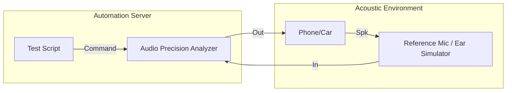

# 音频客观测试指标 (Objective Audio Metrics)

客观测试通过标准化的仪器测量，为音频系统的性能提供可量化的评估数据。本章解析核心指标的行业标准 PASS/FAIL 门槛。

---

## 1. 核心性能指标与行业门槛

### 1.1 总谐波失真加噪声 (THD+N)
*   **物理意义**：信号非线性失真的程度。
*   **门槛**：
    *   **Hi-Fi 级别**：< 0.01%
    *   **智能手机扬声器**：< 1% (由于非线性保护算法，可能会有放宽)
    *   **蓝牙耳机 (AAC/SBC)**：< 0.1%

### 1.2 信噪比 (SNR)
*   **物理意义**：背景底噪的纯净度。
*   **门槛**：
    *   **专业声卡**：> 110 dB
    *   **手机 3.5mm 输出**：> 90 dB
    *   **MEMS 麦克风**：64 dB - 74 dB (典型值)

### 1.3 响度标准 (Loudness - LUFS)
*   **概念**：现代音频（流媒体、电影）不再只看峰值，而看 **LUFS (Loudness Units Full Scale)**。
*   **行业基准**：
    *   **Spotify / YouTube**：-14 LUFS (会自动进行响度归一化)
    *   **电影 (EBU R128)**：-23 LUFS

---

## 2. 频率响应 (Frequency Response)

### 2.1 容差带 (Tolerance Mask)
专业测试不只看单点增益，而要求曲线落在特定的“模板”内。
*   **低频响应**：考察低音下潜（扬声器 Fs 决定）。
*   **高频截止**：考察抗混叠滤波器的性能。

---

## 3. 测试系统拓扑与全自动化

---

## 4. 常见客观测试套件

1.  **POLQA (P.863)**：针对通话语音质量的感知测试（取代 PESQ）。
2.  **STIPA**：公共广播系统的语言清晰度测试。
3.  **TDD (Time Domain Data)**：分析爆音 (Pop/Click) 和启动延迟。

---

## 5. 关键参考 (References)

1.  *Principles of Digital Audio* - Ken C. Pohlmann
2.  [Audio Precision: Fundamental of Audio Test](https://www.ap.com/technical-library/)
3.  [EBU R128 Loudness Normalization Standard](https://tech.ebu.ch/loudness)

---
*Next Topic: [行业通信标准与认证 (Industry Standards)](./02-Industry-Standards.md)*
