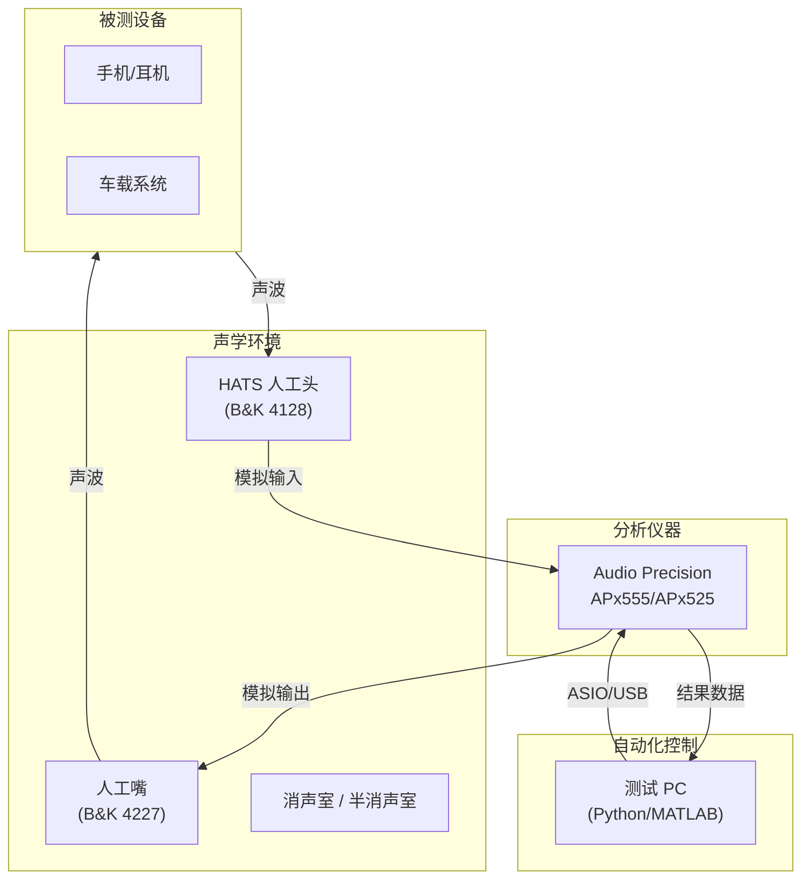

# 音频客观测试指标 (Objective Audio Metrics)

客观测试通过标准化的仪器测量，为音频系统的性能提供可量化的评估数据。本章详细解析每个核心指标的物理意义、测试方法、行业门槛以及常见问题诊断。

---

## 1. 核心性能指标

### 1.1 总谐波失真加噪声 (THD+N)

**物理意义**：衡量信号经过系统后引入的非线性失真和噪声。

```
THD+N 定义:
  THD+N(%) = √(V₂² + V₃² + V₄² + ... + Vnoise²) / V₁ × 100%
  
  V₁:    基波分量 (输入信号频率)
  V₂~Vₙ: 谐波分量 (2f, 3f, 4f...)
  Vnoise: 非谐波噪声

THD+N(dB) = 20 × log₁₀(THD+N ratio)
  例: 0.01% = -80 dB,  1% = -40 dB
```

**测试条件**：

| 参数 | 典型设置 | 说明 |
|:---|:---|:---|
| 测试信号 | 1kHz 正弦波 | 标准频率 |
| 输入电平 | -1 dBFS (数字) / 额定电平 (模拟) | 避免削波 |
| 带宽 | 20Hz-20kHz | A 计权 或 无计权 |
| 分析窗口 | > 1 秒 | 确保稳定 |

**行业门槛**：

| 设备类型 | 优秀 | 合格 | 不合格 |
|:---|:---|:---|:---|
| **Hi-Fi DAC** | < 0.001% | < 0.01% | > 0.05% |
| **专业声卡** | < 0.0005% | < 0.005% | > 0.01% |
| **手机 3.5mm** | < 0.01% | < 0.05% | > 0.1% |
| **手机扬声器** | < 0.5% | < 1% | > 3% |
| **蓝牙耳机** | < 0.05% | < 0.1% | > 0.5% |
| **车载功放** | < 0.01% | < 0.05% | > 0.1% |

**THD+N vs 频率扫描**：

```
THD+N 频率扫描示意:
  THD+N(%)
    1.0│╲                                     ╱
       │ ╲                                   ╱
    0.1│  ╲───────────────────────────────╱
       │   (低频共振)   平坦区域    (高频失真上升)
   0.01│
       └──────────────────────────────────────→ f
        20    100    1k     5k    10k   20kHz

  异常诊断:
    低频 THD+N 偏高 → 扬声器过载 / 电源纹波
    高频 THD+N 偏高 → 运放带宽不足 / 反馈不稳定
    全频段偏高     → 增益设置过高 / 信号链饱和
```

### 1.2 信噪比 (SNR)

**物理意义**：信号功率与背景噪声功率之比。

```
SNR(dB) = 20 × log₁₀(Vsignal / Vnoise)

  测试方法:
    A-weighted SNR: 加 A 计权滤波器 (模拟人耳灵敏度)
    Unweighted SNR: 不加权 (20Hz-20kHz 带通)
    
  A 计权 vs 无计权:
    A-weighted 通常比 unweighted 高 3-5 dB
    因为 A 计权衰减了低频噪声 (人耳不敏感)
```

**行业门槛**：

| 设备 | 优秀 | 合格 | 说明 |
|:---|:---|:---|:---|
| **专业 ADC/DAC** | > 120 dB | > 110 dB | ESS/AKM 芯片 |
| **手机 Codec** | > 100 dB | > 90 dB | 集成方案 |
| **MEMS 麦克风** | > 70 dB | > 64 dB | AOP 也很关键 |
| **蓝牙耳机** | > 95 dB | > 85 dB | DAC 性能 |
| **车载功放** | > 100 dB (A-wt) | > 90 dB | 底噪要求高 |

### 1.3 串扰 (Crosstalk)

```
串扰定义:
  一个声道的信号泄漏到另一个声道的程度
  
  Crosstalk(dB) = 20 × log₁₀(V_leakage / V_signal)
  
  测试方法:
    左声道输入 1kHz 满幅, 右声道输入静音
    测量右声道的泄漏电平

行业门槛:
  专业 DAC:  < -110 dB
  手机 Codec: < -80 dB
  蓝牙耳机:  < -60 dB
  
  串扰过大原因:
    - PCB 布线耦合
    - 共用电源纹波
    - IC 内部隔离不足
```

### 1.4 互调失真 (IMD)

```
IMD 测试:
  输入两个频率 (f1, f2)，测量非线性产生的组合频率分量
  
  常用方法:
    SMPTE/DIN: f1=60Hz, f2=7kHz (4:1 幅度比)
    CCIF/ITU:  f1=19kHz, f2=20kHz (1:1 幅度比)
    
  IMD 产物频率:
    f2 ± f1, f2 ± 2f1, 2f2 ± f1, ...
    
  行业门槛:
    Hi-Fi:    < 0.01%
    消费电子: < 0.1%
```

---

## 2. 响度与动态范围指标

### 2.1 LUFS (Loudness Units Full Scale)

```
LUFS 测量流程 (ITU-R BS.1770):

  输入信号 → K 计权滤波器 → 均方值计算 → 门限判定 → 输出 LUFS
  
  K 计权:
    第一级: 预加重高通 (+4dB @ 高频, 模拟头部效应)
    第二级: 高通滤波器 (衰减 < 100Hz)
    
  门限 (Gating):
    绝对门限: -70 LUFS (排除静音段)
    相对门限: -10 dB (排除极低音量段)
    → 只计算"有效"音量段的平均响度

测量类型:
  Momentary (M):  400ms 窗口, 实时监控
  Short-term (S): 3s 窗口, 短时趋势
  Integrated (I): 全曲平均, 最终评判值
  True Peak (TP): 过采样后的峰值 (非 sample peak)
```

**行业标准**：

| 平台/标准 | 目标 LUFS | True Peak 限制 | 说明 |
|:---|:---|:---|:---|
| **EBU R128** | -23 LUFS | -1 dBTP | 欧洲广播标准 |
| **ATSC A/85** | -24 LKFS | -2 dBTP | 北美电视标准 |
| **Spotify** | -14 LUFS | -1 dBTP | 流媒体 |
| **Apple Music** | -16 LUFS | -1 dBTP | 流媒体 |
| **YouTube** | -14 LUFS | -1 dBTP | 视频平台 |
| **Netflix** | -27 LUFS (对白) | -2 dBTP | 电影/剧集 |

### 2.2 动态范围 (Dynamic Range)

```
动态范围:
  最大不失真输出 与 底噪 之间的差值
  
  DR = SNR + Headroom
  
  典型值:
    16-bit PCM:  ~96 dB (理论)
    24-bit PCM:  ~144 dB (理论), 实际受限于模拟前端
    专业 ADC:    ~120 dB (实测)
    
  音乐动态范围 (DR Score):
    古典音乐:   DR14-DR20 (高动态)
    爵士:       DR10-DR16
    流行/摇滚:  DR5-DR10 (响度战争)
    EDM/电子:   DR4-DR8
```

---

## 3. 频率响应 (Frequency Response)

### 3.1 测试方法

```
频率响应测试方法:

  方法1: 正弦扫频 (Swept Sine)
    优势: 高动态范围, 可同时测 THD+N vs 频率
    劣势: 耗时 (~10-30 秒)
    
  方法2: 对数扫频 (Log Chirp)
    优势: 快速, 可提取脉冲响应
    劣势: 动态范围受限于 crest factor
    
  方法3: 噪声激励 (Pink/White Noise)
    优势: 快速, 接近真实信号
    劣势: 精度较低, 需要平均
    
  方法4: MLS (最大长度序列)
    优势: 优秀的噪声抑制
    劣势: 对非线性敏感
```

### 3.2 容差带 (Tolerance Mask)

```
手机扬声器频响容差 (示意):

  dB (相对 1kHz)
   +10│
      │         ┌───────────────────────┐
    +5│         │                       │
      │    ┌────┤    PASS 区域          ├────┐
     0│────┤    │                       │    ├───
      │    └────┤                       ├────┘
    -5│         │                       │
      │         └───────────────────────┘
   -10│
      └─────────────────────────────────────────→ f
       200Hz   500Hz   1kHz        5kHz   10kHz

  典型要求:
    200Hz-8kHz: ±5 dB (相对 1kHz)
    通话频段 300Hz-3.4kHz: ±3 dB
    
  车载扬声器频响:
    80Hz-16kHz: ±3 dB (更严格)
```

---

## 4. 语音质量客观评估

### 4.1 PESQ / POLQA

| 指标 | PESQ (P.862) | POLQA (P.863) |
|:---|:---|:---|
| 标准 | ITU-T P.862 (2001) | ITU-T P.863 (2018) |
| 评分范围 | 1.0-4.5 MOS | 1.0-5.0 MOS |
| 支持带宽 | 窄带 (NB), 宽带 (WB) | NB, WB, 超宽带 (SWB), 全频带 (FB) |
| 采样率 | 8/16 kHz | 8/16/32/48 kHz |
| 应用 | 传统语音测试 | 现代 VoLTE/VoIP/VoWiFi |

### 4.2 其他语音质量指标

| 指标 | 全称 | 应用 |
|:---|:---|:---|
| **STOI** | Short-Time Objective Intelligibility | 语音清晰度 (0-1) |
| **SI-SNR** | Scale-Invariant SNR | 语音分离/增强评估 |
| **DNSMOS** | Deep Noise Suppression MOS | 微软降噪评估 (P.835) |
| **NISQA** | Non-Intrusive Speech Quality | 无参考端语音质量 |

---

## 5. 测试系统与自动化

### 5.1 测试系统拓扑



### 5.2 Audio Precision 常用测试项

| 测试项 | AP 函数 | 测试条件 | 关键结果 |
|:---|:---|:---|:---|
| THD+N | `THD+N Ratio` | 1kHz, -1dBFS | 失真百分比 |
| 频响 | `Frequency Response` | 20Hz-20kHz sweep | dB vs Hz 曲线 |
| SNR | `SNR` | 静音输入 / A-wt | dB 值 |
| 串扰 | `Crosstalk` | 1kHz, 仅一声道 | dB 隔离度 |
| IMD | `IMD` | SMPTE 60Hz+7kHz | 百分比 |
| 延迟 | `Delay / Latency` | 脉冲激励 | ms |
| 响度 | `Loudness (BS.1770)` | 音乐/语音素材 | LUFS |

### 5.3 Python 自动化示例

```python
# Audio Precision APx API 自动化测试框架 (伪代码)
import APx500_API as apx

def run_audio_test_suite(dut_name: str):
    ap = apx.APx525()
    ap.connect()
    
    results = {}
    
    # THD+N 测试
    ap.set_generator(freq=1000, level_dbfs=-1.0)
    ap.set_analyzer(bandwidth=(20, 20000), weighting='none')
    thd = ap.measure_thdn()
    results['THD+N_1kHz'] = thd
    assert thd < 0.1, f"THD+N FAIL: {thd}%"
    
    # 频率响应
    fr_data = ap.sweep_frequency(start=20, stop=20000, points=200)
    flatness = max(fr_data) - min(fr_data)  # dB
    results['FR_flatness'] = flatness
    
    # SNR
    ap.set_generator(level_dbfs=-999)  # 静音
    noise_floor = ap.measure_rms(weighting='A')
    snr = -1.0 - noise_floor  # dBFS
    results['SNR_A'] = snr
    
    # 导出报告
    ap.export_report(f"{dut_name}_report.pdf", results)
    ap.disconnect()
    return results
```

---

## 6. 常见测试问题诊断

| 异常现象 | 可能原因 | 排查方法 |
|:---|:---|:---|
| THD+N 偏高 (全频段) | 增益设置过高 / 信号削波 | 降低输入电平, 检查波形 |
| THD+N 偏高 (低频) | 扬声器过载 / 电源纹波 | 降低音量, 检查电源 |
| SNR 偏低 | 接地回路 / 电磁干扰 | 检查接地, 屏蔽线缆 |
| 频响不平 (某频段凹陷) | 声学腔体共振 / 滤波器设计 | 仿真验证, 调整腔体 |
| 串扰偏高 | PCB 布线耦合 | 增加走线间距, 加地线隔离 |
| LUFS 不达标 | DRC/Limiter 设置不当 | 调整阈值和增益 |
| 延迟过高 | Buffer 过大 / SRC 引入 | 减小 buffer, 统一采样率 |

---

## 7. 关键参考 (References)

1.  *Principles of Digital Audio* - Ken C. Pohlmann
2.  [Audio Precision: Fundamentals of Audio Test](https://www.ap.com/technical-library/)
3.  [EBU R128 Loudness Normalization Standard](https://tech.ebu.ch/loudness)
4.  [ITU-T P.863 POLQA](https://www.itu.int/rec/T-REC-P.863)
5.  [ITU-R BS.1770 Loudness Measurement](https://www.itu.int/rec/R-REC-BS.1770)
6.  [AES17 - Digital Audio Measurement](https://www.aes.org/publications/standards/)

---
*Next Topic: [行业通信标准与认证 (Industry Standards)](./02-Industry-Standards.md)*
