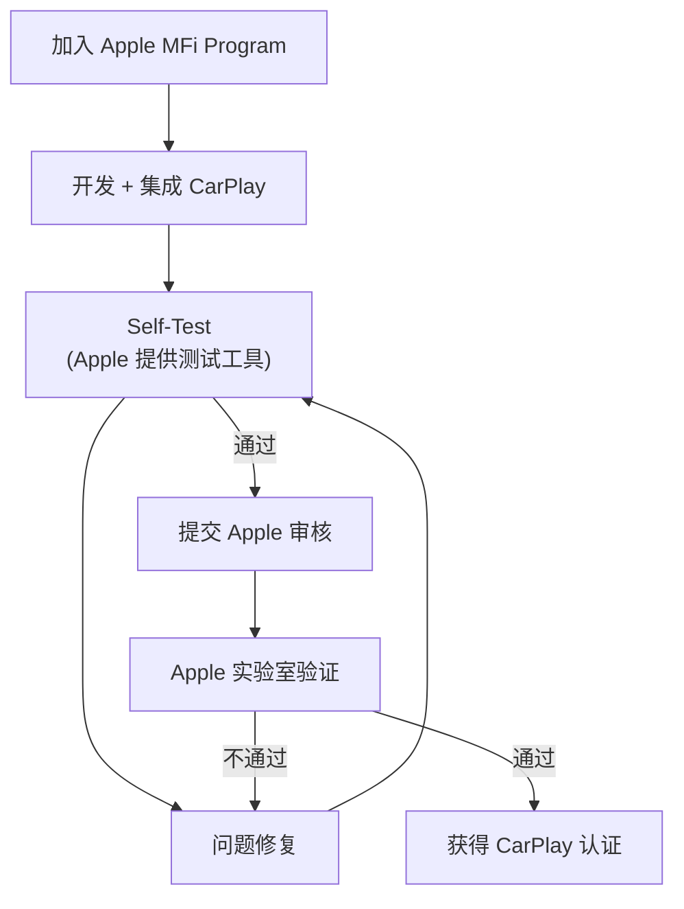
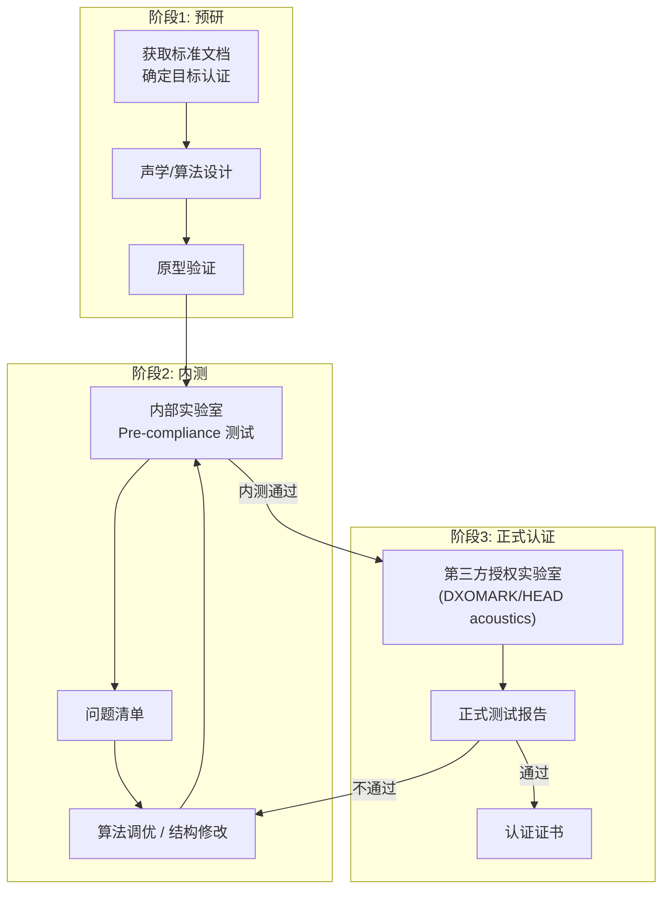

# 行业通信标准与认证 (Industry Standards & Certifications)

在消费电子和汽车领域，音频产品不仅要"好听"，还必须满足一系列国际标准和第三方平台的认证要求。本章详细列出各标准的具体测试项目、PASS/FAIL 阈值和测试环境配置。

---

## 1. 语音质量评估标准 (ITU-T)

### 1.1 标准演进

| 标准 | 年份 | 频带 | 替代关系 | 分数范围 |
|:---|:---|:---|:---|:---|
| **P.861 (PSQM)** | 1996 | 窄带 | 已废弃 | 0-6.5 |
| **P.862 (PESQ)** | 2001 | 窄带/宽带 | 被 POLQA 取代 | -0.5 ~ 4.5 |
| **P.863 (POLQA)** | 2011/2018 | 窄带/宽带/全频带 | 当前标准 | 1.0 ~ 5.0 |

### 1.2 POLQA (P.863) 详解

```
POLQA 测试模式:
  NB (窄带):  300-3400 Hz,  8kHz 采样
  SWB (超宽带): 50-14000 Hz, 48kHz 采样
  FB (全频带): 20-20000 Hz, 48kHz 采样

测试方法:
  1. 播放标准语料 (ITU-T P.501 参考语音)
  2. 通过 DUT 传输/处理
  3. 比较降级后的信号与参考信号
  4. 输出 MOS-LQO 分数

商用级门槛:
  手机通话:     MOS > 3.5 (NB), > 3.8 (SWB)
  VoLTE/VoNR:  MOS > 4.0 (SWB)
  会议系统:     MOS > 3.8 (SWB)
  车载免提:     MOS > 3.2 (NB), > 3.5 (SWB)
```

---

## 2. 手机通话标准 (3GPP)

### 2.1 3GPP TS 26.131 / TS 26.132

| 标准 | 内容 | 说明 |
|:---|:---|:---|
| **TS 26.131** | 手持/免提终端声学性能要求 | 定义 PASS/FAIL 阈值 |
| **TS 26.132** | 终端声学测试方法 | 定义测试 Setup 和步骤 |

### 2.2 关键测试项目与阈值

| 测试项 | 手持模式 | 免提模式 | 说明 |
|:---|:---|:---|:---|
| **送话灵敏度 (SLR)** | 5-11 dB | -1 ~ +5 dB | 发送响度评定值 |
| **受话灵敏度 (RLR)** | -1 ~ +5 dB | -1 ~ +5 dB | 接收响度评定值 |
| **送话频响** | ±3dB (100-4kHz) | ±5dB | 发送频率响应容差 |
| **受话频响** | ±3dB (100-4kHz) | ±5dB | 接收频率响应容差 |
| **STOI (送话)** | > 0.6 (噪声下) | > 0.5 | 语音可懂度 |
| **AEC (ERLE)** | > 30dB | > 40dB | 回声消除能力 |
| **AGC 范围** | - | ±10dB 输入变化 → ±3dB 输出变化 | 增益控制 |
| **延迟 (单向)** | < 100ms | < 150ms | 端到端延迟 |
| **背景噪声抑制** | - | > 6dB | 环境噪声衰减 |

### 2.3 测试环境配置

```
手持模式 (Handset):
  - 人工耳 (Ear Simulator, IEC 60318-4)
  - 人工嘴 (Mouth Simulator, ITU-T P.51)
  - HATS (Head and Torso Simulator)
  - 参考点: ERP (Ear Reference Point) / MRP (Mouth Reference Point)

免提模式 (Hands-free):
  - 测试距离: 50cm (手机) / 车内标准位置
  - 背景噪声: Hoth 噪声 / 车噪 (P.56, 不同车速)
  - 多角度测试: 0°, ±30°, ±60°
```

---

## 3. 车载免提通话标准

### 3.1 ITU-T P.1100 / P.1110

| 标准 | 频带 | 适用 |
|:---|:---|:---|
| **P.1100** | 窄带 (NB, 300-3400Hz) | 2G/3G 车载通话 |
| **P.1110** | 宽带 (WB, 50-7kHz) | 4G/5G HD Voice 车载 |

### 3.2 P.1110 核心测试项

| 测试类别 | 具体项目 | PASS 条件 |
|:---|:---|:---|
| **送话** | 灵敏度 SLR | 14 ± 3 dB |
| | 频率响应 | 模板内 (±4dB) |
| | 背景噪声下 POLQA | > 2.6 (65km/h Hoth noise) |
| **受话** | 灵敏度 RLR | 4 ± 4 dB |
| | 频率响应 | 模板内 |
| | 最大音量 distortion | THD+N < 3% |
| **双讲** | 双讲衰减 | 送话衰减 < 6dB |
| | 双讲 POLQA | > 2.5 |
| **回声** | 终端耦合损耗 TCLw | > 46 dB |
| | 收敛时间 | < 3 秒 |
| | 通话中断后恢复 | < 1 秒 |
| **延迟** | 单向口到耳延迟 | < 200ms |
| **噪声** | 空闲信道噪声 | < -64 dBm0p |
| | 噪声抑制 (静止) | > 6 dB |
| | 噪声抑制 (高速) | > 10 dB |

### 3.3 测试环境

```
车载免提测试环境:
  ┌───────────────────────────────────────┐
  │              测试车辆 / 消声室          │
  │                                       │
  │   [MRP] ←50cm→ [人工嘴]              │
  │     ↑                                 │
  │   驾驶员头部位置                       │
  │                                       │
  │   [REF MIC]  [车载麦克风阵列]          │
  │                                       │
  │   [扬声器] ← A2B/I2S → [主机]        │
  │                                       │
  │   背景噪声发生器:                      │
  │     - 静止: 40 dBA                    │
  │     - 60km/h: 65 dBA                  │
  │     - 120km/h: 75 dBA                 │
  └───────────────────────────────────────┘
```

---

## 4. Apple CarPlay 音频认证

### 4.1 认证要求摘要

| 测试项 | 要求 | 说明 |
|:---|:---|:---|
| **Audio Latency** | ≤ 75ms (one-way) | USB/Wi-Fi 通路延迟 |
| **AEC Performance** | ERLE > 35dB | 回声消除 |
| **送话频响** | 100-7000Hz 模板内 | 宽带要求 |
| **受话频响** | 100-7000Hz 模板内 | |
| **双讲** | 衰减 < 6dB | 全双工性能 |
| **采样率** | 16kHz (发送), 48kHz (接收) | |
| **Siri 集成** | 语音指令响应 < 500ms | 唤醒到响应 |

### 4.2 认证流程



---

## 5. Microsoft Teams 认证

### 5.1 Teams Room / Personal 设备要求

| 类别 | 测试项 | 要求 |
|:---|:---|:---|
| **音频输入** | 拾音距离 | ≥ 2m (Room), ≥ 0.7m (Personal) |
| | 频率响应 | 200-8000Hz ±3dB |
| | THD+N | < 1% |
| | 自噪声 | < 35 dBA |
| **音频输出** | 频率响应 | 200-8000Hz ±5dB |
| | 最大声压级 | > 80 dBA @ 0.5m |
| | THD+N | < 3% |
| **回声消除** | ERLE | > 40dB |
| | 收敛时间 | < 5 秒 |
| **全双工** | 双讲性能 | 发送衰减 < 3dB |
| **噪声抑制** | 送话 NS 能力 | > 12dB (Office noise) |
| **延迟** | 端到端 | < 100ms |
| **兼容性** | USB 枚举 | 即插即用，UAC 标准 |
| | 控制按钮 | Mute/Volume/Hook 按键映射 |

### 5.2 Zoom Certified

| 测试项 | 要求 |
|:---|:---|
| 音频输入频响 | 100-8000Hz |
| AEC 性能 | ERLE > 30dB |
| 全双工 | 双讲衰减 < 6dB |
| 音量一致性 | ±2dB (不同音量档位) |
| 延迟 | < 150ms |

---

## 6. 认证测试完整流程



### 6.1 常用测试实验室

| 实验室 | 专长 | 地区 |
|:---|:---|:---|
| **HEAD acoustics** | 车载/通信 (P.1100/P.1110) | 德国 |
| **DXOMARK** | 手机音频评测 | 法国 |
| **Allion** | USB/蓝牙互操作性 | 台湾 |
| **UL (Intertek)** | Teams/Zoom 认证 | 全球 |
| **Apple 授权实验室** | CarPlay | 全球 |

---

## 7. 车规音频 EMC 与可靠性标准

### 7.1 车载 EMC 标准

| 标准 | 内容 | 测试项 | 适用 |
|:---|:---|:---|:---|
| **CISPR 25** | 车载设备辐射/传导发射限值 | 传导发射 (150kHz-30MHz)、辐射发射 (30MHz-1GHz) | 所有车载电子设备 |
| **ISO 11452** | 车载设备抗扰度 | 大电流注入 (BCI)、散装电流注入、辐射抗扰 | 车载音频主机/功放 |
| **ISO 7637** | 电源瞬态抗扰度 | Load Dump (最高 40V)、瞬态脉冲 | 功放电源设计 |
| **ISO 16750** | 环境可靠性 | 温度 (-40~+85°C)、湿度、振动、盐雾 | 车载全部件 |

### 7.2 车载音频元器件认证

| 认证 | 适用 | 要求 |
|:---|:---|:---|
| **AEC-Q100** | IC 芯片 (Codec/DSP/功放) | 温度循环、HTOL、ESD 等 |
| **AEC-Q103** | MEMS 器件 (麦克风) | 振动、跌落、高温存储 |
| **AEC-Q104** | 多芯片模块 | 组合应力测试 |
| **IATF 16949** | 供应商质量体系 | 汽车行业质量管理体系认证 |

---

## 8. Hi-Res Audio 认证

### 8.1 日本音频协会 (JAS) Hi-Res 认证

```
Hi-Res Audio 定义 (Japan Audio Society):
  "能够再现超越 CD 品质音频的设备/内容"
  
  CD 规格: 16bit / 44.1kHz
  Hi-Res 最低要求:
    播放设备: 支持 96kHz/24bit 或更高
    录音设备: 支持 96kHz/24bit 或更高
    耳机/扬声器: 频率响应 ≥ 40kHz

Hi-Res Audio Wireless (无线 Hi-Res):
  2019 年新增标准
  要求: 蓝牙编解码支持 96kHz/24bit
  认证 Codec: LDAC, aptX HD, aptX Adaptive, LHDC
  注: SBC/AAC 不符合 Hi-Res Wireless 标准
```

### 8.2 各平台 Hi-Res 技术要求

| 平台/认证 | DAC 要求 | 采样率 | 位深 | 编解码格式 |
|:---|:---|:---|:---|:---|
| **JAS Hi-Res** | SNR > 100dB | ≥ 96kHz | ≥ 24bit | FLAC/ALAC/DSD/WAV |
| **Hi-Res Wireless** | - | ≥ 96kHz (无线传输) | ≥ 24bit | LDAC/aptX HD |
| **MQA (已停运)** | 支持 MQA 解码 | 原始可达 384kHz | 24bit | MQA 折叠编码 |
| **Apple Lossless** | - | 最高 192kHz | 24bit | ALAC |
| **Dolby Atmos Music** | 空间音频渲染 | 48kHz | 24bit | EC-3/AC-4 |

---

## 9. 其他重要标准

| 标准 | 领域 | 内容 |
|:---|:---|:---|
| **IEC 60268** | 音频设备 | 声音系统设备通用测量方法 |
| **IEC 61672** | 声级计 | 声级测量仪器规范 |
| **ISO 3382** | 建筑声学 | 混响时间 RT60 测量 |
| **ETSI ES 202 739** | 通话降噪 | 背景噪声管理 |
| **ETSI TS 103 224** | eCall | 紧急呼叫音频要求 |
| **AES67** | 专业音频网络 | IP 音频互操作标准 |
| **Bluetooth SIG** | 蓝牙音频 | A2DP/HFP/LE Audio 认证 |
| **3GPP TS 26.114** | IMS 多媒体 | VoLTE/VoNR 媒体处理要求 |
| **3GPP TS 26.441** | EVS 编解码 | 增强语音服务 (9.6-128kbps) |
| **ETSI EG 202 396-1** | 语音通信 | 背景噪声模拟 (办公/车载/街道) |

---

## 10. 关键参考 (References)

1.  [ITU-T P.863: POLQA](https://www.itu.int/rec/T-REC-P.863)
2.  [ITU-T P.1110: Wideband Hands-free Communication](https://www.itu.int/rec/T-REC-P.1110)
3.  [3GPP TS 26.131: Terminal Acoustic Characteristics](https://portal.3gpp.org/desktopmodules/Specifications/SpecificationDetails.aspx?specificationId=1420)
4.  [3GPP TS 26.132: Acoustics Test Methods](https://portal.3gpp.org/desktopmodules/Specifications/SpecificationDetails.aspx?specificationId=1421)
5.  [Apple CarPlay Developer](https://developer.apple.com/carplay/)
6.  [Microsoft Teams Device Certification](https://learn.microsoft.com/en-us/microsoftteams/devices/usb-devices)
7.  [HEAD acoustics - Automotive Audio Testing](https://www.head-acoustics.com/)

---
*Next Module: [11. 学习路径与资源 (Learning Path)](../11-Learning-Path-Resources/README.md)*
