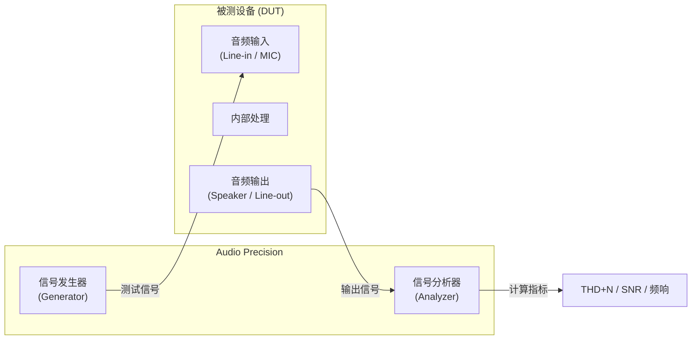
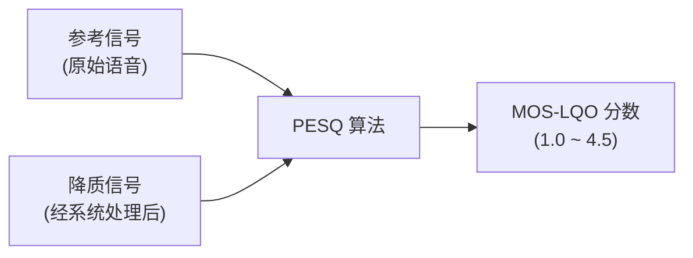
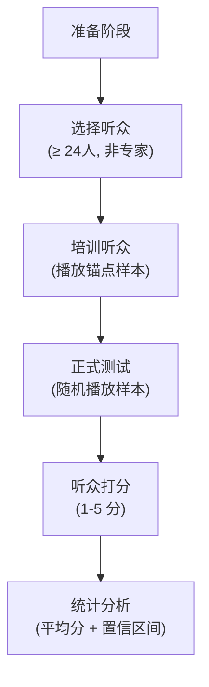

# 音频测试工具实操指南 (Testing Tools & Practice)

本章介绍音频开发中最常用的测试工具和方法论——从专业仪器 Audio Precision 到开源工具 Audacity，以及自动化测试脚本的编写实践。

---

## 1. Audio Precision (AP) 专业测试系统

### 1.1 概述

Audio Precision 是音频行业"黄金标准"测试仪器，广泛用于手机、车载、耳机等产品的出厂测试和研发验证。

| 型号 | 定位 | 通道数 | 典型应用 |
|:---|:---|:---|:---|
| **APx555** | 旗舰 | 2+2 | 研发实验室 |
| **APx525** | 标准 | 2+2 | 生产线 / 研发 |
| **APx515** | 入门 | 2 | 小型实验室 |
| **APx1701** | 声学专用 | 多通道 | 扬声器/麦克风测试 |

### 1.2 AP 测试系统拓扑



### 1.3 常用测试项目与操作

#### THD+N (总谐波失真+噪声)

```
测试条件:
- 信号: 1kHz 正弦波, 0dBFS
- 带宽: 20Hz - 20kHz (A-Weighted 可选)
- 采样: 48kHz / 24bit

操作步骤:
1. AP Generator → 输出 1kHz Sine → DUT 输入
2. DUT 输出 → AP Analyzer Input
3. AP 自动计算: THD+N = √(H2² + H3² + ... + Noise²) / Fundamental
4. 读取结果: 典型手机扬声器 THD+N < 1% @ 1kHz
```

#### 频率响应 (Frequency Response)

```
测试条件:
- 信号: 对数扫频 (Log Sweep), 20Hz - 20kHz
- 电平: -20dBFS (避免非线性)
- 参考: 1kHz 归一化

操作步骤:
1. AP Generator → Swept Sine → DUT
2. AP Analyzer → 逐频率测量幅度
3. 绘制频响曲线 (dB vs Hz)
4. 判断: ±3dB 为可接受偏差范围
```

#### 信噪比 (SNR)

```
测量方法:
1. DUT 播放满幅信号 → 测量 RMS 电平 (Signal)
2. DUT 静音 → 测量残余噪声 RMS (Noise)
3. SNR = 20 * log10(Signal / Noise) dB

典型指标:
- Hi-Fi DAC: > 120dB
- 手机 Codec: > 100dB
- 蓝牙耳机: > 90dB
```

### 1.4 AP 自动化测试 (APx500 API)

Audio Precision 提供 COM/API 接口，支持自动化：

```python
# Python 通过 COM 接口控制 APx500
import win32com.client

# 连接 APx500 软件
apx = win32com.client.Dispatch("APx500.Application")
project = apx.OpenProject("MyTestSequence.approjx")

# 运行测试序列
for measurement in project.Measurements:
    measurement.Run()
    
    # 读取结果
    result = measurement.Result
    thd_n = result.GetValue("THD+N Ratio", "dB")
    print(f"{measurement.Name}: THD+N = {thd_n:.2f} dB")
    
    # 判断 Pass/Fail
    if thd_n > -60:  # -60dB = 0.1%
        print("FAIL!")
```

---

## 2. PESQ / POLQA 语音质量评估

### 2.1 PESQ (P.862) — 经典标准

**PESQ (Perceptual Evaluation of Speech Quality)** 是 ITU-T 标准化的客观语音质量评估算法。



**评分含义**：

| MOS 分数 | 主观质量 | 典型场景 |
|:---|:---|:---|
| 4.0 - 4.5 | 优秀 | VoLTE HD Voice |
| 3.5 - 4.0 | 良好 | WiFi 通话 |
| 3.0 - 3.5 | 一般 | 普通蓝牙 HFP |
| 2.5 - 3.0 | 较差 | 高噪声环境通话 |
| < 2.5 | 不可接受 | 严重失真 |

### 2.2 POLQA (P.863) — 新一代标准

POLQA 是 PESQ 的演进版本，支持：
*   **超宽带 (Super-Wideband)**：评估 50Hz-14kHz 范围
*   **全频带 (Fullband)**：评估 50Hz-20kHz 范围
*   更好的时间对齐能力

### 2.3 实际测试流程

```bash
# 使用 POLQA 命令行工具 (商业授权)
polqa --ref reference.wav --deg degraded.wav --mode SWB

# 输出示例:
# POLQA MOS-LQO: 3.82
# Delay: 120ms
# Active Speech Level: -26.0 dBov

# 使用开源 ViSQOL (Google 开源的 MOS 预测)
visqol --reference_file ref.wav --degraded_file deg.wav --use_speech_mode
```

### 2.4 测试信号要求

| 参数 | PESQ | POLQA |
|:---|:---|:---|
| 采样率 | 8kHz / 16kHz | 8-48kHz |
| 信号时长 | 8-30 秒 | 8-30 秒 |
| 信号内容 | ITU-T P.501 标准语料 | ITU-T P.501 / 自定义 |
| 静音段 | 前后各留 0.5s | 前后各留 0.5s |

---

## 3. MOS 主观评价方法

### 3.1 什么是 MOS

**MOS (Mean Opinion Score)** 是由真实人类听众对音频质量进行打分的主观评价方法，是音质评估的"终极裁判"。

### 3.2 ITU-T P.800 标准流程



### 3.3 MOS 评分量表

| 分数 | 质量描述 | 主观感受 |
|:---|:---|:---|
| **5** | Excellent (优秀) | 无可感知的失真 |
| **4** | Good (良好) | 可察觉但不恼人 |
| **3** | Fair (一般) | 略有恼人，但可接受 |
| **2** | Poor (较差) | 恼人但不阻碍理解 |
| **1** | Bad (很差) | 非常恼人，难以理解 |

### 3.4 测试场景分类

| 测试类型 | ITU-T 标准 | 评估维度 |
|:---|:---|:---|
| **ACR (绝对类别评分)** | P.800 | 单向听感 |
| **DCR (降质类别评分)** | P.800 | 与参考对比 |
| **CCR (比较类别评分)** | P.800 | A/B 对比 |
| **MUSHRA** | ITU-R BS.1534 | 中等质量音频编解码器比较 |

### 3.5 MUSHRA 测试方法

MUSHRA (MUltiple Stimuli with Hidden Reference and Anchor) 专为音频编解码器评估设计：

```
听众界面:
┌─────────────────────────────────────────┐
│  参考 (Reference)     [播放]            │
│                                         │
│  样本 A  ████████████░░░  滑条 (0-100)  │
│  样本 B  ██████████████░  滑条 (0-100)  │
│  样本 C  ████░░░░░░░░░░░  滑条 (0-100)  │
│  样本 D  ████████████████  滑条 (0-100)  │
│  (其中一个是隐藏参考, 一个是锚点)        │
└─────────────────────────────────────────┘
```

*   **隐藏参考 (Hidden Reference)**：听众必须给出 100 分才表示其可靠
*   **低锚点 (Low Anchor)**：3.5kHz 低通滤波版本，定义"差"的基线

---

## 4. Audacity 音频分析实操

### 4.1 常用分析功能

| 功能 | 操作路径 | 用途 |
|:---|:---|:---|
| **频谱分析** | Analyze → Plot Spectrum | 查看频域分布 |
| **频谱图视图** | View → Spectrogram | 时频分析 |
| **电平测量** | Analyze → Contrast | 测量 RMS/Peak |
| **生成测试信号** | Generate → Tone/Noise | 创建测试信号 |
| **录音比对** | 导入两轨对比 | 前后差异分析 |

### 4.2 命令行批量分析 (SoX)

```bash
# 安装 SoX (Sound eXchange)
brew install sox  # macOS
apt install sox   # Linux

# 查看音频文件信息
sox --info recording.wav

# 测量 RMS 电平
sox recording.wav -n stats

# 生成 1kHz 测试音
sox -n -r 48000 -b 16 test_1k.wav synth 10 sine 1000

# 频谱分析 (输出到文本)
sox recording.wav -n spectrogram -o spectrum.png

# 批量转换格式
for f in *.raw; do
    sox -r 48000 -b 16 -c 2 -e signed "$f" "${f%.raw}.wav"
done

# A加权滤波后测量
sox recording.wav -n sinc 20-20000 stats
```

### 4.3 Python 音频分析脚本

```python
import numpy as np
import soundfile as sf
from scipy import signal
import matplotlib.pyplot as plt

def analyze_audio(filepath):
    """基础音频分析"""
    data, sr = sf.read(filepath)
    
    # RMS 电平
    rms = np.sqrt(np.mean(data**2))
    rms_db = 20 * np.log10(rms + 1e-10)
    
    # Peak 电平
    peak = np.max(np.abs(data))
    peak_db = 20 * np.log10(peak + 1e-10)
    
    # Crest Factor
    crest_factor = peak_db - rms_db
    
    print(f"Sample Rate: {sr} Hz")
    print(f"Duration: {len(data)/sr:.2f} s")
    print(f"RMS Level: {rms_db:.1f} dBFS")
    print(f"Peak Level: {peak_db:.1f} dBFS")
    print(f"Crest Factor: {crest_factor:.1f} dB")
    
    return data, sr

def measure_thd(data, sr, fundamental_freq=1000):
    """测量 THD (总谐波失真)"""
    N = len(data)
    freq = np.fft.rfftfreq(N, 1/sr)
    spectrum = np.abs(np.fft.rfft(data)) / N
    
    # 找到基频幅度
    fund_idx = np.argmin(np.abs(freq - fundamental_freq))
    fund_amp = spectrum[fund_idx]
    
    # 找到各次谐波幅度
    harmonics_power = 0
    for h in range(2, 10):
        h_idx = np.argmin(np.abs(freq - fundamental_freq * h))
        harmonics_power += spectrum[h_idx]**2
    
    thd = np.sqrt(harmonics_power) / fund_amp * 100
    print(f"THD @ {fundamental_freq}Hz: {thd:.4f}%")
    return thd

def plot_frequency_response(data, sr):
    """绘制频率响应"""
    freq, psd = signal.welch(data, sr, nperseg=4096)
    
    plt.figure(figsize=(10, 4))
    plt.semilogx(freq, 10 * np.log10(psd + 1e-10))
    plt.xlabel('Frequency (Hz)')
    plt.ylabel('Power (dB)')
    plt.title('Frequency Response')
    plt.grid(True)
    plt.xlim(20, 20000)
    plt.savefig('freq_response.png', dpi=150)
    plt.show()
```

---

## 5. Android 端自动化音频测试

### 5.1 adb + tinyalsa 录音验证

```bash
#!/bin/bash
# 自动化录音质量验证脚本

DEVICE_PATH="/data/local/tmp"
LOCAL_PATH="./test_results"
DURATION=5  # 录音时长 (秒)

# 1. 推送测试播放文件
adb push test_1khz_48k.wav $DEVICE_PATH/

# 2. 同时播放和录音 (loopback 测试)
adb shell "tinyplay $DEVICE_PATH/test_1khz_48k.wav -D 0 -d 0 &"
adb shell "tinycap $DEVICE_PATH/recorded.wav -D 0 -d 0 \
    -c 2 -r 48000 -b 16 -T $DURATION"

# 3. 拉取录音文件
mkdir -p $LOCAL_PATH
adb pull $DEVICE_PATH/recorded.wav $LOCAL_PATH/

# 4. 本地分析
python3 analyze_audio.py $LOCAL_PATH/recorded.wav
```

### 5.2 CTS Audio 测试

Android CTS (Compatibility Test Suite) 包含音频相关测试：

```bash
# 运行 CTS 音频模块
cts-tradefed run cts -m CtsAudioTestCases

# 常见测试项:
# - AudioTrack 基本功能
# - AudioRecord 基本功能
# - 采样率支持
# - 音频延迟
# - USB Audio 兼容性
# - 蓝牙音频
```

---

## 6. 测试环境要求

### 6.1 消声室 / 半消声室

| 参数 | 要求 |
|:---|:---|
| 背景噪声 | < 20 dBA (消声室) / < 30 dBA (半消声室) |
| 截止频率 | 吸声结构截止频率 < 100Hz |
| 尺寸 | 至少满足远场测试距离 (1m) |
| 隔振 | 地面与建筑结构隔离 |

### 6.2 测试夹具

*   **人工嘴 (Mouth Simulator)**：ITU-T P.51 标准，模拟人嘴声辐射
*   **人工耳 (Ear Simulator)**：ITU-T P.57 标准，模拟耳道声阻抗
*   **HATS (Head and Torso Simulator)**：ITU-T P.58，全头部模型

---

## 7. 关键参考 (References)

1.  [Audio Precision - APx500 Documentation](https://www.ap.com/analyzers-accessories/apx500-series/)
2.  ITU-T P.862: *PESQ - Perceptual Evaluation of Speech Quality*
3.  ITU-T P.863: *POLQA - Perceptual Objective Listening Quality Assessment*
4.  ITU-T P.800: *Methods for Subjective Determination of Transmission Quality*
5.  ITU-R BS.1534: *MUSHRA - Method for the Subjective Assessment of Intermediate Quality*
6.  [SoX - Sound eXchange](http://sox.sourceforge.net/)
7.  [ViSQOL - Google Open Source](https://github.com/google/visqol)
