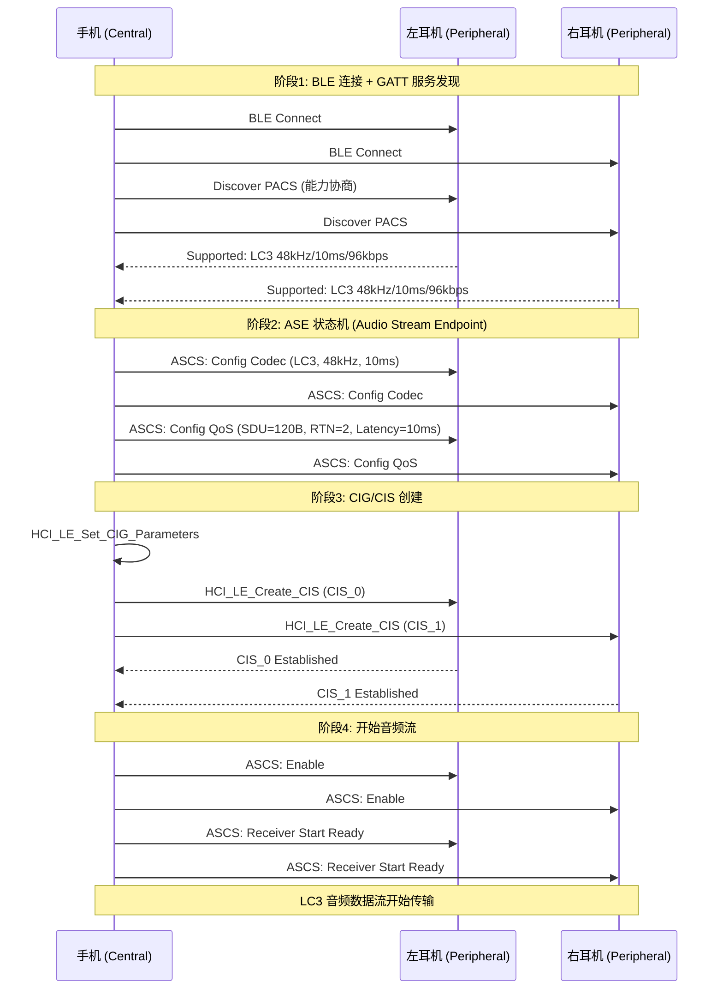

# LE Audio 与 LC3 编解码 (Bluetooth LE Audio)

Bluetooth LE Audio 是蓝牙 5.2+ 引入的下一代音频标准，基于 BLE (Bluetooth Low Energy) 传输，使用全新的 LC3 编解码器，支持多流音频 (Multi-Stream)、广播音频 (Auracast)、助听器等场景，是经典蓝牙 A2DP 的继任者。

---

## 1. LE Audio vs Classic Audio 全面对比

```
LE Audio (新) vs Classic Bluetooth Audio (旧):

  ┌──────────────────┬──────────────────────┬─────────────────────────┐
  │ 维度             │ Classic (A2DP/HFP)   │ LE Audio (BAP/CCP/MCP)  │
  ├──────────────────┼──────────────────────┼─────────────────────────┤
  │ 传输层           │ BR/EDR (Classic BT)  │ BLE (Low Energy)        │
  │ 编解码器         │ SBC/AAC/aptX/LDAC    │ LC3 (必选)              │
  │ 延迟             │ 100-200ms (SBC)      │ 20-30ms (LC3)           │
  │ 音质 (同比特率)  │ SBC @328kbps 较差    │ LC3 @160kbps 更优       │
  │ 多流支持         │ 单流 (L+R 混合传输)  │ 多流 (L/R 独立流)       │
  │ 广播             │ ❌                   │ ✅ Auracast             │
  │ 助听器           │ 非标准               │ ✅ HAP 原生支持         │
  │ 游戏模式         │ 无标准低延迟模式     │ ✅ Gaming Mode Profile  │
  │ 功耗             │ 较高 (BR/EDR)        │ 较低 (BLE)              │
  │ 连接数           │ 通常 1 对 1          │ 支持 1 对多             │
  │ Android 支持     │ Android 1.0+         │ Android 13+ (部分)      │
  │                  │                      │ Android 14+ (完善)      │
  └──────────────────┴──────────────────────┴─────────────────────────┘
```

---

## 2. LC3 编解码器 (Low Complexity Communication Codec)

### 2.1 LC3 核心特性

```
LC3 = LE Audio 的标准编解码器 (Bluetooth SIG 定义):

  关键指标:
    采样率:    8 / 16 / 24 / 32 / 44.1 / 48 kHz
    帧长:      7.5ms 或 10ms
    比特率:    16 ~ 320 kbps (可配置)
    声道:      Mono / Stereo (Multi-Stream)
    延迟:      算法延迟 = 帧长 (7.5 或 10ms)
    复杂度:    ~3 MIPS (编码) / ~2 MIPS (解码)
    
  vs SBC (旧标准):
    LC3 @ 160 kbps ≈ SBC @ 345 kbps 的主观音质
    → 同等音质下带宽减少 50%+
    → 或同等带宽下音质大幅提升

  LC3 内部架构:
    编码器:
      输入 PCM → MDCT 变换 → 频谱量化 → 算术编码 → 比特流
    解码器:
      比特流 → 算术解码 → 频谱反量化 → IMDCT → 输出 PCM
      + PLC (Packet Loss Concealment) 丢包补偿
```

### 2.2 LC3 编码器内部流程详解

```
LC3 编码器处理管线 (每帧 7.5ms 或 10ms):

  ┌──────────────────────────────────────────────────────────────┐
  │  Step 1: 预处理                                              │
  │    输入 PCM (16/24/32-bit) → 浮点归一化                      │
  │    高通滤波 (去除 DC 偏移, 截止 ~20Hz)                       │
  └──────────┬───────────────────────────────────────────────────┘
             ▼
  ┌──────────────────────────────────────────────────────────────┐
  │  Step 2: MDCT 变换 (Modified Discrete Cosine Transform)      │
  │    时域 PCM → 频域系数                                       │
  │    窗函数: 正弦窗 (Sine Window), 50% 重叠                    │
  │    10ms@48kHz: 480 样本 → 240 个 MDCT 系数                  │
  │    7.5ms@48kHz: 360 样本 → 180 个 MDCT 系数                 │
  └──────────┬───────────────────────────────────────────────────┘
             ▼
  ┌──────────────────────────────────────────────────────────────┐
  │  Step 3: 频谱分析与量化                                       │
  │    3a. 带宽检测: 自动检测有效频谱范围                          │
  │    3b. 时域/频域攻击检测 (Transient Detection)                │
  │        → 瞬态帧使用短窗 (提高时间分辨率)                      │
  │    3c. SNS (Spectral Noise Shaping):                         │
  │        → 根据掩蔽阈值对量化噪声进行频域整形                   │
  │        → 类似传统编码中的心理声学模型                         │
  │    3d. 频谱量化:                                              │
  │        → 均匀标量量化 + 全局增益控制                          │
  │        → 比特分配由目标码率决定                               │
  └──────────┬───────────────────────────────────────────────────┘
             ▼
  ┌──────────────────────────────────────────────────────────────┐
  │  Step 4: 熵编码 (Arithmetic Coding)                          │
  │    量化系数 → 算术编码 → 压缩比特流                          │
  │    残余比特 → 噪声填充 (Noise Filling) 参数                  │
  └──────────┬───────────────────────────────────────────────────┘
             ▼
  ┌──────────────────────────────────────────────────────────────┐
  │  Step 5: 比特流封装                                          │
  │    编码参数 + 压缩频谱 → LC3 帧                              │
  │    帧大小 = 目标码率 × 帧长 / 8 (bytes)                      │
  │    例: 160kbps × 10ms = 200 bytes/帧                         │
  └──────────────────────────────────────────────────────────────┘
```

```
LC3 解码器 (编码器的镜像操作):

  比特流 → 算术解码 → 反量化 → 噪声填充
    → SNS 反整形 → IMDCT → 重叠相加 → PCM 输出

  PLC (Packet Loss Concealment) 丢包补偿:
    当 BLE 包丢失时:
      1. 用前一帧频谱做平滑衰减 (Fade-out)
      2. 噪声填充保持信号连续性
      3. 恢复后 Fade-in 平滑过渡
      4. 连续丢包 > 4帧 → 静音输出 (避免伪信号)
```

### 2.3 LC3plus (增强版)

```
LC3plus = Fraunhofer 扩展版本 (超出 BT SIG 标准):

  新增特性:
    - 帧长扩展: 2.5ms / 5ms (超低延迟!)
    - 高保真模式: 96kHz / 24-bit
    - 更强 PLC
    - 多通道 (5.1/7.1)
    
  应用:
    - 高通 aptX Lossless (底层用 LC3plus)
    - 专业无线监听
    - 游戏超低延迟模式 (2.5ms 帧 → 总延迟 < 20ms)
    
  注意: LC3plus 不是 Bluetooth SIG 标准
    → 需要双方设备都支持 (私有协议协商)
```

---

## 3. LE Audio 协议栈

```
LE Audio 协议栈架构:

  ┌─────────────────────────────────────────────────────────────┐
  │ Application Layer                                          │
  │   音乐播放 / 通话 / 游戏 / 广播接收                        │
  ├─────────────────────────────────────────────────────────────┤
  │ Profile Layer                                              │
  │   BAP (Basic Audio Profile)       ← 音频流控制核心         │
  │   CAP (Common Audio Profile)      ← 协调多设备             │
  │   CCP (Call Control Profile)      ← 通话控制               │
  │   MCP (Media Control Profile)     ← 媒体播放控制           │
  │   VCP (Volume Control Profile)    ← 音量控制               │
  │   CSIP (Coordinated Set)          ← TWS 左右耳协调         │
  │   HAP (Hearing Access Profile)    ← 助听器                 │
  │   TMAP (Telephony and Media)      ← 电话+媒体             │
  ├─────────────────────────────────────────────────────────────┤
  │ Core Layer                                                 │
  │   ASCS (Audio Stream Control Service)                      │
  │   PACS (Published Audio Capabilities Service)              │
  │   BASS (Broadcast Audio Scan Service)                      │
  │   ISO (Isochronous Channels)     ← BLE 等时通道           │
  ├─────────────────────────────────────────────────────────────┤
  │ Transport Layer                                            │
  │   BLE L2CAP → BLE Link Layer → RF                         │
  └─────────────────────────────────────────────────────────────┘
```

---

## 4. CIS 与 BIS (等时通道)

```
LE Audio 的数据传输使用 ISO (Isochronous) 通道:

  CIS (Connected Isochronous Stream) — 点对点:
    手机 ←→ 耳机 (单播, 类似 A2DP)
    ┌──────┐  CIS_0 (L)  ┌───────────┐
    │ 手机 │ ──────────→ │ 左耳机    │
    │      │  CIS_1 (R)  ├───────────┤
    │      │ ──────────→ │ 右耳机    │
    └──────┘             └───────────┘
    
    特点:
      - 双向 (支持 Mic 回传, 通话无需切 SCO)
      - 可靠重传 (比 A2DP 更好的抗干扰)
      - 每个耳朵独立 CIS → 真正的独立左右声道

  BIS (Broadcast Isochronous Stream) — 广播:
    一个发送端, 无限个接收端 (Auracast)
    ┌──────┐  BIS  ┌───────────┐
    │ 广播 │ ════→ │ 接收器 1  │
    │ 源   │ ════→ │ 接收器 2  │
    │      │ ════→ │ 接收器 3  │
    │      │  ...  │ ...       │
    └──────┘       └───────────┘
    
    Auracast 应用场景:
      - 机场/车站公共广播
      - 健身房共享音乐
      - 会议室同声传译
      - 博物馆语音导览
```

### 4.2 CIS 建立时序详解



```
CIS QoS 参数详解:

  SDU (Service Data Unit):  每个 ISO 包的有效载荷
    = LC3 帧大小 = 码率 × 帧长 / 8
    例: 96kbps × 10ms / 8 = 120 bytes

  SDU_Interval:  SDU 发送间隔 = 帧长 (7.5ms 或 10ms)

  RTN (Retransmission Number):  重传次数
    RTN=0: 无重传, 最低延迟
    RTN=2: 最多 2 次重传, 平衡可靠性和延迟
    RTN=5: 高可靠, 但延迟增大

  Max_Transport_Latency:  最大传输延迟
    音乐播放: 60-100ms (容忍较高)
    游戏模式: 15-30ms (低延迟优先)
    语音通话: 40-60ms

  PHY:  物理层速率
    1M PHY: 兼容性好, 范围远
    2M PHY: 速率翻倍, 减少空口占用时间, 降低功耗
```

### 4.3 BIS 广播时序与 Auracast 部署

```
BIS 广播建立流程:

  发送端 (Broadcast Source):
    1. 创建 BIG (Broadcast Isochronous Group)
       HCI_LE_Create_BIG
       参数: BIS 数量, SDU 大小, SDU_Interval, Packing, PHY
    2. 广播 Extended Advertising + Periodic Advertising
       包含: Broadcast Audio Announcement (BAA)
       内容: 编码参数, 流名称, 语言, 加密信息
    3. 开始发送 BIS 数据流 (无需连接)

  接收端 (Broadcast Sink):
    1. 扫描 Extended Advertising
    2. 同步 Periodic Advertising
    3. 解析 Broadcast Audio Announcement
       → 显示可用广播源列表
    4. 用户选择 → Sync to BIG
       HCI_LE_BIG_Create_Sync
    5. 接收 BIS 数据 → LC3 解码 → 播放

Auracast 实际部署场景与设计:

  场景 1 - 机场登机口广播:
    发送端: 机场广播设备 (BIS, LC3 48kHz/64kbps)
    接收端: 旅客耳机/助听器
    特点: 无需配对, 无限人数, 可多语言并行广播

  场景 2 - 健身房共享音乐:
    发送端: 健身房音响主机 (BIS, LC3 48kHz/96kbps)
    接收端: 会员耳机
    特点: 替代传统大音箱, 每人自控音量

  场景 3 - 多语言同声传译:
    发送端: 会议系统 (BIG 含多个 BIS)
      BIS_0: 中文通道
      BIS_1: 英文通道
      BIS_2: 日文通道
    接收端: 选择对应语言 BIS 收听

  加密与访问控制:
    Broadcast Code: 16 字节密码, AES-CCM 加密
    公开广播: 无需密码 (机场/博物馆)
    私有广播: 需输入密码 (健身房 VIP)
```

---

## 5. Android LE Audio 实现

### 5.1 Android 架构

```
Android LE Audio 软件栈:

  App (MediaPlayer / AudioTrack)
    │
    ▼
  AudioFlinger → AudioPolicy
    │  → 路由到 LE Audio Output
    ▼
  Bluetooth Audio HAL (AIDL)
    │  → IBluetoothAudioProvider
    │  → SessionType: LE_AUDIO_SOFTWARE / LE_AUDIO_OFFLOAD
    ▼
  Bluetooth Stack (Gabeldorsche / Fluoride)
    │  → BAP State Machine
    │  → LC3 Encoder (软件 / 硬件 Offload)
    │  → ISO Channel Manager
    ▼
  BLE Controller → RF → LE Audio 设备

  两种编码模式:
    Software: ARM 侧 LC3 编码 → BT Controller 发送
    Offload:  ADSP/BT 芯片内部 LC3 编码 → 更省电
```

### 5.2 调试命令

```bash
# === LE Audio 连接状态 ===
adb shell dumpsys bluetooth_manager | grep -iE "le.audio|unicast|broadcast"

# 查看 LC3 编码参数
adb shell dumpsys bluetooth_manager | grep -i "codec_config"
# 预期: codec_type=LC3, sample_rate=48000, frame_duration=10ms

# BAP 状态
adb shell dumpsys bluetooth_manager | grep -iE "bap|ascs|pacs"

# === CIS 连接信息 ===
adb shell dumpsys bluetooth_manager | grep -i "cis\|iso"

# === Auracast 广播 ===
adb shell dumpsys bluetooth_manager | grep -i "broadcast"

# === 音频路由确认 ===
adb shell dumpsys media.audio_policy | grep -i "le_audio"
# AUDIO_DEVICE_OUT_BLE_HEADSET / AUDIO_DEVICE_OUT_BLE_SPEAKER

# === 常见问题 ===
# 1. LE Audio 设备连接但无声:
#    → 检查 BAP 状态是否 STREAMING
#    → 检查 AudioPolicy 是否路由到 BLE 设备
#    → LC3 编码是否成功 (logcat TAG=bluetooth)

# 2. 音频断续:
#    → 检查 CIS 重传次数 (Flush Timeout)
#    → BLE 连接参数 (Connection Interval)
#    → 干扰环境 → 增大 Flush Timeout
```

---

## 6. TWS 真无线与 CSIP

```
TWS (True Wireless Stereo) 在 LE Audio 中的实现:

  Classic BT TWS (旧方案):
    手机 → 主耳 → 转发给副耳 (Relay)
    问题: 转发延迟、副耳功耗高、单耳使用需切换
    
  LE Audio TWS (新方案):
    手机 → CIS_0 → 左耳
    手机 → CIS_1 → 右耳
    → 两耳独立接收, 无转发!
    → 延迟一致, 功耗均衡
    
  CSIP (Coordinated Set Identification Profile):
    → 将左右耳标识为一个"协调集"
    → 手机自动识别它们是一对
    → 支持: 单耳模式 (另一耳自动断连)
    → 支持: 配对一次, 左右同时连接
    
  Android 实现:
    → CsipSetCoordinator 管理协调集
    → AudioPolicy 为 CSIP Group 创建统一输出
    → 音量同步: VCP 确保左右耳音量一致
```

---

## 7. 关键参考 (References)

1. [Bluetooth SIG - LE Audio Specification](https://www.bluetooth.com/learn-about-bluetooth/recent-enhancements/le-audio/)
2. [LC3 Codec Specification - Bluetooth SIG](https://www.bluetooth.com/specifications/specs/low-complexity-communication-codec/)
3. [Fraunhofer LC3plus](https://www.iis.fraunhofer.de/en/ff/amm/communication/lc3plus.html)
4. [Android LE Audio - AOSP](https://source.android.com/docs/core/connect/bluetooth/ble-audio)
5. [Auracast - Bluetooth SIG](https://www.bluetooth.com/auracast/)
6. [Qualcomm S7 & S7 Pro Gen 1 - LE Audio Support](https://www.qualcomm.com/products/audio)
