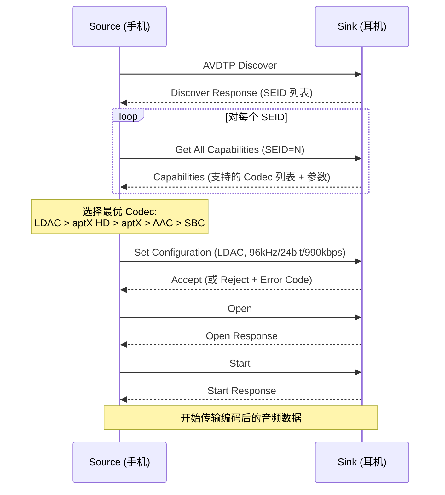

# 蓝牙音频调试实战 (Bluetooth Audio Debug)

蓝牙音频问题涉及协议栈、编解码器、传输调度和音频框架多个层面，定位难度远高于有线音频。本章提供系统化的调试方法论、工具使用和常见问题诊断流程。

---

## 1. 蓝牙音频问题分层模型

```
蓝牙音频调试分层:

  ┌──────────────────────────────────────────────────────────────┐
  │ Layer 5: App 层                                             │
  │   AudioTrack/MediaPlayer → AudioAttributes → Session        │
  │   问题: 焦点冲突, 路由未切换, 编码格式协商失败               │
  ├──────────────────────────────────────────────────────────────┤
  │ Layer 4: Audio Framework 层                                 │
  │   AudioPolicy 路由 → AudioFlinger → BT Audio HAL            │
  │   问题: A2DP output 未创建, codec 不匹配, 采样率不支持       │
  ├──────────────────────────────────────────────────────────────┤
  │ Layer 3: Bluetooth Stack 层 (Gabeldorsche / Fluoride)       │
  │   AVDTP 信令 → A2DP/HFP Profile → L2CAP                    │
  │   问题: AVDTP Abort, Codec 协商拒绝, 连接超时               │
  ├──────────────────────────────────────────────────────────────┤
  │ Layer 2: HCI 层                                             │
  │   HCI Command/Event → ACL/SCO Data → Controller 调度        │
  │   问题: ACL 带宽不足, SCO 链路质量差, Sniff 模式冲突         │
  ├──────────────────────────────────────────────────────────────┤
  │ Layer 1: RF 层                                              │
  │   2.4GHz ISM 频段 → AFH (跳频) → 功率控制                   │
  │   问题: Wi-Fi 共存干扰, 距离过远, 天线遮挡                   │
  └──────────────────────────────────────────────────────────────┘

调试原则: 自底向上排除 — 先确认 RF 链路正常, 再逐层上推
```

---

## 2. 核心调试工具

### 2.1 btsnoop HCI Log

蓝牙音频调试最重要的工具，记录主机与控制器之间的所有 HCI 交互。

```bash
# 开启 btsnoop log (Android)
adb shell setprop persist.bluetooth.btsnooplogmode full
adb shell svc bluetooth disable && adb shell svc bluetooth enable

# 日志位置
adb pull /data/misc/bluetooth/logs/btsnoop_hci.log

# 开启方法2: 开发者选项 → "启用蓝牙 HCI 信息收集日志"

# Wireshark 分析 (推荐)
wireshark btsnoop_hci.log
# 过滤器:
#   A2DP 信令:  btavdtp
#   HFP AT 命令: bthfp
#   L2CAP:      btl2cap
#   AVDTP 媒体: avdtp && btavdtp.signal == false
```

### 2.2 关键 btsnoop 分析场景

```
场景1: A2DP Codec 协商失败

  正常流程:
    SRC → SNK: AVDTP Discover
    SNK → SRC: AVDTP Discover Response (列出 SEP 列表)
    SRC → SNK: AVDTP Get Capabilities (SEID=1)
    SNK → SRC: capabilities (SBC + AAC + LDAC ...)
    SRC → SNK: AVDTP Set Configuration (选择 LDAC)
    SNK → SRC: AVDTP Set Configuration Response (Accept)
    
  失败模式:
    SRC → SNK: AVDTP Set Configuration (LDAC)
    SNK → SRC: AVDTP Set Configuration Response (Reject, BAD_CODEC_TYPE)
    → 原因: 对端不支持该 Codec, 或 Capabilities 解析错误
    → 修复: 检查本端 codec_capabilities 配置是否与对端兼容

场景2: A2DP 播放卡顿

  HCI log 中观察:
    大量 Number of Completed Packets Event 间隔不均匀
    出现 ACL Data Packet 重传
    → 原因: RF 干扰或 ACL 带宽被其他 profile 占用
    
  检查: 
    HCI Read RSSI: 信号强度 < -70dBm → 距离/遮挡问题
    HCI Read Link Quality: quality < 200 → 干扰严重
```

### 2.3 dumpsys 蓝牙相关

```bash
# 蓝牙整体状态
adb shell dumpsys bluetooth_manager

# A2DP Profile 状态
adb shell dumpsys bluetooth_manager | grep -A 50 "A2dpStateMachine"
# 关注: mCurrentCodec, mPlayingA2dpDevice, state

# 活跃的音频编解码配置
adb shell dumpsys bluetooth_manager | grep -i "codec"
# 输出示例:
#   Codec: LDAC
#   Sample Rate: 96000
#   Bits Per Sample: 24
#   Channel Mode: STEREO
#   Codec Specific: Quality=HIGH (990kbps)

# BT Audio HAL 状态
adb shell dumpsys media.audio_flinger | grep -A 5 "a2dp"
# 确认 A2DP output thread 是否存在且活跃

# HFP 状态
adb shell dumpsys bluetooth_manager | grep -A 30 "HeadsetStateMachine"
# 关注: mAudioState, mCurrentDevice, isVoiceRecognitionStarted
```

### 2.4 logcat 关键 TAG

```bash
# 蓝牙音频相关的核心 TAG
adb logcat -s \
    bt_a2dp:V \
    bt_a2dp_hw:V \
    BluetoothA2dp:V \
    BtAudioHal:V \
    bluetooth_a2dp_codec:V \
    A2dpService:V \
    AudioPolicyManager:V \
    AudioFlinger:V

# 快速过滤 A2DP 连接问题
adb logcat | grep -iE "(a2dp|avdtp|codec_config|setActiveDevice)"

# HFP/SCO 相关
adb logcat -s bt_hfp:V HeadsetService:V AudioManager:V

# LE Audio 相关 (Android 13+)
adb logcat -s LeAudioService:V bluetooth_le_audio:V
```

---

## 3. 常见问题诊断流程

### 3.1 A2DP 连接后无声

```
诊断流程图:

  连接 A2DP 后无声
       │
       ▼
  ① dumpsys bluetooth_manager: A2DP state == PLAYING?
       │
       ├── NO → A2DP 未进入 Playing 状态
       │         检查 AVDTP Start 是否成功 (btsnoop)
       │         检查 AudioPolicy 是否切换路由到 A2DP output
       │
       └── YES
            │
            ▼
  ② dumpsys media.audio_flinger: A2DP output thread 存在?
       │
       ├── NO → AudioPolicy 未创建 A2DP output
       │         检查: apm setDeviceConnectionState() 是否被调用
       │         检查: audio_policy_configuration.xml 是否有 a2dp module
       │
       └── YES
            │
            ▼
  ③ A2DP output thread 有活跃 Track?
       │
       ├── NO → 音频流未路由到 A2DP
       │         检查 AudioPolicy 的 getOutputForAttr() 返回值
       │         检查 ForceUse(FOR_MEDIA) 是否被设为 FORCE_NO_BT_A2DP
       │
       └── YES
            │
            ▼
  ④ BT HAL encoding 正常? (logcat bt_a2dp_hw)
       │
       ├── 编码错误 → Codec 初始化失败 / 参数不匹配
       │
       └── 编码正常
            │
            ▼
  ⑤ HCI ACL 数据包在发送? (btsnoop)
       │
       ├── NO → L2CAP channel 异常, 检查连接状态
       │
       └── YES → 问题在对端 (SNK 解码/DAC 问题)
```

### 3.2 A2DP 播放卡顿/断续

```
常见原因与排查:

  ┌─────────────────────────────────────────────────────────────────┐
  │ 原因                    │ 排查方法                              │
  ├─────────────────────────┼───────────────────────────────────────┤
  │ Wi-Fi 共存干扰          │ 关闭 Wi-Fi 测试; 检查 coex log       │
  │                         │ adb shell cat /sys/kernel/debug/      │
  │                         │   ieee80211/phy0/ath10k/btcoex        │
  ├─────────────────────────┼───────────────────────────────────────┤
  │ Codec 码率过高          │ 降低 LDAC Quality: HIGH→MID→LOW       │
  │                         │ 切换到 AAC/SBC 测试                   │
  ├─────────────────────────┼───────────────────────────────────────┤
  │ ACL 带宽竞争            │ btsnoop: 检查是否有并发 HID/HOGP 流量  │
  │ (多设备同时连接)        │ 断开其他 BT 设备测试                  │
  ├─────────────────────────┼───────────────────────────────────────┤
  │ CPU 负载导致编码延迟    │ perfetto/systrace 检查 bt_a2dp 线程   │
  │                         │ CPU 调频是否及时                      │
  ├─────────────────────────┼───────────────────────────────────────┤
  │ buffer underrun         │ logcat: "A2DP UNDERFLOW" / "media_tx" │
  │ (编码速度 < 消耗速度)   │ 增大 A2DP buffer 或优化调度优先级     │
  ├─────────────────────────┼───────────────────────────────────────┤
  │ 信号弱/距离远           │ HCI Read RSSI < -75dBm                │
  │                         │ 减小距离或移除遮挡物                  │
  └─────────────────────────┴───────────────────────────────────────┘
```

### 3.3 HFP 通话音质差 (断续/回声/单通)

```
HFP 音频链路:

  手机 MIC → SCO Link (mSBC/CVSD) → 耳机 Speaker
  耳机 MIC → SCO Link (mSBC/CVSD) → 手机 Speaker

诊断:
  ┌──────────────────────────────────────────────────────────┐
  │ 症状           │ 可能原因              │ 排查              │
  ├────────────────┼───────────────────────┼──────────────────┤
  │ 通话无声(双向) │ SCO 链路未建立        │ btsnoop: 检查     │
  │                │                       │ HCI Setup SCO     │
  │                │                       │ Connection        │
  ├────────────────┼───────────────────────┼──────────────────┤
  │ 对方听不到我   │ 上行 MIC 路由错误     │ 检查 AudioPolicy  │
  │ (单通)         │ 或 SCO TX 无数据      │ input device 是否 │
  │                │                       │ 切到 BT_SCO       │
  ├────────────────┼───────────────────────┼──────────────────┤
  │ 语音断续       │ SCO 丢包 (eSCO       │ btsnoop: 检查     │
  │                │ retransmission 不足)  │ Synchronous Conn  │
  │                │                       │ Complete 参数     │
  ├────────────────┼───────────────────────┼──────────────────┤
  │ 回声           │ AEC 未生效            │ 检查 AudioEffect  │
  │                │ 或参考信号延迟不对    │ EffectChain 是否  │
  │                │                       │ 挂载在 input      │
  ├────────────────┼───────────────────────┼──────────────────┤
  │ 音质差(机器音) │ 使用了 CVSD 而非 mSBC│ btsnoop: 检查     │
  │                │                       │ codec negotiation │
  │                │                       │ 应为 Transparent  │
  │                │                       │ (=mSBC WBS)       │
  └────────────────┴───────────────────────┴──────────────────┘

确认 WBS (宽带语音) 是否启用:
  adb shell dumpsys bluetooth_manager | grep -i "wbs\|codec.*sco\|msbc"
  # 或 btsnoop 中检查 eSCO Connection:
  #   Air Mode = Transparent → mSBC (WBS, 16kHz)
  #   Air Mode = u-law/A-law → CVSD (NBS, 8kHz)
```

### 3.4 LE Audio 常见问题

```bash
# LE Audio 状态检查 (Android 13+)
adb shell dumpsys bluetooth_manager | grep -A 30 "LeAudioService"

# CIS (Connected Isochronous Stream) 状态
adb logcat -s bluetooth_le_audio | grep -i "cis\|iso\|codec_config"

# 常见 LE Audio 问题:
# 1. Codec Config 不匹配
#    → 检查 PAC (Published Audio Capabilities) 是否包含所需 LC3 配置
#    → logcat: "No matching codec config"
#
# 2. CIS 建立失败  
#    → btsnoop: HCI LE Create CIS → Connection Failed
#    → 原因: 对端不支持请求的 PHY / interval
#
# 3. 音频断续
#    → 检查 ISO interval 和 SDU size 是否合理
#    → flush timeout 过小导致丢包
#
# 4. 左右耳不同步 (TWS)
#    → 检查 CSIP 协调状态
#    → presentation delay 配置是否一致
```

---

## 4. Codec 协商详解与调试

### 4.1 A2DP Codec 协商流程



### 4.2 强制切换 Codec (调试用)

```bash
# 查看当前 Codec
adb shell dumpsys bluetooth_manager | grep "mCodecConfig"

# 通过开发者选项切换 (Settings → Developer → BT Audio Codec)
# 或通过命令行 (Android 12+):
adb shell cmd bluetooth_manager set-codec-config-preference \
    --codec ldac \
    --sample-rate 96000 \
    --bits-per-sample 24 \
    --channel-mode stereo \
    --codec-specific-1 1000  # Quality: 0=ABR, 1=HIGH, 2=MID, 3=LOW

# 禁用特定 Codec (排除法)
adb shell setprop persist.bluetooth.a2dp_offload.cap ""
# 重启蓝牙后生效
```

### 4.3 Codec Offload vs Software Encoding

```
A2DP 数据通路对比:

  Software Encoding (默认):
    AudioFlinger → BT Audio HAL → libldacBT_enc.so (CPU 编码)
                                → L2CAP → ACL → Controller
    特点: 灵活, 支持所有 Codec, CPU 占用高

  Hardware Offload (高通/MTK):
    AudioFlinger → Offload BT HAL → ADSP (DSP 编码)
                                   → Controller (直连)
    特点: 低功耗, 但仅支持芯片厂商指定的 Codec

确认 offload 状态:
  adb shell getprop persist.bluetooth.a2dp_offload.disabled
  # false = offload 启用, true = 软件编码

  adb shell dumpsys media.audio_flinger | grep -i "a2dp\|offload"
  # 检查输出是否为 offload output
```

---

## 5. 蓝牙音频性能指标抓取

### 5.1 延迟测量

```bash
# A2DP 端到端延迟组成:
#   编码延迟 + ACL 传输延迟 + 解码延迟 + DAC 延迟
#   SBC: ~100-150ms | AAC: ~150-200ms | LDAC: ~200-300ms | aptX LL: ~40ms

# 使用 Audio Latency Test App + 外部回环测量
# 或使用 Perfetto 抓取各阶段时间戳:
adb shell perfetto --txt -o /data/misc/perfetto-traces/bt_audio.pb <<EOF
buffers { size_kb: 32768 }
data_sources {
  config {
    name: "linux.ftrace"
    ftrace_config {
      ftrace_events: "sched/sched_switch"
      atrace_categories: "audio"
      atrace_apps: "com.android.bluetooth"
    }
  }
}
duration_ms: 10000
EOF

adb pull /data/misc/perfetto-traces/bt_audio.pb
# 在 ui.perfetto.dev 中分析 BT 编码线程调度
```

### 5.2 吞吐量与丢包监控

```bash
# 蓝牙质量指标
adb shell dumpsys bluetooth_manager | grep -iE "quality|rssi|tx_fail|flush"

# HCI 级别统计
adb shell cat /sys/kernel/debug/bluetooth/hci0/link_keys
# 某些平台支持:
adb shell cat /sys/kernel/debug/bluetooth/hci0/acl_mtu
adb shell cat /sys/kernel/debug/bluetooth/hci0/sco_mtu

# Vendor-specific 诊断 (高通):
adb shell cat /sys/kernel/debug/bluetooth/bt_qual/a2dp_stats
# 输出: tx_bytes, tx_pkts, dropped_pkts, retransmits, avg_interval_ms
```

---

## 6. 实战案例

### 6.1 案例: LDAC 连接后自动降级为 SBC

```
现象: 连接时显示 LDAC, 播放几秒后自动切换为 SBC
日志: "A2DP: Too many retransmits, downgrading codec"

分析:
  1. btsnoop: 观察到频繁的 L2CAP retransmission
  2. HCI Read RSSI: -68dBm (边缘值)
  3. 同时 Wi-Fi 在 2.4GHz 大量传输

根因: Wi-Fi 与 BT 共存干扰, ACL 丢包率超过阈值触发 Codec 降级

修复:
  - Wi-Fi 切换到 5GHz
  - 或调整 BT coex 优先级: 
    adb shell "echo 1 > /sys/kernel/debug/bluetooth/coex_priority"
  - 或适当降低 LDAC Quality 到 Adaptive Bitrate
```

### 6.2 案例: HFP 通话切换时 2秒 无声

```
现象: 接通电话后, 有约 2 秒听不到对方声音

分析:
  logcat 时间线:
    T+0ms:    AudioPolicy: setPhoneState(IN_CALL)
    T+200ms:  AudioPolicy: startOutput() → routing to BT_SCO
    T+500ms:  AudioFlinger: openOutput(bt_sco) 
    T+800ms:  btsnoop: HCI Setup Synchronous Connection
    T+1500ms: btsnoop: Synchronous Connection Complete (成功)
    T+1800ms: AudioPolicy: input routing → BT_SCO_HEADSET
    T+2000ms: 声音正常

根因: SCO 链路建立需要 ~700ms, 加上 AudioPolicy 路由切换时间

优化:
  - 预建立 SCO: 在 RINGING 阶段提前发起 SCO setup
  - 减少 AudioPolicy 路由切换开销: 预创建 SCO output
  - BT Controller 优化: 缩短 eSCO negotiation 时间
```

### 6.3 案例: LE Audio 耳机左右耳音量不一致

```
现象: TWS 耳机左耳正常, 右耳音量偏小

分析:
  1. dumpsys: 两个 CIS stream 都存在且活跃
  2. logcat: VCP (Volume Control Profile) 设置了相同 volume
  3. 检查 Audio HAL: 两个 stream 的 PCM 数据一致

根因: 右耳 Codec 的 DAC gain 校准值异常 (固件问题)

验证: 
  adb shell dumpsys bluetooth_manager | grep -A 10 "LeAudioDevice"
  # 检查两个设备的 codec_config 和 volume_offset

修复: 更新耳机固件, 或通过 VCP Volume Offset 补偿
```

---

## 7. 调试命令速查表

| 目标 | 命令 |
|:---|:---|
| BT 整体状态 | `adb shell dumpsys bluetooth_manager` |
| A2DP Codec | `dumpsys bluetooth_manager \| grep -i codec` |
| HFP 状态 | `dumpsys bluetooth_manager \| grep -A 20 HeadsetState` |
| LE Audio | `dumpsys bluetooth_manager \| grep -A 30 LeAudio` |
| BT HAL 日志 | `adb logcat -s BtAudioHal:V bt_a2dp_hw:V` |
| 抓 btsnoop | 开发者选项或 `setprop persist.bluetooth.btsnooplogmode full` |
| RSSI 查看 | `dumpsys bluetooth_manager \| grep rssi` |
| Audio 路由确认 | `dumpsys media.audio_flinger \| grep -A 5 "Output thread"` |
| 强制 SBC | 开发者选项 → 蓝牙音频编解码器 → SBC |
| offload 状态 | `getprop persist.bluetooth.a2dp_offload.disabled` |
| BT coex 日志 | `adb logcat \| grep -i coex` |
| Perfetto BT trace | 见 §5.1 |

---

## 参考

- Android Bluetooth 源码: `packages/modules/Bluetooth/`
- btsnoop 格式: Bluetooth Core Spec Vol 4, Part E
- Wireshark BT 过滤器: https://wiki.wireshark.org/Bluetooth
- Android BT Audio HAL AIDL: `hardware/interfaces/bluetooth/audio/aidl/`
