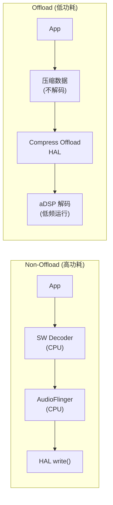

# 音频功耗优化 (Audio Power Optimization)

音频系统是常驻后台的典型场景（音乐播放、语音助手、通话），功耗优化直接影响设备续航。本章从硬件到软件系统性分析音频功耗的来源与优化策略。

---

## 1. 音频功耗模型

```
音频全链路功耗组成:

  ┌──────────────────────────────────────────────────┐
  │ 应用处理器 (AP)                                  │
  │  ├── audioserver CPU 占用                        │
  │  │   ├── AudioMixer 混音                        │
  │  │   ├── Resampler 重采样                       │
  │  │   └── SW Effect 软件音效                     │
  │  ├── App 解码 (如 MediaCodec SW decoder)        │
  │  └── Memory bandwidth (DDR)                     │
  ├──────────────────────────────────────────────────┤
  │ 音频 DSP (aDSP/cDSP)                           │
  │  ├── Codec 解码 (Offload)                       │
  │  ├── 3A / Effect 处理                           │
  │  └── 语音唤醒 (KWD)                            │
  ├──────────────────────────────────────────────────┤
  │ Codec / SmartPA 硬件                            │
  │  ├── DAC/ADC 模拟电路                           │
  │  ├── Class-D 放大器                             │
  │  └── MCLK / PLL 时钟                           │
  ├──────────────────────────────────────────────────┤
  │ 接口总线                                        │
  │  ├── I2S/TDM BCLK                              │
  │  └── SLIMbus / SoundWire                        │
  └──────────────────────────────────────────────────┘
```

### 1.1 典型场景功耗参考

| 场景 | AP 状态 | DSP 状态 | 典型电流 (mA) |
|:---|:---|:---|:---|
| 息屏音乐播放 (Offload) | Suspend | Active (低频) | 15-25 |
| 息屏音乐播放 (Non-offload) | Active | Idle | 80-120 |
| 语音唤醒待命 (LPI) | Suspend | Island Active | 2-5 |
| 通话 (VoLTE) | Active | Active | 100-150 |
| 录音 (普通) | Active | Active | 60-80 |
| 蓝牙音乐 (A2DP) | Active | 编码 Active | 40-60 |

---

## 2. Offload 播放 (硬件解码卸载)

### 2.1 原理



### 2.2 Offload 条件与限制

```
Offload 生效条件:
  ✅ 格式支持: MP3/AAC/FLAC/ALAC/Opus (平台相关)
  ✅ 非低延迟: 不能走 Fast/MMAP 路径
  ✅ 无 SW Effect: EffectChain 中无需 CPU 处理的音效
  ✅ 单流: 通常一个 Offload 通道 (部分平台支持多路)
  
Offload 失败回退:
  ❌ 有 Session Effect (SW 实现) → 回退 Deep Buffer
  ❌ 音效需要 CPU 处理 → 回退 Deep Buffer
  ❌ 多路混音需求 → 回退 Normal Mixer
  ❌ 格式不支持 → 回退 SW Decode
```

### 2.3 关键配置

```xml
<!-- audio_policy_configuration.xml -->
<mixPort name="compress_offload" role="source"
         flags="AUDIO_OUTPUT_FLAG_COMPRESS_OFFLOAD|AUDIO_OUTPUT_FLAG_DIRECT">
    <profile name="" format="AUDIO_FORMAT_MP3"
             samplingRates="44100,48000" channelMasks="AUDIO_CHANNEL_OUT_STEREO"/>
    <profile name="" format="AUDIO_FORMAT_AAC_LC"
             samplingRates="44100,48000" channelMasks="AUDIO_CHANNEL_OUT_STEREO"/>
    <profile name="" format="AUDIO_FORMAT_FLAC"
             samplingRates="44100,48000,96000" channelMasks="AUDIO_CHANNEL_OUT_STEREO"/>
</mixPort>
```

### 2.4 调试验证

```bash
# 检查当前播放是否走 Offload
adb shell dumpsys media.audio_flinger | grep -A 5 "Offload"

# 查看 Compress 设备状态
adb shell cat /proc/asound/card0/pcm*c/sub0/status

# 验证 DSP 活跃而 AP 可 suspend
adb shell cat /sys/kernel/debug/clk/lpass_aon_cc_main_rcg_clk_src/clk_rate

# logcat 关键字
adb logcat -s AudioFlinger AudioPolicyManager | grep -i "offload\|compress"
```

---

## 3. AP Suspend 与 Wake Lock

### 3.1 音频 Wake Lock 机制

```
AudioFlinger 持有 Wake Lock 的条件:
  - 有 active Track 在 Normal/Fast/Offload Thread 上
  - Thread 需要持续 write() 到 HAL
  
Release Wake Lock:
  - 所有 Track 进入 PAUSED/STOPPED
  - Offload 模式下 DSP buffer 足够大, AP 可 partial suspend
  
问题场景:
  ❌ App 持有 AudioTrack 但不 release → 永久阻止 suspend
  ❌ Effect 需要 CPU → 即使 Offload 也无法 suspend
  ❌ Recording 活跃 → AP 必须保持 active
```

### 3.2 排查功耗异常

```bash
# 查看 audio 相关 wake lock
adb shell dumpsys power | grep -A 5 "audio"

# 查看 audioserver CPU 占用
adb shell top -n 1 | grep audioserver

# 查看是否有持续的 audio session
adb shell dumpsys media.audio_flinger | grep "active\|standby"

# 检查 Thread 是否进入 standby
adb shell dumpsys media.audio_flinger | grep "standby"
# standby: yes → 正常 (省电)
# standby: no  → 持续活跃 (耗电)
```

---

## 4. DSP 低功耗模式

### 4.1 高通 LPI (Low Power Island)

```
LPI 架构:
  
  ┌─────────────────────────────────────────────┐
  │ Main LPASS (高性能, 高功耗)                  │
  │  ├── aDSP (音频主处理)                      │
  │  ├── 高速 SRAM                              │
  │  └── 高频 Clock (600MHz+)                   │
  ├─────────────────────────────────────────────┤
  │ Low Power Island (超低功耗)                  │
  │  ├── Sensor DSP (sDSP) 或独立核             │
  │  ├── 小容量 TCM                             │
  │  ├── 低频 Clock (< 100MHz)                  │
  │  └── 功能: KWD / VAD / 超低功耗录音         │
  └─────────────────────────────────────────────┘
  
状态切换:
  Full Power → LPI:
    触发: AP suspend + 仅 KWD/VAD 活跃
    功耗: 2-5 mA (含 Codec bias)
    
  LPI → Full Power:
    触发: 唤醒词检测 / 用户交互
    延迟: 50-100ms (DSP boot + Graph setup)
```

### 4.2 DSP Clock Scaling

```bash
# 查看 DSP 当前频率
adb shell cat /sys/kernel/debug/clk/lpass_core_cc_lpm_core_clk_src/clk_rate

# ADSP 频率等级 (高通平台)
# SVS (低功耗):   ~300 MHz → 适合轻量音效
# Nominal:        ~600 MHz → 适合复杂处理
# Turbo:         ~800 MHz → 适合多通道 ANC
```

---

## 5. Codec 与 DAPM 电源管理

### 5.1 DAPM (Dynamic Audio Power Management) 省电原理

```
DAPM 核心: 只给正在使用的音频路径供电

  播放路径 (仅播放时通电):
    DAC → Mixer → PGA → Speaker Amp → Speaker
    
  录音路径 (仅录音时通电):
    Mic → Mic Bias → PGA → ADC
    
  非使用路径: 全部断电 (0mA)
  
电源序列控制:
  Power Up:   Mic Bias → PGA → ADC (从源到端)
  Power Down: ADC → PGA → Mic Bias (从端到源)
  
Bias Level 状态机:
  OFF → STANDBY → PREPARE → ON
  (每个状态对应不同的供电/时钟配置)
```

### 5.2 Codec 功耗优化 Checklist

| 优化项 | 方法 | 节省 |
|:---|:---|:---|
| **关闭未用 DAC/ADC** | DAPM route 不连接 → 自动断电 | 5-15mA |
| **降低 MCLK 频率** | 使用 MCLK/2 或 MCLK/4 | 2-5mA |
| **Headphone 模式切换** | 高阻→低阻自动切换输出级 | 3-8mA |
| **Class-H/G 放大器** | 动态调整供电轨 | 10-30mA |
| **Mic Bias 关闭** | 耳机拔出后立即关闭 | 1-3mA |
| **PLL 关闭** | 无音频活动时关闭 PLL | 2-5mA |

---

## 6. 系统级优化策略

### 6.1 Deep Buffer 策略

```
Buffer Size vs 功耗:

  Normal Buffer (20ms):
    → AP 每 20ms 唤醒一次写数据
    → CPU 唤醒频繁, 无法深度休眠
    
  Deep Buffer (96ms / 192ms):
    → AP 每 96ms 才唤醒一次
    → 间隔期间 AP 可进入 C3/C4 低功耗状态
    → 节省 30-50% CPU 功耗
    
  Offload Buffer (多秒):
    → AP 可完全 suspend
    → DSP 内部缓冲足够长时间的数据
    → 仅需定期补充压缩数据
```

### 6.2 采样率与位深优化

```
不必要的高采样率 = 浪费功耗:

  48kHz/16bit stereo:
    数据率 = 48000 × 2 × 2 = 192 KB/s
    
  96kHz/32bit stereo:
    数据率 = 96000 × 4 × 2 = 768 KB/s (4x 带宽)
    → 4x DMA 传输量
    → 4x DSP 处理量
    → 更高的 BCLK 频率 (更高接口功耗)
    
建议:
  语音通话: 16kHz/16bit (足够 HD Voice)
  音乐播放: 48kHz/16bit (绝大多数内容)
  Hi-Res:   仅在用户显式要求时启用
```

### 6.3 音效功耗影响

| 音效类型 | CPU 额外负载 | 优化方式 |
|:---|:---|:---|
| 5-band EQ | ~1% | 可 offload 到 DSP |
| DRC/Limiter | ~1-2% | 可 offload 到 DSP |
| Virtualizer | ~3-5% | 建议 DSP 实现 |
| Spatializer (HRTF) | ~8-15% | 必须 DSP 实现 |
| AEC + NS | ~10-20% | 必须 DSP 实现 |
| AI 降噪 (NN) | ~15-30% | NPU/DSP 加速 |

---

## 7. 功耗调试命令速查

```bash
# ==================== 整体功耗 ====================
# Battery Historian 抓取
adb shell dumpsys batterystats --reset
# ... 运行测试场景 ...
adb bugreport > bugreport.zip
# 用 Battery Historian 分析

# ==================== Audio 相关 ====================
# audioserver CPU 占用
adb shell top -H -p $(adb shell pidof audioserver) -n 1

# audio wake lock 状态
adb shell dumpsys power | grep -i "audio"

# AudioFlinger Thread 状态
adb shell dumpsys media.audio_flinger | grep -E "Thread|standby|active"

# Offload 状态
adb shell dumpsys media.audio_flinger | grep -i "offload\|compress"

# ==================== DSP 功耗 ====================
# ADSP 状态 (高通)
adb shell cat /sys/kernel/debug/rpmh_stats/master_stats | grep adsp

# DSP clock frequency
adb shell cat /sys/kernel/debug/clk/lpass*/clk_rate

# ==================== Codec 功耗 ====================
# Codec 寄存器 (检查不必要的供电)
adb shell tinymix -D 0 | grep -i "power\|bias\|enable"

# DAPM widget 状态
adb shell cat /sys/kernel/debug/asoc/*/dapm/*
```

---

## 8. 常见功耗问题诊断

| 问题 | 根因 | 解决方案 |
|:---|:---|:---|
| 息屏播放电流 >100mA | 未走 Offload 路径 | 检查 audio_policy, 移除阻碍 offload 的 SW effect |
| 无音频时底电流偏高 | Thread 未进入 standby | 检查是否有 App 持有未释放的 AudioTrack |
| KWD 待机功耗 >10mA | LPI 未启用 | 检查 SoundTrigger HAL 配置 |
| 蓝牙播放功耗高 | 编码在 AP CPU | 使用支持 offload A2DP 的平台 |
| Codec 漏电 | Mic Bias 未关闭 | 检查 DAPM route, 确保耳机拔出后 bias 关闭 |
| 通话功耗异常 | DSP 频率锁在 Turbo | 检查 ACDB usecase, 优化算法复杂度 |

---

## 9. 关键参考 (References)

1.  [Android Audio Power Optimization - AOSP](https://source.android.com/docs/core/audio/latency-power)
2.  [Qualcomm Low Power Audio Architecture](https://developer.qualcomm.com/software/hexagon-dsp-sdk)
3.  [Linux DAPM Documentation](https://www.kernel.org/doc/html/latest/sound/soc/dapm.html)
4.  [Battery Historian](https://developer.android.com/topic/performance/power/battery-historian)

---
*返回：[调试方法论](./01-Debug-Methodology.md) | [跨层数据流](./02-Cross-Layer-Data-Flow.md)*
