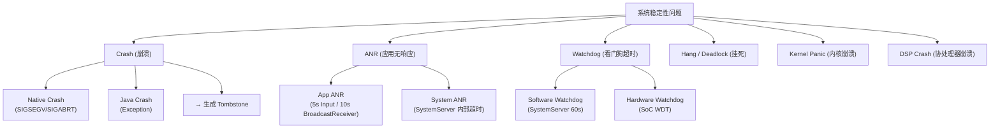

# 音频稳定性分析 (Audio Stability Analysis)

稳定性是系统级音频软件最核心的质量指标之一。一次 `audioserver` 的 Crash 会导致全系统音频中断数秒；一次 ADSP 崩溃可能造成整个通话链路断裂。本章系统梳理 Android/Linux 系统稳定性基础知识，并深入音频子系统的典型稳定性问题与分析方法。

---

## 1. 稳定性基础知识

### 1.1 稳定性问题分类



### 1.2 信号 (Signal) 基础

Native Crash 的本质是进程收到了致命信号：

| 信号 | 编号 | 含义 | 常见原因 |
|:---|:---|:---|:---|
| **SIGSEGV** | 11 | 段错误 | 空指针、野指针、访问已释放内存 |
| **SIGABRT** | 6 | 主动 abort | assert 失败、CHECK 宏触发、`std::abort()` |
| **SIGBUS** | 7 | 总线错误 | 非对齐内存访问、mmap 越界 |
| **SIGFPE** | 8 | 浮点异常 | 整数除零 |
| **SIGPIPE** | 13 | 管道断裂 | 写入已关闭的 socket/fd |
| **SIGSYS** | 31 | 非法系统调用 | seccomp 策略拦截 |
| **SIGILL** | 4 | 非法指令 | 代码段损坏、ABI 不兼容 |

### 1.3 Tombstone 文件结构

```
Tombstone 是 Android 系统为 Native Crash 生成的"现场快照":

  路径: /data/tombstones/tombstone_XX (或 /data/tombstones/tombstone_XX.pb)
  
  文件内容:
  ┌──────────────────────────────────────────────────────────┐
  │ 1. 基本信息 (Header)                                    │
  │    pid, tid, process name, uid                          │
  │    signal (SIGSEGV / SIGABRT / ...)                     │
  │    fault addr (访问的非法地址)                           │
  │    timestamp                                             │
  ├──────────────────────────────────────────────────────────┤
  │ 2. 寄存器快照 (Registers)                               │
  │    r0-r15 (ARM32) 或 x0-x30, sp, pc, lr (ARM64)       │
  │    pc = 崩溃时的指令地址 → 用于定位代码行              │
  ├──────────────────────────────────────────────────────────┤
  │ 3. 调用栈 (Backtrace)                                   │
  │    #00 pc 0x00012345  /system/lib64/libaudioflinger.so  │
  │    #01 pc 0x00023456  /system/lib64/libaudioflinger.so  │
  │    #02 pc 0x00034567  /system/lib64/libbinder.so        │
  │    ...                                                   │
  ├──────────────────────────────────────────────────────────┤
  │ 4. 内存映射 (Memory Maps)                               │
  │    各 .so 的加载基地址 → 用于 addr2line 解析           │
  ├──────────────────────────────────────────────────────────┤
  │ 5. 其他线程的调用栈                                     │
  │    辅助分析死锁 / 竞态                                  │
  ├──────────────────────────────────────────────────────────┤
  │ 6. 日志片段 (Logcat tail)                               │
  │    崩溃前的最后几十行日志                                │
  └──────────────────────────────────────────────────────────┘
```

### 1.4 Tombstone 解读实战

```bash
# ==================== 获取 Tombstone ====================
adb shell ls /data/tombstones/
adb pull /data/tombstones/tombstone_00

# ==================== 关键字段解读 ====================
# 示例 Tombstone 片段:
#
# pid: 1234, tid: 5678, name: audioserver  >>> audioserver <<<
# uid: 1041
# signal 11 (SIGSEGV), code 1 (SEGV_MAPERR), fault addr 0x0
#    x0  0000000000000000  x1  0000007fa3b2c100
#    ...
#    pc  0000007f8a012340  sp  0000007fa3b2bf00
#
# backtrace:
#    #00 pc 0000000000012340  /system/lib64/libaudioflinger.so
#    #01 pc 0000000000045678  /system/lib64/libaudioflinger.so
#    #02 pc 00000000000789ab  /system/lib64/libbinder.so

# 解读:
#   signal 11 (SIGSEGV) → 段错误
#   code 1 (SEGV_MAPERR) → 访问了未映射的地址
#   fault addr 0x0 → 空指针解引用!
#   进程名: audioserver → 音频服务崩溃

# ==================== addr2line 定位源码行 ====================
# 需要带符号表的 .so (userdebug/eng 编译)
addr2line -f -e out/target/product/xxx/symbols/system/lib64/libaudioflinger.so 0x12340
# 输出:
#   android::AudioFlinger::PlaybackThread::threadLoop()
#   frameworks/av/services/audioflinger/Threads.cpp:3456

# ==================== 批量解析 ====================
# 使用 development/scripts/stack 工具
python3 development/scripts/stack < tombstone_00
```

---

## 2. audioserver 崩溃分析

### 2.1 audioserver 进程概览

```
audioserver 进程:
  
  可执行文件: /system/bin/audioserver
  UID: 1041 (audioserver)
  
  包含的核心服务:
    ├── AudioFlinger      (混音引擎)
    ├── AudioPolicyService (路由策略)
    ├── AudioEffect       (音效管理)
    └── AAudioService     (低延迟音频)
  
  关键特性:
    - Crash 后由 init 自动重启 (oneshot=false)
    - 重启耗时 2-5 秒, 期间全系统无声
    - 重启后所有 AudioTrack/AudioRecord 需要重建
    - App 端收到 AudioTrack.ERROR_DEAD_OBJECT
    
  init.rc 定义:
    service audioserver /system/bin/audioserver
        class core
        user audioserver
        group audio camera drmrpc inet media mediadrm net_bt net_bt_admin
        ioprio rt 4
        writepid /dev/cpuset/foreground/tasks
        onrestart restart vendor.audio-hal
```

### 2.2 Top 10 audioserver Crash 场景

| # | 场景 | 信号 | 典型栈顶 | 根因 |
|:---|:---|:---|:---|:---|
| 1 | 空指针访问 Track | SIGSEGV | `PlaybackThread::threadLoop` | Track 被移除后仍被引用 |
| 2 | Use-After-Free | SIGSEGV | `EffectChain::process` | Effect 卸载后链表仍持有指针 |
| 3 | Binder 超时 abort | SIGABRT | `IPCThreadState::talkWithDriver` | HAL 侧阻塞导致 Binder 超时 |
| 4 | CHECK 宏失败 | SIGABRT | `LOG_ALWAYS_FATAL` | 参数校验失败 (format/channels 异常) |
| 5 | Buffer 越界 | SIGSEGV | `AudioMixer::process` | frameCount 计算错误导致越界 |
| 6 | std::bad_alloc | SIGABRT | `__cxa_throw` | 内存不足无法分配 buffer |
| 7 | 死锁 abort | SIGABRT | `Mutex::lock` timeout | 锁顺序不一致 |
| 8 | HAL Crash 连带 | SIGPIPE | Binder proxy | vendor HAL 进程崩溃,binder 断裂 |
| 9 | AIDL 接口不匹配 | SIGABRT | `Status::fromExceptionCode` | HAL 版本不兼容 |
| 10 | fd 泄漏 | SIGABRT | `open` / `mmap` 失败 | 大量 fd 未关闭达到上限 |

### 2.3 分析方法论

```
audioserver Crash 分析三步法:

  Step 1: 确定崩溃类型与位置
    ├── signal → SIGSEGV (内存问题) / SIGABRT (主动 abort)
    ├── fault addr → 0x0 (空指针) / 小地址 (野指针) / 合法地址 (权限)
    ├── backtrace → 定位到具体函数和代码行
    └── addr2line → 精确到源码行号
    
  Step 2: 分析上下文
    ├── 其他线程的 backtrace → 是否有死锁 / 竞态
    ├── logcat → 崩溃前的音频操作序列
    │   └── 搜索: "AudioFlinger" "AudioPolicy" "audio_hw" "dying"
    ├── 复现场景 → 哪个操作触发 (插拔耳机/切换App/蓝牙连接)
    └── 频率 → 必现 / 偶现 / 特定设备
    
  Step 3: 确定根因
    ├── 空指针 → 检查 sp<> / wp<> 的 promote() 是否判空
    ├── UAF → 检查对象生命周期和引用计数
    ├── 竞态 → 检查锁的范围和顺序
    ├── HAL 问题 → 检查 vendor HAL 日志
    └── 资源泄漏 → 检查 fd / memory 使用趋势
```

### 2.4 实用调试命令

```bash
# ==================== 实时监控 audioserver ====================
# 监控 audioserver 是否重启
adb logcat -b events | grep -E "am_proc_died|am_proc_start" | grep audio

# 查看 audioserver pid (变化 = 重启过)
adb shell pidof audioserver

# 查看 audioserver 的 fd 数 (泄漏检测)
adb shell ls /proc/$(pidof audioserver)/fd | wc -l

# 查看 audioserver 内存占用
adb shell dumpsys meminfo audioserver

# 实时看 audioserver 日志
adb logcat -s AudioFlinger AudioPolicyService AudioTrack AudioHAL

# ==================== Crash 后分析 ====================
# 查看最近的 tombstone
adb shell ls -lt /data/tombstones/ | head -5
adb shell cat /data/tombstones/tombstone_00

# 查看 dropbox (历史 crash)
adb shell dumpsys dropbox --print | grep -A 30 "audioserver"

# 查看 audioserver 重启次数
adb shell dumpsys audio | grep -i "restart\|crash"

# ==================== 主动触发 dump (不崩溃) ====================
# dump AudioFlinger 内部状态
adb shell dumpsys media.audio_flinger

# dump AudioPolicy 内部状态
adb shell dumpsys media.audio_policy

# dump 音效链状态
adb shell dumpsys media.audio_flinger | grep -A 20 "Effect"
```

---

## 3. Audio HAL 崩溃分析

### 3.1 HAL 进程架构

```
Android 音频 HAL 进程模型:

  Android 8.0+ (Treble):
    audioserver 和 HAL 运行在不同进程, 通过 Binder IPC 通信
    
    进程 1: audioserver (system)
      └── AudioFlinger → Binder → Audio HAL proxy
    
    进程 2: android.hardware.audio.service (vendor)
      └── Audio HAL impl → AGM/TinyALSA → Kernel

  HAL 崩溃影响:
    - HAL 进程 crash → init 重启 HAL 进程
    - audioserver 检测到 Binder death → 重新连接
    - 可能导致 audioserver 也 abort (SIGPIPE/异常状态)
    - 典型无声时间: 3-8 秒
    
  Tombstone 位置区分:
    audioserver crash:
      进程名: audioserver
      库: libaudioflinger.so, libaudioclient.so
      
    HAL crash:
      进程名: android.hardware.audio.service
      库: vendor 库 (audio.primary.xxx.so, libagm.so, libar-gsl.so)
```

### 3.2 常见 HAL Crash 模式

```
HAL Crash 典型场景:

  1. Codec 驱动返回异常
     HAL 调用 pcm_open() 失败 → 返回 NULL → HAL 未判空 → SIGSEGV
     
  2. mixer_ctl 操作失败
     tinymix 控件名变更 → mixer_get_ctl_by_name() 返回 NULL → Crash
     
  3. AGM session 异常
     Graph 未正确关闭 → 重新打开时状态冲突 → SIGABRT
     
  4. 多线程竞态
     HAL out_write() 和 out_standby() 并发 → 共享资源未保护 → UAF
     
  5. 超时阻塞
     Codec 未响应 (I2C 超时) → HAL write() 阻塞 → 
     AudioFlinger Binder 超时 → audioserver abort
     
  6. ACDB 加载失败
     校准文件损坏 → 参数下发异常 → SPF module 拒绝 → Graph 失败
```

---

## 4. ADSP Crash (SSR) 分析

### 4.1 ADSP Crash 基础

```
ADSP (Audio DSP) Crash = 子系统重启 (SSR, SubSystem Restart):

  什么是 SSR?
    高通平台的子系统 (ADSP/CDSP/MPSS) 运行独立的 RTOS
    任何一个子系统 crash, 不会导致 AP (Linux/Android) crash
    而是触发 SSR: 
      1. Crash 检测 (watchdog / exception)
      2. 收集 crash dump
      3. 重启子系统
      4. 通知 AP 侧驱动重新初始化
    
  ADSP SSR 影响:
    - 所有音频 Graph 被销毁
    - 正在播放的音频中断 2-5 秒
    - HAL 收到 SSR 通知 → 重建所有 session
    - 可能导致上层 audioserver 异常

  SSR 类型:
    ADSP crash (音频/传感器 DSP)
    CDSP crash (计算 DSP, AI 推理)
    MPSS crash (Modem, 影响 VoLTE 通话)
```

### 4.2 ADSP Crash 检测与日志

```bash
# ==================== 检测 ADSP SSR ====================
# 方法 1: Kernel log
adb shell dmesg | grep -iE "adsp|ssr|subsys|pdr|fatal"
# 关键日志:
#   "subsystem adsp crashed"
#   "adsp: wdog bite received"
#   "subsystem_restart: Restart sequence requested for adsp"

# 方法 2: 系统属性
adb shell getprop | grep -i ssr
# sys.audio.restart.count  → SSR 次数
# sys.ssr.adsp             → 最近 SSR 时间

# 方法 3: subsys 节点
adb shell cat /sys/bus/msm_subsys/devices/subsys*/name
adb shell cat /sys/bus/msm_subsys/devices/subsys*/restart_level

# ==================== ADSP Crash Dump ====================
# Crash dump 路径 (需要 root)
adb shell ls /data/vendor/ssrdump/
adb shell ls /data/vendor/ramdump/
# 文件: adsp_xxxx.elf → 用 Qualcomm CrashScope 工具解析

# ==================== 常用 ADSP 调试 ====================
# 查看 ADSP 运行状态
adb shell cat /sys/kernel/debug/adsp/substate

# 查看 SPF 模块状态 (需 QXDM)
# 或通过 AGM dump:
adb shell echo 0x7 > /proc/asound/card0/agm_dump_level
adb shell cat /proc/asound/card0/agm_dump
```

### 4.3 ADSP Crash 常见原因

| # | 原因 | 表现 | 排查方向 |
|:---|:---|:---|:---|
| 1 | **Watchdog 超时** | "wdog bite received" | CAPI 模块 process() 执行时间过长 |
| 2 | **内存越界** | "data abort" / "prefetch abort" | 自定义 CAPI 模块 buffer 操作越界 |
| 3 | **栈溢出** | "stack overflow" | CAPI 模块栈上分配过大 buffer |
| 4 | **空指针** | "NULL pointer" | 模块未初始化就被调用 |
| 5 | **Heap 耗尽** | "heap alloc failed" | 太多 Graph 同时活跃, 内存不足 |
| 6 | **GPR 消息异常** | "GPR callback error" | HLOS 下发了非法参数 |
| 7 | **除零错误** | "divide by zero" | 算法参数未校验 |
| 8 | **死锁** | WDT bark → SSR | 多 Graph 共享资源锁竞争 |

### 4.4 ADSP SSR 恢复流程

```
ADSP SSR → Audio 恢复全链路:

  ┌─────────────────────────────────────────────────────────┐
  │ 1. ADSP Crash 发生                                     │
  │    └── Hexagon RTOS 检测到异常/WDT                     │
  ├─────────────────────────────────────────────────────────┤
  │ 2. PIL (Peripheral Image Loader) 收集 dump & 重启 ADSP │
  │    └── dmesg: "subsystem adsp crashed"                  │
  ├─────────────────────────────────────────────────────────┤
  │ 3. Kernel ASoC 驱动收到 SSR 通知                       │
  │    └── snd_event_notify() → 标记 sound card DOWN       │
  ├─────────────────────────────────────────────────────────┤
  │ 4. AGM (Audio Graph Manager) 清理所有 session          │
  │    └── agm_session_close() for all active sessions      │
  ├─────────────────────────────────────────────────────────┤
  │ 5. ADSP 重启完成, SPF 就绪                             │
  │    └── dmesg: "adsp subsystem is up"                    │
  ├─────────────────────────────────────────────────────────┤
  │ 6. AGM 收到 UP 通知 → 重建 Graph                      │
  │    └── agm_session_open() + set_config() + start()     │
  ├─────────────────────────────────────────────────────────┤
  │ 7. Audio HAL 收到 card UP 事件                         │
  │    └── 重新打开 PCM 设备, 恢复音量/路由/音效           │
  ├─────────────────────────────────────────────────────────┤
  │ 8. AudioFlinger 检测到 HAL 恢复                        │
  │    └── 重新写入数据, 音频恢复正常                      │
  └─────────────────────────────────────────────────────────┘

  总恢复时间: 约 2-5 秒 (取决于 Graph 复杂度)
```

---

## 5. ANR 分析 (Application Not Responding)

### 5.1 音频相关 ANR 场景

```
音频 ANR 典型触发路径:

  路径 1: App 主线程调用阻塞式音频 API
    MainActivity.onClick()
      → AudioManager.setStreamVolume()   // Binder 调用
        → AudioService.setStreamVolume() // 获取锁
          → AudioPolicyService (Binder)  // 跨进程
    如果 AudioService 锁被占用 → 主线程等待 > 5s → ANR!
    
  路径 2: BroadcastReceiver 中处理音频事件
    AudioManager.ACTION_AUDIO_BECOMING_NOISY
      → onReceive() 中暂停播放
        → MediaPlayer.pause()            // 可能阻塞
    如果 HAL 侧 standby 缓慢 → Receiver 超时 > 10s → ANR!
    
  路径 3: audioserver 内部阻塞导致 Binder 超时
    App → Binder → AudioFlinger
    AudioFlinger 的锁被 PlaybackThread 长期占用
    Binder 线程等待 → App 的 Binder 超时 → ANR
    
  路径 4: SystemServer Watchdog
    AudioService 持锁执行耗时操作 (如遍历 200+ 音量组)
    → Watchdog 检测 handler 无响应 > 60s → System ANR
```

### 5.2 ANR 日志分析

```bash
# ==================== ANR 日志获取 ====================
# traces 文件 (包含所有线程调用栈)
adb pull /data/anr/traces.txt

# dropbox 中的 ANR 记录
adb shell dumpsys dropbox --print | grep -B5 -A50 "anr"

# ==================== 关键分析步骤 ====================
# 1. 找到主线程 (tid=1) 的调用栈
#    看是否阻塞在 Binder / Lock / I/O
#
# 2. 如果阻塞在 Binder:
#    找到对端 (audioserver) 的线程栈
#    看它在等什么锁
#
# 3. 常见阻塞模式:
#    "- waiting to lock <0x...> held by thread XX"
#    → 去看 thread XX 在做什么
#    → 如果 thread XX 也在等锁 → 死锁!

# ==================== 音频死锁检测 ====================
# AudioFlinger 常见锁:
#   mLock (AudioFlinger 全局锁)
#   mCallbackLock (PlaybackThread)
#   mEffectLock (EffectChain)
#   
# 死锁经典模式:
#   Thread A: 持有 mLock → 等待 mEffectLock
#   Thread B: 持有 mEffectLock → 等待 mLock
```

---

## 6. Kernel Audio Panic 与 Oops

### 6.1 音频相关内核崩溃

```
音频驱动引发 Kernel 问题:

  严重度排序:
    Kernel Panic (系统重启) > Oops (可能恢复) > WARNING (不致命)

  常见触发场景:
    1. ASoC 驱动空指针:
       snd_soc_component_read() 时 component 已释放
       → NULL pointer dereference → Oops/Panic
       
    2. DMA 内存错误:
       DMA buffer 未正确分配或跨页边界
       → Bus Error / Data Abort → Kernel Panic
       
    3. 中断处理超时:
       Audio DMA 中断 handler 执行过长
       → Hard lockup detected → Watchdog 复位
       
    4. Regmap I2C/SPI 超时:
       外部 Codec 掉电但驱动仍在读写寄存器
       → I2C timeout → 可能触发 Oops
       
    5. PM (电源管理) 异常:
       Suspend/Resume 顺序错误, Codec 时序不满足
       → 注册器读写异常 → Crash

  排查命令:
    adb shell dmesg | grep -iE "oops|panic|bug|call trace|unable to handle"
    adb shell cat /sys/fs/pstore/console-ramoops-0   # 上次 panic 日志
    adb shell cat /proc/last_kmsg                     # 旧内核
```

---

## 7. 内存问题专题

### 7.1 常见音频内存问题

```
内存问题分类:

  ┌────────────────────────────────────────────────────────┐
  │ Use-After-Free (UAF)                                  │
  │   指针指向已释放的内存, 访问时可能:                    │
  │   ├── 正好未被覆盖 → 表面正常, 实际时间炸弹          │
  │   ├── 已被其他对象覆盖 → 数据错乱 / 类型混淆         │
  │   └── 页面已回收 → SIGSEGV                           │
  │                                                        │
  │   音频典型场景:                                        │
  │   - AudioTrack 析构, 但 PlaybackThread 还在引用        │
  │   - EffectModule 被 removeEffect, 但 EffectChain      │
  │     的 process() 正在执行                              │
  │   - 跨线程共享 sp<> 引用计数竞态                      │
  ├────────────────────────────────────────────────────────┤
  │ Double-Free                                            │
  │   同一块内存被释放两次                                  │
  │   音频: 手动 delete + sp<> 引用计数同时管理 = 灾难     │
  ├────────────────────────────────────────────────────────┤
  │ Buffer Overflow                                        │
  │   写入超过分配大小的数据                                │
  │   音频: frameCount 计算错误, 声道数不匹配导致越界       │
  ├────────────────────────────────────────────────────────┤
  │ Memory Leak (泄漏)                                     │
  │   不崩溃, 但 RSS 持续增长直到 OOM Killer 杀进程        │
  │   音频: 循环创建 AudioTrack 不释放                     │
  │         Audio Effect 未 release                        │
  └────────────────────────────────────────────────────────┘
```

### 7.2 内存调试工具

```bash
# ==================== ASan (Address Sanitizer) ====================
# userdebug 编译时开启, 检测 UAF/Overflow/DoubleFree
# 在 BoardConfig.mk 中:
#   SANITIZE_TARGET := address

# 运行时检测到问题输出:
#   ==1234==ERROR: AddressSanitizer: heap-use-after-free
#   READ of size 4 at 0x60200000efb0 thread T5
#   ...freed by thread T3 here:
#   ...previously allocated by thread T1 here:

# ==================== MTE (Memory Tagging Extension) ====================
# ARM v8.5+ (Pixel 8 / 最新 SoC)
# 硬件级内存标签检查, 开销 < 5%
# 每次分配给内存块打 4-bit tag, 访问时硬件自动校验

# ==================== Malloc Debug ====================
# 开启 audioserver 的 malloc 调试:
adb shell setprop libc.debug.malloc.options "backtrace guard"
adb shell stop audioserver && adb shell start audioserver

# 查看内存泄漏:
adb shell dumpsys media.audio_flinger --unreachable

# ==================== procfs 内存监控 ====================
# 持续监控 audioserver RSS
watch -n 5 'adb shell cat /proc/$(adb shell pidof audioserver)/status | grep -E "VmRSS|VmSize|Threads|FDSize"'
```

---

## 8. 稳定性防护与最佳实践

### 8.1 编码防御

```cpp
// ========== 空指针防护 ==========
// Bad: 直接使用
sp<Track> track = getTrack(id);
track->start();  // track 可能为 null → SIGSEGV!

// Good: 判空
sp<Track> track = getTrack(id);
if (track == nullptr) {
    ALOGE("Track %d not found", id);
    return BAD_VALUE;
}
track->start();

// ========== wp<> 弱引用安全 promote ==========
// AudioFlinger 中大量使用 wp<> → sp<> 提升
wp<PlaybackThread> weakThread = mThread;
sp<PlaybackThread> thread = weakThread.promote();
if (thread == nullptr) {
    // PlaybackThread 已被销毁
    return DEAD_OBJECT;
}
// 安全使用 thread

// ========== 锁的安全使用 ==========
// Bad: 手动加锁/解锁, 异常路径可能未解锁
mLock.lock();
// ... 如果中间 return 或抛异常 → 死锁!
mLock.unlock();

// Good: RAII 自动锁
{
    Mutex::Autolock _l(mLock);
    // 离开作用域自动解锁
}

// ========== Buffer 安全 ==========
// Bad: 直接用 frameCount 计算 buffer size, 可能溢出
size_t bufSize = frameCount * channelCount * sizeof(int16_t);

// Good: 溢出检查
if (__builtin_mul_overflow(frameCount, channelCount, &temp) ||
    __builtin_mul_overflow(temp, sizeof(int16_t), &bufSize)) {
    return BAD_VALUE;
}
```

### 8.2 稳定性监控清单

| 监控项 | 检查方法 | 阈值 |
|:---|:---|:---|
| audioserver Crash 次数 | `logcat -b events \| grep am_proc_died` | 0 次/天 |
| ADSP SSR 次数 | `dmesg \| grep "subsystem.*crashed"` | 0 次/天 |
| audioserver RSS 增长 | `cat /proc/PID/status` | < 100MB |
| audioserver FD 数 | `ls /proc/PID/fd \| wc -l` | < 512 |
| HAL Crash 次数 | `logcat \| grep "audio.*died"` | 0 次/天 |
| Audio ANR | `dumpsys dropbox` | 0 次/天 |
| Kernel Oops (audio) | `dmesg \| grep -i "oops\|bug"` | 0 次/天 |

---

## 9. 关键参考 (References)

1.  [Android Debugging - Diagnosing Native Crashes](https://source.android.com/docs/core/tests/debug/native-crash)
2.  [Android Tombstone 解读官方文档](https://source.android.com/docs/core/tests/debug)
3.  [Qualcomm ADSP SSR 文档](https://docs.qualcomm.com/bundle/80-VN500-27)
4.  [AddressSanitizer (ASan) 使用指南](https://clang.llvm.org/docs/AddressSanitizer.html)
5.  [Android 音频框架源码](https://cs.android.com/android/platform/superproject/+/main:frameworks/av/services/audioflinger/)

---
*返回：[功耗优化](./03-Power-Optimization.md) | [调试方法论](./01-Debug-Methodology.md)*
