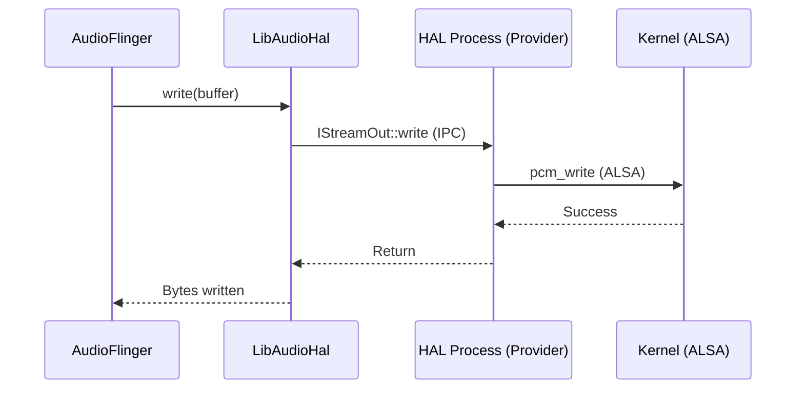

# Audio HAL Content Implementation Plan

> **For agentic workers:** REQUIRED SUB-SKILL: Use superpowers:subagent-driven-development (recommended) or superpowers:executing-plans to implement this plan task-by-task. Steps use checkbox (`- [ ]`) syntax for tracking.

**Goal:** Create a high-quality technical document `06-AudioHAL.md` in the `04-Android-Audio-Stack` directory.

**Architecture:** Classic Technical Document Structure.

**Tech Stack:** Markdown, Mermaid.

---

### Task 1: Write 04-Android-Audio-Stack/06-AudioHAL.md

**Files:**
- Create: `04-Android-Audio-Stack/06-AudioHAL.md`

- [ ] **Step 1: Write the content of 06-AudioHAL.md**

Write the following content to `04-Android-Audio-Stack/06-AudioHAL.md`:

```markdown
# Audio HAL 接口规范 (Audio Hardware Abstraction Layer)

Audio HAL 是 Android 系统服务与底层硬件驱动（通常是 ALSA）之间的标准接口。它确保了 Android 框架可以在不修改系统服务代码的情况下，适配不同厂商的音频硬件。

---

## 1. HAL 的演进史

Android HAL 经历了从传统 C 风格接口到现代化接口的重大演进：

1.  **Legacy HAL (Android 7.0 以前)**：基于 C 结构的函数指针。
2.  **HIDL HAL (Android 8.0 - 13)**：使用 HIDL (HAL Interface Definition Language) 语言定义，运行在独立的硬件进程中。
3.  **AIDL HAL (Android 14 及以后)**：全面转向 AIDL (Android Interface Definition Language)，与应用层 API 风格更加统一，性能更好。

---

## 2. 核心接口架构 (Core Interfaces)

无论使用哪种语言定义，Audio HAL 始终包含两个核心接口类：

### 2.1 IDevice (设备接口)
代表一个音频硬件模块（如 `primary`, `usb`, `a2dp`）。
*   `openOutputStream()`：打开一个输出流。
*   `openInputStream()`：打开一个输入流。
*   `setParameters()`：设置硬件参数（如：设置路由、设置采样率）。

### 2.2 IStream (流接口)
代表一个活跃的音频流。
*   `IStreamOut`：用于播放。核心方法是 `write()`。
*   `IStreamIn`：用于录音。核心方法是 `read()`。
*   `getLatency()`：获取当前硬件层延迟。

---

## 3. HAL 与 AudioFlinger 的交互

AudioFlinger 通过 `DeviceHalInterface` 和 `StreamHalInterface` 这层包装类来调用 HAL 接口。



---

## 4. VTS 测试 (Vendor Test Suite)

为了保证 HAL 实现的兼容性，Google 提供了 VTS 测试套件。
*   **目标**：确保第三方厂商（如高通、MTK）实现的 HAL 满足 Android 框架的所有预期（例如：并发流数量、格式支持、延迟要求）。

---

## 5. 关键参考 (References)

1.  [AOSP: Audio HAL AIDL Specification](https://source.android.com/docs/core/audio/aidl)
2.  [HIDL Audio HAL Implementation](https://source.android.com/docs/core/audio/hidl)

---
*Next Module: [05. Linux 音频子系统 (Linux Audio Subsystem)](../05-Linux-Audio-Subsystem/README.md)*
```

- [ ] **Step 2: Commit the file**

Run:
```bash
git add 04-Android-Audio-Stack/06-AudioHAL.md
git commit -m "feat: add Audio HAL chapter"
```

---
End of plan.
