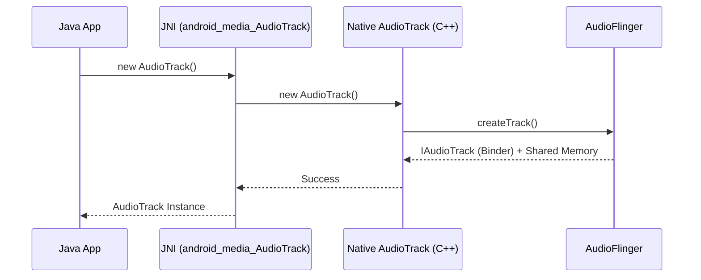

# AudioTrack Deep Dive Content Implementation Plan

> **For agentic workers:** REQUIRED SUB-SKILL: Use superpowers:subagent-driven-development (recommended) or superpowers:executing-plans to implement this plan task-by-task. Steps use checkbox (`- [ ]`) syntax for tracking.

**Goal:** Create a high-quality technical document `02-AudioTrack-Deep-Dive.md` in the `04-Android-Audio-Stack` directory.

**Architecture:** Classic Technical Document Structure.

**Tech Stack:** Markdown, Mermaid.

---

### Task 1: Write 04-Android-Audio-Stack/02-AudioTrack-Deep-Dive.md

**Files:**
- Create: `04-Android-Audio-Stack/02-AudioTrack-Deep-Dive.md`

- [ ] **Step 1: Write the content of 02-AudioTrack-Deep-Dive.md**

Write the following content to `04-Android-Audio-Stack/02-AudioTrack-Deep-Dive.md`:

```markdown
# AudioTrack 深度解析 (AudioTrack Deep Dive)

`AudioTrack` 是 Android 应用层播放原始 PCM 音频数据的核心 API。它不仅存在于 Java 层，在 Native 层也有对应的实现，通过 Binder 与 `AudioFlinger` 通信。

---

## 1. 核心工作模式

AudioTrack 支持两种播放模式：

*   **MODE_STATIC (静态模式)**：一次性将音频数据写入缓存，适用于短促的提示音、铃声。优点是延迟低，无需多次跨进程拷贝。
*   **MODE_STREAM (流模式)**：应用通过持续调用 `write()` 方法写入数据，适用于音乐、视频播放。

---

## 2. 跨层级架构 (Cross-Layer Architecture)

应用调用 `new AudioTrack()` 时，背后发生了一系列跨层操作：



### 2.1 关键角色
1.  **Java AudioTrack**：面向开发者的包装类。
2.  **Native AudioTrack**：位于 `libmedia.so`，负责与 `audioserver` 交互。
3.  **Shared Memory (共享内存)**：为了避免大量的音频 PCM 数据通过 Binder 传输（效率极低），Android 使用 `AudioTrackShared` 机制，在 App 进程和 `audioserver` 进程之间共享一块匿名内存。

---

## 3. 播放流程详解

### 3.1 写入数据 (The Write Loop)
在流模式下，数据的流向如下：
1.  应用调用 `write(byte[] data, ...)`。
2.  JNI 将数据拷贝到 Native 层。
3.  Native AudioTrack 将数据写入**共享内存的生产者缓冲区 (Proxy)**。
4.  AudioFlinger 端的 **消费者缓冲区 (ServerProxy)** 读取数据进行混音。

### 3.2 播放控制
*   `play()`：启动播放线程，通知 AudioFlinger 开始消费数据。
*   `pause()`：暂停播放，但不清除缓冲区数据。
*   `stop()`：停止播放，并在数据播完后关闭。

---

## 4. 常见问题与优化

*   **BufferSize 选值**：调用 `getMinBufferSize()` 获得系统建议的最小缓冲区。设置过小会导致断音 (Underflow)，设置过大会增加延迟。
*   **回调机制**：`onMarkerReached` 和 `onPeriodicNotification` 可用于精确同步，但需注意在非 UI 线程处理。

---

## 5. 关键参考 (References)

1.  [Android Developer: AudioTrack](https://developer.android.com/reference/android/media/AudioTrack)
2.  [AOSP Source: AudioTrack.cpp](https://android.googlesource.com/platform/frameworks/av/+/master/media/libaudioclient/AudioTrack.cpp)

---
*Next Topic: [AudioRecord 录音流程解析](./03-AudioRecord.md)*
```

- [ ] **Step 2: Commit the file**

Run:
```bash
git add 04-Android-Audio-Stack/02-AudioTrack-Deep-Dive.md
git commit -m "feat: add AudioTrack deep dive chapter"
```

---
End of plan.
