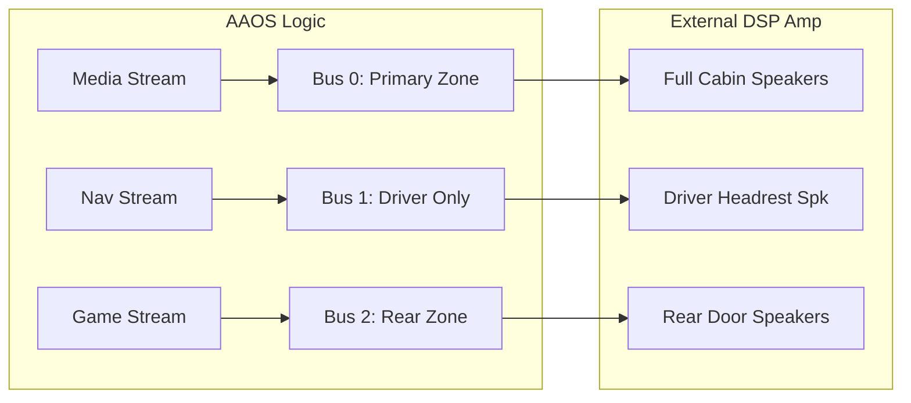

# Multi-zone and Routing Content Implementation Plan

> **For agentic workers:** REQUIRED SUB-SKILL: Use superpowers:subagent-driven-development (recommended) or superpowers:executing-plans to implement this plan task-by-task. Steps use checkbox (`- [ ]`) syntax for tracking.

**Goal:** Create a high-quality technical document `02-Multi-zone-Routing.md` in the `06-Automotive-Audio` directory.

**Architecture:** Classic Technical Document Structure.

**Tech Stack:** Markdown, Mermaid.

---

### Task 1: Write 06-Automotive-Audio/02-Multi-zone-Routing.md

**Files:**
- Create: `06-Automotive-Audio/02-Multi-zone-Routing.md`

- [ ] **Step 1: Write the content of 02-Multi-zone-Routing.md**

Write the following content to `06-Automotive-Audio/02-Multi-zone-Routing.md`:

```markdown
# 车载多音区与路由策略 (Multi-zone & Routing Strategy)

在现代智能座舱中，音频系统必须具备“空间隔离”和“精准投送”的能力。多音区管理和灵活的路由策略是实现这一目标的关键。

---

## 1. 多音区概念 (Audio Zones)

Android Automotive (AAOS) 将车内空间划分为不同的 **Audio Zone**。

*   **Primary Zone (主音区)**：通常指驾驶员和副驾驶区域。
*   **Secondary Zones (次级音区)**：通常指后排座椅、甚至是第三排。
*   **Occupant Zone (乘员区)**：AAOS 10 引入的概念，将音频与具体的乘员账号绑定。

---

## 2. 基于 Bus 的路由 (Bus-based Routing)

不同于手机使用设备类型（如 SPEAKER）路由，车载系统使用 **Bus (总线地址)** 进行路由。

### 2.1 为什么使用 Bus？
车载硬件通常有几十个扬声器，但 Android 核心只认识几种设备。通过将音频流发送到不同的物理总线（如 `bus0_music`, `bus1_nav`），外部 DSP 功放可以识别流的类型并将其路由到正确的扬声器。



---

## 3. 路由策略与优先级

### 3.1 焦点管理 (Audio Focus)
车载系统通常会定制 `CarAudioFocus`。例如：
*   **相互排斥**：正在听音乐时，如果开启紧急语音，音乐必须暂停。
*   **并发播放 (Ducking)**：导航播报时，音乐音量自动压低而不停止。

### 3.2 声音分层
1.  **Safety (安全级)**：ADAS 警报、雷达音（优先级最高，硬件级直通）。
2.  **Communication (通信级)**：电话、语音助理。
3.  **Entertainment (娱乐级)**：音乐、视频。

---

## 4. 关键配置文件：car_audio_configuration.xml

这个文件定义了 AAOS 如何将音区、总线和物理设备对应起来。
*   **Zone 定义**：包含音区 ID。
*   **Volume Group**：将多个总线组合在一起，实现统一的音量调节（如：媒体音量同时控制左/右声道）。

---

## 5. 关键参考 (References)

1.  [AOSP: Automotive Audio Control HAL](https://source.android.com/devices/automotive/audio/audio-control-hal)
2.  [AAOS Audio Zones Management](https://source.android.com/devices/automotive/audio/zones)

---
*Next Module: [07. 高通平台专题 (Qualcomm Platform)](../07-Qualcomm-Platform/README.md)*
```

- [ ] **Step 2: Commit the file**

Run:
```bash
git add 06-Automotive-Audio/02-Multi-zone-Routing.md
git commit -m "feat: add multi-zone and routing strategy chapter"
```

---
End of plan.
