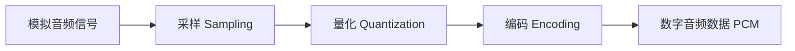

# Digital Audio Fundamentals Content Implementation Plan

> **For agentic workers:** REQUIRED SUB-SKILL: Use superpowers:subagent-driven-development (recommended) or superpowers:executing-plans to implement this plan task-by-task. Steps use checkbox (`- [ ]`) syntax for tracking.

**Goal:** Create a high-quality technical document `03-Digital-Audio-Fundamentals.md` in the `01-Acoustics-Digital-Audio` directory.

**Architecture:** Classic Technical Document Structure.

**Tech Stack:** Markdown, Mermaid.

---

### Task 1: Write 03-Digital-Audio-Fundamentals.md

**Files:**
- Create: `01-Acoustics-Digital-Audio/03-Digital-Audio-Fundamentals.md`

- [ ] **Step 1: Write the content of 03-Digital-Audio-Fundamentals.md**

Write the following content to `01-Acoustics-Digital-Audio/03-Digital-Audio-Fundamentals.md`:

```markdown
# 数字音频基础 (Digital Audio Fundamentals)

数字音频是将连续的模拟声波信号通过采样、量化和编码，转化为计算机可处理的离散二进制数据的过程。

---

## 1. 模拟到数字的转换 (ADC Process)

模拟信号（电压变化）转换为数字信号主要包含三个步骤：

1.  **采样 (Sampling)**：在时间轴上对信号进行离散化。
2.  **量化 (Quantization)**：在幅度轴上对信号进行离散化。
3.  **编码 (Encoding)**：将量化后的数值转化为二进制序列（如 PCM）。



---

## 2. 采样率 (Sampling Rate)

### 2.1 奈奎斯特-香农采样定理 (Nyquist-Shannon Theorem)
*   **定理内容**：为了能够无失真地重建原始模拟信号，采样频率 $f_s$ 必须大于信号最高频率 $f_{max}$ 的两倍。
*   **公式**：$f_s > 2 \cdot f_{max}$
*   **奈奎斯特频率**：$f_s / 2$ 称为奈奎斯特频率。如果信号频率超过此值，会产生 **混叠 (Aliasing)** 现象。

### 2.2 常见采样率
*   **8kHz / 16kHz**：电话语音、语音识别（宽带/窄带语音）。
*   **44.1kHz**：CD 标准。由于人耳上限是 20kHz，加上防混叠滤波器的过渡带，44.1kHz 是最经济的选择。
*   **48kHz**：数字视频、电影音频标准。
*   **96kHz / 192kHz**：Hi-Res 高解析度音频。

---

## 3. 位深 (Bit Depth) 与 量化 (Quantization)

### 3.1 位深 (Bit Depth)
位深决定了每一个采样点能够表达的**精度**，直接影响**动态范围 (Dynamic Range)** 和 **信噪比 (SNR)**。
*   **8-bit**：256 个量化层级。
*   **16-bit**：65,536 个量化层级（CD 标准）。
*   **24-bit**：专业录音标准。

### 3.2 动态范围计算
动态范围（dB）的近似计算公式：
$$\text{Dynamic Range} \approx 6.02 \times N + 1.76 \text{ dB}$$
*(其中 $N$ 为位深)*
*   16-bit 约为 96dB。
*   24-bit 约为 144dB。

### 3.3 量化噪声与抖动 (Dithering)
*   **量化噪声 (Quantization Noise)**：由于量化层级有限导致的舍入误差。
*   **抖动 (Dithering)**：在量化前人为引入极微小的白噪声，目的是将由于量化导致的谐波失真转化为随机噪声，使听感更自然。

---

## 4. 码率 (Bitrate)

对于未压缩的 PCM 音频，码率计算公式为：
$$\text{Bitrate} = \text{采样率} \times \text{位深} \times \text{通道数}$$
*   **例子 (CD)**：$44,100 \times 16 \times 2 = 1,411,200 \text{ bps} \approx 1.4 \text{ Mbps}$

---

## 5. PCM 数据格式 (Pulse Code Modulation)

PCM 是数字音频最原始、最通用的存储格式。

*   **符号位**：通常是有符号数（Signed Integer），例如 16-bit PCM 的范围是 -32768 到 32767。
*   **存储方式**：
    *   **交织 (Interleaved)**：LRLRLR（左右声道交替存储，常见）。
    *   **非交织 (Non-Interleaved / Planar)**：LLLL RRRR（左右声道分开存储）。

---

## 6. 关键参考 (References)

1.  *Digital Audio Signal Processing* - Udo Zölzer
2.  [Sampling (signal processing) - Wikipedia](https://en.wikipedia.org/wiki/Sampling_(signal_processing))
3.  [The Science of Sample Rates - Xiph.org](https://xiph.org/video/vid2.shtml)

---
*Next Module: [02. 硬件系统 (Hardware System)](../02-Hardware-System/README.md)*
```

- [ ] **Step 2: Commit the file**

Run:
```bash
git add 01-Acoustics-Digital-Audio/03-Digital-Audio-Fundamentals.md
git commit -m "feat: add digital audio fundamentals chapter"
```

---
End of plan.
