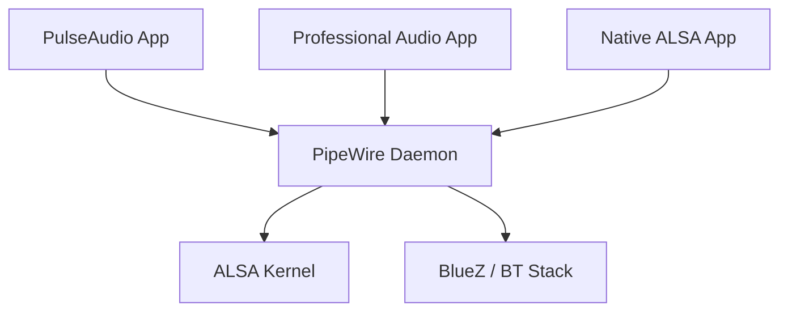

# PulseAudio & PipeWire Content Implementation Plan

> **For agentic workers:** REQUIRED SUB-SKILL: Use superpowers:subagent-driven-development (recommended) or superpowers:executing-plans to implement this plan task-by-task. Steps use checkbox (`- [ ]`) syntax for tracking.

**Goal:** Create a high-quality technical document `03-PulseAudio-PipeWire.md` in the `05-Linux-Audio-Subsystem` directory.

**Architecture:** Classic Technical Document Structure.

**Tech Stack:** Markdown, Mermaid.

---

### Task 1: Write 05-Linux-Audio-Subsystem/03-PulseAudio-PipeWire.md

**Files:**
- Create: `05-Linux-Audio-Subsystem/03-PulseAudio-PipeWire.md`

- [ ] **Step 1: Write the content of 03-PulseAudio-PipeWire.md**

Write the following content to `05-Linux-Audio-Subsystem/03-PulseAudio-PipeWire.md`:

```markdown
# 现代 Linux 音频服务 (PulseAudio & PipeWire)

在桌面 Linux 系统（如 Ubuntu, Fedora）中，应用通常不直接调用 ALSA，而是通过音频服务器（Sound Server）进行交互，以实现多应用混音、动态设备切换和网络音频传输。

---

## 1. PulseAudio (业界长青树)

PulseAudio 是过去十多年 Linux 桌面的标准音频服务器。

### 1.1 核心功能
*   **软件混音**：允许网页、播放器、系统通知同时发声。
*   **网络透明性**：可以将音频流发送到另一台运行 PulseAudio 的机器。
*   **动态路由**：支持在不停止播放的情况下，将音频从扬声器切换到蓝牙耳机。

### 1.2 局限性
*   **延迟较高**：不适合专业音频处理（如电吉他效果器、MIDI 合成）。
*   **架构复杂**：代码臃肿，难以维护。

---

## 2. PipeWire (下一代标准)

PipeWire 是近年来 Linux 社区最重大的音频更新，旨在统一 Linux 上的音频和视频处理。

### 2.1 核心优势
*   **统一性**：同时兼容 PulseAudio (桌面)、JACK (专业音频) 和 ALSA 接口。
*   **极低延迟**：采用类似 JACK 的图模型（Graph-based）架构，支持实时音频处理。
*   **安全性**：原生支持 Flatpak 等沙盒应用的权限控制。



---

## 3. 架构对比

| 特性 | PulseAudio | PipeWire |
| :--- | :--- | :--- |
| **主要定位** | 通用桌面音频 | 通用 + 专业 + 视频 |
| **延迟** | 中/高 | 极低 (媲美 JACK) |
| **容器化支持** | 弱 | 强 |
| **主流分发版** | Ubuntu 22.04 以前 | Fedora, Ubuntu 22.10+, Arch |

---

## 4. 关键参考 (References)

1.  [PulseAudio Documentation](https://www.freedesktop.org/wiki/Software/PulseAudio/)
2.  [PipeWire Official Site](https://pipewire.org/)
3.  [Linux Audio: The State of the Union - PipeWire](https://archive.fosdem.org/2020/schedule/event/pipewire/)

---
*Next Module: [06. 车载音频系统 (Automotive Audio System)](../06-Automotive-Audio/README.md)*
```

- [ ] **Step 2: Commit the file**

Run:
```bash
git add 05-Linux-Audio-Subsystem/03-PulseAudio-PipeWire.md
git commit -m "feat: add PulseAudio and PipeWire chapter"
```

---
End of plan.
